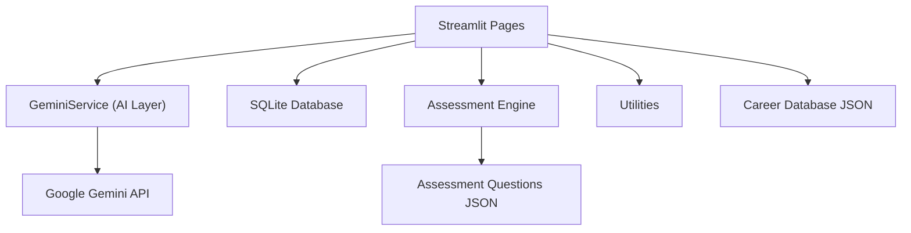
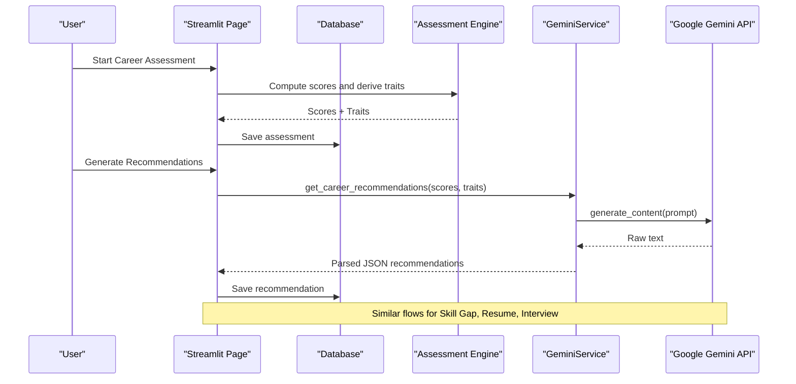
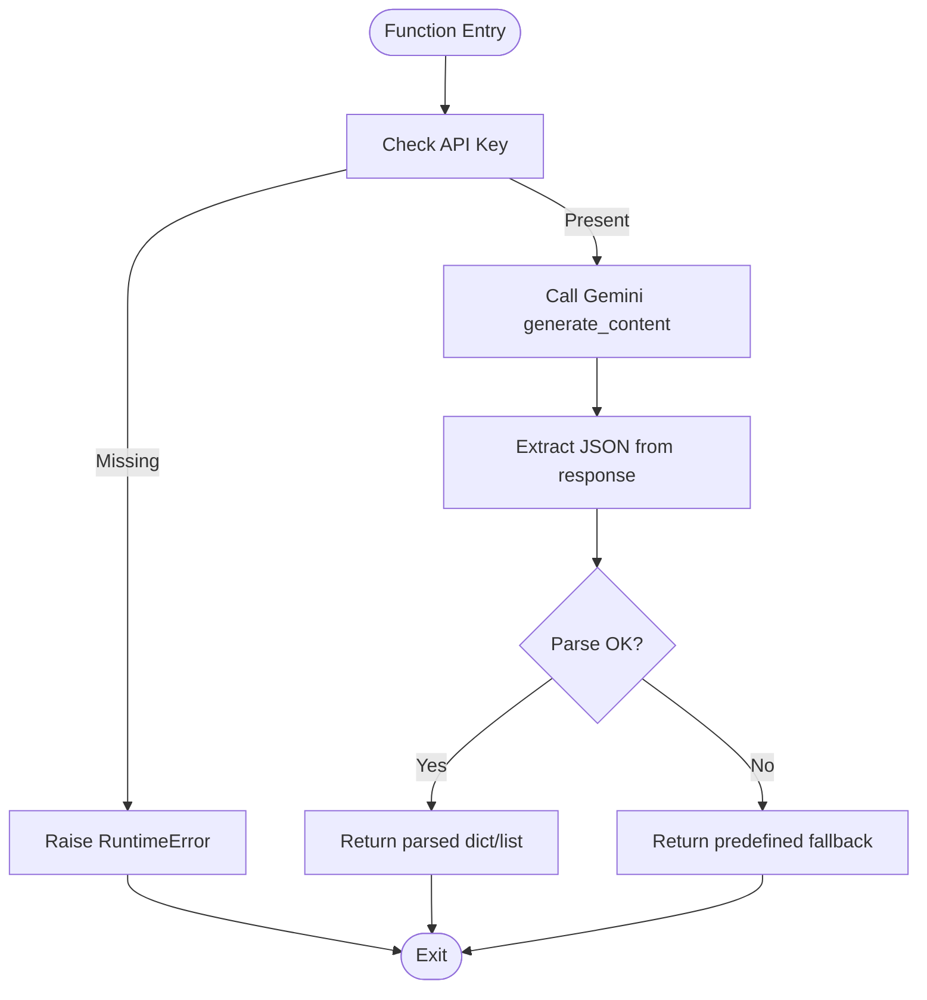
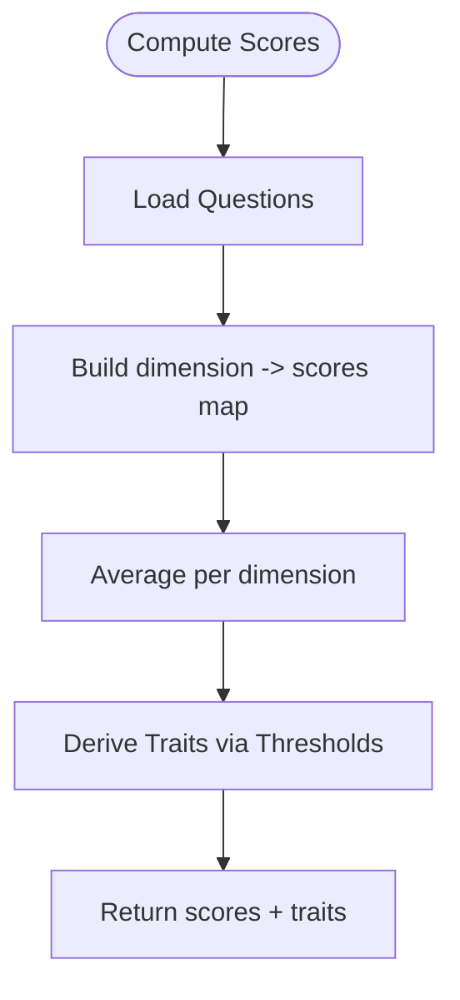
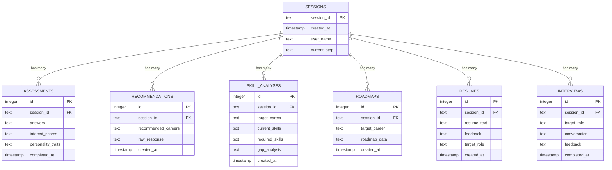
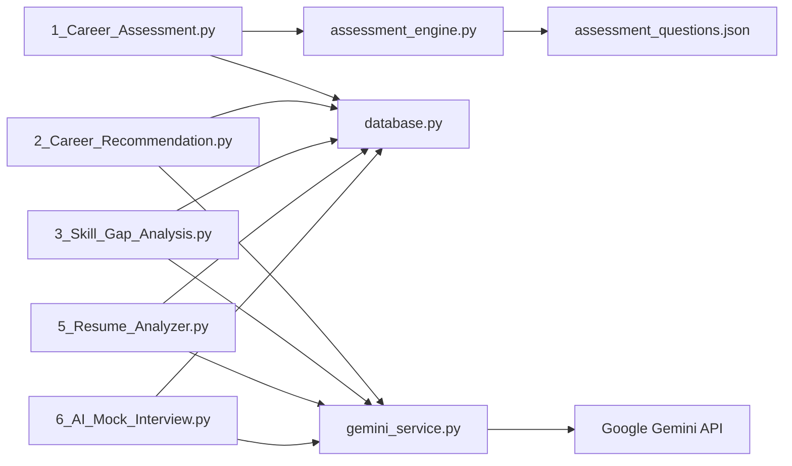

# AI Integration

<cite>
**Referenced Files in This Document**
- [gemini_service.py](file://mentorx-ai/src/gemini_service.py)
- [assessment_engine.py](file://mentorx-ai/src/assessment_engine.py)
- [database.py](file://mentorx-ai/src/database.py)
- [utils.py](file://mentorx-ai/src/utils.py)
- [app.py](file://mentorx-ai/app.py)
- [1_Career_Assessment.py](file://mentorx-ai/pages/1_Career_Assessment.py)
- [2_Career_Recommendation.py](file://mentorx-ai/pages/2_Career_Recommendation.py)
- [3_Skill_Gap_Analysis.py](file://mentorx-ai/pages/3_Skill_Gap_Analysis.py)
- [5_Resume_Analyzer.py](file://mentorx-ai/pages/5_Resume_Analyzer.py)
- [6_AI_Mock_Interview.py](file://mentorx-ai/pages/6_AI_Mock_Interview.py)
- [assessment_questions.json](file://mentorx-ai/data/assessment_questions.json)
- [career_database.json](file://mentorx-ai/data/career_database.json)
</cite>

## Table of Contents
1. [Introduction](#introduction)
2. [Project Structure](#project-structure)
3. [Core Components](#core-components)
4. [Architecture Overview](#architecture-overview)
5. [Detailed Component Analysis](#detailed-component-analysis)
6. [Dependency Analysis](#dependency-analysis)
7. [Performance Considerations](#performance-considerations)
8. [Troubleshooting Guide](#troubleshooting-guide)
9. [Conclusion](#conclusion)
10. [Appendices](#appendices)

## Introduction
This document explains Mentor X-AI’s AI integration layer built on Google Gemini. It covers the centralized AI service, prompt engineering for career coaching scenarios, response parsing and validation, conversation management for mock interviews, error handling and fallbacks, configuration options, rate limiting considerations, and the assessment engine’s scoring and personality trait derivation. It also details how AI capabilities are integrated across career recommendations, skill gap analysis, resume evaluation, and mock interviews.

## Project Structure
Mentor X-AI is a Streamlit application with a clear separation between UI pages, business logic, data persistence, and AI integration:
- UI Pages: Feature-specific Streamlit pages orchestrate user flows and call services.
- AI Service: Centralized module that encapsulates all Gemini API calls, prompt construction, JSON parsing, and safe fallbacks.
- Assessment Engine: Computes multi-dimensional scores and derives personality traits from assessment answers.
- Database Layer: SQLite-based persistence for sessions, assessments, recommendations, skill analyses, roadmaps, resumes, and interviews.
- Utilities: Shared helpers for formatting, readiness scoring, progress tracking, and report generation.
- Data Assets: Static datasets for assessment questions and career profiles.

**Diagram sources**
- [gemini_service.py:1-422](file://mentorx-ai/src/gemini_service.py#L1-L422)
- [assessment_engine.py:1-144](file://mentorx-ai/src/assessment_engine.py#L1-L144)
- [database.py:1-362](file://mentorx-ai/src/database.py#L1-L362)
- [utils.py:1-205](file://mentorx-ai/src/utils.py#L1-L205)
- [1_Career_Assessment.py:1-138](file://mentorx-ai/pages/1_Career_Assessment.py#L1-L138)
- [2_Career_Recommendation.py:1-140](file://mentorx-ai/pages/2_Career_Recommendation.py#L1-L140)
- [3_Skill_Gap_Analysis.py:1-230](file://mentorx-ai/pages/3_Skill_Gap_Analysis.py#L1-L230)
- [5_Resume_Analyzer.py:1-191](file://mentorx-ai/pages/5_Resume_Analyzer.py#L1-L191)
- [6_AI_Mock_Interview.py:1-283](file://mentorx-ai/pages/6_AI_Mock_Interview.py#L1-L283)
- [assessment_questions.json:1-134](file://mentorx-ai/data/assessment_questions.json#L1-L134)
- [career_database.json:1-149](file://mentorx-ai/data/career_database.json#L1-L149)

**Section sources**
- [app.py:1-166](file://mentorx-ai/app.py#L1-L166)
- [gemini_service.py:1-422](file://mentorx-ai/src/gemini_service.py#L1-L422)
- [assessment_engine.py:1-144](file://mentorx-ai/src/assessment_engine.py#L1-L144)
- [database.py:1-362](file://mentorx-ai/src/database.py#L1-L362)
- [utils.py:1-205](file://mentorx-ai/src/utils.py#L1-L205)

## Core Components
- Centralized AI Service: Encapsulates model configuration, prompt building, JSON extraction, and safe calls with fallbacks.
- Assessment Engine: Loads assessment questions, computes dimension averages, and derives personality traits based on thresholds.
- Database Layer: Manages session lifecycle and persists results for each feature; provides dashboard aggregation.
- Utilities: Formatting helpers, readiness score calculation, progress tracking, and text report generation.
- Streamlit Pages: Orchestrate user interactions, guardrails, state management, and display of AI outputs.

Key responsibilities:
- Prompt Engineering: Structured prompts per feature to produce consistent JSON responses tailored to Pakistan’s job market context.
- Response Parsing: Robust JSON extraction handling markdown fences and errors.
- Conversation Management: Maintains interview chat history and question sequencing.
- Error Handling & Fallbacks: Graceful degradation when API calls fail or return unexpected structures.

**Section sources**
- [gemini_service.py:16-60](file://mentorx-ai/src/gemini_service.py#L16-L60)
- [assessment_engine.py:44-144](file://mentorx-ai/src/assessment_engine.py#L44-L144)
- [database.py:21-108](file://mentorx-ai/src/database.py#L21-L108)
- [utils.py:16-118](file://mentorx-ai/src/utils.py#L16-L118)

## Architecture Overview
The system follows a layered architecture:
- Presentation Layer: Streamlit pages handle user input and visualization.
- Business Logic Layer: Assessment engine computes scores and traits; utilities compute readiness and progress.
- Integration Layer: Centralized Gemini service manages LLM calls, prompt templates, and response parsing.
- Persistence Layer: SQLite database stores sessions and feature results.

**Diagram sources**
- [1_Career_Assessment.py:91-113](file://mentorx-ai/pages/1_Career_Assessment.py#L91-L113)
- [2_Career_Recommendation.py:54-68](file://mentorx-ai/pages/2_Career_Recommendation.py#L54-L68)
- [gemini_service.py:66-103](file://mentorx-ai/src/gemini_service.py#L66-L103)
- [database.py:152-167](file://mentorx-ai/src/database.py#L152-L167)

## Detailed Component Analysis

### Centralized AI Service (GeminiService)
Responsibilities:
- Model configuration and initialization using environment variables.
- Safe API calls with structured prompts per feature.
- JSON extraction from raw LLM output, including markdown fence stripping.
- Consistent fallback responses to ensure UI stability.

Prompt strategies:
- Role anchoring and domain context (Pakistan job market).
- Strict JSON schema enforcement via explicit format instructions.
- Contextual inputs (assessment scores, personality traits, current skills, target roles).
- State-aware prompts for iterative processes (e.g., interview question numbering and finalization).

Response parsing:
- Regex-based extraction of JSON blocks from markdown fences.
- JSON decoding with exception handling.
- Fallback dictionaries returned on any failure to keep UI functional.

Error handling:
- Missing API key raises a runtime error at call time.
- Exceptions during API calls or parsing are caught and logged; fallback values are returned.

Configuration:
- Model name and API key sourced from environment variables.
- Initialization guards prevent usage without configured credentials.

Rate limiting considerations:
- The service does not implement client-side rate limiting; callers should consider backoff/retry strategies if needed.
- For high-volume usage, integrate exponential backoff and request throttling around _call_gemini.

**Diagram sources**
- [gemini_service.py:32-60](file://mentorx-ai/src/gemini_service.py#L32-L60)

**Section sources**
- [gemini_service.py:16-60](file://mentorx-ai/src/gemini_service.py#L16-L60)
- [gemini_service.py:66-103](file://mentorx-ai/src/gemini_service.py#L66-L103)
- [gemini_service.py:110-147](file://mentorx-ai/src/gemini_service.py#L110-L147)
- [gemini_service.py:154-201](file://mentorx-ai/src/gemini_service.py#L154-L201)
- [gemini_service.py:208-285](file://mentorx-ai/src/gemini_service.py#L208-L285)
- [gemini_service.py:292-335](file://mentorx-ai/src/gemini_service.py#L292-L335)
- [gemini_service.py:342-371](file://mentorx-ai/src/gemini_service.py#L342-L371)
- [gemini_service.py:378-421](file://mentorx-ai/src/gemini_service.py#L378-L421)

### Assessment Engine
Responsibilities:
- Load assessment questions from JSON.
- Compute average scores per dimension from user answers.
- Derive personality traits based on threshold rules across interest, work style, skills, and values.

Scoring algorithm:
- Maps question IDs to dimensions and aggregates scores per dimension.
- Averages computed per dimension and rounded to one decimal place.

Personality trait derivation:
- Applies threshold checks per dimension to assign human-readable traits.
- Provides a fallback “Versatile” trait when no thresholds are met.

Complexity:
- Time complexity O(N) where N is number of questions; space complexity O(D) for dimension accumulators.

**Diagram sources**
- [assessment_engine.py:44-81](file://mentorx-ai/src/assessment_engine.py#L44-L81)
- [assessment_engine.py:84-130](file://mentorx-ai/src/assessment_engine.py#L84-L130)

**Section sources**
- [assessment_engine.py:44-144](file://mentorx-ai/src/assessment_engine.py#L44-L144)
- [assessment_questions.json:1-134](file://mentorx-ai/data/assessment_questions.json#L1-L134)

### Database Layer
Responsibilities:
- Initialize tables for sessions, assessments, recommendations, skill analyses, roadmaps, resumes, and interviews.
- CRUD operations for each entity with JSON serialization/deserialization.
- Dashboard aggregation function to retrieve all relevant data for a session.

Design notes:
- Foreign keys link feature results to sessions.
- Latest records retrieved using ORDER BY id DESC LIMIT 1.
- Session step tracking supports guided workflow progression.

**Diagram sources**
- [database.py:21-108](file://mentorx-ai/src/database.py#L21-L108)

**Section sources**
- [database.py:21-362](file://mentorx-ai/src/database.py#L21-L362)

### Utilities
Responsibilities:
- Score formatting helpers (color, emoji, label).
- Career database loading and lookup.
- Readiness score calculation combining assessment completion, recommendation, skill analysis match percentage, roadmap, resume score, and interview score.
- Progress tracker for steps and text report generation.

Readiness scoring weights:
- Assessment completed: 10%
- Recommendation done: 10%
- Skill analysis: 20% weighted by overall_match_percentage
- Roadmap generated: 15%
- Resume score: 25% weighted by overall_score
- Interview score: 20% weighted by overall_score

**Section sources**
- [utils.py:16-118](file://mentorx-ai/src/utils.py#L16-L118)
- [utils.py:124-205](file://mentorx-ai/src/utils.py#L124-L205)
- [career_database.json:1-149](file://mentorx-ai/data/career_database.json#L1-L149)

### Streamlit Pages Integration
- Career Assessment: Collects answers, computes scores and traits, saves to DB, updates session step.
- Career Recommendation: Calls AI service to generate top careers, displays results, allows selection, saves to DB.
- Skill Gap Analysis: Collects current skills, calls AI service to analyze gaps, visualizes comparison, saves to DB.
- Resume Analyzer: Accepts resume text and target role, calls AI service for evaluation, displays structured feedback, saves to DB.
- AI Mock Interview: Orchestrates conversation flow, generates questions, evaluates answers, produces summary, saves to DB.

State management:
- Uses Streamlit session_state to maintain progress, selections, and interview conversation history.
- Guards enforce prerequisite steps before accessing features.

**Section sources**
- [1_Career_Assessment.py:1-138](file://mentorx-ai/pages/1_Career_Assessment.py#L1-L138)
- [2_Career_Recommendation.py:1-140](file://mentorx-ai/pages/2_Career_Recommendation.py#L1-L140)
- [3_Skill_Gap_Analysis.py:1-230](file://mentorx-ai/pages/3_Skill_Gap_Analysis.py#L1-L230)
- [5_Resume_Analyzer.py:1-191](file://mentorx-ai/pages/5_Resume_Analyzer.py#L1-L191)
- [6_AI_Mock_Interview.py:1-283](file://mentorx-ai/pages/6_AI_Mock_Interview.py#L1-L283)

## Dependency Analysis
Component relationships:
- Pages depend on GeminiService for AI capabilities and Database for persistence.
- AssessmentEngine depends on assessment_questions.json and feeds scores/traits to GeminiService.
- Utilities support UI rendering and readiness computation using persisted data.

Coupling and cohesion:
- GeminiService is cohesive with a single responsibility: AI integration.
- Pages have moderate coupling to both AI and DB layers but remain focused on UX orchestration.
- Database layer is decoupled from UI and AI, providing clean persistence APIs.

Potential circular dependencies:
- None detected; imports are unidirectional from pages to services and utilities.

External dependencies:
- Google Generative AI SDK for LLM calls.
- Streamlit for UI.
- SQLite for local storage.

**Diagram sources**
- [1_Career_Assessment.py:1-138](file://mentorx-ai/pages/1_Career_Assessment.py#L1-L138)
- [2_Career_Recommendation.py:1-140](file://mentorx-ai/pages/2_Career_Recommendation.py#L1-L140)
- [3_Skill_Gap_Analysis.py:1-230](file://mentorx-ai/pages/3_Skill_Gap_Analysis.py#L1-L230)
- [5_Resume_Analyzer.py:1-191](file://mentorx-ai/pages/5_Resume_Analyzer.py#L1-L191)
- [6_AI_Mock_Interview.py:1-283](file://mentorx-ai/pages/6_AI_Mock_Interview.py#L1-L283)
- [assessment_engine.py:1-144](file://mentorx-ai/src/assessment_engine.py#L1-L144)
- [gemini_service.py:1-422](file://mentorx-ai/src/gemini_service.py#L1-L422)

**Section sources**
- [gemini_service.py:1-422](file://mentorx-ai/src/gemini_service.py#L1-L422)
- [assessment_engine.py:1-144](file://mentorx-ai/src/assessment_engine.py#L1-L144)
- [database.py:1-362](file://mentorx-ai/src/database.py#L1-L362)

## Performance Considerations
- LLM latency: Each AI call incurs network latency; minimize redundant calls by caching results in session state and database.
- Prompt size: Keep prompts concise; avoid overly large resume texts in prompts to reduce token usage and cost.
- JSON parsing overhead: Use robust parsing once per response; avoid repeated regex scans.
- Database I/O: Batch writes where possible; use latest-record retrieval patterns already implemented.
- Rate limiting: Implement client-side throttling or retry with exponential backoff around Gemini calls to respect API quotas.
- Visualization performance: Limit chart series (e.g., radar chart uses up to 8 skills) to maintain responsiveness.

[No sources needed since this section provides general guidance]

## Troubleshooting Guide
Common issues and resolutions:
- Missing API key: Ensure GOOGLE_API_KEY is set in environment; the service will raise an error if absent.
- Invalid JSON response: The parser handles markdown fences; if parsing fails, fallback values are returned. Verify prompt constraints and model behavior.
- Empty or partial results: Check page guards and prerequisites; ensure prior steps are completed and data is saved to DB.
- Stale session state: Clear session state or restart app to reset interview conversations and intermediate states.
- Database errors: Validate SQLite file permissions and integrity; reinitialize DB if necessary.

Operational tips:
- Log exceptions in GeminiService to diagnose failures.
- Validate incoming data from users (e.g., non-empty resume text, selected career).
- Use dashboard aggregation to confirm persisted data availability.

**Section sources**
- [gemini_service.py:32-60](file://mentorx-ai/src/gemini_service.py#L32-L60)
- [2_Career_Recommendation.py:54-68](file://mentorx-ai/pages/2_Career_Recommendation.py#L54-L68)
- [5_Resume_Analyzer.py:84-105](file://mentorx-ai/pages/5_Resume_Analyzer.py#L84-L105)
- [6_AI_Mock_Interview.py:73-104](file://mentorx-ai/pages/6_AI_Mock_Interview.py#L73-L104)

## Conclusion
Mentor X-AI’s AI integration layer centralizes Gemini interactions through a robust service that enforces structured prompts, parses JSON reliably, and provides graceful fallbacks. The assessment engine delivers multi-dimensional scoring and personality traits, while the database layer ensures persistent, queryable state across features. Streamlit pages orchestrate user workflows, leveraging AI capabilities for career recommendations, skill gap analysis, resume evaluation, and mock interviews. With careful configuration, error handling, and performance considerations, the system offers a cohesive career coaching experience tailored to the Pakistani job market.

[No sources needed since this section summarizes without analyzing specific files]

## Appendices

### Configuration Options
- Environment variables:
  - GOOGLE_API_KEY: Required for Gemini API access.
- Model configuration:
  - MODEL_NAME: Set to a supported Gemini model (currently configured for a flash variant).
- Rate limiting:
  - Not implemented in-service; recommend adding retries/backoff at call sites if needed.

**Section sources**
- [gemini_service.py:16-26](file://mentorx-ai/src/gemini_service.py#L16-L26)

### Prompt Templates Overview
- Career Recommendations: Inputs include interest scores and personality traits; output includes top 5 careers with match scores, reasoning, salary ranges, growth outlook, and key skills.
- Skill Gap Analysis: Inputs include target career and current skills; output includes matched skills, gap skills with priorities, and overall match percentage.
- Learning Roadmap: Inputs include target career and gap skills; output includes phased milestones with resources and estimated hours.
- Resume Review: Inputs include resume text and target role; output includes overall score, section feedback, ATS tips, improvements, and strengths.
- Mock Interview:
  - Question Generation: Inputs include target role, conversation history, and question number; output includes question, type, context, and finalization flag.
  - Answer Evaluation: Inputs include question, answer, and target role; output includes score, strengths, improvements, and better example.
  - Final Summary: Inputs include target role, full conversation, and answer scores; output includes overall score, breakdown, tips, and impression.

**Section sources**
- [gemini_service.py:66-103](file://mentorx-ai/src/gemini_service.py#L66-L103)
- [gemini_service.py:110-147](file://mentorx-ai/src/gemini_service.py#L110-L147)
- [gemini_service.py:154-201](file://mentorx-ai/src/gemini_service.py#L154-L201)
- [gemini_service.py:208-285](file://mentorx-ai/src/gemini_service.py#L208-L285)
- [gemini_service.py:292-335](file://mentorx-ai/src/gemini_service.py#L292-L335)
- [gemini_service.py:342-371](file://mentorx-ai/src/gemini_service.py#L342-L371)
- [gemini_service.py:378-421](file://mentorx-ai/src/gemini_service.py#L378-L421)

### Conversation Management (Mock Interview)
- Maintains message history in session state with roles (interviewer, candidate, feedback).
- Tracks question number and determines finalization at a fixed count.
- Generates next questions conditioned on prior conversation and evaluates answers immediately.
- Produces a final summary aggregating conversation and individual answer scores.

**Section sources**
- [6_AI_Mock_Interview.py:41-54](file://mentorx-ai/pages/6_AI_Mock_Interview.py#L41-L54)
- [6_AI_Mock_Interview.py:91-104](file://mentorx-ai/pages/6_AI_Mock_Interview.py#L91-L104)
- [6_AI_Mock_Interview.py:130-233](file://mentorx-ai/pages/6_AI_Mock_Interview.py#L130-L233)

### Assessment Engine Scoring and Personality Traits
- Multi-dimensional scoring: Aggregates per-dimension averages from 1–5 scale answers.
- Personality traits: Derived via threshold rules across interests, work style, skills, and values; fallback trait provided.

**Section sources**
- [assessment_engine.py:44-81](file://mentorx-ai/src/assessment_engine.py#L44-L81)
- [assessment_engine.py:84-130](file://mentorx-ai/src/assessment_engine.py#L84-L130)

### AI Response Validation and Quality Assurance
- Validation: Strict JSON schemas enforced via prompts; parser extracts fenced JSON blocks.
- QA: Fallback responses ensure UI continuity; pages validate presence of expected fields before saving/displaying.
- Observability: Errors are printed; consider logging enhancements for production.

**Section sources**
- [gemini_service.py:43-60](file://mentorx-ai/src/gemini_service.py#L43-L60)
- [2_Career_Recommendation.py:57-68](file://mentorx-ai/pages/2_Career_Recommendation.py#L57-L68)
- [5_Resume_Analyzer.py:84-105](file://mentorx-ai/pages/5_Resume_Analyzer.py#L84-L105)

### Performance Optimization Techniques
- Cache AI results in session state and database to avoid repeated calls.
- Limit chart series and prompt sizes to reduce token usage and improve responsiveness.
- Implement retry/backoff for resilient API interactions under rate limits.

[No sources needed since this section provides general guidance]