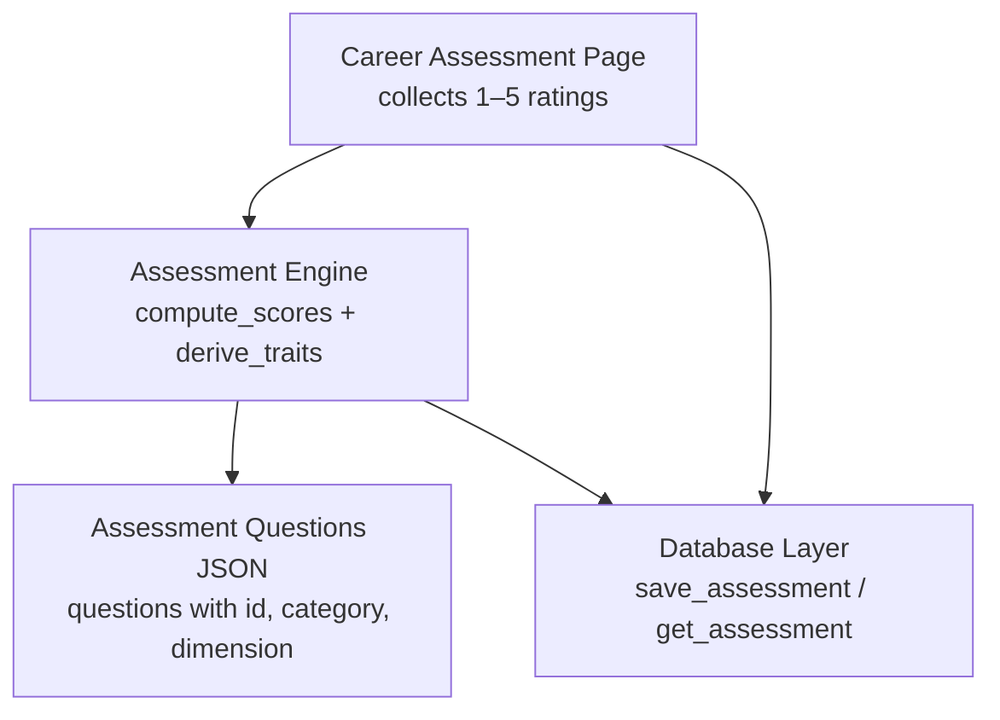
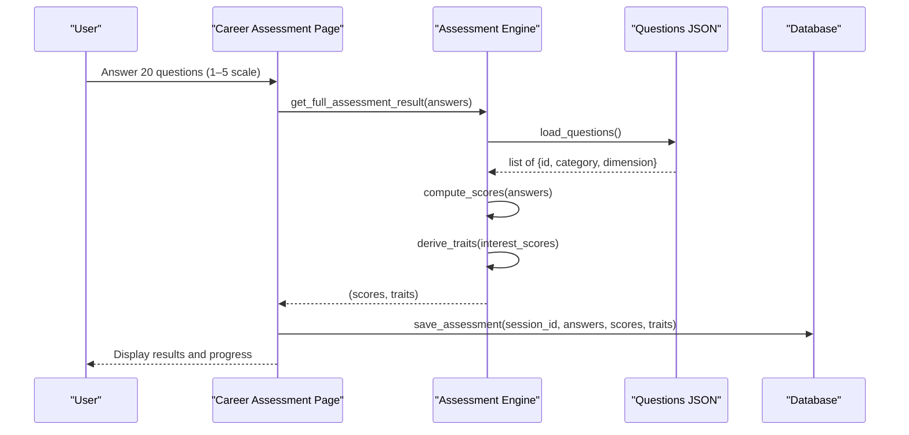
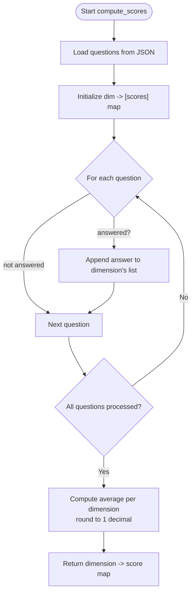
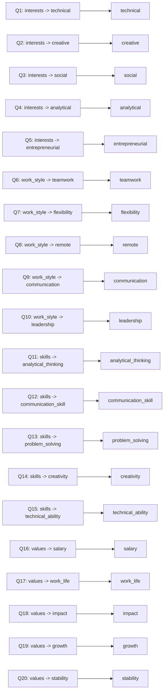
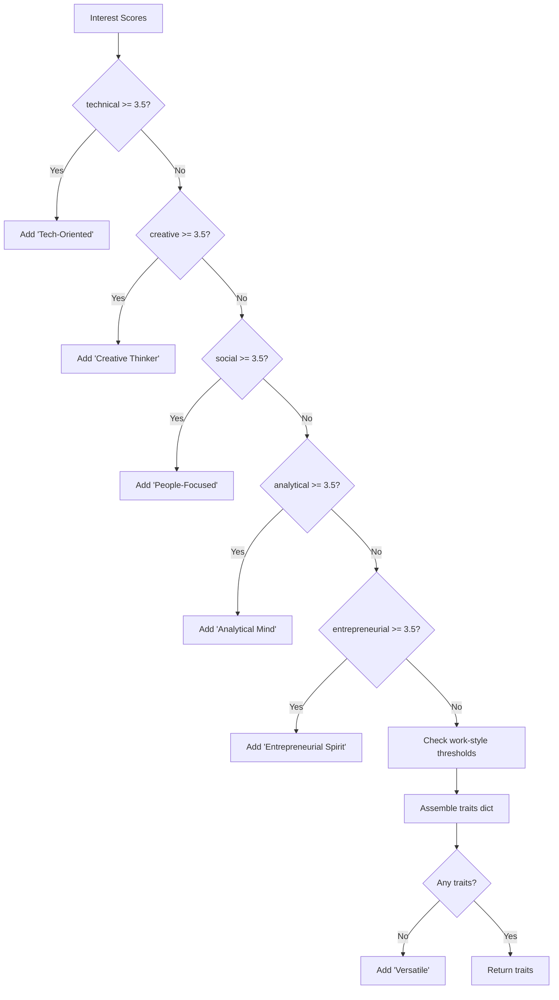
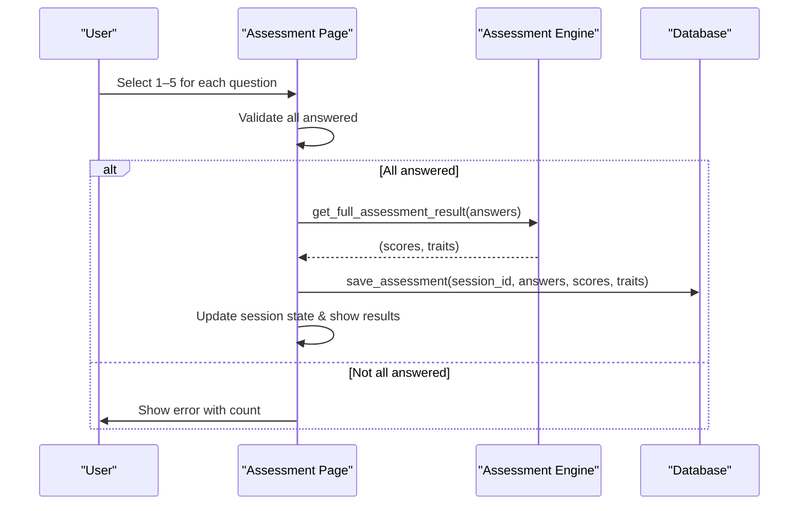
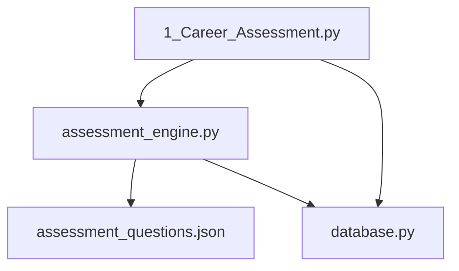

# Assessment Scoring System

<cite>
**Referenced Files in This Document**
- [assessment_engine.py](file://mentorx-ai/src/assessment_engine.py)
- [assessment_questions.json](file://mentorx-ai/data/assessment_questions.json)
- [1_Career_Assessment.py](file://mentorx-ai/pages/1_Career_Assessment.py)
- [database.py](file://mentorx-ai/src/database.py)
- [utils.py](file://mentorx-ai/src/utils.py)
</cite>

## Table of Contents
1. [Introduction](#introduction)
2. [Project Structure](#project-structure)
3. [Core Components](#core-components)
4. [Architecture Overview](#architecture-overview)
5. [Detailed Component Analysis](#detailed-component-analysis)
6. [Dependency Analysis](#dependency-analysis)
7. [Performance Considerations](#performance-considerations)
8. [Troubleshooting Guide](#troubleshooting-guide)
9. [Conclusion](#conclusion)
10. [Appendices](#appendices)

## Introduction
This document explains the assessment scoring system in Mentor X-AI, focusing on how raw answers are transformed into dimension scores across four categories: interests, work style, skills, and values. It details the compute_scores function, question categorization, dimension mapping, average score calculations, data structures, normalization techniques, and how different response patterns influence final scores.

## Project Structure
The assessment scoring system spans a few key files:
- The UI page collects user responses to 20 questions grouped by category.
- The assessment engine loads questions, computes dimension averages, and derives traits.
- The database persists answers, scores, and traits per session.
- Utilities provide formatting helpers and report generation that include assessment results.

**Diagram sources**
- [1_Career_Assessment.py:35-113](file://mentorx-ai/pages/1_Career_Assessment.py#L35-L113)
- [assessment_engine.py:44-143](file://mentorx-ai/src/assessment_engine.py#L44-L143)
- [assessment_questions.json:1-134](file://mentorx-ai/data/assessment_questions.json#L1-L134)
- [database.py:152-183](file://mentorx-ai/src/database.py#L152-L183)

**Section sources**
- [1_Career_Assessment.py:1-138](file://mentorx-ai/pages/1_Career_Assessment.py#L1-L138)
- [assessment_engine.py:1-144](file://mentorx-ai/src/assessment_engine.py#L1-L144)
- [assessment_questions.json:1-134](file://mentorx-ai/data/assessment_questions.json#L1-L134)
- [database.py:1-362](file://mentorx-ai/src/database.py#L1-L362)

## Core Components
- Question catalog: A JSON file defines each question’s id, category (interests, work_style, skills, values), and dimension mapping used for scoring.
- Scoring engine: Loads questions, aggregates answers by dimension, and computes average scores per dimension. It also derives personality traits from interest scores.
- UI flow: Collects 1–5 ratings per question, validates completion, calls the engine, saves results, and displays outcomes.
- Persistence: Stores raw answers, computed scores, and derived traits in a SQLite database per session.

Key responsibilities:
- compute_scores: Maps question ids to dimensions and averages their numeric answers.
- derive_traits: Converts interest dimension scores into human-readable trait labels and descriptions.
- save_assessment: Persists assessment artifacts to the database.

**Section sources**
- [assessment_engine.py:44-143](file://mentorx-ai/src/assessment_engine.py#L44-L143)
- [assessment_questions.json:11-131](file://mentorx-ai/data/assessment_questions.json#L11-L131)
- [1_Career_Assessment.py:35-113](file://mentorx-ai/pages/1_Career_Assessment.py#L35-L113)
- [database.py:152-183](file://mentorx-ai/src/database.py#L152-L183)

## Architecture Overview
The scoring pipeline connects the UI, engine, data, and database:

**Diagram sources**
- [1_Career_Assessment.py:91-113](file://mentorx-ai/pages/1_Career_Assessment.py#L91-L113)
- [assessment_engine.py:52-143](file://mentorx-ai/src/assessment_engine.py#L52-L143)
- [assessment_questions.json:11-131](file://mentorx-ai/data/assessment_questions.json#L11-L131)
- [database.py:152-183](file://mentorx-ai/src/database.py#L152-L183)

## Detailed Component Analysis

### compute_scores: Dimension Averaging Logic
- Input: answers is a dict mapping question id (string) to integer rating (1–5).
- Processing:
  - Load all questions from the JSON catalog.
  - For each answered question, group its rating under its dimension.
  - Compute the average per dimension; round to one decimal place.
  - If no answers exist for a dimension, default to 0.0.
- Output: A dict of dimension -> average score (float rounded to 1 decimal).

**Diagram sources**
- [assessment_engine.py:52-81](file://mentorx-ai/src/assessment_engine.py#L52-L81)
- [assessment_questions.json:11-131](file://mentorx-ai/data/assessment_questions.json#L11-L131)

**Section sources**
- [assessment_engine.py:52-81](file://mentorx-ai/src/assessment_engine.py#L52-L81)

### Question Categorization and Dimension Mapping
- Categories:
  - interests: technical, creative, social, analytical, entrepreneurial
  - work_style: teamwork, flexibility, communication, leadership
  - skills: technical_skill, problem_solving, communication, leadership, creativity_skill
  - values: salary, work_life, impact, growth, stability
- Each question has:
  - id: unique identifier used in answers
  - category: grouping label for UI and prompts
  - dimension: key used to aggregate scores
- Note: Some questions use dimension names not present in the core dimension set (e.g., remote, analytical_thinking, communication_skill, creativity, technical_ability). These will be aggregated independently if answered, but they do not appear in the predefined CATEGORY_MAP or DIMENSION_LABELS.

**Diagram sources**
- [assessment_questions.json:11-131](file://mentorx-ai/data/assessment_questions.json#L11-L131)
- [assessment_engine.py:15-41](file://mentorx-ai/src/assessment_engine.py#L15-L41)

**Section sources**
- [assessment_questions.json:11-131](file://mentorx-ai/data/assessment_questions.json#L11-L131)
- [assessment_engine.py:15-41](file://mentorx-ai/src/assessment_engine.py#L15-L41)

### derive_traits: From Scores to Personality Labels
- Uses interest dimension scores to assign descriptive traits when thresholds are met.
- Examples:
  - Technical >= 3.5 => Tech-Oriented
  - Creative >= 3.5 => Creative Thinker
  - Social >= 3.5 => People-Focused
  - Analytical >= 3.5 => Analytical Mind
  - Entrepreneurial >= 3.5 => Entrepreneurial Spirit
  - Teamwork >= 4.0 => Team Player; <= 2.0 => Independent Worker
  - Flexibility >= 4.0 => Adaptable
  - Leadership >= 4.0 => Natural Leader
  - Problem Solving >= 4.0 => Strong Problem Solver
  - Communication >= 4.0 => Effective Communicator
  - Growth >= 4.0 => Growth-Driven
  - Impact >= 4.0 => Impact-Oriented
- Fallback: If no traits qualify, assigns “Versatile”.

**Diagram sources**
- [assessment_engine.py:84-130](file://mentorx-ai/src/assessment_engine.py#L84-L130)

**Section sources**
- [assessment_engine.py:84-130](file://mentorx-ai/src/assessment_engine.py#L84-L130)

### UI Flow and Validation
- Displays questions grouped by category with radio buttons for 1–5 ratings.
- Tracks progress and enforces answering all questions before submission.
- On submit:
  - Calls get_full_assessment_result to compute scores and traits.
  - Saves results via save_assessment.
  - Updates session step and stores results in session state for later pages.
  - Shows a summary of dimension scores and traits.

**Diagram sources**
- [1_Career_Assessment.py:35-113](file://mentorx-ai/pages/1_Career_Assessment.py#L35-L113)
- [assessment_engine.py:133-143](file://mentorx-ai/src/assessment_engine.py#L133-L143)
- [database.py:152-183](file://mentorx-ai/src/database.py#L152-L183)

**Section sources**
- [1_Career_Assessment.py:35-113](file://mentorx-ai/pages/1_Career_Assessment.py#L35-L113)

### Data Structures
- Assessment questions:
  - id: stringified in answers mapping
  - category: interests, work_style, skills, values
  - dimension: key used for aggregation
- Answers:
  - Dict[str, int]: question id to rating 1–5
- Scores:
  - Dict[str, float]: dimension to average score (rounded to 1 decimal)
- Traits:
  - Dict[str, str]: trait name to description
- Database storage:
  - assessments table stores answers, interest_scores, personality_traits as JSON strings per session

**Section sources**
- [assessment_questions.json:11-131](file://mentorx-ai/data/assessment_questions.json#L11-L131)
- [assessment_engine.py:52-143](file://mentorx-ai/src/assessment_engine.py#L52-L143)
- [database.py:36-45](file://mentorx-ai/src/database.py#L36-L45)
- [database.py:152-183](file://mentorx-ai/src/database.py#L152-L183)

### Score Normalization Techniques
- Raw inputs are normalized to a consistent 1–5 Likert scale defined in the assessment questions metadata.
- Aggregation uses simple arithmetic mean per dimension.
- Results are rounded to one decimal place for readability.
- No cross-dimensional weighting is applied at this stage; each dimension is independent.

**Section sources**
- [assessment_questions.json:4-10](file://mentorx-ai/data/assessment_questions.json#L4-L10)
- [assessment_engine.py:76-81](file://mentorx-ai/src/assessment_engine.py#L76-L81)

### Example Input/Output Flows
- Input example:
  - answers = {"1": 4, "2": 5, "3": 3, "4": 4, "5": 5, "6": 4, "7": 5, "8": 3, "9": 4, "10": 3, "11": 4, "12": 5, "13": 5, "14": 4, "15": 5, "16": 2, "17": 4, "18": 5, "19": 5, "20": 3}
- Expected behavior:
  - compute_scores groups answers by dimension and returns averages per dimension.
  - derive_traits evaluates interest-based thresholds and returns a set of personality traits.
  - save_assessment persists answers, scores, and traits to the database.
  - UI displays dimension scores sorted by value and lists traits.

Note: The exact output keys depend on which dimensions have answers. Dimensions without any answered questions will default to 0.0.

**Section sources**
- [assessment_engine.py:52-143](file://mentorx-ai/src/assessment_engine.py#L52-L143)
- [1_Career_Assessment.py:91-138](file://mentorx-ai/pages/1_Career_Assessment.py#L91-L138)
- [database.py:152-183](file://mentorx-ai/src/database.py#L152-L183)

## Dependency Analysis
- The assessment page depends on:
  - assessment_engine.load_questions and get_full_assessment_result
  - database.save_assessment and update_session_step
- The assessment engine depends on:
  - assessment_questions.json for question definitions
  - internal mappings for labels and categories
- The database layer provides persistence for sessions, assessments, and other modules.

**Diagram sources**
- [1_Career_Assessment.py:12-13](file://mentorx-ai/pages/1_Career_Assessment.py#L12-L13)
- [assessment_engine.py:6-9](file://mentorx-ai/src/assessment_engine.py#L6-L9)
- [database.py:152-183](file://mentorx-ai/src/database.py#L152-L183)

**Section sources**
- [1_Career_Assessment.py:1-138](file://mentorx-ai/pages/1_Career_Assessment.py#L1-L138)
- [assessment_engine.py:1-144](file://mentorx-ai/src/assessment_engine.py#L1-L144)
- [database.py:1-362](file://mentorx-ai/src/database.py#L1-L362)

## Performance Considerations
- Loading questions once per compute_scores call is acceptable given the small dataset size.
- Aggregation is O(n) over questions; negligible overhead for ~20 items.
- Rounding to one decimal reduces floating-point noise without impacting performance.
- For scalability, consider caching loaded questions if compute_scores is called frequently within a session.

[No sources needed since this section provides general guidance]

## Troubleshooting Guide
- Missing answers:
  - The UI enforces completing all questions before submission; ensure all 20 are answered.
- Unexpected dimension keys:
  - Some questions map to dimensions not in the predefined set (e.g., remote, analytical_thinking). These will still be averaged if answered but won’t appear in category summaries unless explicitly handled elsewhere.
- Trait derivation:
  - Traits are based on thresholds; low or balanced scores may result in fewer traits or fallback to “Versatile”.
- Persistence issues:
  - Ensure the database is initialized and accessible; check connection and table creation.

**Section sources**
- [1_Career_Assessment.py:91-113](file://mentorx-ai/pages/1_Career_Assessment.py#L91-L113)
- [assessment_questions.json:11-131](file://mentorx-ai/data/assessment_questions.json#L11-L131)
- [assessment_engine.py:84-130](file://mentorx-ai/src/assessment_engine.py#L84-L130)
- [database.py:21-45](file://mentorx-ai/src/database.py#L21-L45)

## Conclusion
The assessment scoring system transforms 1–5 Likert-scale responses into dimension-specific averages and derives personality traits from interest scores. The design is straightforward and modular: the UI collects inputs, the engine computes and interprets scores, and the database persists results. While most dimensions align with predefined categories, some questions introduce additional dimensions that are still aggregated independently. This approach ensures transparency and simplicity while enabling meaningful insights for career recommendations.

[No sources needed since this section summarizes without analyzing specific files]

## Appendices

### Appendix A: Category-to-Dimension Mapping
- interests: technical, creative, social, analytical, entrepreneurial
- work_style: teamwork, flexibility, communication, leadership
- skills: technical_skill, problem_solving, communication, leadership, creativity_skill
- values: salary, work_life, impact, growth, stability

**Section sources**
- [assessment_engine.py:35-41](file://mentorx-ai/src/assessment_engine.py#L35-L41)

### Appendix B: Scale Definitions
- 1: Strongly Disagree
- 2: Disagree
- 3: Neutral
- 4: Agree
- 5: Strongly Agree

**Section sources**
- [assessment_questions.json:4-10](file://mentorx-ai/data/assessment_questions.json#L4-L10)

### Appendix C: Report Integration
- Reports can include assessment dimension scores and overall readiness metrics using utility functions.

**Section sources**
- [utils.py:151-205](file://mentorx-ai/src/utils.py#L151-L205)