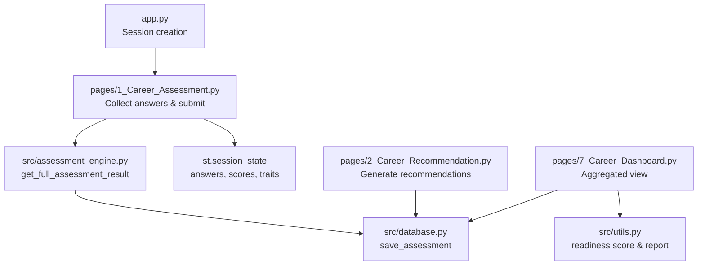
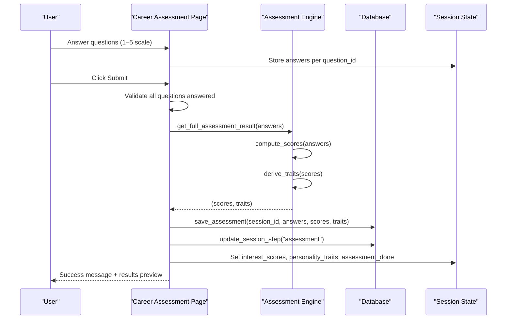
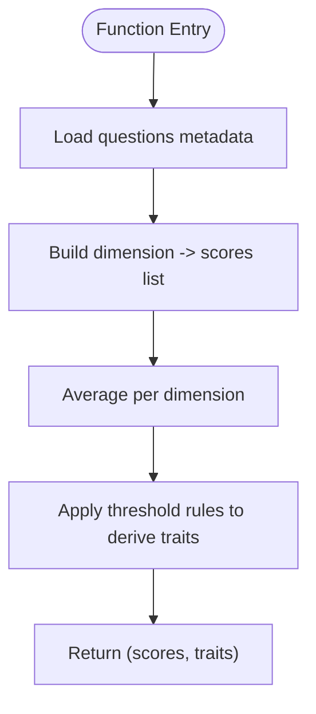
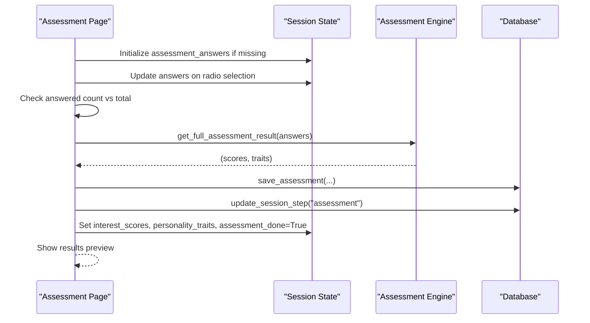
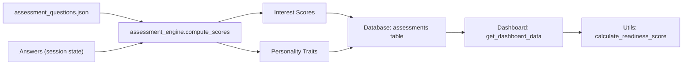
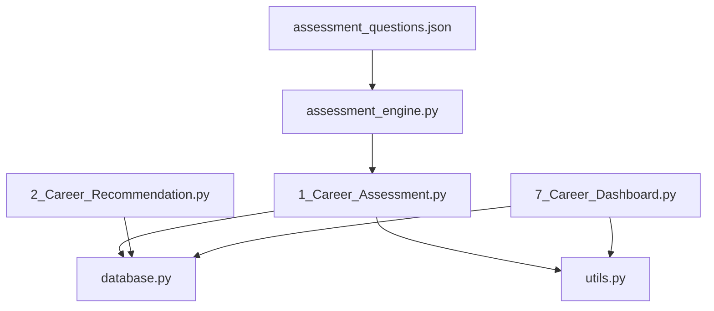

# Assessment Workflow Integration

<cite>
**Referenced Files in This Document**
- [assessment_engine.py](file://mentorx-ai/src/assessment_engine.py)
- [1_Career_Assessment.py](file://mentorx-ai/pages/1_Career_Assessment.py)
- [2_Career_Recommendation.py](file://mentorx-ai/pages/2_Career_Recommendation.py)
- [7_Career_Dashboard.py](file://mentorx-ai/pages/7_Career_Dashboard.py)
- [database.py](file://mentorx-ai/src/database.py)
- [utils.py](file://mentorx-ai/src/utils.py)
- [app.py](file://mentorx-ai/app.py)
- [assessment_questions.json](file://mentorx-ai/data/assessment_questions.json)
</cite>

## Table of Contents
1. [Introduction](#introduction)
2. [Project Structure](#project-structure)
3. [Core Components](#core-components)
4. [Architecture Overview](#architecture-overview)
5. [Detailed Component Analysis](#detailed-component-analysis)
6. [Dependency Analysis](#dependency-analysis)
7. [Performance Considerations](#performance-considerations)
8. [Troubleshooting Guide](#troubleshooting-guide)
9. [Conclusion](#conclusion)
10. [Appendices](#appendices)

## Introduction
This document explains the end-to-end assessment workflow from user interaction to result generation, focusing on how get_full_assessment_result orchestrates score computation and trait derivation. It also covers integration points between the Streamlit UI, session state management, database persistence, and downstream pages that consume assessment results. Error handling strategies, validation checks, and performance considerations are included, along with examples of typical sessions and outcomes.

## Project Structure
The application is a Streamlit-based multi-page app:
- Entry point initializes the database and manages user sessions.
- Page 1 collects answers and computes assessment results using the assessment engine.
- Page 2 uses assessment results to generate AI-powered career recommendations.
- Page 7 aggregates all steps into a readiness dashboard.
- The database layer persists assessments, recommendations, and other artifacts.
- Utilities provide shared helpers for scoring and reporting.

**Diagram sources**
- [app.py:67-79](file://mentorx-ai/app.py#L67-L79)
- [1_Career_Assessment.py:91-113](file://mentorx-ai/pages/1_Career_Assessment.py#L91-L113)
- [assessment_engine.py:133-143](file://mentorx-ai/src/assessment_engine.py#L133-L143)
- [database.py:152-167](file://mentorx-ai/src/database.py#L152-L167)
- [2_Career_Recommendation.py:57-68](file://mentorx-ai/pages/2_Career_Recommendation.py#L57-L68)
- [7_Career_Dashboard.py:43-47](file://mentorx-ai/pages/7_Career_Dashboard.py#L43-L47)
- [utils.py:70-117](file://mentorx-ai/src/utils.py#L70-L117)

**Section sources**
- [app.py:1-166](file://mentorx-ai/app.py#L1-L166)
- [1_Career_Assessment.py:1-138](file://mentorx-ai/pages/1_Career_Assessment.py#L1-L138)
- [2_Career_Recommendation.py:1-140](file://mentorx-ai/pages/2_Career_Recommendation.py#L1-L140)
- [7_Career_Dashboard.py:1-272](file://mentorx-ai/pages/7_Career_Dashboard.py#L1-L272)
- [database.py:1-362](file://mentorx-ai/src/database.py#L1-L362)
- [utils.py:1-205](file://mentorx-ai/src/utils.py#L1-L205)

## Core Components
- Assessment Engine: Computes dimension scores from answers and derives personality/career traits.
- UI Pages: Collect user inputs, validate completion, trigger computations, and display results.
- Database Layer: Persists assessment data and updates session progress.
- Utilities: Compute overall readiness score and generate text reports.

Key responsibilities:
- Score computation: Aggregate per-dimension averages from question responses.
- Trait derivation: Map dimension thresholds to readable traits.
- Session state: Maintain answers, flags, and computed results across page reruns.
- Persistence: Save assessment results and update current step.

**Section sources**
- [assessment_engine.py:44-81](file://mentorx-ai/src/assessment_engine.py#L44-L81)
- [assessment_engine.py:84-143](file://mentorx-ai/src/assessment_engine.py#L84-L143)
- [1_Career_Assessment.py:35-113](file://mentorx-ai/pages/1_Career_Assessment.py#L35-L113)
- [database.py:114-167](file://mentorx-ai/src/database.py#L114-L167)
- [utils.py:70-117](file://mentorx-ai/src/utils.py#L70-L117)

## Architecture Overview
The assessment workflow spans UI, engine, and persistence layers:

**Diagram sources**
- [1_Career_Assessment.py:91-113](file://mentorx-ai/pages/1_Career_Assessment.py#L91-L113)
- [assessment_engine.py:133-143](file://mentorx-ai/src/assessment_engine.py#L133-L143)
- [database.py:152-167](file://mentorx-ai/src/database.py#L152-L167)

## Detailed Component Analysis

### Assessment Engine: get_full_assessment_result
- Purpose: Orchestrate score computation and trait derivation in one call.
- Inputs: answers mapping question_id to numeric rating.
- Outputs: tuple of (interest_scores dict, personality_traits dict).
- Behavior:
  - Loads questions metadata to map answers to dimensions.
  - Averages scores per dimension; returns floats rounded to one decimal.
  - Derives traits based on threshold rules across interests, work style, skills, and values.
  - Provides fallback trait when no thresholds match.

**Diagram sources**
- [assessment_engine.py:44-81](file://mentorx-ai/src/assessment_engine.py#L44-L81)
- [assessment_engine.py:84-143](file://mentorx-ai/src/assessment_engine.py#L84-L143)

**Section sources**
- [assessment_engine.py:44-143](file://mentorx-ai/src/assessment_engine.py#L44-L143)

### UI Integration: Career Assessment Page
- Validates active session before rendering.
- Loads questions and groups them by category for presentation.
- Captures user responses into session state keyed by question_id.
- Enforces completion: requires all questions answered before submission.
- On submit:
  - Calls get_full_assessment_result to compute scores and traits.
  - Persists results via save_assessment and updates session step.
  - Stores scores and traits in session state for downstream pages.
  - Displays immediate results preview.

**Diagram sources**
- [1_Career_Assessment.py:21-113](file://mentorx-ai/pages/1_Career_Assessment.py#L21-L113)
- [database.py:152-167](file://mentorx-ai/src/database.py#L152-L167)

**Section sources**
- [1_Career_Assessment.py:21-138](file://mentorx-ai/pages/1_Career_Assessment.py#L21-L138)

### Data Flow Patterns
- Question metadata drives dimension aggregation.
- Answers are stored in session state during interaction and persisted to the database upon submission.
- Scores and traits are cached in session state to avoid recomputation and enable downstream consumption.
- Dashboard reads aggregated data from the database to compute readiness metrics and visualize results.

**Diagram sources**
- [assessment_questions.json:11-132](file://mentorx-ai/data/assessment_questions.json#L11-L132)
- [assessment_engine.py:44-81](file://mentorx-ai/src/assessment_engine.py#L44-L81)
- [database.py:152-167](file://mentorx-ai/src/database.py#L152-L167)
- [7_Career_Dashboard.py:43-47](file://mentorx-ai/pages/7_Career_Dashboard.py#L43-L47)
- [utils.py:70-117](file://mentorx-ai/src/utils.py#L70-L117)

### Session State Management
- Guard clauses ensure a valid session exists before accessing assessment or recommendation pages.
- Session keys used:
  - session_id: unique identifier for the user’s journey.
  - assessment_answers: dictionary of question_id to rating.
  - assessment_done: boolean flag indicating submission.
  - interest_scores, personality_traits: computed results for reuse.
  - selected_career, selected_career_skills, selected_career_salary: context for subsequent steps.

Validation and error handling:
- Missing session triggers a warning and stops rendering.
- Incomplete answers block submission with an error message.
- Recommendations page warns if assessment not completed.

**Section sources**
- [1_Career_Assessment.py:21-23](file://mentorx-ai/pages/1_Career_Assessment.py#L21-L23)
- [1_Career_Assessment.py:91-96](file://mentorx-ai/pages/1_Career_Assessment.py#L91-L96)
- [2_Career_Recommendation.py:21-30](file://mentorx-ai/pages/2_Career_Recommendation.py#L21-L30)

### Downstream Integration Points
- Career Recommendation Page:
  - Reads scores and traits from session state.
  - Generates recommendations via external service and persists them.
  - Updates session step to reflect progress.
- Dashboard Page:
  - Aggregates all data via get_dashboard_data.
  - Computes readiness score and displays progress tracker.
  - Visualizes assessment dimension breakdown and other metrics.

**Section sources**
- [2_Career_Recommendation.py:32-68](file://mentorx-ai/pages/2_Career_Recommendation.py#L32-L68)
- [7_Career_Dashboard.py:43-47](file://mentorx-ai/pages/7_Career_Dashboard.py#L43-L47)
- [utils.py:70-117](file://mentorx-ai/src/utils.py#L70-L117)

## Dependency Analysis
- Assessment Engine depends on:
  - assessment_questions.json for question metadata and dimension mapping.
- UI Pages depend on:
  - assessment_engine for computation.
  - database for persistence and session step updates.
  - utils for formatting and readiness calculations.
- Dashboard depends on:
  - database for aggregated data retrieval.
  - utils for readiness scoring and report generation.

**Diagram sources**
- [assessment_engine.py:44-81](file://mentorx-ai/src/assessment_engine.py#L44-L81)
- [1_Career_Assessment.py:91-113](file://mentorx-ai/pages/1_Career_Assessment.py#L91-L113)
- [2_Career_Recommendation.py:57-68](file://mentorx-ai/pages/2_Career_Recommendation.py#L57-L68)
- [7_Career_Dashboard.py:43-47](file://mentorx-ai/pages/7_Career_Dashboard.py#L43-L47)
- [utils.py:70-117](file://mentorx-ai/src/utils.py#L70-L117)

**Section sources**
- [assessment_engine.py:44-143](file://mentorx-ai/src/assessment_engine.py#L44-L143)
- [1_Career_Assessment.py:91-113](file://mentorx-ai/pages/1_Career_Assessment.py#L91-L113)
- [2_Career_Recommendation.py:57-68](file://mentorx-ai/pages/2_Career_Recommendation.py#L57-L68)
- [7_Career_Dashboard.py:43-47](file://mentorx-ai/pages/7_Career_Dashboard.py#L43-L47)
- [utils.py:70-117](file://mentorx-ai/src/utils.py#L70-L117)

## Performance Considerations
- Local computation: Score averaging and trait derivation are lightweight operations over small datasets (questions and answers), ensuring fast response times.
- Caching in session state: Avoids recomputation across page reruns and reduces database calls.
- Database writes: Persisted only on submission; read operations are minimal and targeted.
- Visualization: Dashboard renders charts based on aggregated data; consider limiting chart size and data points for responsiveness.

[No sources needed since this section provides general guidance]

## Troubleshooting Guide
Common issues and resolutions:
- Missing session:
  - Symptom: Warning message and early exit on assessment/recommendation/dashboard pages.
  - Resolution: Ensure the user starts from the home page to create a session.
- Incomplete assessment:
  - Symptom: Error message prompting to answer all questions.
  - Resolution: Complete all questions before submitting.
- No recommendations generated:
  - Symptom: Error indicating API key issues or empty results.
  - Resolution: Verify API configuration and retry generation.
- Dashboard shows no data:
  - Symptom: Empty or missing sections.
  - Resolution: Ensure prior steps have been completed and data saved to the database.

Error handling patterns:
- UI guards check session existence and step prerequisites.
- Validation ensures completeness before submission.
- External service errors are surfaced with actionable messages.

**Section sources**
- [1_Career_Assessment.py:21-23](file://mentorx-ai/pages/1_Career_Assessment.py#L21-L23)
- [1_Career_Assessment.py:91-96](file://mentorx-ai/pages/1_Career_Assessment.py#L91-L96)
- [2_Career_Recommendation.py:21-30](file://mentorx-ai/pages/2_Career_Recommendation.py#L21-L30)
- [2_Career_Recommendation.py:57-68](file://mentorx-ai/pages/2_Career_Recommendation.py#L57-L68)

## Conclusion
The assessment workflow integrates a clear separation of concerns: UI collects and validates inputs, the assessment engine computes scores and derives traits, and the database persists results while tracking session progress. Session state enables efficient reuse of computed results across pages. The dashboard consolidates all steps into a cohesive readiness view. Robust validation and error handling ensure a smooth user experience, while local computation and caching maintain performance.

[No sources needed since this section summarizes without analyzing specific files]

## Appendices

### Example Sessions and Outcomes
- Typical session flow:
  - User creates a session from the home page.
  - Completes 20-question assessment; all answers recorded in session state.
  - Submits assessment; scores and traits computed and saved to the database.
  - Proceeds to career recommendation; AI generates matches based on profile.
  - Selects target career; continues through skill gap analysis, roadmap, resume review, and mock interview.
  - Reviews dashboard showing readiness score, progress tracker, and visualizations.

- Outcome indicators:
  - Dimension scores displayed per category and summarized in the dashboard.
  - Personality traits shown immediately after submission and referenced in recommendations.
  - Readiness score reflects completion and quality of each step.

[No sources needed since this section describes conceptual workflows]