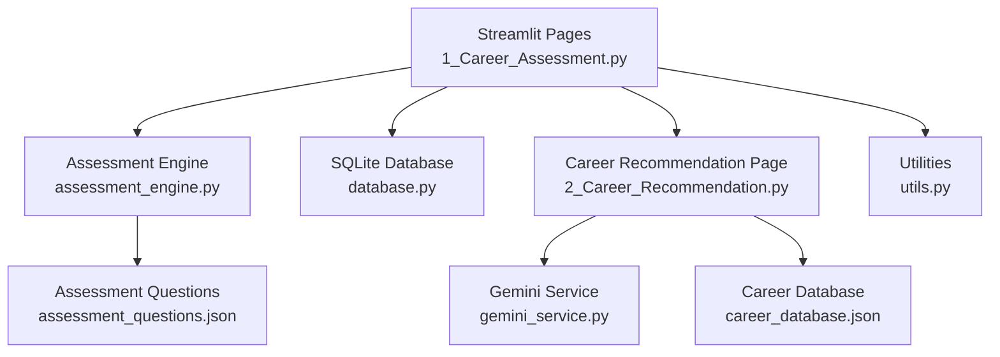
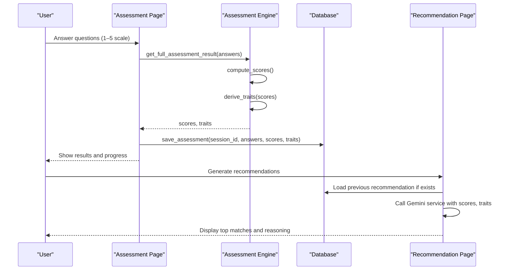
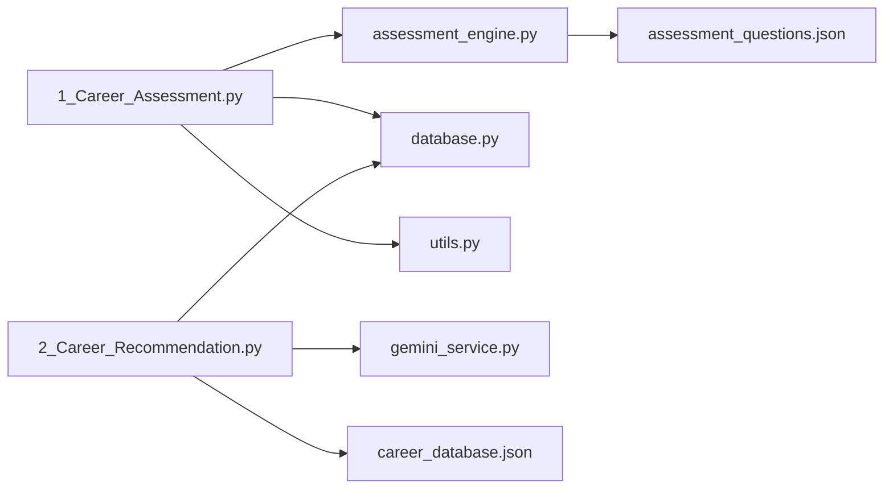
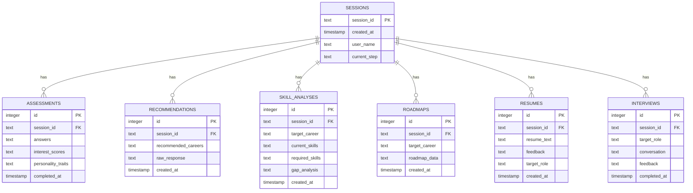

# Career Assessment Algorithms

<cite>
**Referenced Files in This Document**
- [assessment_engine.py](file://mentorx-ai/src/assessment_engine.py)
- [assessment_questions.json](file://mentorx-ai/data/assessment_questions.json)
- [1_Career_Assessment.py](file://mentorx-ai/pages/1_Career_Assessment.py)
- [2_Career_Recommendation.py](file://mentorx-ai/pages/2_Career_Recommendation.py)
- [database.py](file://mentorx-ai/src/database.py)
- [utils.py](file://mentorx-ai/src/utils.py)
- [career_database.json](file://mentorx-ai/data/career_database.json)
</cite>

## Table of Contents
1. [Introduction](#introduction)
2. [Project Structure](#project-structure)
3. [Core Components](#core-components)
4. [Architecture Overview](#architecture-overview)
5. [Detailed Component Analysis](#detailed-component-analysis)
6. [Dependency Analysis](#dependency-analysis)
7. [Performance Considerations](#performance-considerations)
8. [Troubleshooting Guide](#troubleshooting-guide)
9. [Conclusion](#conclusion)
10. [Appendices](#appendices)

## Introduction
This document explains Mentor X-AI’s career assessment algorithms and scoring system. It covers the multi-dimensional assessment methodology across interests, work style, skills, and values; how personality traits are derived from dimension scores; how assessment results are processed to generate meaningful career insights; the question categorization system; scoring algorithms; and result interpretation methods. It also provides example workflows and score calculations grounded in the codebase.

## Project Structure
The assessment system is implemented as a Streamlit application with dedicated pages for each step of the user journey. The core logic resides in the assessment engine, while data (questions and careers) is stored in JSON files. A SQLite database persists assessments and downstream artifacts.

**Diagram sources**
- [1_Career_Assessment.py:1-138](file://mentorx-ai/pages/1_Career_Assessment.py#L1-L138)
- [assessment_engine.py:1-144](file://mentorx-ai/src/assessment_engine.py#L1-L144)
- [assessment_questions.json:1-134](file://mentorx-ai/data/assessment_questions.json#L1-L134)
- [2_Career_Recommendation.py:1-140](file://mentorx-ai/pages/2_Career_Recommendation.py#L1-L140)
- [database.py:1-362](file://mentorx-ai/src/database.py#L1-L362)
- [career_database.json:1-149](file://mentorx-ai/data/career_database.json#L1-L149)
- [utils.py:1-205](file://mentorx-ai/src/utils.py#L1-L205)

**Section sources**
- [1_Career_Assessment.py:1-138](file://mentorx-ai/pages/1_Career_Assessment.py#L1-L138)
- [assessment_engine.py:1-144](file://mentorx-ai/src/assessment_engine.py#L1-L144)
- [assessment_questions.json:1-134](file://mentorx-ai/data/assessment_questions.json#L1-L134)
- [2_Career_Recommendation.py:1-140](file://mentorx-ai/pages/2_Career_Recommendation.py#L1-L140)
- [database.py:1-362](file://mentorx-ai/src/database.py#L1-L362)
- [career_database.json:1-149](file://mentorx-ai/data/career_database.json#L1-L149)
- [utils.py:1-205](file://mentorx-ai/src/utils.py#L1-L205)

## Core Components
- Assessment questions and categories: Defined in a JSON file with per-question category and dimension mappings.
- Scoring engine: Computes average scores per dimension and derives personality traits based on thresholds.
- UI flow: Collects answers, validates completion, computes scores, persists results, and displays outcomes.
- Persistence layer: Stores assessments and related data in SQLite.
- Utilities: Formatting helpers, readiness scoring, and report generation.

Key responsibilities:
- Question loading and grouping by category.
- Dimension-level averaging and trait derivation.
- Session state management and progress tracking.
- Saving assessment results and advancing session steps.

**Section sources**
- [assessment_questions.json:1-134](file://mentorx-ai/data/assessment_questions.json#L1-L134)
- [assessment_engine.py:1-144](file://mentorx-ai/src/assessment_engine.py#L1-L144)
- [1_Career_Assessment.py:1-138](file://mentorx-ai/pages/1_Career_Assessment.py#L1-L138)
- [database.py:1-362](file://mentorx-ai/src/database.py#L1-L362)
- [utils.py:1-205](file://mentorx-ai/src/utils.py#L1-L205)

## Architecture Overview
The assessment workflow proceeds through these stages:
1. User completes a 20-question quiz grouped into four categories: Interests, Work Style, Skills, Values.
2. Answers are validated and submitted.
3. Scores are computed per dimension and personality traits are derived.
4. Results are saved to the database and displayed to the user.
5. Recommendations page uses the profile to generate AI-based career suggestions.

**Diagram sources**
- [1_Career_Assessment.py:1-138](file://mentorx-ai/pages/1_Career_Assessment.py#L1-L138)
- [assessment_engine.py:1-144](file://mentorx-ai/src/assessment_engine.py#L1-L144)
- [database.py:1-362](file://mentorx-ai/src/database.py#L1-L362)
- [2_Career_Recommendation.py:1-140](file://mentorx-ai/pages/2_Career_Recommendation.py#L1-L140)

## Detailed Component Analysis

### Question Categorization System
- Categories: interests, work_style, skills, values.
- Dimensions: Each question maps to a specific dimension used for scoring.
- Scale: 1–5 Likert scale with labels Strongly Disagree to Strongly Agree.

Example mapping highlights:
- Interests include technical, creative, social, analytical, entrepreneurial.
- Work style includes teamwork, flexibility, communication, leadership.
- Skills include problem_solving, creativity_skill, technical_skill, etc.
- Values include salary, work_life, impact, growth, stability.

**Section sources**
- [assessment_questions.json:1-134](file://mentorx-ai/data/assessment_questions.json#L1-L134)
- [assessment_engine.py:15-41](file://mentorx-ai/src/assessment_engine.py#L15-L41)

### Scoring Algorithm
- Input: Mapping of question_id to integer score (1–5).
- Process:
  - Group answers by dimension using question metadata.
  - Compute average per dimension and round to one decimal place.
  - Return a dictionary of dimension -> average score.

Complexity:
- Time: O(N) where N is number of questions.
- Space: O(D) where D is number of dimensions with at least one answer.

Edge cases:
- Missing answers for a dimension yield 0.0 for that dimension.
- All answers present ensures stable averages.

**Section sources**
- [assessment_engine.py:52-81](file://mentorx-ai/src/assessment_engine.py#L52-L81)
- [assessment_questions.json:1-134](file://mentorx-ai/data/assessment_questions.json#L1-L134)

### Personality Trait Derivation
- Input: Dimension scores.
- Rules:
  - Interest-based traits triggered when interest dimensions meet or exceed threshold (e.g., technical >= 3.5).
  - Work-style traits use higher thresholds for strong alignment (e.g., teamwork >= 4.0).
  - Skill and value traits similarly thresholded (e.g., problem_solving >= 4.0, growth >= 4.0).
  - Fallback trait “Versatile” if no other traits qualify.

Output: Dictionary of trait_name -> description string.

Interpretation:
- Traits provide human-readable summaries of dominant tendencies.
- They feed into downstream recommendation prompts and narrative explanations.

**Section sources**
- [assessment_engine.py:84-130](file://mentorx-ai/src/assessment_engine.py#L84-L130)

### Assessment Workflow and UI Integration
- Loads questions and groups them by category.
- Presents radio buttons for each question with labeled scale.
- Validates all questions answered before submission.
- Computes scores and traits, saves to database, updates session step, and shows results.

Progress indicators:
- Progress bar reflects answered vs total questions.
- Color-coded dimension scores shown after submission.

**Section sources**
- [1_Career_Assessment.py:1-138](file://mentorx-ai/pages/1_Career_Assessment.py#L1-L138)
- [database.py:152-183](file://mentorx-ai/src/database.py#L152-L183)

### Result Interpretation Methods
- Dimension scores are presented sorted by strength.
- Threshold-based color coding helps users quickly identify strengths and areas for development.
- Personality traits summarize key behavioral and motivational patterns.
- Readiness and reporting utilities can aggregate assessment outcomes into broader career readiness metrics.

**Section sources**
- [1_Career_Assessment.py:119-138](file://mentorx-ai/pages/1_Career_Assessment.py#L119-L138)
- [utils.py:16-43](file://mentorx-ai/src/utils.py#L16-L43)
- [utils.py:70-117](file://mentorx-ai/src/utils.py#L70-L117)

### Example Assessment Workflow and Score Calculation
Step-by-step:
1. User answers all 20 questions on a 1–5 scale.
2. Engine groups answers by dimension and computes averages.
3. Traits are derived using thresholds.
4. Results are persisted and displayed.

Illustrative calculation:
- Suppose a user answers three questions mapped to the “technical” dimension with scores 4, 5, 4.
- Average = (4 + 5 + 4) / 3 = 4.3 (rounded to one decimal).
- If “technical” >= 3.5, trait “Tech-Oriented” is assigned.

Note: Actual question-to-dimension mappings are defined in the assessment questions file.

**Section sources**
- [assessment_engine.py:52-81](file://mentorx-ai/src/assessment_engine.py#L52-L81)
- [assessment_engine.py:84-130](file://mentorx-ai/src/assessment_engine.py#L84-L130)
- [assessment_questions.json:1-134](file://mentorx-ai/data/assessment_questions.json#L1-L134)

### Career Recommendations Integration
- After assessment, the recommendation page loads or generates AI-based suggestions using the user’s scores and traits.
- Recommendations include match scores, reasoning, growth outlook, key skills, and salary ranges.
- Users select a target career to proceed to skill gap analysis and learning roadmap.

**Section sources**
- [2_Career_Recommendation.py:1-140](file://mentorx-ai/pages/2_Career_Recommendation.py#L1-L140)
- [career_database.json:1-149](file://mentorx-ai/data/career_database.json#L1-L149)

## Dependency Analysis
The assessment pipeline has clear dependencies:
- UI depends on assessment engine for scoring and trait derivation.
- Engine depends on assessment questions metadata.
- UI persists results via database module.
- Recommendation page depends on both database and external Gemini service.
- Utilities support formatting and readiness scoring.

**Diagram sources**
- [1_Career_Assessment.py:1-138](file://mentorx-ai/pages/1_Career_Assessment.py#L1-L138)
- [assessment_engine.py:1-144](file://mentorx-ai/src/assessment_engine.py#L1-L144)
- [assessment_questions.json:1-134](file://mentorx-ai/data/assessment_questions.json#L1-L134)
- [database.py:1-362](file://mentorx-ai/src/database.py#L1-L362)
- [utils.py:1-205](file://mentorx-ai/src/utils.py#L1-L205)
- [2_Career_Recommendation.py:1-140](file://mentorx-ai/pages/2_Career_Recommendation.py#L1-L140)
- [career_database.json:1-149](file://mentorx-ai/data/career_database.json#L1-L149)

**Section sources**
- [1_Career_Assessment.py:1-138](file://mentorx-ai/pages/1_Career_Assessment.py#L1-L138)
- [assessment_engine.py:1-144](file://mentorx-ai/src/assessment_engine.py#L1-L144)
- [assessment_questions.json:1-134](file://mentorx-ai/data/assessment_questions.json#L1-L134)
- [database.py:1-362](file://mentorx-ai/src/database.py#L1-L362)
- [utils.py:1-205](file://mentorx-ai/src/utils.py#L1-L205)
- [2_Career_Recommendation.py:1-140](file://mentorx-ai/pages/2_Career_Recommendation.py#L1-L140)
- [career_database.json:1-149](file://mentorx-ai/data/career_database.json#L1-L149)

## Performance Considerations
- Scoring algorithm is linear in the number of questions; negligible overhead for typical usage.
- JSON loading occurs once per assessment computation; caching could be considered if repeated calls occur within a session.
- Database writes are lightweight and transactional; ensure proper connection handling to avoid contention under load.
- UI rendering scales with number of questions and categories; keep lists manageable and lazy-load heavy components if needed.

[No sources needed since this section provides general guidance]

## Troubleshooting Guide
Common issues and resolutions:
- Missing session: Ensure the user starts from the home page to create a session before accessing assessment pages.
- Incomplete answers: Submission requires all questions answered; progress indicator helps identify missing responses.
- API key errors: If recommendations fail, verify the Gemini API key configuration and network connectivity.
- Database initialization: Ensure the SQLite database is initialized so tables exist before saving assessments.

Operational checks:
- Validate that assessment_questions.json is accessible and well-formed.
- Confirm database paths and permissions are correct.
- Use dashboard aggregation to inspect completed steps and overall readiness.

**Section sources**
- [1_Career_Assessment.py:21-23](file://mentorx-ai/pages/1_Career_Assessment.py#L21-L23)
- [1_Career_Assessment.py:91-113](file://mentorx-ai/pages/1_Career_Assessment.py#L91-L113)
- [2_Career_Recommendation.py:21-30](file://mentorx-ai/pages/2_Career_Recommendation.py#L21-L30)
- [2_Career_Recommendation.py:57-68](file://mentorx-ai/pages/2_Career_Recommendation.py#L57-L68)
- [database.py:21-107](file://mentorx-ai/src/database.py#L21-L107)

## Conclusion
Mentor X-AI’s assessment system provides a structured, multi-dimensional evaluation of user interests, work style, skills, and values. The scoring engine computes dimension averages and derives personality traits using clear thresholds. Results are persisted and visualized, enabling actionable career recommendations and further coaching steps. The design balances simplicity with extensibility, allowing future enhancements such as additional dimensions, refined thresholds, and richer analytics.

[No sources needed since this section summarizes without analyzing specific files]

## Appendices

### Data Model Overview

**Diagram sources**
- [database.py:21-107](file://mentorx-ai/src/database.py#L21-L107)