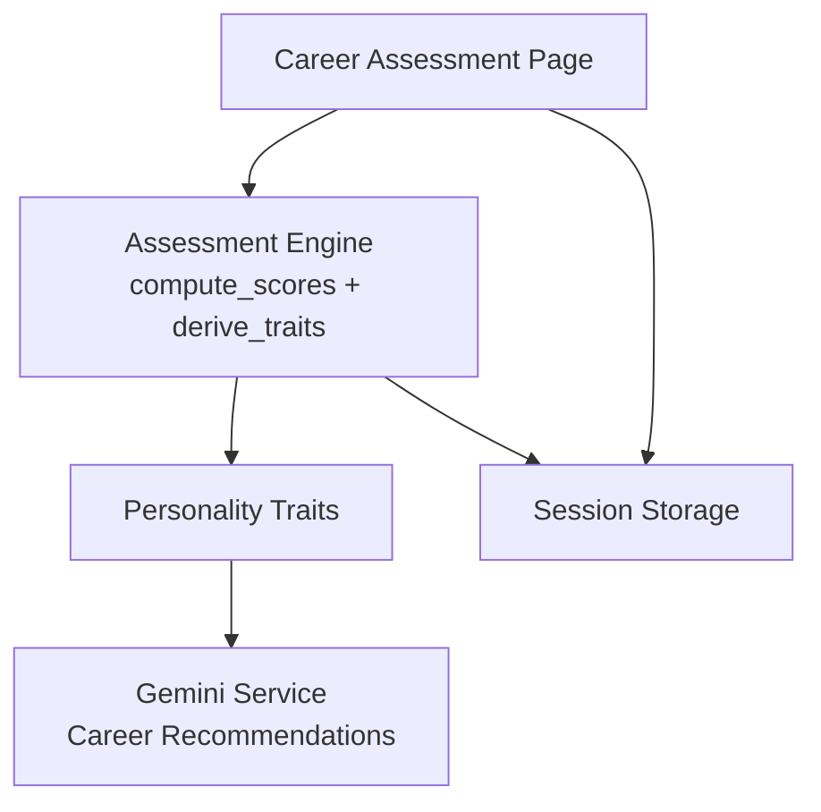
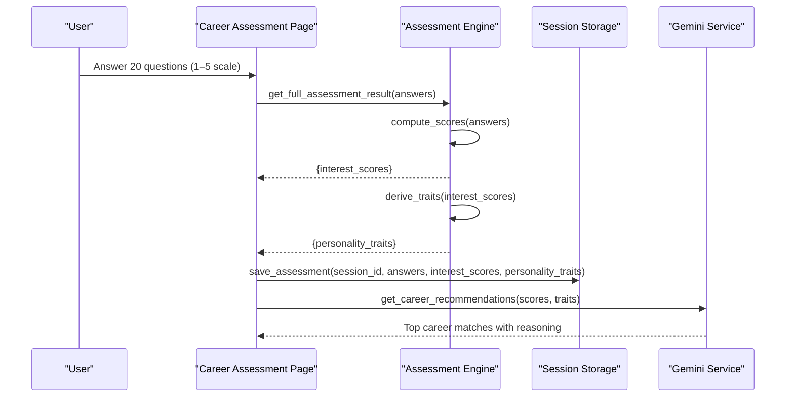
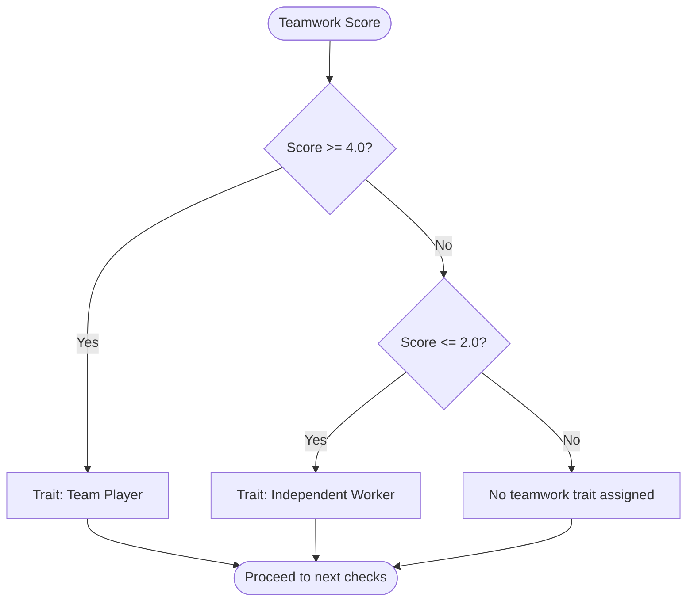
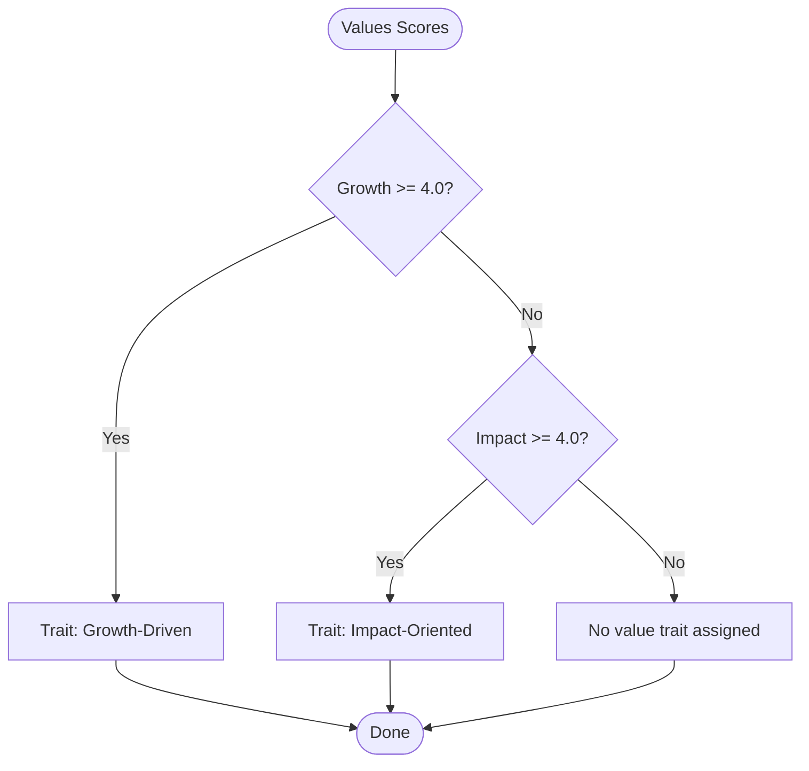
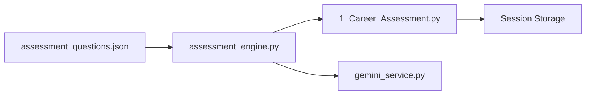

# Personality Trait Derivation

<cite>
**Referenced Files in This Document**
- [assessment_engine.py](file://mentorx-ai/src/assessment_engine.py)
- [assessment_questions.json](file://mentorx-ai/data/assessment_questions.json)
- [1_Career_Assessment.py](file://mentorx-ai/pages/1_Career_Assessment.py)
- [gemini_service.py](file://mentorx-ai/src/gemini_service.py)
</cite>

## Table of Contents
1. [Introduction](#introduction)
2. [Project Structure](#project-structure)
3. [Core Components](#core-components)
4. [Architecture Overview](#architecture-overview)
5. [Detailed Component Analysis](#detailed-component-analysis)
6. [Dependency Analysis](#dependency-analysis)
7. [Performance Considerations](#performance-considerations)
8. [Troubleshooting Guide](#troubleshooting-guide)
9. [Conclusion](#conclusion)

## Introduction
This document explains the personality trait derivation system that transforms numerical assessment scores into meaningful personality and career characteristics. It focuses on how the derive_traits function maps dimension scores to traits such as Tech-Oriented, Creative Thinker, People-Focused, Growth-Driven, and Impact-Oriented. It also details threshold-based logic, decision trees for work-style traits (teamwork preferences, leadership potential), value-based traits (growth-driven, impact-oriented), score-to-trait mappings, and fallback mechanisms for balanced profiles.

## Project Structure
The trait derivation system is part of a career assessment pipeline:
- The user completes a 20-question quiz across interests, work style, skills, and values.
- Answers are aggregated into per-dimension average scores.
- Scores are transformed into human-readable traits via derive_traits.
- Results are stored and later used by downstream services (e.g., career recommendations).

**Diagram sources**
- [1_Career_Assessment.py:91-113](file://mentorx-ai/pages/1_Career_Assessment.py#L91-L113)
- [assessment_engine.py:52-143](file://mentorx-ai/src/assessment_engine.py#L52-L143)
- [gemini_service.py:79-103](file://mentorx-ai/src/gemini_service.py#L79-L103)

**Section sources**
- [1_Career_Assessment.py:1-138](file://mentorx-ai/pages/1_Career_Assessment.py#L1-L138)
- [assessment_engine.py:1-143](file://mentorx-ai/src/assessment_engine.py#L1-L143)
- [assessment_questions.json:1-134](file://mentorx-ai/data/assessment_questions.json#L1-L134)

## Core Components
- Dimension scoring: Aggregates raw answers into per-dimension averages (scale 1–5).
- Trait derivation: Applies thresholds to map dimension scores to traits.
- Integration points: UI collects answers; results are persisted and consumed by recommendation services.

Key responsibilities:
- compute_scores: Builds dimension-level aggregates from question responses.
- derive_traits: Converts dimension scores into labeled traits with descriptions.
- get_full_assessment_result: Convenience wrapper returning both scores and traits.

**Section sources**
- [assessment_engine.py:52-81](file://mentorx-ai/src/assessment_engine.py#L52-L81)
- [assessment_engine.py:84-143](file://mentorx-ai/src/assessment_engine.py#L84-L143)

## Architecture Overview
The flow from answers to traits and beyond:

**Diagram sources**
- [1_Career_Assessment.py:91-113](file://mentorx-ai/pages/1_Career_Assessment.py#L91-L113)
- [assessment_engine.py:133-143](file://mentorx-ai/src/assessment_engine.py#L133-L143)
- [gemini_service.py:79-103](file://mentorx-ai/src/gemini_service.py#L79-L103)

## Detailed Component Analysis

### Scoring Pipeline
- Input: A dictionary mapping question IDs to integer scores (1–5).
- Processing:
  - Load questions and group answers by dimension.
  - Compute average per dimension, rounded to one decimal place.
- Output: A dictionary of dimension -> average score.

Complexity:
- Time: O(Q) where Q is number of questions (20).
- Space: O(D) where D is number of dimensions (up to ~16).

Edge cases:
- Missing answers: Dimensions without answers default to 0.0.
- Rounding: Ensures consistent thresholds across users.

**Section sources**
- [assessment_engine.py:44-81](file://mentorx-ai/src/assessment_engine.py#L44-L81)
- [assessment_questions.json:11-131](file://mentorx-ai/data/assessment_questions.json#L11-L131)

### Trait Derivation Logic
derive_traits applies threshold rules to produce a set of traits. Each rule checks a specific dimension and assigns a descriptive label if the threshold is met.

Thresholds and mappings:
- Interest-based traits (threshold 3.5):
  - technical >= 3.5 => Tech-Oriented
  - creative >= 3.5 => Creative Thinker
  - social >= 3.5 => People-Focused
  - analytical >= 3.5 => Analytical Mind
  - entrepreneurial >= 3.5 => Entrepreneurial Spirit
- Work-style traits (thresholds vary):
  - teamwork >= 4.0 => Team Player
  - teamwork <= 2.0 => Independent Worker (mutually exclusive branch)
  - flexibility >= 4.0 => Adaptable
  - leadership >= 4.0 => Natural Leader
- Skill traits (threshold 4.0):
  - problem_solving >= 4.0 => Strong Problem Solver
  - communication >= 4.0 => Effective Communicator
- Value traits (threshold 4.0):
  - growth >= 4.0 => Growth-Driven
  - impact >= 4.0 => Impact-Oriented
- Fallback:
  - If no traits are derived, assign Versatile to represent a balanced profile.

Decision tree for teamwork preference:

**Diagram sources**
- [assessment_engine.py:104-112](file://mentorx-ai/src/assessment_engine.py#L104-L112)

Value-based traits decision flow:

**Diagram sources**
- [assessment_engine.py:120-124](file://mentorx-ai/src/assessment_engine.py#L120-L124)

Score-to-trait examples:
- Example 1: High technical and creative scores (>= 3.5) yield Tech-Oriented and Creative Thinker.
- Example 2: High teamwork (>= 4.0) yields Team Player; low teamwork (<= 2.0) yields Independent Worker.
- Example 3: High growth and impact (>= 4.0) yields Growth-Driven and Impact-Oriented.
- Balanced profile: If all scores fall below thresholds, Versatile is assigned.

Fallback mechanism:
- If no thresholds are met, the system assigns Versatile to ensure every user receives at least one meaningful trait.

**Section sources**
- [assessment_engine.py:84-130](file://mentorx-ai/src/assessment_engine.py#L84-L130)

### Integration Points
- UI integration: The Career Assessment page calls get_full_assessment_result to obtain both scores and traits, then persists them and displays results.
- Downstream usage: The Gemini service consumes both interest_scores and personality_traits to generate tailored career recommendations.

**Section sources**
- [1_Career_Assessment.py:91-113](file://mentorx-ai/pages/1_Career_Assessment.py#L91-L113)
- [gemini_service.py:79-103](file://mentorx-ai/src/gemini_service.py#L79-L103)

## Dependency Analysis
- assessment_engine depends on:
  - assessment_questions.json for question definitions and dimension mappings.
- 1_Career_Assessment.py depends on:
  - assessment_engine for scoring and trait derivation.
  - database module for persistence (outside scope of this document).
- gemini_service depends on:
  - interest_scores and personality_traits to generate recommendations.

**Diagram sources**
- [assessment_engine.py:44-81](file://mentorx-ai/src/assessment_engine.py#L44-L81)
- [1_Career_Assessment.py:91-113](file://mentorx-ai/pages/1_Career_Assessment.py#L91-L113)
- [gemini_service.py:79-103](file://mentorx-ai/src/gemini_service.py#L79-L103)

**Section sources**
- [assessment_engine.py:1-143](file://mentorx-ai/src/assessment_engine.py#L1-L143)
- [assessment_questions.json:1-134](file://mentorx-ai/data/assessment_questions.json#L1-L134)
- [1_Career_Assessment.py:1-138](file://mentorx-ai/pages/1_Career_Assessment.py#L1-L138)
- [gemini_service.py:79-103](file://mentorx-ai/src/gemini_service.py#L79-L103)

## Performance Considerations
- Efficiency: Scoring and trait derivation are linear in the number of questions and dimensions; negligible overhead for typical use.
- Threshold tuning: Adjusting thresholds can change sensitivity to certain traits; consider re-evaluating based on user feedback.
- Robustness: Missing answers default to zero; ensure complete question coverage or handle partial submissions gracefully in the UI.

[No sources needed since this section provides general guidance]

## Troubleshooting Guide
Common issues and resolutions:
- No traits derived:
  - Cause: All dimension scores below thresholds.
  - Resolution: Verify answers; expect Versatile as fallback.
- Unexpected teamwork trait:
  - Cause: Misinterpretation of thresholds (>= 4.0 vs <= 2.0).
  - Resolution: Confirm score falls within expected range; check mutual exclusivity logic.
- Inconsistent trait assignments:
  - Cause: Rounding differences or missing dimensions.
  - Resolution: Ensure all questions answered; review dimension aggregation.

**Section sources**
- [assessment_engine.py:84-130](file://mentorx-ai/src/assessment_engine.py#L84-L130)

## Conclusion
The personality trait derivation system converts assessment scores into actionable insights using clear, threshold-based rules. It supports interest-based, work-style, skill, and value-based traits, with a robust fallback ensuring every user receives a meaningful label. The design is simple, efficient, and integrates seamlessly with the assessment UI and downstream recommendation services.

[No sources needed since this section summarizes without analyzing specific files]