# Google Gemini API Integration

<cite>
**Referenced Files in This Document**
- [gemini_service.py](file://mentorx-ai/src/gemini_service.py)
- [2_Career_Recommendation.py](file://mentorx-ai/pages/2_Career_Recommendation.py)
- [3_Skill_Gap_Analysis.py](file://mentorx-ai/pages/3_Skill_Gap_Analysis.py)
- [4_Learning_Roadmap.py](file://mentorx-ai/pages/4_Learning_Roadmap.py)
- [5_Resume_Analyzer.py](file://mentorx-ai/pages/5_Resume_Analyzer.py)
- [6_AI_Mock_Interview.py](file://mentorx-ai/pages/6_AI_Mock_Interview.py)
- [app.py](file://mentorx-ai/app.py)
- [config.toml](file://mentorx-ai/.streamlit/config.toml)
</cite>

## Table of Contents
1. [Introduction](#introduction)
2. [Project Structure](#project-structure)
3. [Core Components](#core-components)
4. [Architecture Overview](#architecture-overview)
5. [Detailed Component Analysis](#detailed-component-analysis)
6. [Dependency Analysis](#dependency-analysis)
7. [Performance Considerations](#performance-considerations)
8. [Troubleshooting Guide](#troubleshooting-guide)
9. [Conclusion](#conclusion)
10. [Appendices](#appendices)

## Introduction
This document explains how Mentor X-AI integrates with the Google Gemini API to power AI-driven features across career assessment, recommendations, skill gap analysis, learning roadmaps, resume review, and mock interviews. It focuses on the centralized AI service architecture, model configuration, API key management, connection setup, core helper functions, prompt engineering patterns, JSON parsing with markdown fence handling, fallback mechanisms, configuration options, rate limiting considerations, and troubleshooting guidance.

## Project Structure
Mentor X-AI is a Streamlit application organized into:
- A central AI service module that encapsulates all Gemini API interactions
- Feature pages that orchestrate user flows and call the AI service
- Application entry point and UI configuration

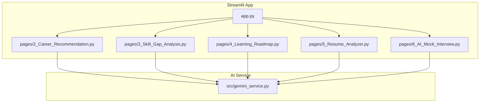

**Diagram sources**
- [app.py:1-166](file://mentorx-ai/app.py#L1-L166)
- [gemini_service.py:1-422](file://mentorx-ai/src/gemini_service.py#L1-L422)
- [2_Career_Recommendation.py:1-140](file://mentorx-ai/pages/2_Career_Recommendation.py#L1-L140)
- [3_Skill_Gap_Analysis.py:1-230](file://mentorx-ai/pages/3_Skill_Gap_Analysis.py#L1-L230)
- [4_Learning_Roadmap.py:1-198](file://mentorx-ai/pages/4_Learning_Roadmap.py#L1-L198)
- [5_Resume_Analyzer.py:1-191](file://mentorx-ai/pages/5_Resume_Analyzer.py#L1-L191)
- [6_AI_Mock_Interview.py:1-283](file://mentorx-ai/pages/6_AI_Mock_Interview.py#L1-L283)

**Section sources**
- [app.py:1-166](file://mentorx-ai/app.py#L1-L166)
- [config.toml:1-13](file://mentorx-ai/.streamlit/config.toml#L1-L13)

## Core Components
The Gemini integration is centralized in a single service module that:
- Loads environment variables for API keys
- Configures the Gemini client once at import time
- Provides typed helper functions for calling the model, parsing JSON responses (including markdown fences), and safe calls with fallbacks
- Exposes feature-specific functions that build structured prompts and return well-defined JSON schemas

Key responsibilities:
- Model configuration and connection setup
- Centralized error handling and robust fallbacks
- Consistent prompt templates per feature
- Strict JSON output contracts parsed from model responses

**Section sources**
- [gemini_service.py:1-60](file://mentorx-ai/src/gemini_service.py#L1-L60)

## Architecture Overview
All LLM calls are funneled through the centralized service. Pages construct prompts based on user inputs and session state, then rely on the service to handle API communication and response parsing.

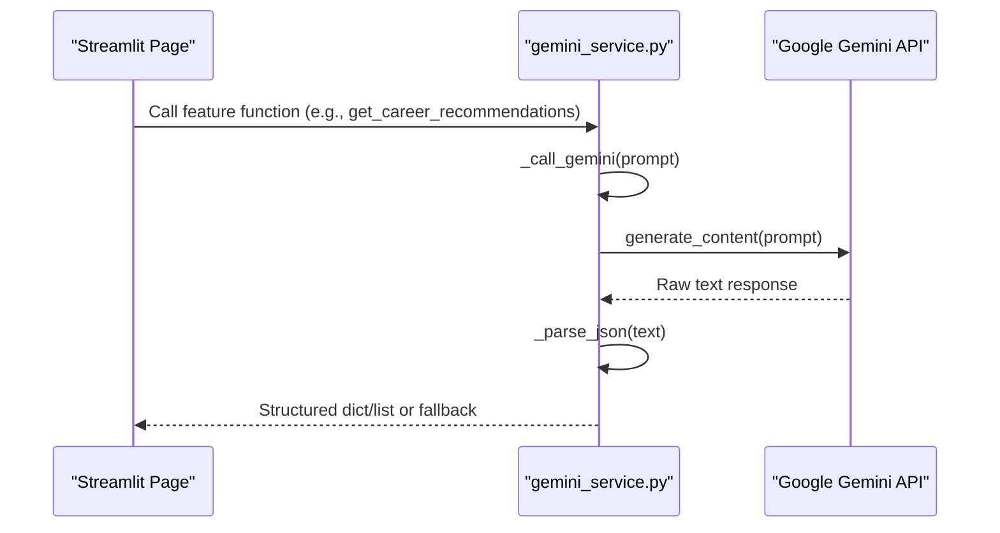

**Diagram sources**
- [gemini_service.py:32-59](file://mentorx-ai/src/gemini_service.py#L32-L59)
- [2_Career_Recommendation.py:54-68](file://mentorx-ai/pages/2_Career_Recommendation.py#L54-L68)
- [3_Skill_Gap_Analysis.py:90-116](file://mentorx-ai/pages/3_Skill_Gap_Analysis.py#L90-L116)
- [4_Learning_Roadmap.py:60-75](file://mentorx-ai/pages/4_Learning_Roadmap.py#L60-L75)
- [5_Resume_Analyzer.py:84-104](file://mentorx-ai/pages/5_Resume_Analyzer.py#L84-L104)
- [6_AI_Mock_Interview.py:91-104](file://mentorx-ai/pages/6_AI_Mock_Interview.py#L91-L104)

## Detailed Component Analysis

### Centralized AI Service: gemini_service.py
Responsibilities:
- Configuration: model name, API key loading, client initialization
- Helpers:
  - _call_gemini: validates configuration and invokes the model
  - _parse_json: extracts JSON from raw text, stripping markdown fences
  - _safe_call: wraps calls with try/except and returns a fallback structure on errors
- Feature functions:
  - Career recommendations
  - Skill gap analysis
  - Learning roadmap generation
  - Resume review
  - Mock interview question generation, answer evaluation, and final summary

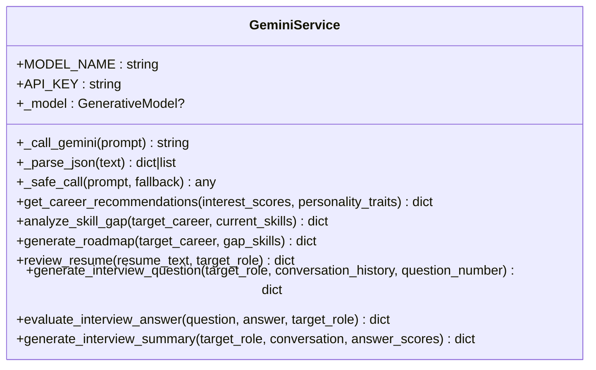

**Diagram sources**
- [gemini_service.py:15-60](file://mentorx-ai/src/gemini_service.py#L15-L60)
- [gemini_service.py:66-422](file://mentorx-ai/src/gemini_service.py#L66-L422)

**Section sources**
- [gemini_service.py:15-60](file://mentorx-ai/src/gemini_service.py#L15-L60)
- [gemini_service.py:66-422](file://mentorx-ai/src/gemini_service.py#L66-L422)

### Helper Functions and Error Handling

- _call_gemini
  - Validates that the model instance exists; raises a clear runtime error if the API key is missing
  - Invokes the model’s content generation method and returns raw text
- _parse_json
  - Uses regex to strip optional markdown fences around JSON
  - Parses the cleaned text into Python structures
- _safe_call
  - Wraps call and parse steps in a try/except block
  - Logs errors and returns a predefined fallback structure to keep UI functional

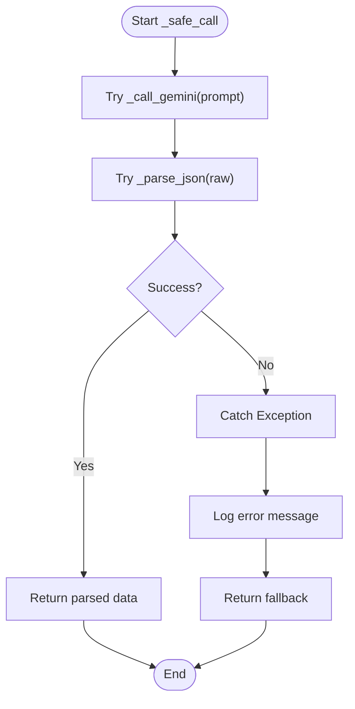

**Diagram sources**
- [gemini_service.py:32-59](file://mentorx-ai/src/gemini_service.py#L32-L59)

**Section sources**
- [gemini_service.py:32-59](file://mentorx-ai/src/gemini_service.py#L32-L59)

### Prompt Engineering Patterns
Across features, prompts follow consistent patterns:
- Role definition and domain context (Pakistani job market focus)
- Input injection via structured formatting (JSON dumps for scores, skills, etc.)
- Explicit schema enforcement (“Return ONLY valid JSON in this exact format”)
- Constraints and ranges (e.g., match_score 0–100, priority levels, phase counts)
- Examples embedded in prompts to guide output shape

Examples by feature:
- Career recommendations: injects interest scores and personality traits; requests top 5 careers with specific fields
- Skill gap analysis: compares current skills against target role requirements; defines matched and gap categories with priorities
- Learning roadmap: generates phased plans with milestones, resources, hours, and free/paid indicators
- Resume review: evaluates sections, provides ATS tips, strengths, and improvement suggestions
- Mock interview: generates contextual questions, evaluates answers, and produces a final summary

**Section sources**
- [gemini_service.py:66-103](file://mentorx-ai/src/gemini_service.py#L66-L103)
- [gemini_service.py:110-147](file://mentorx-ai/src/gemini_service.py#L110-L147)
- [gemini_service.py:154-201](file://mentorx-ai/src/gemini_service.py#L154-L201)
- [gemini_service.py:208-285](file://mentorx-ai/src/gemini_service.py#L208-L285)
- [gemini_service.py:292-335](file://mentorx-ai/src/gemini_service.py#L292-L335)
- [gemini_service.py:342-371](file://mentorx-ai/src/gemini_service.py#L342-L371)
- [gemini_service.py:378-421](file://mentorx-ai/src/gemini_service.py#L378-L421)

### JSON Response Parsing with Markdown Fence Handling
- The parser strips optional “```json” wrappers using a regular expression before parsing
- If no fences are present, it parses the entire text as JSON
- Errors during parsing are caught by _safe_call and result in returning the fallback structure

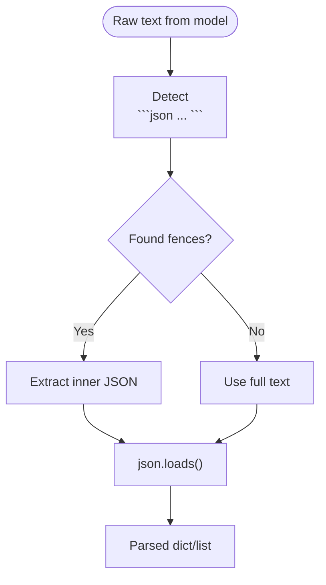

**Diagram sources**
- [gemini_service.py:43-49](file://mentorx-ai/src/gemini_service.py#L43-L49)

**Section sources**
- [gemini_service.py:43-49](file://mentorx-ai/src/gemini_service.py#L43-L49)

### Fallback Mechanisms
Each feature function passes a default fallback structure to _safe_call so the UI remains stable even when the API fails or returns malformed JSON:
- Recommendations fallback: empty list under “recommendations”
- Skill gap fallback: empty lists and zero match percentage
- Roadmap fallback: empty phases and zero total hours
- Resume feedback fallback: zero score and empty lists
- Interview question fallback: generic opening question and metadata
- Answer evaluation fallback: neutral score and placeholder feedback
- Summary fallback: minimal overall impression and tips

**Section sources**
- [gemini_service.py:66-103](file://mentorx-ai/src/gemini_service.py#L66-L103)
- [gemini_service.py:110-147](file://mentorx-ai/src/gemini_service.py#L110-L147)
- [gemini_service.py:154-201](file://mentorx-ai/src/gemini_service.py#L154-L201)
- [gemini_service.py:208-285](file://mentorx-ai/src/gemini_service.py#L208-L285)
- [gemini_service.py:292-335](file://mentorx-ai/src/gemini_service.py#L292-L335)
- [gemini_service.py:342-371](file://mentorx-ai/src/gemini_service.py#L342-L371)
- [gemini_service.py:378-421](file://mentorx-ai/src/gemini_service.py#L378-L421)

### Feature Integrations and Data Flows

#### Career Recommendation Flow
- User triggers generation after completing assessment
- Page calls the service function with interest scores and personality traits
- Service builds a prompt and returns recommendations
- Page persists results and updates session step

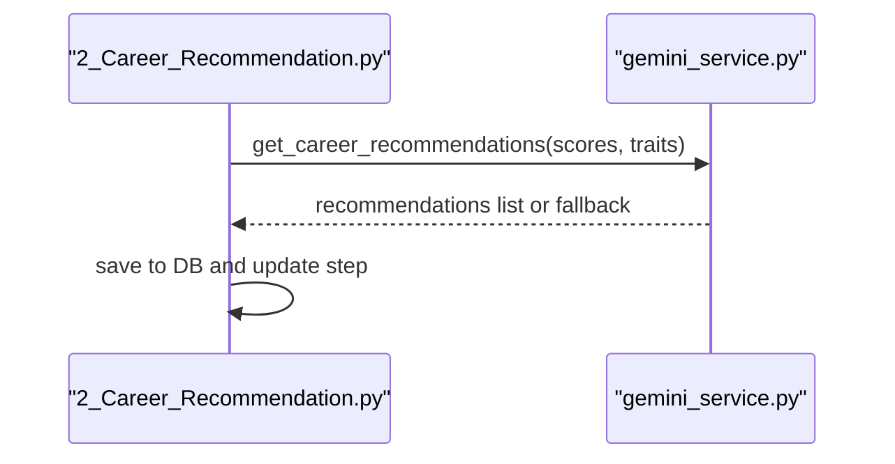

**Diagram sources**
- [2_Career_Recommendation.py:54-68](file://mentorx-ai/pages/2_Career_Recommendation.py#L54-L68)
- [gemini_service.py:66-103](file://mentorx-ai/src/gemini_service.py#L66-L103)

**Section sources**
- [2_Career_Recommendation.py:54-68](file://mentorx-ai/pages/2_Career_Recommendation.py#L54-L68)
- [gemini_service.py:66-103](file://mentorx-ai/src/gemini_service.py#L66-L103)

#### Skill Gap Analysis Flow
- User selects skills and submits for analysis
- Page calls service with target career and current skills
- Service returns matched and gap skills with priorities and match percentage
- Page visualizes results and stores them

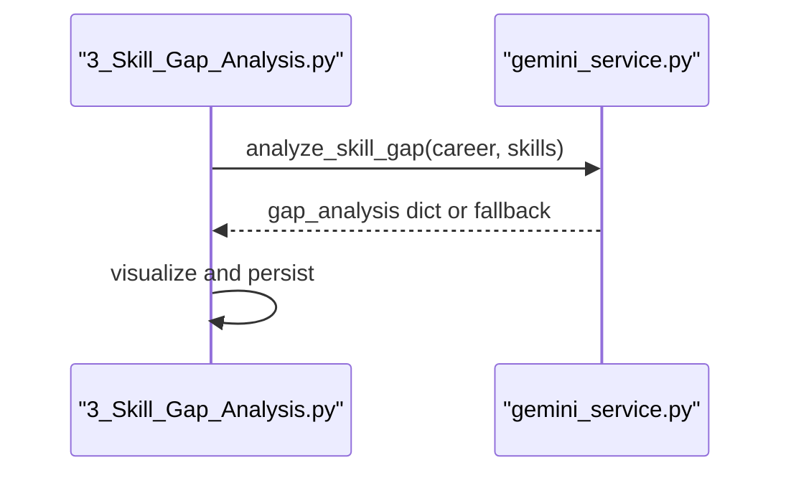

**Diagram sources**
- [3_Skill_Gap_Analysis.py:90-116](file://mentorx-ai/pages/3_Skill_Gap_Analysis.py#L90-L116)
- [gemini_service.py:110-147](file://mentorx-ai/src/gemini_service.py#L110-L147)

**Section sources**
- [3_Skill_Gap_Analysis.py:90-116](file://mentorx-ai/pages/3_Skill_Gap_Analysis.py#L90-L116)
- [gemini_service.py:110-147](file://mentorx-ai/src/gemini_service.py#L110-L147)

#### Learning Roadmap Flow
- Page gathers gap skills and calls service to generate phases and milestones
- Service returns structured roadmap with estimated hours
- Page renders timeline and milestone tracking

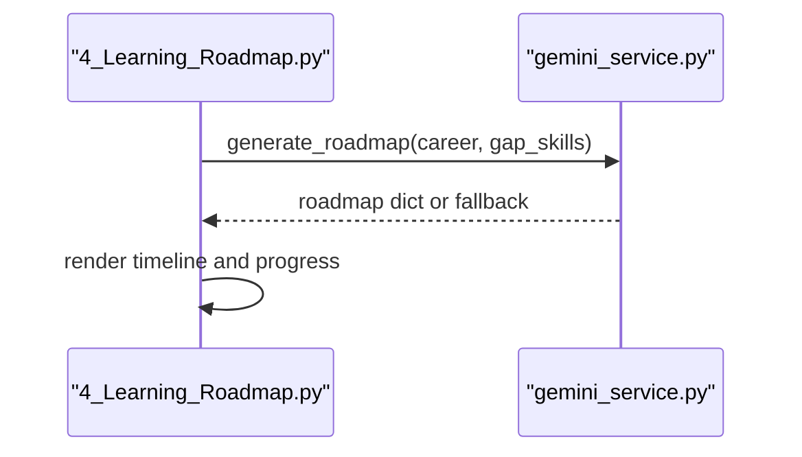

**Diagram sources**
- [4_Learning_Roadmap.py:60-75](file://mentorx-ai/pages/4_Learning_Roadmap.py#L60-L75)
- [gemini_service.py:154-201](file://mentorx-ai/src/gemini_service.py#L154-L201)

**Section sources**
- [4_Learning_Roadmap.py:60-75](file://mentorx-ai/pages/4_Learning_Roadmap.py#L60-L75)
- [gemini_service.py:154-201](file://mentorx-ai/src/gemini_service.py#L154-L201)

#### Resume Analyzer Flow
- User pastes resume text and specifies target role
- Page calls service to evaluate resume
- Service returns section feedback, ATS tips, strengths, and improvements
- Page displays gauge and detailed feedback

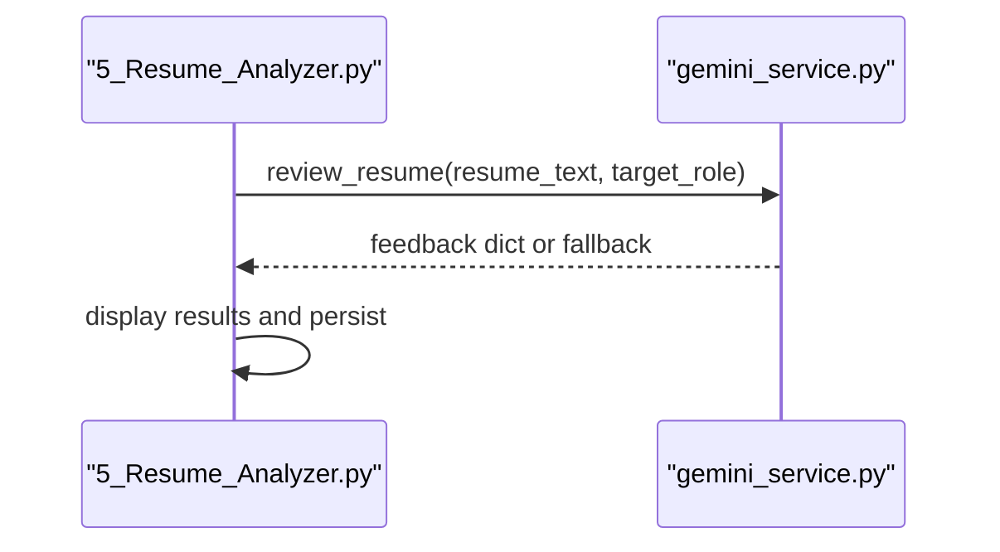

**Diagram sources**
- [5_Resume_Analyzer.py:84-104](file://mentorx-ai/pages/5_Resume_Analyzer.py#L84-L104)
- [gemini_service.py:208-285](file://mentorx-ai/src/gemini_service.py#L208-L285)

**Section sources**
- [5_Resume_Analyzer.py:84-104](file://mentorx-ai/pages/5_Resume_Analyzer.py#L84-L104)
- [gemini_service.py:208-285](file://mentorx-ai/src/gemini_service.py#L208-L285)

#### Mock Interview Flow
- Page initializes chat state and starts interview
- For each turn:
  - Generate next question based on conversation history
  - Evaluate candidate answer with feedback
  - After final question, generate overall summary
- Results are persisted and displayed

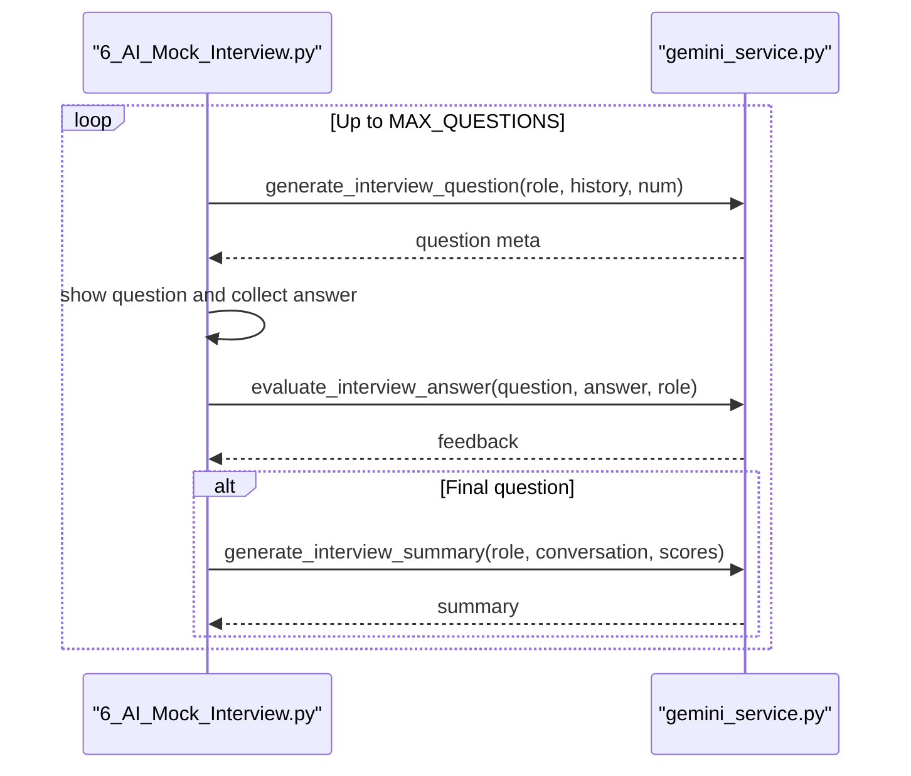

**Diagram sources**
- [6_AI_Mock_Interview.py:91-104](file://mentorx-ai/pages/6_AI_Mock_Interview.py#L91-L104)
- [6_AI_Mock_Interview.py:141-193](file://mentorx-ai/pages/6_AI_Mock_Interview.py#L141-L193)
- [gemini_service.py:292-335](file://mentorx-ai/src/gemini_service.py#L292-L335)
- [gemini_service.py:342-371](file://mentorx-ai/src/gemini_service.py#L342-L371)
- [gemini_service.py:378-421](file://mentorx-ai/src/gemini_service.py#L378-L421)

**Section sources**
- [6_AI_Mock_Interview.py:91-104](file://mentorx-ai/pages/6_AI_Mock_Interview.py#L91-L104)
- [6_AI_Mock_Interview.py:141-193](file://mentorx-ai/pages/6_AI_Mock_Interview.py#L141-L193)
- [gemini_service.py:292-335](file://mentorx-ai/src/gemini_service.py#L292-L335)
- [gemini_service.py:342-371](file://mentorx-ai/src/gemini_service.py#L342-L371)
- [gemini_service.py:378-421](file://mentorx-ai/src/gemini_service.py#L378-L421)

## Dependency Analysis
- All feature pages depend on the centralized AI service for LLM calls
- The service depends on the Google Generative AI SDK and environment variable loader
- UI configuration is managed via Streamlit config file

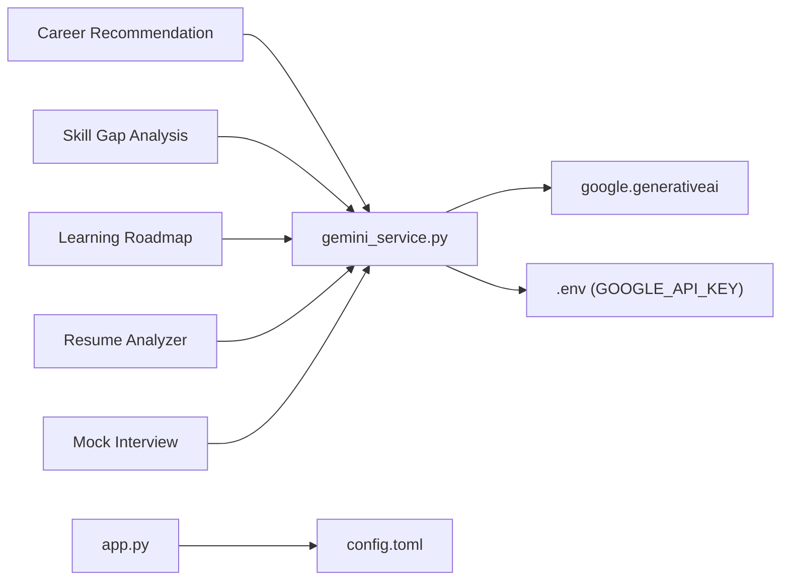

**Diagram sources**
- [gemini_service.py:6-25](file://mentorx-ai/src/gemini_service.py#L6-L25)
- [2_Career_Recommendation.py:1-140](file://mentorx-ai/pages/2_Career_Recommendation.py#L1-L140)
- [3_Skill_Gap_Analysis.py:1-230](file://mentorx-ai/pages/3_Skill_Gap_Analysis.py#L1-L230)
- [4_Learning_Roadmap.py:1-198](file://mentorx-ai/pages/4_Learning_Roadmap.py#L1-L198)
- [5_Resume_Analyzer.py:1-191](file://mentorx-ai/pages/5_Resume_Analyzer.py#L1-L191)
- [6_AI_Mock_Interview.py:1-283](file://mentorx-ai/pages/6_AI_Mock_Interview.py#L1-L283)
- [app.py:1-166](file://mentorx-ai/app.py#L1-L166)
- [config.toml:1-13](file://mentorx-ai/.streamlit/config.toml#L1-L13)

**Section sources**
- [gemini_service.py:6-25](file://mentorx-ai/src/gemini_service.py#L6-L25)
- [config.toml:1-13](file://mentorx-ai/.streamlit/config.toml#L1-L13)

## Performance Considerations
- Rate limiting: The service does not implement explicit rate limiting. When integrating with Gemini, consider adding retries with exponential backoff and request throttling to avoid hitting quotas or timeouts.
- Caching: Responses are cached per session in Streamlit state and optionally persisted in the database. Consider caching repeated queries (e.g., same career/skills) to reduce API usage.
- Prompt size: Keep prompts concise and focused to minimize token usage and latency.
- Streaming: For long-running tasks like interview summaries, consider streaming partial outputs to improve perceived performance.
- Concurrency: Avoid parallel calls to Gemini within a single session unless necessary; serialize requests to respect quotas.

[No sources needed since this section provides general guidance]

## Troubleshooting Guide
Common issues and resolutions:
- Missing API key
  - Symptom: Runtime error indicating API key not configured
  - Resolution: Ensure GOOGLE_API_KEY is set in your .env file and loaded via dotenv
- Malformed JSON response
  - Symptom: Parsing errors leading to fallback behavior
  - Resolution: Check prompt constraints and ensure the model returns strictly JSON; verify markdown fence handling
- Empty or incomplete results
  - Symptom: Fallback structures returned (e.g., empty lists)
  - Resolution: Inspect logs printed by the service and retry with refined prompts or different model settings
- UI shows persistent errors
  - Symptom: Pages display “Could not generate… Please check your API key”
  - Resolution: Validate environment configuration and network connectivity; confirm Gemini availability

Operational checks:
- Verify model initialization occurs only when an API key is present
- Confirm that _safe_call catches exceptions and returns appropriate fallbacks
- Review page guards that require prior steps to be completed

**Section sources**
- [gemini_service.py:32-59](file://mentorx-ai/src/gemini_service.py#L32-L59)
- [2_Career_Recommendation.py:54-68](file://mentorx-ai/pages/2_Career_Recommendation.py#L54-L68)
- [3_Skill_Gap_Analysis.py:90-116](file://mentorx-ai/pages/3_Skill_Gap_Analysis.py#L90-L116)
- [4_Learning_Roadmap.py:60-75](file://mentorx-ai/pages/4_Learning_Roadmap.py#L60-L75)
- [5_Resume_Analyzer.py:84-104](file://mentorx-ai/pages/5_Resume_Analyzer.py#L84-L104)
- [6_AI_Mock_Interview.py:91-104](file://mentorx-ai/pages/6_AI_Mock_Interview.py#L91-L104)

## Conclusion
Mentor X-AI centralizes all Google Gemini API interactions in a single service module, ensuring consistent configuration, robust error handling, and predictable JSON outputs. Each feature page composes structured prompts tailored to its domain and relies on the service to manage API calls and parsing. With clear fallbacks and strict schemas, the system remains resilient to API failures and malformed responses. To further improve reliability and performance, consider implementing rate limiting, caching strategies, and streaming where appropriate.

[No sources needed since this section summarizes without analyzing specific files]

## Appendices

### Configuration Options
- Model selection
  - Current model: gemini-2.0-flash
  - Change by updating the model name constant in the service module
- API key management
  - Load GOOGLE_API_KEY from environment via dotenv
  - Client is initialized only when the key is present
- Streamlit theme and server settings
  - Primary color, background colors, font, headless mode, and usage stats gathered via config file

**Section sources**
- [gemini_service.py:15-25](file://mentorx-ai/src/gemini_service.py#L15-L25)
- [config.toml:1-13](file://mentorx-ai/.streamlit/config.toml#L1-L13)

### Example Scenarios

- Successful API call
  - Scenario: Generating career recommendations
  - Flow: Page constructs prompt with user profile, service calls Gemini, parses JSON, returns recommendations, UI displays and persists results
  - References:
    - [2_Career_Recommendation.py:54-68](file://mentorx-ai/pages/2_Career_Recommendation.py#L54-L68)
    - [gemini_service.py:66-103](file://mentorx-ai/src/gemini_service.py#L66-L103)

- Error scenario: Missing API key
  - Symptom: Runtime error raised when attempting to call the model
  - Resolution: Set GOOGLE_API_KEY in .env and restart the app
  - Reference:
    - [gemini_service.py:32-39](file://mentorx-ai/src/gemini_service.py#L32-L39)

- Error scenario: Malformed JSON response
  - Symptom: Parsing exception leads to fallback structure
  - Resolution: Refine prompt to enforce strict JSON; verify markdown fence handling
  - Reference:
    - [gemini_service.py:43-59](file://mentorx-ai/src/gemini_service.py#L43-L59)