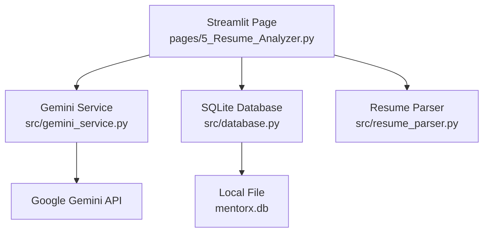
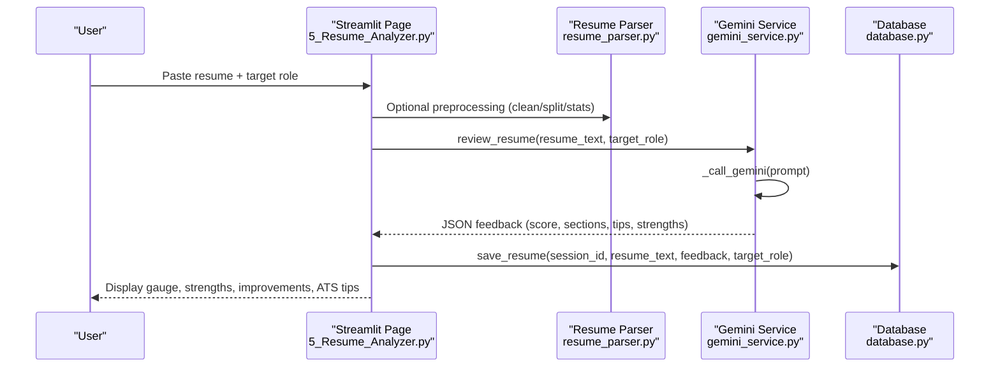
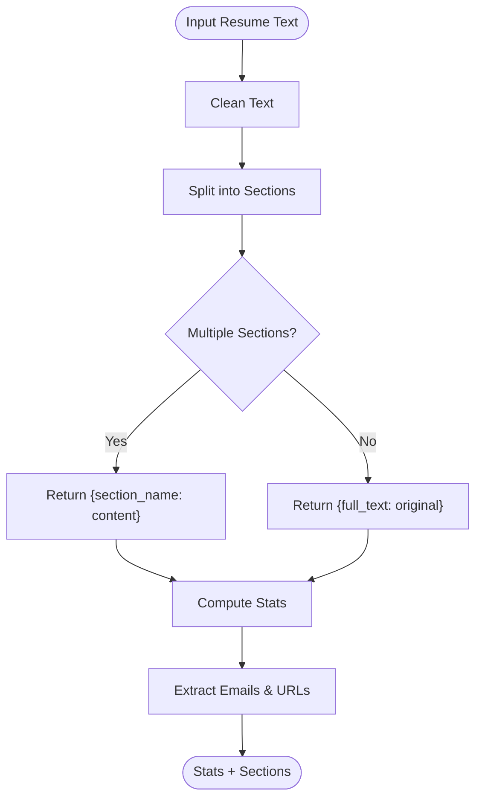
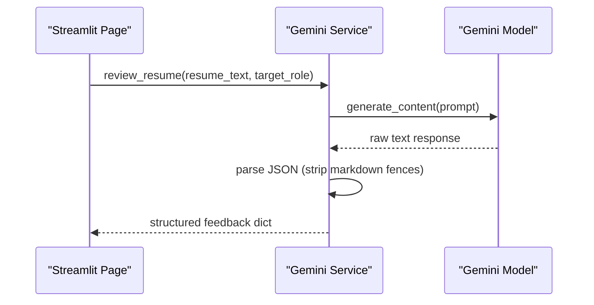
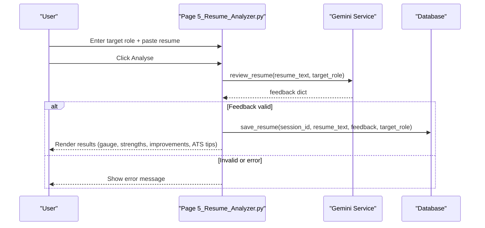
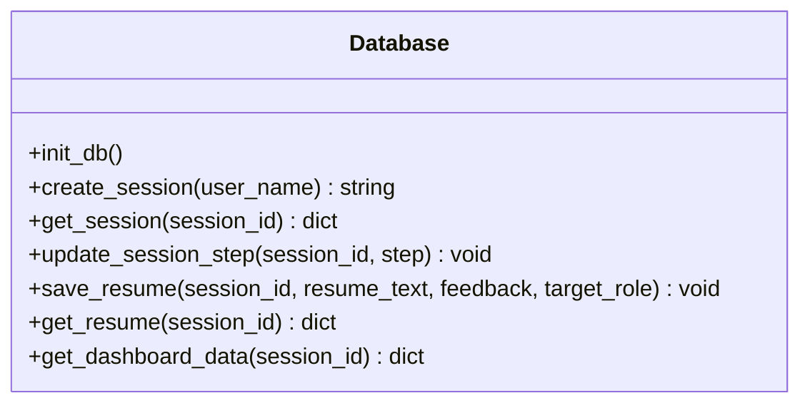
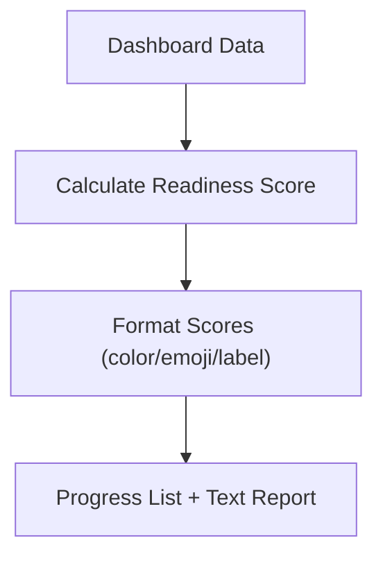
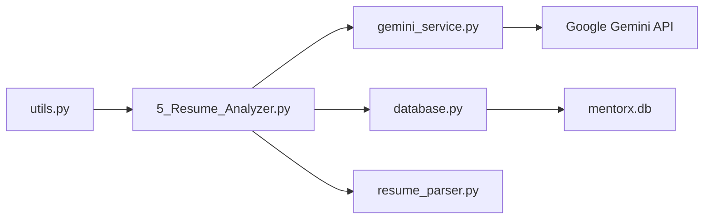
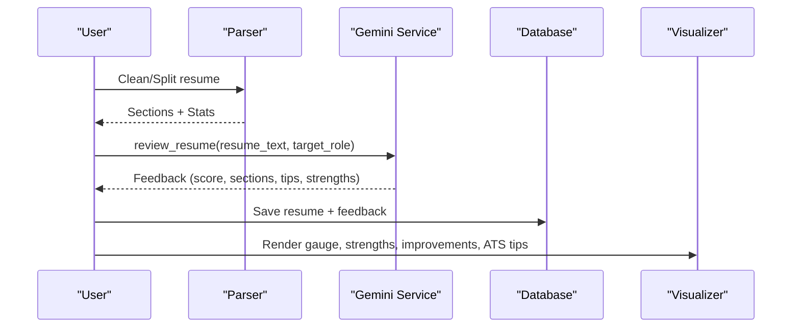

# Resume Analysis Engine

<cite>
**Referenced Files in This Document**
- [resume_parser.py](file://mentorx-ai/src/resume_parser.py)
- [gemini_service.py](file://mentorx-ai/src/gemini_service.py)
- [5_Resume_Analyzer.py](file://mentorx-ai/pages/5_Resume_Analyzer.py)
- [database.py](file://mentorx-ai/src/database.py)
- [utils.py](file://mentorx-ai/src/utils.py)
- [app.py](file://mentorx-ai/app.py)
</cite>

## Table of Contents
1. [Introduction](#introduction)
2. [Project Structure](#project-structure)
3. [Core Components](#core-components)
4. [Architecture Overview](#architecture-overview)
5. [Detailed Component Analysis](#detailed-component-analysis)
6. [Dependency Analysis](#dependency-analysis)
7. [Performance Considerations](#performance-considerations)
8. [Troubleshooting Guide](#troubleshooting-guide)
9. [Conclusion](#conclusion)
10. [Appendices](#appendices)

## Introduction
This document explains the Resume Analysis Engine within MentorX AI, focusing on:
- Text processing and section extraction from resume content
- Integration with Google Gemini for intelligent resume review, ATS optimization analysis, and personalized feedback generation
- Scoring methodology, strength identification, and improvement recommendations
- End-to-end resume processing workflows and evaluation outputs

The engine is designed to be accessible to users while providing robust, structured, and actionable insights powered by AI.

## Project Structure
The resume analysis feature spans a Streamlit page, a parsing utility, an AI service layer, and a local SQLite database for persistence.

**Diagram sources**
- [5_Resume_Analyzer.py:1-191](file://mentorx-ai/pages/5_Resume_Analyzer.py#L1-L191)
- [gemini_service.py:1-422](file://mentorx-ai/src/gemini_service.py#L1-L422)
- [resume_parser.py:1-102](file://mentorx-ai/src/resume_parser.py#L1-L102)
- [database.py:1-362](file://mentorx-ai/src/database.py#L1-L362)

**Section sources**
- [app.py:1-166](file://mentorx-ai/app.py#L1-L166)
- [5_Resume_Analyzer.py:1-191](file://mentorx-ai/pages/5_Resume_Analyzer.py#L1-L191)

## Core Components
- Resume Parser: Cleans text, detects sections (summary, experience, education, skills, etc.), extracts emails and URLs, and computes basic stats.
- Gemini Service: Centralizes all LLM calls using structured prompts and JSON responses; includes resume review, skill gap analysis, roadmap generation, and interview features.
- Streamlit Page: User interface for resume input, target role selection, triggering analysis, and displaying results with charts and expandable sections.
- Database: Persists sessions, assessments, recommendations, skill analyses, roadmaps, resumes, and interviews; provides dashboard aggregation.
- Utilities: Score formatting helpers, readiness score calculation, progress tracking, and report export.

**Section sources**
- [resume_parser.py:1-102](file://mentorx-ai/src/resume_parser.py#L1-L102)
- [gemini_service.py:1-422](file://mentorx-ai/src/gemini_service.py#L1-L422)
- [5_Resume_Analyzer.py:1-191](file://mentorx-ai/pages/5_Resume_Analyzer.py#L1-L191)
- [database.py:1-362](file://mentorx-ai/src/database.py#L1-L362)
- [utils.py:1-205](file://mentorx-ai/src/utils.py#L1-L205)

## Architecture Overview
The resume analysis workflow integrates user input, parsing, AI evaluation, and result visualization.

**Diagram sources**
- [5_Resume_Analyzer.py:84-104](file://mentorx-ai/pages/5_Resume_Analyzer.py#L84-L104)
- [gemini_service.py:208-285](file://mentorx-ai/src/gemini_service.py#L208-L285)
- [database.py:286-308](file://mentorx-ai/src/database.py#L286-L308)

## Detailed Component Analysis

### Resume Parser: Text Processing and Section Extraction
- Text cleaning: Removes control characters and normalizes whitespace.
- Section splitting: Detects known headings (e.g., summary, experience, education, skills) and ALL-CAPS short lines; returns a mapping of section names to their content or falls back to full_text if no clear sections are found.
- Extraction utilities: Finds email addresses and URLs via regex.
- Statistics: Word count, number of detected sections, list of section keys, extracted emails, and URLs.

**Diagram sources**
- [resume_parser.py:23-74](file://mentorx-ai/src/resume_parser.py#L23-L74)
- [resume_parser.py:77-101](file://mentorx-ai/src/resume_parser.py#L77-L101)

**Section sources**
- [resume_parser.py:1-102](file://mentorx-ai/src/resume_parser.py#L1-L102)

### Gemini Service: AI-Powered Resume Review
- Configuration: Loads API key from environment and initializes the model.
- Prompting: Uses structured prompts to request JSON output for consistent parsing.
- Resume Review: Evaluates resume against a target role and returns:
  - overall_score (0–100)
  - section_feedback (per-section scores, comments, suggestions)
  - ats_tips (ATS compatibility tips)
  - top_improvements (actionable items)
  - strengths (positive attributes)
- Error handling: Graceful fallback to default values when API errors occur.

**Diagram sources**
- [gemini_service.py:32-59](file://mentorx-ai/src/gemini_service.py#L32-L59)
- [gemini_service.py:208-285](file://mentorx-ai/src/gemini_service.py#L208-L285)

**Section sources**
- [gemini_service.py:1-422](file://mentorx-ai/src/gemini_service.py#L1-L422)

### Streamlit Page: Resume Analyzer Interface
- Inputs: Target role (auto-filled from prior recommendation) and resume text area.
- Validation: Ensures both inputs are provided before analysis.
- Analysis: Calls review_resume and persists results to the database.
- Visualization: Displays a gauge chart for overall score, lists strengths and improvements, shows per-section feedback in expanders, and presents ATS tips.

**Diagram sources**
- [5_Resume_Analyzer.py:84-104](file://mentorx-ai/pages/5_Resume_Analyzer.py#L84-L104)
- [5_Resume_Analyzer.py:110-191](file://mentorx-ai/pages/5_Resume_Analyzer.py#L110-L191)
- [database.py:286-308](file://mentorx-ai/src/database.py#L286-L308)

**Section sources**
- [5_Resume_Analyzer.py:1-191](file://mentorx-ai/pages/5_Resume_Analyzer.py#L1-L191)

### Database Layer: Persistence and Aggregation
- Tables: Sessions, assessments, recommendations, skill analyses, roadmaps, resumes, interviews.
- Resume storage: Saves resume text, feedback (as JSON), and target role per session.
- Retrieval: Fetches latest resume data for a session and parses stored JSON fields.
- Dashboard aggregation: Combines all components to compute readiness metrics.

**Diagram sources**
- [database.py:21-107](file://mentorx-ai/src/database.py#L21-L107)
- [database.py:286-308](file://mentorx-ai/src/database.py#L286-L308)
- [database.py:351-362](file://mentorx-ai/src/database.py#L351-L362)

**Section sources**
- [database.py:1-362](file://mentorx-ai/src/database.py#L1-L362)

### Utilities: Scoring and Readiness
- Score formatting: Color, emoji, and label based on thresholds.
- Readiness score: Weighted composite across assessment, recommendation, skill analysis, roadmap, resume, and interview.
- Progress tracking: Lists steps and completion status.
- Report export: Generates a plain-text summary including resume score and other milestones.

**Diagram sources**
- [utils.py:16-43](file://mentorx-ai/src/utils.py#L16-L43)
- [utils.py:70-117](file://mentorx-ai/src/utils.py#L70-L117)
- [utils.py:124-144](file://mentorx-ai/src/utils.py#L124-L144)
- [utils.py:151-205](file://mentorx-ai/src/utils.py#L151-L205)

**Section sources**
- [utils.py:1-205](file://mentorx-ai/src/utils.py#L1-L205)

## Dependency Analysis
- The Streamlit page depends on the Gemini service for AI evaluation and the database for persistence.
- The parser is optional but can be used to preprocess resume text before sending to the AI.
- The database stores all intermediate and final results, enabling dashboard aggregation and continuity across steps.
- Utilities provide cross-cutting concerns like scoring and reporting.

**Diagram sources**
- [5_Resume_Analyzer.py:1-191](file://mentorx-ai/pages/5_Resume_Analyzer.py#L1-L191)
- [gemini_service.py:1-422](file://mentorx-ai/src/gemini_service.py#L1-L422)
- [database.py:1-362](file://mentorx-ai/src/database.py#L1-L362)
- [resume_parser.py:1-102](file://mentorx-ai/src/resume_parser.py#L1-L102)
- [utils.py:1-205](file://mentorx-ai/src/utils.py#L1-L205)

**Section sources**
- [5_Resume_Analyzer.py:1-191](file://mentorx-ai/pages/5_Resume_Analyzer.py#L1-L191)
- [gemini_service.py:1-422](file://mentorx-ai/src/gemini_service.py#L1-L422)
- [database.py:1-362](file://mentorx-ai/src/database.py#L1-L362)
- [resume_parser.py:1-102](file://mentorx-ai/src/resume_parser.py#L1-L102)
- [utils.py:1-205](file://mentorx-ai/src/utils.py#L1-L205)

## Performance Considerations
- Parsing efficiency: Regex-based cleaning and section detection are lightweight; suitable for typical resume lengths.
- AI latency: Gemini calls may introduce latency; consider caching repeated reviews for identical inputs if needed.
- Database I/O: Local SQLite operations are fast for single-user sessions; ensure minimal queries during rendering.
- UI responsiveness: Use streaming or loading indicators during AI calls to improve perceived performance.

[No sources needed since this section provides general guidance]

## Troubleshooting Guide
- Missing API key: If GOOGLE_API_KEY is not set, Gemini calls will raise an error; ensure environment configuration.
- Empty or invalid inputs: The page validates that resume text and target role are provided before analysis.
- JSON parsing failures: The service attempts to extract JSON from Gemini’s response; fallback values are returned on errors.
- Database issues: Ensure the application has write permissions to create and update mentorx.db.

**Section sources**
- [gemini_service.py:32-59](file://mentorx-ai/src/gemini_service.py#L32-L59)
- [5_Resume_Analyzer.py:84-104](file://mentorx-ai/pages/5_Resume_Analyzer.py#L84-L104)
- [database.py:21-107](file://mentorx-ai/src/database.py#L21-L107)

## Conclusion
The Resume Analysis Engine combines straightforward text processing with powerful AI-driven evaluation to deliver actionable feedback. It extracts key resume sections, scores content relative to a target role, identifies strengths, suggests improvements, and provides ATS optimization tips. The modular architecture ensures scalability and maintainability, while the Streamlit interface offers an intuitive user experience.

[No sources needed since this section summarizes without analyzing specific files]

## Appendices

### Example Resume Processing Workflow
- User pastes resume and specifies target role.
- System optionally cleans and splits resume into sections.
- AI evaluates resume against target role and returns structured feedback.
- Results are saved to the database and displayed with visualizations.

**Diagram sources**
- [resume_parser.py:23-101](file://mentorx-ai/src/resume_parser.py#L23-L101)
- [gemini_service.py:208-285](file://mentorx-ai/src/gemini_service.py#L208-L285)
- [database.py:286-308](file://mentorx-ai/src/database.py#L286-L308)
- [5_Resume_Analyzer.py:110-191](file://mentorx-ai/pages/5_Resume_Analyzer.py#L110-L191)

### Evaluation Outputs
- Overall score: Numeric rating indicating resume quality relative to the target role.
- Section feedback: Per-section scores with comments and suggestions.
- ATS tips: Actionable advice to improve applicant tracking system compatibility.
- Top improvements: Prioritized recommendations to enhance resume effectiveness.
- Strengths: Positive attributes highlighted for reinforcement.

**Section sources**
- [gemini_service.py:208-285](file://mentorx-ai/src/gemini_service.py#L208-L285)
- [5_Resume_Analyzer.py:110-191](file://mentorx-ai/pages/5_Resume_Analyzer.py#L110-L191)