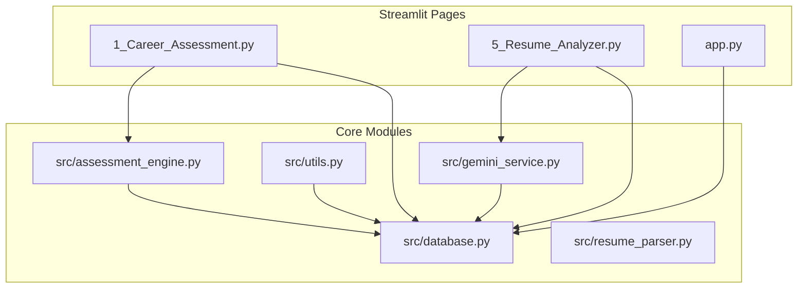
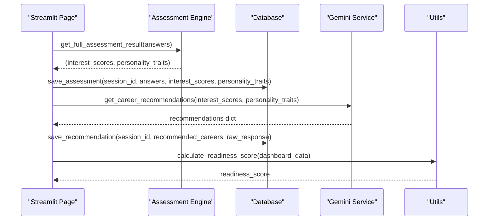
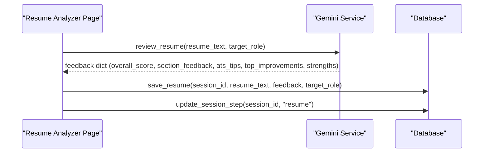
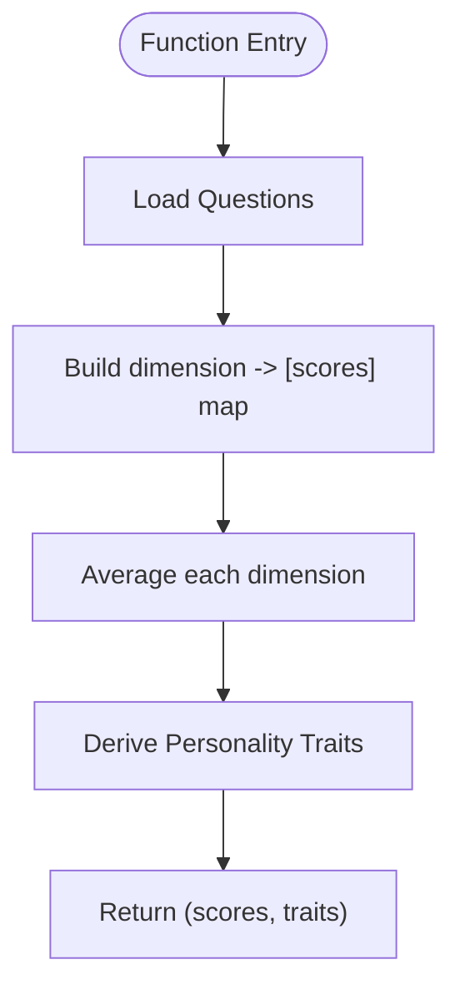
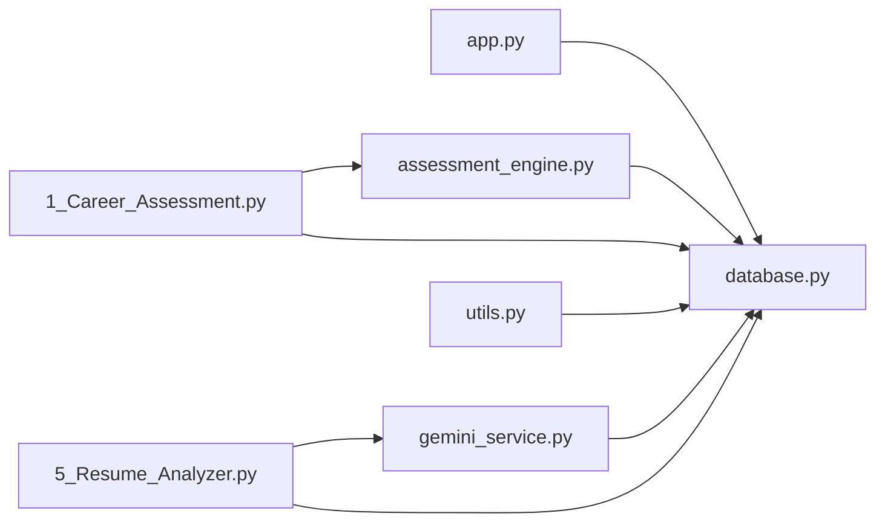
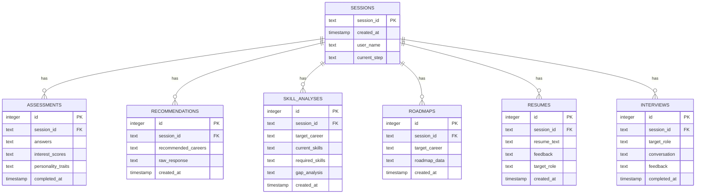

# API Reference

<cite>
**Referenced Files in This Document**
- [app.py](file://mentorx-ai/app.py)
- [database.py](file://mentorx-ai/src/database.py)
- [gemini_service.py](file://mentorx-ai/src/gemini_service.py)
- [utils.py](file://mentorx-ai/src/utils.py)
- [assessment_engine.py](file://mentorx-ai/src/assessment_engine.py)
- [resume_parser.py](file://mentorx-ai/src/resume_parser.py)
- [1_Career_Assessment.py](file://mentorx-ai/pages/1_Career_Assessment.py)
- [5_Resume_Analyzer.py](file://mentorx-ai/pages/5_Resume_Analyzer.py)
</cite>

## Table of Contents
1. [Introduction](#introduction)
2. [Project Structure](#project-structure)
3. [Core Components](#core-components)
4. [Architecture Overview](#architecture-overview)
5. [Detailed Component Analysis](#detailed-component-analysis)
6. [Dependency Analysis](#dependency-analysis)
7. [Performance Considerations](#performance-considerations)
8. [Troubleshooting Guide](#troubleshooting-guide)
9. [Conclusion](#conclusion)
10. [Appendices](#appendices)

## Introduction
This document provides a comprehensive API reference for Mentor X-AI’s internal service interfaces and modules. It covers:
- Database module APIs for session management, CRUD operations, and dashboard aggregation
- Gemini service APIs for AI-driven career recommendations, skill gap analysis, learning roadmaps, resume review, and mock interview flows
- Utility functions for progress tracking, report generation, and common helpers
- Assessment engine methods for scoring calculations, personality trait derivation, and result processing
- Resume parser APIs for text extraction, section analysis, and statistics

The goal is to enable developers to integrate with or extend the system confidently by understanding method signatures, parameters, return values, error handling patterns, and usage examples via referenced source files.

## Project Structure
Mentor X-AI is a Streamlit-based application that orchestrates several Python modules under src/:
- database.py: SQLite persistence layer (sessions, assessments, recommendations, skill analyses, roadmaps, resumes, interviews)
- gemini_service.py: Google Gemini integration for LLM calls and structured JSON responses
- utils.py: Shared helpers (score formatting, readiness score calculation, progress tracker, text report generation)
- assessment_engine.py: Scoring logic and personality trait derivation from assessment answers
- resume_parser.py: Text cleaning, section splitting, and basic resume statistics

Pages under pages/ implement user workflows that call these modules. The main entry point app.py initializes the database and manages sessions.

**Diagram sources**
- [app.py:13-32](file://mentorx-ai/app.py#L13-L32)
- [1_Career_Assessment.py:12-13](file://mentorx-ai/pages/1_Career_Assessment.py#L12-L13)
- [5_Resume_Analyzer.py:13-14](file://mentorx-ai/pages/5_Resume_Analyzer.py#L13-L14)

**Section sources**
- [app.py:1-166](file://mentorx-ai/app.py#L1-L166)

## Core Components
- Database Layer: Session lifecycle, CRUD for assessments, recommendations, skill analyses, roadmaps, resumes, interviews; dashboard aggregation
- Gemini Service: Centralized LLM calls with structured prompts and JSON parsing; fallbacks on errors
- Utilities: Score color/emoji/label helpers, readiness score computation, progress tracker, text report generator
- Assessment Engine: Dimension scoring and personality trait derivation from quiz answers
- Resume Parser: Text cleaning, section detection, word count, email/URL extraction, stats

**Section sources**
- [database.py:14-362](file://mentorx-ai/src/database.py#L14-L362)
- [gemini_service.py:32-60](file://mentorx-ai/src/gemini_service.py#L32-L60)
- [utils.py:16-205](file://mentorx-ai/src/utils.py#L16-L205)
- [assessment_engine.py:44-144](file://mentorx-ai/src/assessment_engine.py#L44-L144)
- [resume_parser.py:23-102](file://mentorx-ai/src/resume_parser.py#L23-L102)

## Architecture Overview
High-level flow:
- User interacts with Streamlit pages
- Pages call assessment engine and database for assessment data
- Gemini service generates AI insights (recommendations, skill gaps, roadmaps, resume feedback, interview Q&A)
- Utils compute readiness scores and generate reports
- Database persists all results per session

**Diagram sources**
- [1_Career_Assessment.py:91-113](file://mentorx-ai/pages/1_Career_Assessment.py#L91-L113)
- [assessment_engine.py:133-144](file://mentorx-ai/src/assessment_engine.py#L133-L144)
- [database.py:152-183](file://mentorx-ai/src/database.py#L152-L183)
- [gemini_service.py:66-104](file://mentorx-ai/src/gemini_service.py#L66-L104)
- [utils.py:70-118](file://mentorx-ai/src/utils.py#L70-L118)

## Detailed Component Analysis

### Database Module API
Responsibilities:
- Session management: create, retrieve, update step
- CRUD for assessments, recommendations, skill analyses, roadmaps, resumes, interviews
- Dashboard aggregation across entities

Key Methods:
- get_connection()
- init_db()
- create_session(user_name) -> str
- get_session(session_id) -> dict | None
- update_session_step(session_id, step)
- save_assessment(session_id, answers, interest_scores, personality_traits)
- get_assessment(session_id) -> dict | None
- save_recommendation(session_id, recommended_careers, raw_response="")
- get_recommendation(session_id) -> dict | None
- save_skill_analysis(session_id, target_career, current_skills, required_skills, gap_analysis)
- get_skill_analysis(session_id) -> dict | None
- save_roadmap(session_id, target_career, roadmap_data)
- get_roadmap(session_id) -> dict | None
- save_resume(session_id, resume_text, feedback, target_role)
- get_resume(session_id) -> dict | None
- save_interview(session_id, target_role, conversation, feedback)
- get_interview(session_id) -> dict | None
- get_dashboard_data(session_id) -> dict

Parameter Specifications:
- All save_* methods accept session_id and entity-specific fields; complex fields are serialized to JSON strings before storage
- All get_* methods return dicts with JSON fields deserialized back to Python objects when present; otherwise None

Return Value Formats:
- Session methods return session rows as dicts or None
- Entity methods return latest record as dict with parsed JSON fields or None
- get_dashboard_data returns aggregated dict containing session, assessment, recommendation, skill_analysis, roadmap, resume, interview

Error Handling Patterns:
- No explicit exceptions raised; returns None when no records found
- Connection handling uses sqlite3.Row factory; ensure proper commit/close

Usage Examples:
- Session creation and retrieval: [app.py:67-79](file://mentorx-ai/app.py#L67-L79), [database.py:114-134](file://mentorx-ai/src/database.py#L114-L134)
- Save and load assessment: [1_Career_Assessment.py:91-113](file://mentorx-ai/pages/1_Career_Assessment.py#L91-L113), [database.py:152-183](file://mentorx-ai/src/database.py#L152-L183)
- Resume save/load: [5_Resume_Analyzer.py:84-104](file://mentorx-ai/pages/5_Resume_Analyzer.py#L84-L104), [database.py:286-308](file://mentorx-ai/src/database.py#L286-L308)

**Section sources**
- [database.py:14-362](file://mentorx-ai/src/database.py#L14-L362)
- [app.py:13-32](file://mentorx-ai/app.py#L13-L32)
- [1_Career_Assessment.py:91-113](file://mentorx-ai/pages/1_Career_Assessment.py#L91-L113)
- [5_Resume_Analyzer.py:84-104](file://mentorx-ai/pages/5_Resume_Analyzer.py#L84-L104)

### Gemini Service API
Responsibilities:
- Centralized LLM interactions using Google Gemini
- Structured JSON prompt engineering and response parsing
- Fallback behavior on errors

Configuration:
- Model name and API key loaded from environment; model initialized if key present

Key Methods:
- _call_gemini(prompt) -> str
- _parse_json(text) -> dict | list
- _safe_call(prompt, fallback=None) -> any
- get_career_recommendations(interest_scores, personality_traits) -> dict
- analyze_skill_gap(target_career, current_skills) -> dict
- generate_roadmap(target_career, gap_skills) -> dict
- review_resume(resume_text, target_role) -> dict
- generate_interview_question(target_role, conversation_history, question_number) -> dict
- evaluate_interview_answer(question, answer, target_role) -> dict
- generate_interview_summary(target_role, conversation, answer_scores) -> dict

Parameter Descriptions:
- get_career_recommendations: interest_scores (dict), personality_traits (dict)
- analyze_skill_gap: target_career (str), current_skills (list)
- generate_roadmap: target_career (str), gap_skills (list)
- review_resume: resume_text (str), target_role (str)
- generate_interview_question: target_role (str), conversation_history (list of messages), question_number (int)
- evaluate_interview_answer: question (str), answer (str), target_role (str)
- generate_interview_summary: target_role (str), conversation (list), answer_scores (list)

Return Value Formats:
- Each method returns a structured dict conforming to its documented schema; fallback dicts provided on errors

Error Handling Patterns:
- _safe_call catches exceptions and prints error message; returns fallback value
- If API key missing, _call_gemini raises RuntimeError

Usage Examples:
- Resume review: [5_Resume_Analyzer.py:84-104](file://mentorx-ai/pages/5_Resume_Analyzer.py#L84-L104), [gemini_service.py:208-285](file://mentorx-ai/src/gemini_service.py#L208-L285)
- Career recommendations: [gemini_service.py:66-104](file://mentorx-ai/src/gemini_service.py#L66-L104)
- Skill gap analysis: [gemini_service.py:110-147](file://mentorx-ai/src/gemini_service.py#L110-L147)
- Roadmap generation: [gemini_service.py:154-201](file://mentorx-ai/src/gemini_service.py#L154-L201)
- Interview flows: [gemini_service.py:292-421](file://mentorx-ai/src/gemini_service.py#L292-L421)

**Diagram sources**
- [5_Resume_Analyzer.py:84-104](file://mentorx-ai/pages/5_Resume_Analyzer.py#L84-L104)
- [gemini_service.py:208-285](file://mentorx-ai/src/gemini_service.py#L208-L285)
- [database.py:286-308](file://mentorx-ai/src/database.py#L286-L308)

**Section sources**
- [gemini_service.py:1-422](file://mentorx-ai/src/gemini_service.py#L1-L422)
- [5_Resume_Analyzer.py:84-104](file://mentorx-ai/pages/5_Resume_Analyzer.py#L84-L104)

### Utility Functions API
Responsibilities:
- Score formatting helpers (color, emoji, label)
- Career database loading and lookup
- Readiness score calculation based on dashboard data
- Progress tracker for steps
- Text report generation summarizing coaching journey

Key Methods:
- score_color(score) -> str
- score_emoji(score) -> str
- score_label(score) -> str
- load_career_database() -> list[dict]
- get_career_info(title) -> dict | None
- calculate_readiness_score(dashboard_data) -> int
- get_progress(dashboard_data) -> list[dict]
- generate_text_report(dashboard_data) -> str

Parameter Descriptions:
- calculate_readiness_score: dashboard_data (dict) containing session, assessment, recommendation, skill_analysis, roadmap, resume, interview
- get_progress: dashboard_data (dict)
- generate_text_report: dashboard_data (dict)

Return Value Formats:
- score_* helpers return string representations
- load_career_database returns list of career profiles
- get_career_info returns career dict or None
- calculate_readiness_score returns integer 0-100
- get_progress returns list of step status dicts
- generate_text_report returns plain-text summary string

Error Handling Patterns:
- Graceful defaults when keys missing in dashboard_data
- File I/O handled with try/except implicitly via open; ensure data files exist

Usage Examples:
- Readiness score: [utils.py:70-118](file://mentorx-ai/src/utils.py#L70-L118)
- Progress tracker: [utils.py:124-144](file://mentorx-ai/src/utils.py#L124-L144)
- Text report: [utils.py:151-205](file://mentorx-ai/src/utils.py#L151-L205)

**Section sources**
- [utils.py:16-205](file://mentorx-ai/src/utils.py#L16-L205)

### Assessment Engine API
Responsibilities:
- Load assessment questions from JSON
- Compute dimension scores from answers
- Derive personality traits from dimension scores
- Convenience wrapper to compute both

Key Methods:
- load_questions() -> list
- compute_scores(answers) -> dict
- derive_traits(interest_scores) -> dict
- get_full_assessment_result(answers) -> tuple[dict, dict]

Parameter Descriptions:
- compute_scores: answers (dict mapping question_id to score 1-5)
- derive_traits: interest_scores (dict of dimension to average score)
- get_full_assessment_result: answers (dict)

Return Value Formats:
- compute_scores returns dimension -> average score (float rounded to 1 decimal)
- derive_traits returns trait_name -> description string
- get_full_assessment_result returns (interest_scores, personality_traits)

Error Handling Patterns:
- Missing dimensions default to 0.0
- Fallback trait “Versatile” if none derived

Usage Examples:
- Full assessment result: [assessment_engine.py:133-144](file://mentorx-ai/src/assessment_engine.py#L133-L144)
- Usage in page: [1_Career_Assessment.py:91-113](file://mentorx-ai/pages/1_Career_Assessment.py#L91-L113)

**Diagram sources**
- [assessment_engine.py:44-144](file://mentorx-ai/src/assessment_engine.py#L44-L144)

**Section sources**
- [assessment_engine.py:44-144](file://mentorx-ai/src/assessment_engine.py#L44-L144)
- [1_Career_Assessment.py:91-113](file://mentorx-ai/pages/1_Career_Assessment.py#L91-L113)

### Resume Parser API
Responsibilities:
- Clean resume text
- Split into sections based on headings
- Estimate word count
- Extract emails and URLs
- Compute resume statistics

Key Methods:
- clean_text(text) -> str
- split_sections(text) -> dict[str, str]
- estimate_word_count(text) -> int
- extract_emails(text) -> list[str]
- extract_urls(text) -> list[str]
- get_resume_stats(text) -> dict

Parameter Descriptions:
- All methods accept text input; get_resume_stats aggregates multiple helpers

Return Value Formats:
- clean_text returns normalized string
- split_sections returns dict mapping section names to content or {"full_text": text}
- estimate_word_count returns integer
- extract_emails/urls return lists of strings
- get_resume_stats returns dict with word_count, section_count, sections_detected, emails, urls

Error Handling Patterns:
- Regex-based extraction handles malformed inputs gracefully
- Fallback to full_text if sections cannot be detected

Usage Examples:
- Stats computation: [resume_parser.py:92-102](file://mentorx-ai/src/resume_parser.py#L92-L102)
- Section splitting: [resume_parser.py:30-74](file://mentorx-ai/src/resume_parser.py#L30-L74)

**Section sources**
- [resume_parser.py:23-102](file://mentorx-ai/src/resume_parser.py#L23-L102)

## Dependency Analysis
Module relationships:
- app.py initializes database and manages sessions
- Pages depend on database, assessment_engine, gemini_service, and utils
- Database depends on sqlite3, json, uuid, datetime
- Gemini service depends on google.generativeai and dotenv
- Utils depend on pathlib and json
- Assessment engine depends on pathlib and json
- Resume parser depends on re

**Diagram sources**
- [app.py:13-32](file://mentorx-ai/app.py#L13-L32)
- [1_Career_Assessment.py:12-13](file://mentorx-ai/pages/1_Career_Assessment.py#L12-L13)
- [5_Resume_Analyzer.py:13-14](file://mentorx-ai/pages/5_Resume_Analyzer.py#L13-L14)

**Section sources**
- [app.py:1-166](file://mentorx-ai/app.py#L1-L166)
- [database.py:1-362](file://mentorx-ai/src/database.py#L1-L362)
- [gemini_service.py:1-422](file://mentorx-ai/src/gemini_service.py#L1-L422)
- [utils.py:1-205](file://mentorx-ai/src/utils.py#L1-L205)
- [assessment_engine.py:1-144](file://mentorx-ai/src/assessment_engine.py#L1-L144)
- [resume_parser.py:1-102](file://mentorx-ai/src/resume_parser.py#L1-L102)

## Performance Considerations
- Database: Uses lightweight SQLite; ensure single-writer concurrency; consider connection pooling if scaling beyond local usage
- Gemini API: Rate limits and latency; use _safe_call to avoid blocking UI; cache results where appropriate
- Utils: Readiness score calculation is O(n) over dashboard keys; negligible overhead
- Assessment Engine: Question loading from JSON is fast; scoring averages are linear in number of questions
- Resume Parser: Regex operations are efficient; large resumes may benefit from chunked processing if needed

[No sources needed since this section provides general guidance]

## Troubleshooting Guide
Common issues and resolutions:
- Missing GOOGLE_API_KEY: Gemini service raises RuntimeError; set GOOGLE_API_KEY in .env
- No data returned from get_* methods: Ensure corresponding save_* was called and session_id matches
- Assessment not persisted: Verify answers dict contains all question_ids and scores are integers 1-5
- Resume analysis fails: Check resume_text and target_role are non-empty; verify API key configuration

Error Handling Patterns:
- Gemini service wraps calls in _safe_call with fallbacks; inspect printed errors for diagnostics
- Database methods do not raise exceptions; check for None returns and handle accordingly

Usage References:
- Gemini error handling: [gemini_service.py:32-60](file://mentorx-ai/src/gemini_service.py#L32-L60)
- Resume analyzer error paths: [5_Resume_Analyzer.py:84-104](file://mentorx-ai/pages/5_Resume_Analyzer.py#L84-L104)
- Assessment submission validation: [1_Career_Assessment.py:91-113](file://mentorx-ai/pages/1_Career_Assessment.py#L91-L113)

**Section sources**
- [gemini_service.py:32-60](file://mentorx-ai/src/gemini_service.py#L32-L60)
- [5_Resume_Analyzer.py:84-104](file://mentorx-ai/pages/5_Resume_Analyzer.py#L84-L104)
- [1_Career_Assessment.py:91-113](file://mentorx-ai/pages/1_Career_Assessment.py#L91-L113)

## Conclusion
Mentor X-AI provides a cohesive set of internal APIs spanning database persistence, AI-driven insights, utility helpers, assessment scoring, and resume parsing. Developers can leverage these modules to extend functionality, integrate new features, or build custom workflows while maintaining consistent data models and error handling patterns.

[No sources needed since this section summarizes without analyzing specific files]

## Appendices

### Data Models Diagram

**Diagram sources**
- [database.py:26-104](file://mentorx-ai/src/database.py#L26-L104)