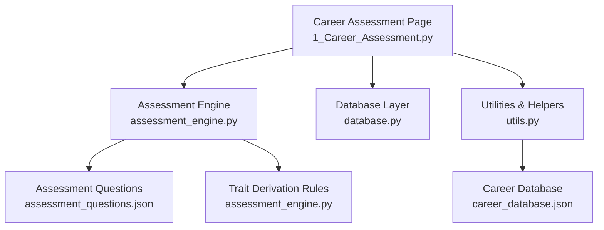
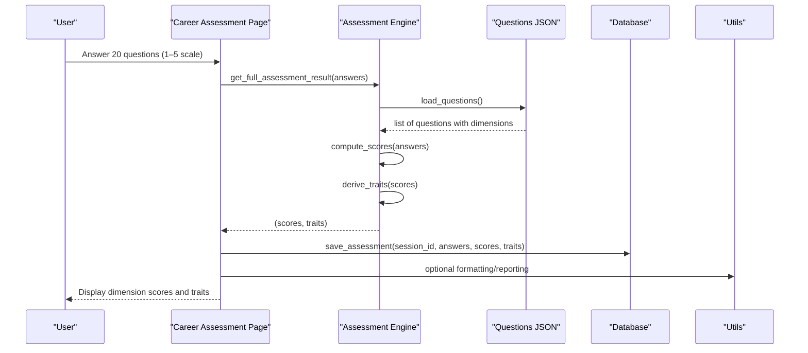
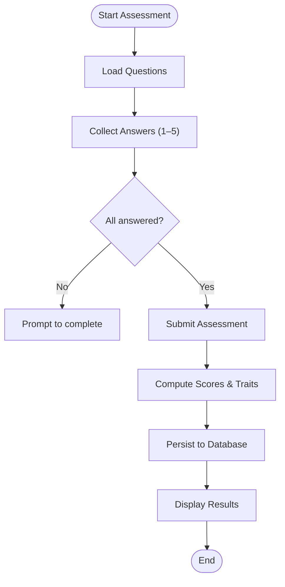
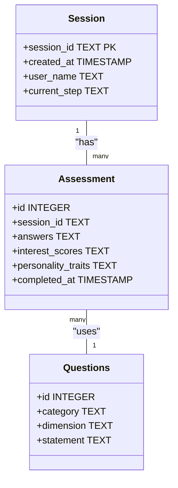
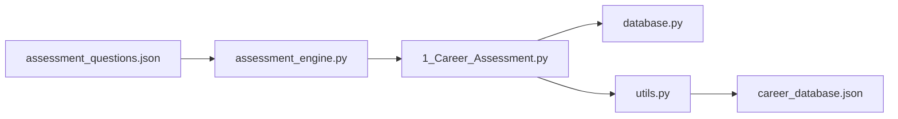

# Assessment Engine API

<cite>
**Referenced Files in This Document**
- [assessment_engine.py](file://mentorx-ai/src/assessment_engine.py)
- [assessment_questions.json](file://mentorx-ai/data/assessment_questions.json)
- [1_Career_Assessment.py](file://mentorx-ai/pages/1_Career_Assessment.py)
- [database.py](file://mentorx-ai/src/database.py)
- [utils.py](file://mentorx-ai/src/utils.py)
- [career_database.json](file://mentorx-ai/data/career_database.json)
</cite>

## Table of Contents
1. [Introduction](#introduction)
2. [Project Structure](#project-structure)
3. [Core Components](#core-components)
4. [Architecture Overview](#architecture-overview)
5. [Detailed Component Analysis](#detailed-component-analysis)
6. [Dependency Analysis](#dependency-analysis)
7. [Performance Considerations](#performance-considerations)
8. [Troubleshooting Guide](#troubleshooting-guide)
9. [Conclusion](#conclusion)
10. [Appendices](#appendices)

## Introduction
This document provides comprehensive API documentation for the Assessment Engine module that powers career assessment scoring, personality trait derivation, and result interpretation. It covers:
- Scoring calculation methods for interest dimensions (technical, creative, social, analytical, entrepreneurial)
- Work style assessment (teamwork, flexibility, communication, leadership)
- Skills evaluation (problem solving, creativity, technical skill confidence)
- Values alignment (salary, work-life balance, impact, growth, stability)
- Personality trait derivation algorithms
- Score normalization processes
- Result interpretation methods
- Method signatures, parameters, return formats, and scoring methodologies
- Examples of input data structures and expected outputs

## Project Structure
The assessment engine is implemented as a small, focused module with clear separation between:
- Data definitions (questions and categories)
- Scoring logic (dimension averaging)
- Trait derivation (threshold-based rules)
- UI integration (Streamlit page)
- Persistence (SQLite database)
- Utilities (reporting and formatting helpers)

**Diagram sources**
- [1_Career_Assessment.py:1-138](file://mentorx-ai/pages/1_Career_Assessment.py#L1-L138)
- [assessment_engine.py:1-144](file://mentorx-ai/src/assessment_engine.py#L1-L144)
- [assessment_questions.json:1-134](file://mentorx-ai/data/assessment_questions.json#L1-L134)
- [database.py:1-362](file://mentorx-ai/src/database.py#L1-L362)
- [utils.py:1-205](file://mentorx-ai/src/utils.py#L1-L205)
- [career_database.json:1-149](file://mentorx-ai/data/career_database.json#L1-L149)

**Section sources**
- [assessment_engine.py:1-144](file://mentorx-ai/src/assessment_engine.py#L1-L144)
- [1_Career_Assessment.py:1-138](file://mentorx-ai/pages/1_Career_Assessment.py#L1-L138)
- [assessment_questions.json:1-134](file://mentorx-ai/data/assessment_questions.json#L1-L134)
- [database.py:1-362](file://mentorx-ai/src/database.py#L1-L362)
- [utils.py:1-205](file://mentorx-ai/src/utils.py#L1-L205)
- [career_database.json:1-149](file://mentorx-ai/data/career_database.json#L1-L149)

## Core Components
- Dimension metadata and category mapping define how questions group into interests, work style, skills, and values.
- Question loading reads the JSON dataset to map question IDs to dimensions.
- Scoring computes average scores per dimension from user answers on a 1–5 scale.
- Trait derivation applies threshold-based rules to produce human-readable personality traits.
- A convenience wrapper returns both scores and traits together.
- The Streamlit page orchestrates user input, validation, submission, persistence, and display.
- The database layer persists assessments and related data.
- Utilities provide formatting helpers and report generation.

Key responsibilities:
- Compute dimension averages (interests, work style, skills, values)
- Derive personality traits based on thresholds
- Normalize scores to a consistent 1–5 scale via averaging
- Interpret results for downstream recommendation and reporting

**Section sources**
- [assessment_engine.py:15-41](file://mentorx-ai/src/assessment_engine.py#L15-L41)
- [assessment_engine.py:44-81](file://mentorx-ai/src/assessment_engine.py#L44-L81)
- [assessment_engine.py:84-143](file://mentorx-ai/src/assessment_engine.py#L84-L143)
- [1_Career_Assessment.py:35-113](file://mentorx-ai/pages/1_Career_Assessment.py#L35-L113)
- [database.py:152-183](file://mentorx-ai/src/database.py#L152-L183)
- [utils.py:16-43](file://mentorx-ai/src/utils.py#L16-L43)

## Architecture Overview
The assessment flow begins at the Streamlit page, which collects answers and calls the assessment engine to compute scores and derive traits. Results are persisted to SQLite and displayed to the user. Utilities assist with formatting and reporting.

**Diagram sources**
- [1_Career_Assessment.py:91-113](file://mentorx-ai/pages/1_Career_Assessment.py#L91-L113)
- [assessment_engine.py:44-81](file://mentorx-ai/src/assessment_engine.py#L44-L81)
- [assessment_engine.py:84-143](file://mentorx-ai/src/assessment_engine.py#L84-L143)
- [database.py:152-183](file://mentorx-ai/src/database.py#L152-L183)
- [utils.py:151-205](file://mentorx-ai/src/utils.py#L151-L205)

## Detailed Component Analysis

### Assessment Engine API
The core API exposes three primary functions:

- load_questions() -> list
  - Purpose: Load assessment questions from the JSON file.
  - Returns: List of question objects containing id, category, dimension, statement.
  - Notes: Used by compute_scores to map answers to dimensions.

- compute_scores(answers: dict) -> dict
  - Parameters:
    - answers: Mapping of question_id (string or integer converted to string) -> score (int 1–5).
  - Returns: Mapping of dimension -> average score (float rounded to 1 decimal). If no answers for a dimension, score defaults to 0.0.
  - Methodology:
    - Groups answers by dimension using question metadata.
    - Computes arithmetic mean per dimension.
    - Normalizes to 1–5 scale implicitly through averaging; no additional scaling applied.

- derive_traits(interest_scores: dict) -> dict
  - Parameters:
    - interest_scores: Mapping of dimension -> average score (float).
  - Returns: Mapping of trait_name -> description string.
  - Methodology:
    - Applies threshold-based rules per dimension to assign traits.
    - Interest-based traits use threshold >= 3.5.
    - Work-style traits use thresholds >= 4.0 or <= 2.0 for specific cases.
    - Skill and value traits use thresholds >= 4.0.
    - Fallback trait “Versatile” assigned if no other traits match.

- get_full_assessment_result(answers: dict) -> tuple[dict, dict]
  - Parameters: Same as compute_scores.
  - Returns: Tuple of (scores, traits). Convenience wrapper combining compute_scores and derive_traits.

Dimension coverage:
- Interests: technical, creative, social, analytical, entrepreneurial
- Work Style: teamwork, flexibility, communication, leadership
- Skills: technical_skill, problem_solving, creativity_skill (plus communication and leadership used in skills grouping)
- Values: salary, work_life, impact, growth, stability

Note on categorization:
- CATEGORY_MAP groups dimensions into higher-level categories for downstream processing (e.g., Gemini prompts), but scoring uses raw dimension keys.

Example input/output:
- Input example: {"1": 4, "2": 5, "3": 3, "4": 4, "5": 2, "6": 4, "7": 5, "8": 3, "9": 4, "10": 3, "11": 4, "12": 3, "13": 5, "14": 4, "15": 4, "16": 2, "17": 4, "18": 5, "19": 5, "20": 3}
- Output example (scores): {"technical": 4.0, "creative": 5.0, "social": 3.0, "analytical": 4.0, "entrepreneurial": 2.0, "teamwork": 4.0, "flexibility": 5.0, "communication": 4.0, "leadership": 3.0, "technical_skill": 4.0, "problem_solving": 5.0, "creativity_skill": 4.0, "salary": 2.0, "work_life": 4.0, "impact": 5.0, "growth": 5.0, "stability": 3.0}
- Output example (traits): {"Creative Thinker": "...", "Team Player": "...", "Adaptable": "...", "Strong Problem Solver": "...", "Impact-Oriented": "...", "Growth-Driven": "..."}

**Section sources**
- [assessment_engine.py:44-81](file://mentorx-ai/src/assessment_engine.py#L44-L81)
- [assessment_engine.py:84-143](file://mentorx-ai/src/assessment_engine.py#L84-L143)
- [assessment_questions.json:11-131](file://mentorx-ai/data/assessment_questions.json#L11-L131)

### Scoring Calculation Methods
- Interest dimensions:
  - technical, creative, social, analytical, entrepreneurial
  - Computed as average of answers mapped to each dimension.
  - Thresholds for trait assignment: >= 3.5.

- Work style assessment:
  - teamwork, flexibility, communication, leadership
  - Computed as average per dimension.
  - Thresholds for trait assignment: >= 4.0 (or <= 2.0 for independent worker case).

- Skills evaluation:
  - technical_skill, problem_solving, creativity_skill
  - Also includes communication and leadership in skills grouping for categorization.
  - Thresholds for trait assignment: >= 4.0.

- Values alignment:
  - salary, work_life, impact, growth, stability
  - Computed as average per dimension.
  - Thresholds for trait assignment: >= 4.0.

Normalization process:
- Scores are normalized by averaging per dimension; no explicit rescaling beyond rounding to one decimal place.
- Missing dimensions default to 0.0.

Result interpretation:
- Higher scores indicate stronger alignment with the respective dimension.
- Traits summarize key strengths and preferences derived from thresholds.

**Section sources**
- [assessment_engine.py:15-41](file://mentorx-ai/src/assessment_engine.py#L15-L41)
- [assessment_engine.py:66-81](file://mentorx-ai/src/assessment_engine.py#L66-L81)
- [assessment_engine.py:92-129](file://mentorx-ai/src/assessment_engine.py#L92-L129)

### Personality Trait Derivation Algorithms
Algorithm overview:
- Iterate over dimension scores.
- Apply threshold checks per category:
  - Interests: >= 3.5
  - Work style: >= 4.0 or <= 2.0 (for independence)
  - Skills/values: >= 4.0
- Assign descriptive trait labels and explanations.
- Fallback: “Versatile” if no traits matched.

Complexity:
- O(D) where D is number of dimensions evaluated; constant-time checks per dimension.

Edge cases:
- Empty or partial answers: missing dimensions default to 0.0, may not trigger any traits; fallback ensures at least one trait.

**Section sources**
- [assessment_engine.py:84-129](file://mentorx-ai/src/assessment_engine.py#L84-L129)

### Score Normalization Processes
- Input scale: 1–5 Likert scale per question.
- Aggregation: Arithmetic mean per dimension.
- Rounding: One decimal place.
- Defaults: 0.0 when no answers present for a dimension.

Implications:
- Consistent scale across all dimensions enables direct comparison.
- Averaging smooths out individual question variance.

**Section sources**
- [assessment_engine.py:66-81](file://mentorx-ai/src/assessment_engine.py#L66-L81)

### Result Interpretation Methods
- Dimension scores: Indicate strength of interest/work style/skill/value alignment.
- Traits: Provide concise, human-readable summaries of dominant characteristics.
- Usage: Downstream modules (recommendations, reports) can use scores and traits to tailor advice.

Interpretation guidelines:
- Scores >= 3.5 often correspond to notable interest alignment.
- Scores >= 4.0 typically indicate strong capability or preference.
- Traits help translate numeric scores into actionable insights.

**Section sources**
- [assessment_engine.py:92-129](file://mentorx-ai/src/assessment_engine.py#L92-L129)
- [1_Career_Assessment.py:119-137](file://mentorx-ai/pages/1_Career_Assessment.py#L119-L137)

### Streamlit Integration and Workflow
- Collects answers via radio buttons grouped by category.
- Validates completion before submission.
- Calls get_full_assessment_result to compute scores and traits.
- Persists results to database and updates session state.
- Displays dimension scores and personality traits.

**Diagram sources**
- [1_Career_Assessment.py:35-113](file://mentorx-ai/pages/1_Career_Assessment.py#L35-L113)
- [assessment_engine.py:44-81](file://mentorx-ai/src/assessment_engine.py#L44-L81)
- [assessment_engine.py:84-143](file://mentorx-ai/src/assessment_engine.py#L84-L143)
- [database.py:152-183](file://mentorx-ai/src/database.py#L152-L183)

**Section sources**
- [1_Career_Assessment.py:35-113](file://mentorx-ai/pages/1_Career_Assessment.py#L35-L113)

### Data Models and Relationships

**Diagram sources**
- [database.py:26-45](file://mentorx-ai/src/database.py#L26-L45)
- [assessment_questions.json:11-131](file://mentorx-ai/data/assessment_questions.json#L11-L131)

**Section sources**
- [database.py:26-45](file://mentorx-ai/src/database.py#L26-L45)
- [assessment_questions.json:11-131](file://mentorx-ai/data/assessment_questions.json#L11-L131)

## Dependency Analysis
- assessment_engine.py depends on assessment_questions.json for question metadata.
- 1_Career_Assessment.py depends on assessment_engine.py and database.py for scoring, persistence, and UI orchestration.
- utils.py provides helper functions for formatting and reporting; optionally used by UI or dashboard components.
- career_database.json supports broader career recommendations outside the assessment engine but is part of the ecosystem.

**Diagram sources**
- [assessment_engine.py:44-81](file://mentorx-ai/src/assessment_engine.py#L44-L81)
- [1_Career_Assessment.py:12-113](file://mentorx-ai/pages/1_Career_Assessment.py#L12-L113)
- [database.py:152-183](file://mentorx-ai/src/database.py#L152-L183)
- [utils.py:49-63](file://mentorx-ai/src/utils.py#L49-L63)
- [career_database.json:1-149](file://mentorx-ai/data/career_database.json#L1-L149)

**Section sources**
- [assessment_engine.py:44-81](file://mentorx-ai/src/assessment_engine.py#L44-L81)
- [1_Career_Assessment.py:12-113](file://mentorx-ai/pages/1_Career_Assessment.py#L12-L113)
- [database.py:152-183](file://mentorx-ai/src/database.py#L152-L183)
- [utils.py:49-63](file://mentorx-ai/src/utils.py#L49-L63)
- [career_database.json:1-149](file://mentorx-ai/data/career_database.json#L1-L149)

## Performance Considerations
- Scoring complexity: O(N) where N is number of questions; efficient for 20 questions.
- Trait derivation: O(D) where D is number of dimensions; negligible overhead.
- I/O: Loading JSON once per assessment; minimal cost.
- Database writes: Single insert per assessment submission; acceptable for typical usage.
- Optimization opportunities:
  - Cache loaded questions in memory if multiple assessments run within a session.
  - Precompute dimension mappings to avoid repeated lookups.

[No sources needed since this section provides general guidance]

## Troubleshooting Guide
Common issues and resolutions:
- Missing answers:
  - Symptom: Some dimensions show 0.0 scores.
  - Cause: No answers provided for those dimensions.
  - Resolution: Ensure all questions are answered before submission.

- Incorrect answer format:
  - Symptom: Errors during scoring or persistence.
  - Cause: Non-integer or out-of-range values.
  - Resolution: Validate inputs are integers between 1 and 5.

- Trait mismatch:
  - Symptom: Unexpected or empty traits.
  - Cause: Scores below thresholds or incomplete data.
  - Resolution: Review dimension scores; ensure sufficient responses to trigger traits.

- Database errors:
  - Symptom: Failure to save assessment.
  - Cause: Connection issues or schema mismatches.
  - Resolution: Verify database initialization and connection settings.

**Section sources**
- [assessment_engine.py:66-81](file://mentorx-ai/src/assessment_engine.py#L66-L81)
- [assessment_engine.py:92-129](file://mentorx-ai/src/assessment_engine.py#L92-L129)
- [database.py:152-183](file://mentorx-ai/src/database.py#L152-L183)
- [1_Career_Assessment.py:91-113](file://mentorx-ai/pages/1_Career_Assessment.py#L91-L113)

## Conclusion
The Assessment Engine provides a robust, scalable mechanism for computing dimension scores and deriving personality traits from user responses. Its design emphasizes clarity, simplicity, and extensibility, enabling meaningful career insights and personalized recommendations. The modular architecture allows easy integration with UI, persistence, and reporting components.

[No sources needed since this section summarizes without analyzing specific files]

## Appendices

### API Reference Summary
- load_questions() -> list
  - Reads assessment_questions.json and returns question list.

- compute_scores(answers: dict) -> dict
  - Computes average scores per dimension from answers.

- derive_traits(interest_scores: dict) -> dict
  - Derives personality traits based on threshold rules.

- get_full_assessment_result(answers: dict) -> tuple[dict, dict]
  - Returns both scores and traits.

### Example Input Structures
- Answers mapping:
  - Keys: question_id as string (e.g., "1", "2", ...)
  - Values: integers 1–5 representing Likert scale responses.

### Expected Output Formats
- Scores:
  - Keys: dimension names (e.g., "technical", "creative", "teamwork")
  - Values: floats rounded to one decimal place.

- Traits:
  - Keys: trait names (e.g., "Creative Thinker", "Team Player")
  - Values: descriptive strings explaining the trait.

**Section sources**
- [assessment_engine.py:44-143](file://mentorx-ai/src/assessment_engine.py#L44-L143)
- [assessment_questions.json:11-131](file://mentorx-ai/data/assessment_questions.json#L11-L131)