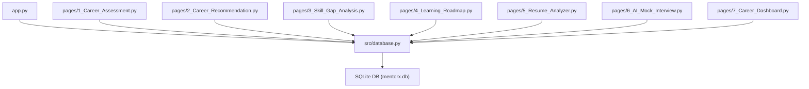
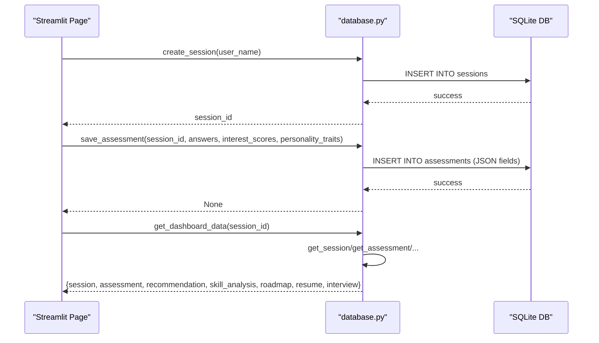
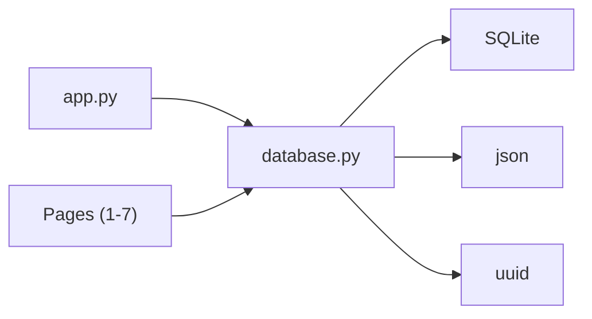
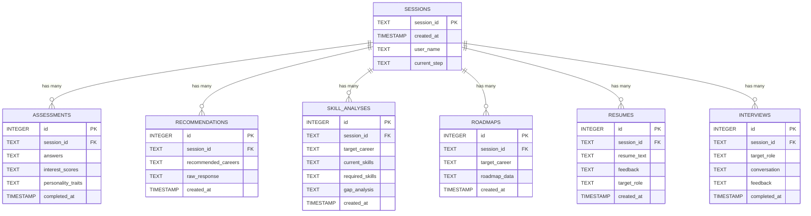
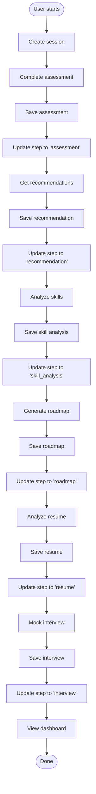

# Database API

<cite>
**Referenced Files in This Document**
- [database.py](file://mentorx-ai/src/database.py)
- [app.py](file://mentorx-ai/app.py)
- [1_Career_Assessment.py](file://mentorx-ai/pages/1_Career_Assessment.py)
- [2_Career_Recommendation.py](file://mentorx-ai/pages/2_Career_Recommendation.py)
- [3_Skill_Gap_Analysis.py](file://mentorx-ai/pages/3_Skill_Gap_Analysis.py)
- [4_Learning_Roadmap.py](file://mentorx-ai/pages/4_Learning_Roadmap.py)
- [5_Resume_Analyzer.py](file://mentorx-ai/pages/5_Resume_Analyzer.py)
- [6_AI_Mock_Interview.py](file://mentorx-ai/pages/6_AI_Mock_Interview.py)
- [7_Career_Dashboard.py](file://mentorx-ai/pages/7_Career_Dashboard.py)
</cite>

## Table of Contents
1. [Introduction](#introduction)
2. [Project Structure](#project-structure)
3. [Core Components](#core-components)
4. [Architecture Overview](#architecture-overview)
5. [Detailed Component Analysis](#detailed-component-analysis)
6. [Dependency Analysis](#dependency-analysis)
7. [Performance Considerations](#performance-considerations)
8. [Troubleshooting Guide](#troubleshooting-guide)
9. [Conclusion](#conclusion)
10. [Appendices](#appendices)

## Introduction
This document provides comprehensive API documentation for the database module that powers session management and data persistence across the application’s seven-step career coaching flow. It covers:
- Session lifecycle methods (create, read, update step)
- CRUD operations for assessments, recommendations, skill analyses, roadmaps, resumes, and interviews
- Dashboard aggregation method to retrieve a composite view of all data for a session
- Connection management patterns using SQLite with JSON serialization/deserialization
- Foreign key relationships between tables
- Error handling expectations and usage examples via page integrations

## Project Structure
The database layer is implemented in a single module that initializes schema, manages connections, and exposes functions used by Streamlit pages. The main entry point initializes the database once per app run and creates user sessions. Pages import specific functions from the database module to persist and retrieve data for each step.

**Diagram sources**
- [app.py:13-32](file://mentorx-ai/app.py#L13-L32)
- [database.py:21-107](file://mentorx-ai/src/database.py#L21-L107)

**Section sources**
- [app.py:13-32](file://mentorx-ai/app.py#L13-L32)
- [database.py:21-107](file://mentorx-ai/src/database.py#L21-L107)

## Core Components
- Connection management: get_connection returns a new SQLite connection with row factory enabled; init_db creates all tables if missing.
- Session management: create_session, get_session, update_session_step.
- Data entities with JSON fields: assessments, recommendations, skill_analyses, roadmaps, resumes, interviews. Each entity has save_* and get_* functions.
- Aggregation: get_dashboard_data returns a composite dictionary containing session plus latest records for each entity.

Key implementation references:
- Connection and schema initialization: [database.py:14-107](file://mentorx-ai/src/database.py#L14-L107)
- Session helpers: [database.py:114-145](file://mentorx-ai/src/database.py#L114-L145)
- Assessment CRUD: [database.py:152-183](file://mentorx-ai/src/database.py#L152-L183)
- Recommendation CRUD: [database.py:190-213](file://mentorx-ai/src/database.py#L190-L213)
- Skill analysis CRUD: [database.py:220-250](file://mentorx-ai/src/database.py#L220-L250)
- Roadmap CRUD: [database.py:257-279](file://mentorx-ai/src/database.py#L257-L279)
- Resume CRUD: [database.py:286-308](file://mentorx-ai/src/database.py#L286-L308)
- Interview CRUD: [database.py:315-344](file://mentorx-ai/src/database.py#L315-L344)
- Dashboard aggregation: [database.py:351-361](file://mentorx-ai/src/database.py#L351-L361)

**Section sources**
- [database.py:14-107](file://mentorx-ai/src/database.py#L14-L107)
- [database.py:114-145](file://mentorx-ai/src/database.py#L114-L145)
- [database.py:152-183](file://mentorx-ai/src/database.py#L152-L183)
- [database.py:190-213](file://mentorx-ai/src/database.py#L190-L213)
- [database.py:220-250](file://mentorx-ai/src/database.py#L220-L250)
- [database.py:257-279](file://mentorx-ai/src/database.py#L257-L279)
- [database.py:286-308](file://mentorx-ai/src/database.py#L286-L308)
- [database.py:315-344](file://mentorx-ai/src/database.py#L315-L344)
- [database.py:351-361](file://mentorx-ai/src/database.py#L351-L361)

## Architecture Overview
The database module encapsulates all persistence logic. Pages call these functions to persist user progress and results. The dashboard aggregates the latest records for a session to present a unified readiness view.

**Diagram sources**
- [database.py:114-124](file://mentorx-ai/src/database.py#L114-L124)
- [database.py:152-167](file://mentorx-ai/src/database.py#L152-L167)
- [database.py:351-361](file://mentorx-ai/src/database.py#L351-L361)

## Detailed Component Analysis

### Connection Management
- get_connection: Opens a new SQLite connection and sets row_factory to sqlite3.Row for dict-like access.
- init_db: Creates all required tables if they do not exist, including foreign keys linking child tables to sessions.

Usage example:
- Application initializes the database on first run and then creates a session when the user starts their journey.

Error handling:
- No explicit try/except blocks are used; errors will propagate as SQLite exceptions. Consumers should handle potential connection or integrity errors at higher layers.

References:
- [database.py:14-18](file://mentorx-ai/src/database.py#L14-L18)
- [database.py:21-107](file://mentorx-ai/src/database.py#L21-L107)
- [app.py:30-32](file://mentorx-ai/app.py#L30-L32)

**Section sources**
- [database.py:14-18](file://mentorx-ai/src/database.py#L14-L18)
- [database.py:21-107](file://mentorx-ai/src/database.py#L21-L107)
- [app.py:30-32](file://mentorx-ai/app.py#L30-L32)

### Session Management
Methods:
- create_session(user_name=""): Creates a new session record and returns a unique session_id string.
- get_session(session_id): Returns a dict representing the session row or None if not found.
- update_session_step(session_id, step): Updates the current_step field for a session.

Parameter types:
- user_name: str (optional, default empty)
- session_id: str (UUID string)
- step: str (e.g., "assessment", "recommendation", etc.)

Return values:
- create_session: str (session_id)
- get_session: dict or None
- update_session_step: None

Usage examples:
- App creates a session when the user clicks start and stores session_id in session state.
- Pages update the current_step after completing a stage.

References:
- [database.py:114-124](file://mentorx-ai/src/database.py#L114-L124)
- [database.py:127-134](file://mentorx-ai/src/database.py#L127-L134)
- [database.py:137-145](file://mentorx-ai/src/database.py#L137-L145)
- [app.py:74-79](file://mentorx-ai/app.py#L74-L79)
- [1_Career_Assessment.py:99-105](file://mentorx-ai/pages/1_Career_Assessment.py#L99-L105)

**Section sources**
- [database.py:114-145](file://mentorx-ai/src/database.py#L114-L145)
- [app.py:74-79](file://mentorx-ai/app.py#L74-L79)
- [1_Career_Assessment.py:99-105](file://mentorx-ai/pages/1_Career_Assessment.py#L99-L105)

### Assessments
Methods:
- save_assessment(session_id, answers, interest_scores, personality_traits)
  - Parameters:
    - session_id: str
    - answers: dict mapping question IDs to scores
    - interest_scores: dict of dimension scores
    - personality_traits: dict of trait descriptions
  - Behavior: Persists JSON-serialized answers, interest_scores, and personality_traits into assessments table.
  - Return: None
- get_assessment(session_id)
  - Parameters: session_id: str
  - Behavior: Retrieves the most recent assessment for the session and deserializes JSON fields into Python dicts.
  - Return: dict with keys including answers, interest_scores, personality_traits or None

Foreign key:
- session_id references sessions(session_id)

Usage example:
- After computing scores and traits, the page saves them and updates the session step.

References:
- [database.py:152-183](file://mentorx-ai/src/database.py#L152-L183)
- [1_Career_Assessment.py:99-105](file://mentorx-ai/pages/1_Career_Assessment.py#L99-L105)

**Section sources**
- [database.py:152-183](file://mentorx-ai/src/database.py#L152-L183)
- [1_Career_Assessment.py:99-105](file://mentorx-ai/pages/1_Career_Assessment.py#L99-L105)

### Recommendations
Methods:
- save_recommendation(session_id, recommended_careers, raw_response="")
  - Parameters:
    - session_id: str
    - recommended_careers: list or dict (will be JSON serialized)
    - raw_response: str (optional)
  - Behavior: Persists JSON-serialized recommended_careers and optional raw_response.
  - Return: None
- get_recommendation(session_id)
  - Parameters: session_id: str
  - Behavior: Retrieves the latest recommendation and deserializes recommended_careers into a Python object.
  - Return: dict with recommended_careers or None

Foreign key:
- session_id references sessions(session_id)

Usage example:
- After generating AI recommendations, the page saves them and proceeds to the next step.

References:
- [database.py:190-213](file://mentorx-ai/src/database.py#L190-L213)
- [2_Career_Recommendation.py:12](file://mentorx-ai/pages/2_Career_Recommendation.py#L12)

**Section sources**
- [database.py:190-213](file://mentorx-ai/src/database.py#L190-L213)
- [2_Career_Recommendation.py:12](file://mentorx-ai/pages/2_Career_Recommendation.py#L12)

### Skill Analyses
Methods:
- save_skill_analysis(session_id, target_career, current_skills, required_skills, gap_analysis)
  - Parameters:
    - session_id: str
    - target_career: str
    - current_skills: list or dict (JSON serialized)
    - required_skills: list or dict (JSON serialized)
    - gap_analysis: list or dict (JSON serialized)
  - Behavior: Persists JSON-serialized skills and gap analysis.
  - Return: None
- get_skill_analysis(session_id)
  - Parameters: session_id: str
  - Behavior: Retrieves latest skill analysis and deserializes JSON fields.
  - Return: dict with current_skills, required_skills, gap_analysis or None

Foreign key:
- session_id references sessions(session_id)

Usage example:
- After analyzing gaps, the page persists results and moves forward.

References:
- [database.py:220-250](file://mentorx-ai/src/database.py#L220-L250)
- [3_Skill_Gap_Analysis.py:13](file://mentorx-ai/pages/3_Skill_Gap_Analysis.py#L13)

**Section sources**
- [database.py:220-250](file://mentorx-ai/src/database.py#L220-L250)
- [3_Skill_Gap_Analysis.py:13](file://mentorx-ai/pages/3_Skill_Gap_Analysis.py#L13)

### Roadmaps
Methods:
- save_roadmap(session_id, target_career, roadmap_data)
  - Parameters:
    - session_id: str
    - target_career: str
    - roadmap_data: list or dict (JSON serialized)
  - Behavior: Persists JSON-serialized roadmap data.
  - Return: None
- get_roadmap(session_id)
  - Parameters: session_id: str
  - Behavior: Retrieves latest roadmap and deserializes roadmap_data.
  - Return: dict with roadmap_data or None

Foreign key:
- session_id references sessions(session_id)

Usage example:
- After generating a learning plan, the page saves it and advances the step.

References:
- [database.py:257-279](file://mentorx-ai/src/database.py#L257-L279)
- [4_Learning_Roadmap.py:13](file://mentorx-ai/pages/4_Learning_Roadmap.py#L13)

**Section sources**
- [database.py:257-279](file://mentorx-ai/src/database.py#L257-L279)
- [4_Learning_Roadmap.py:13](file://mentorx-ai/pages/4_Learning_Roadmap.py#L13)

### Resumes
Methods:
- save_resume(session_id, resume_text, feedback, target_role)
  - Parameters:
    - session_id: str
    - resume_text: str
    - feedback: list or dict (JSON serialized)
    - target_role: str
  - Behavior: Persists resume text and JSON-serialized feedback.
  - Return: None
- get_resume(session_id)
  - Parameters: session_id: str
  - Behavior: Retrieves latest resume entry and deserializes feedback.
  - Return: dict with feedback or None

Foreign key:
- session_id references sessions(session_id)

Usage example:
- After analyzing a resume, the page saves feedback and continues.

References:
- [database.py:286-308](file://mentorx-ai/src/database.py#L286-L308)
- [5_Resume_Analyzer.py:13](file://mentorx-ai/pages/5_Resume_Analyzer.py#L13)

**Section sources**
- [database.py:286-308](file://mentorx-ai/src/database.py#L286-L308)
- [5_Resume_Analyzer.py:13](file://mentorx-ai/pages/5_Resume_Analyzer.py#L13)

### Interviews
Methods:
- save_interview(session_id, target_role, conversation, feedback)
  - Parameters:
    - session_id: str
    - target_role: str
    - conversation: list or dict (JSON serialized)
    - feedback: list or dict (JSON serialized)
  - Behavior: Persists JSON-serialized conversation and feedback.
  - Return: None
- get_interview(session_id)
  - Parameters: session_id: str
  - Behavior: Retrieves latest interview and deserializes conversation and feedback.
  - Return: dict with conversation, feedback or None

Foreign key:
- session_id references sessions(session_id)

Usage example:
- After mock interview, the page saves results and optionally retrieves them later.

References:
- [database.py:315-344](file://mentorx-ai/src/database.py#L315-L344)
- [6_AI_Mock_Interview.py:12](file://mentorx-ai/pages/6_AI_Mock_Interview.py#L12)
- [6_AI_Mock_Interview.py:61](file://mentorx-ai/pages/6_AI_Mock_Interview.py#L61)

**Section sources**
- [database.py:315-344](file://mentorx-ai/src/database.py#L315-L344)
- [6_AI_Mock_Interview.py:12](file://mentorx-ai/pages/6_AI_Mock_Interview.py#L12)
- [6_AI_Mock_Interview.py:61](file://mentorx-ai/pages/6_AI_Mock_Interview.py#L61)

### Dashboard Aggregation
Method:
- get_dashboard_data(session_id)
  - Parameters: session_id: str
  - Behavior: Calls get_session and each get_* function to assemble a composite structure.
  - Return: dict with keys:
    - session: dict or None
    - assessment: dict or None
    - recommendation: dict or None
    - skill_analysis: dict or None
    - roadmap: dict or None
    - resume: dict or None
    - interview: dict or None

Usage example:
- Dashboard page uses this to render readiness metrics and next steps.

References:
- [database.py:351-361](file://mentorx-ai/src/database.py#L351-L361)
- [7_Career_Dashboard.py:14](file://mentorx-ai/pages/7_Career_Dashboard.py#L14)

**Section sources**
- [database.py:351-361](file://mentorx-ai/src/database.py#L351-L361)
- [7_Career_Dashboard.py:14](file://mentorx-ai/pages/7_Career_Dashboard.py#L14)

## Dependency Analysis
- Module-level dependencies:
  - sqlite3 for database connectivity
  - json for serialization/deserialization of complex fields
  - uuid for generating unique session IDs
  - datetime for timestamps
- Inter-module usage:
  - app.py imports init_db, create_session, get_session
  - Each page imports its relevant save_* and get_* functions and update_session_step
  - Dashboard page imports get_dashboard_data and update_session_step

**Diagram sources**
- [app.py:13-32](file://mentorx-ai/app.py#L13-L32)
- [database.py:6-9](file://mentorx-ai/src/database.py#L6-L9)
- [1_Career_Assessment.py:12](file://mentorx-ai/pages/1_Career_Assessment.py#L12)
- [2_Career_Recommendation.py:12](file://mentorx-ai/pages/2_Career_Recommendation.py#L12)
- [3_Skill_Gap_Analysis.py:13](file://mentorx-ai/pages/3_Skill_Gap_Analysis.py#L13)
- [4_Learning_Roadmap.py:13](file://mentorx-ai/pages/4_Learning_Roadmap.py#L13)
- [5_Resume_Analyzer.py:13](file://mentorx-ai/pages/5_Resume_Analyzer.py#L13)
- [6_AI_Mock_Interview.py:12](file://mentorx-ai/pages/6_AI_Mock_Interview.py#L12)
- [7_Career_Dashboard.py:14](file://mentorx-ai/pages/7_Career_Dashboard.py#L14)

**Section sources**
- [database.py:6-9](file://mentorx-ai/src/database.py#L6-L9)
- [app.py:13-32](file://mentorx-ai/app.py#L13-L32)
- [1_Career_Assessment.py:12](file://mentorx-ai/pages/1_Career_Assessment.py#L12)
- [2_Career_Recommendation.py:12](file://mentorx-ai/pages/2_Career_Recommendation.py#L12)
- [3_Skill_Gap_Analysis.py:13](file://mentorx-ai/pages/3_Skill_Gap_Analysis.py#L13)
- [4_Learning_Roadmap.py:13](file://mentorx-ai/pages/4_Learning_Roadmap.py#L13)
- [5_Resume_Analyzer.py:13](file://mentorx-ai/pages/5_Resume_Analyzer.py#L13)
- [6_AI_Mock_Interview.py:12](file://mentorx-ai/pages/6_AI_Mock_Interview.py#L12)
- [7_Career_Dashboard.py:14](file://mentorx-ai/pages/7_Career_Dashboard.py#L14)

## Performance Considerations
- Connection creation: Each function opens a new connection; consider pooling or reusing connections for high-throughput scenarios.
- JSON serialization: Complex objects are serialized to TEXT; ensure payloads remain reasonably sized to avoid large BLOBs.
- Query patterns: All reads use ORDER BY id DESC LIMIT 1 to fetch the latest record; this is efficient but relies on proper indexing if tables grow large.
- Transaction boundaries: Each function commits immediately; batching writes could reduce commit overhead.

[No sources needed since this section provides general guidance]

## Troubleshooting Guide
Common issues and patterns:
- Missing session: Pages guard against missing session_id and prompt users to start from the home page.
- Empty or None results: get_* functions return None when no record exists; consumers should handle None gracefully before accessing fields.
- JSON parsing: Read functions deserialize JSON fields; if stored data is malformed, JSON decoding errors may occur. Ensure write paths always serialize valid JSON.
- Integrity constraints: Foreign keys enforce session existence; inserting without a valid session_id will fail.

Operational checks:
- Ensure init_db is called before any writes to guarantee tables exist.
- Verify session_id validity when reading or updating session-related data.

References:
- [1_Career_Assessment.py:21-23](file://mentorx-ai/pages/1_Career_Assessment.py#L21-L23)
- [database.py:170-183](file://mentorx-ai/src/database.py#L170-L183)
- [database.py:202-213](file://mentorx-ai/src/database.py#L202-L213)
- [database.py:238-250](file://mentorx-ai/src/database.py#L238-L250)
- [database.py:268-279](file://mentorx-ai/src/database.py#L268-L279)
- [database.py:297-308](file://mentorx-ai/src/database.py#L297-L308)
- [database.py:332-344](file://mentorx-ai/src/database.py#L332-L344)

**Section sources**
- [1_Career_Assessment.py:21-23](file://mentorx-ai/pages/1_Career_Assessment.py#L21-L23)
- [database.py:170-183](file://mentorx-ai/src/database.py#L170-L183)
- [database.py:202-213](file://mentorx-ai/src/database.py#L202-L213)
- [database.py:238-250](file://mentorx-ai/src/database.py#L238-L250)
- [database.py:268-279](file://mentorx-ai/src/database.py#L268-L279)
- [database.py:297-308](file://mentorx-ai/src/database.py#L297-L308)
- [database.py:332-344](file://mentorx-ai/src/database.py#L332-L344)

## Conclusion
The database module provides a clean, session-centric API for persisting and retrieving user progress across the seven-step career coaching workflow. It standardizes JSON serialization for complex fields, enforces referential integrity through foreign keys, and offers a convenient dashboard aggregation endpoint. Proper error handling at the caller level ensures robustness, while performance can be further optimized by connection reuse and query indexing as data grows.

[No sources needed since this section summarizes without analyzing specific files]

## Appendices

### Data Model and Relationships

**Diagram sources**
- [database.py:26-104](file://mentorx-ai/src/database.py#L26-L104)

### Typical Usage Flow

[No sources needed since this diagram shows conceptual workflow, not actual code structure]