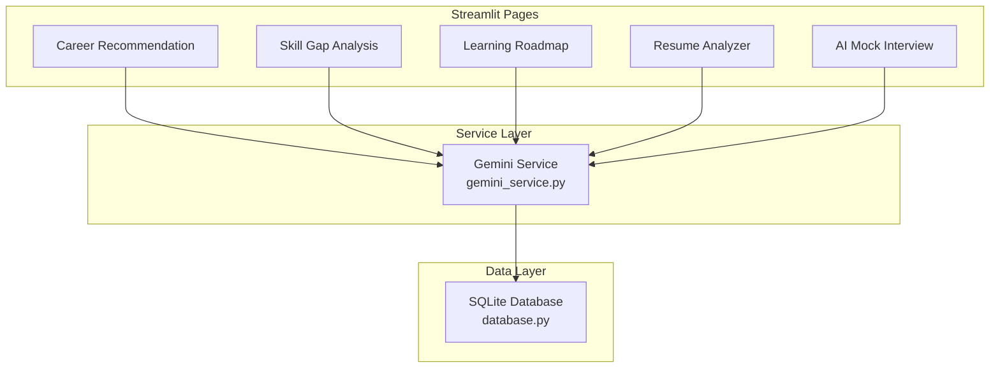
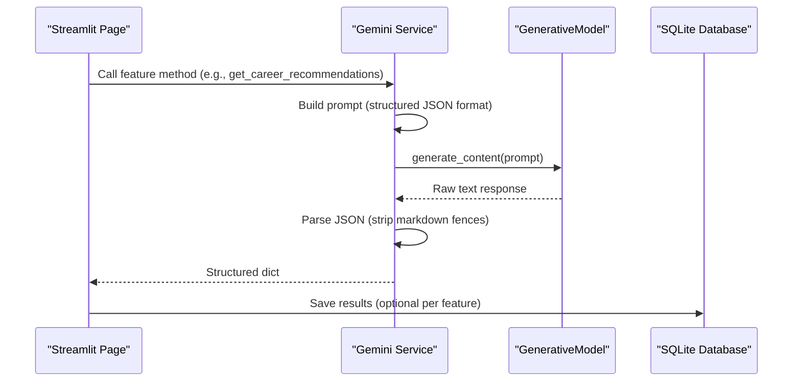
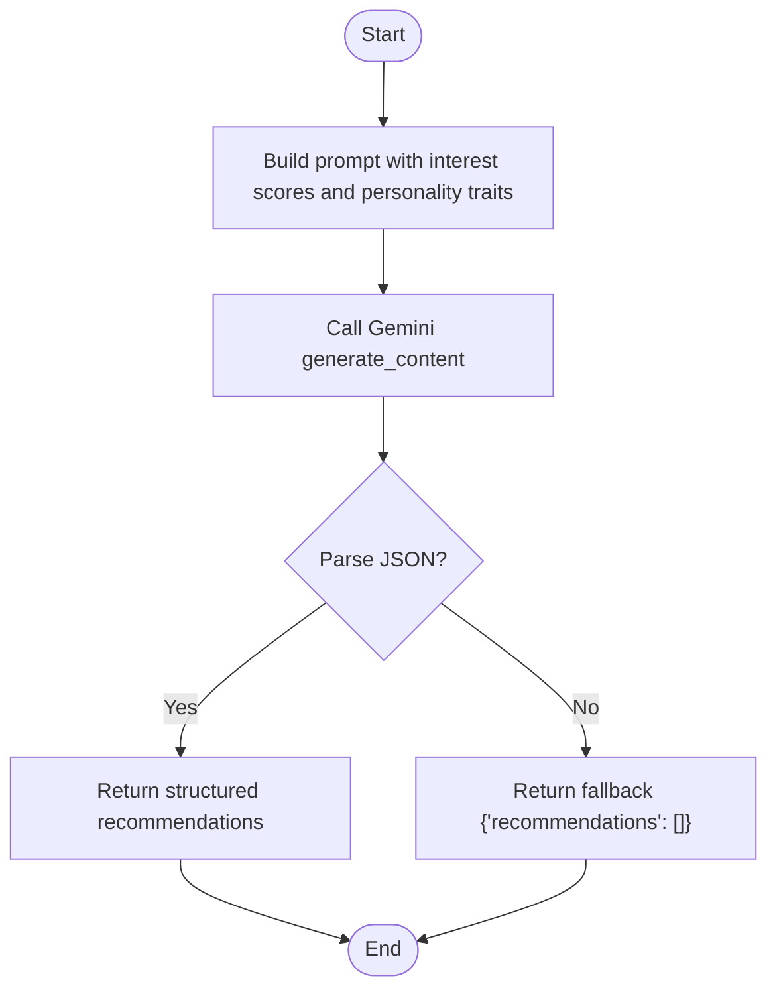
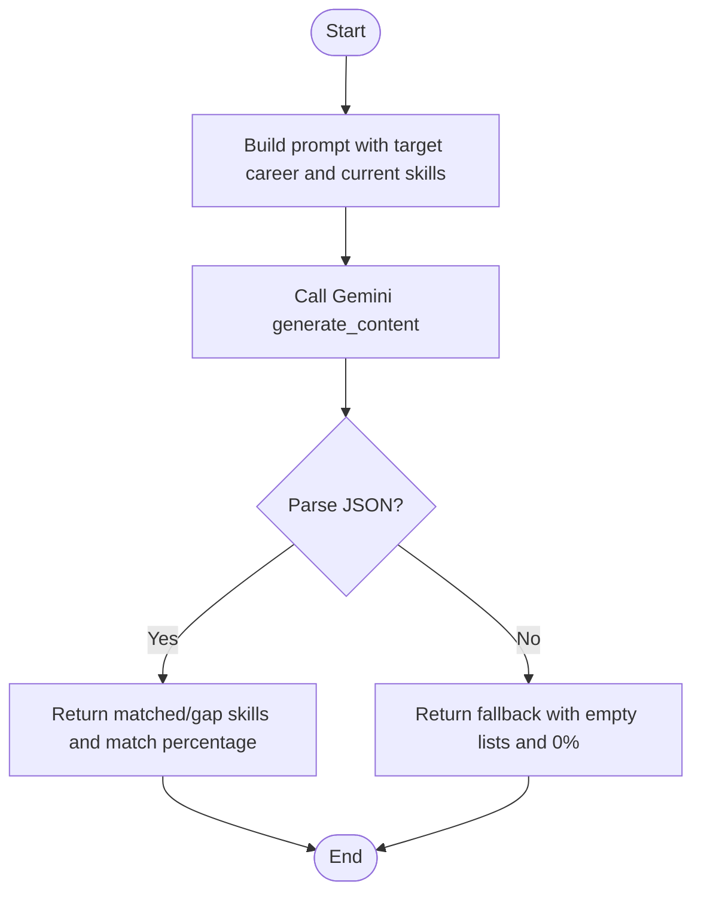
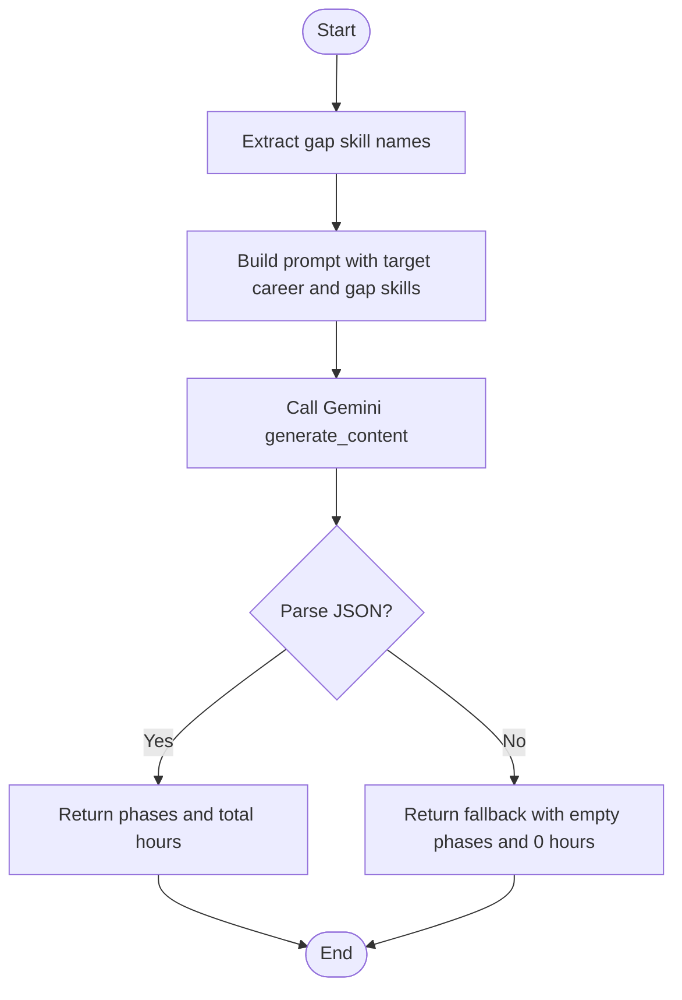
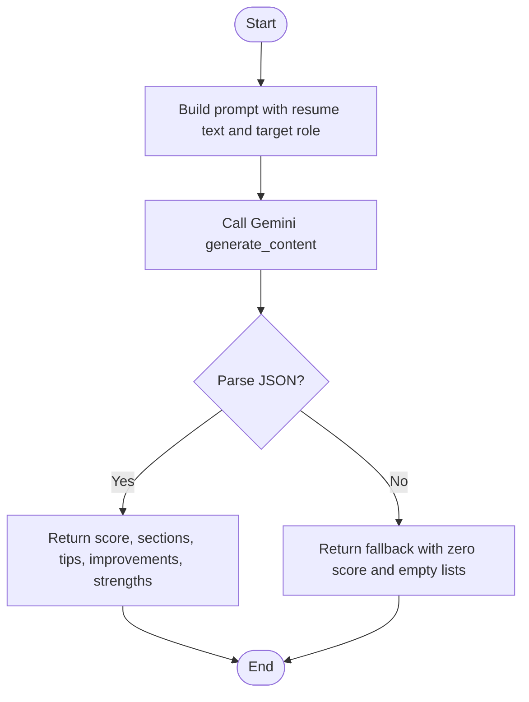
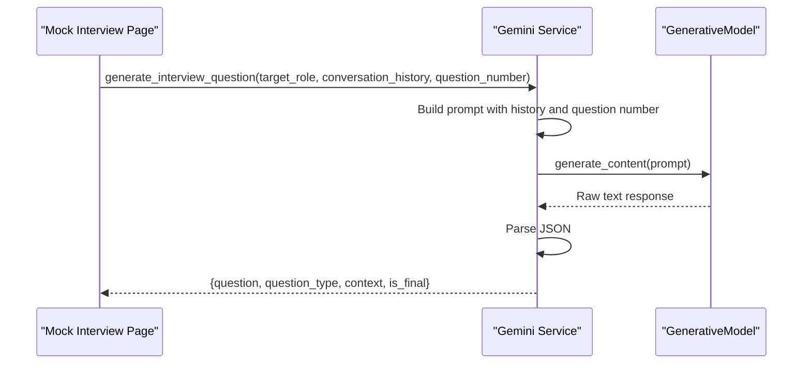
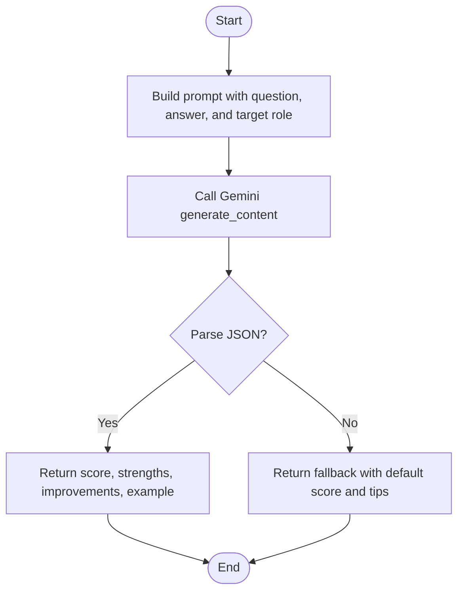
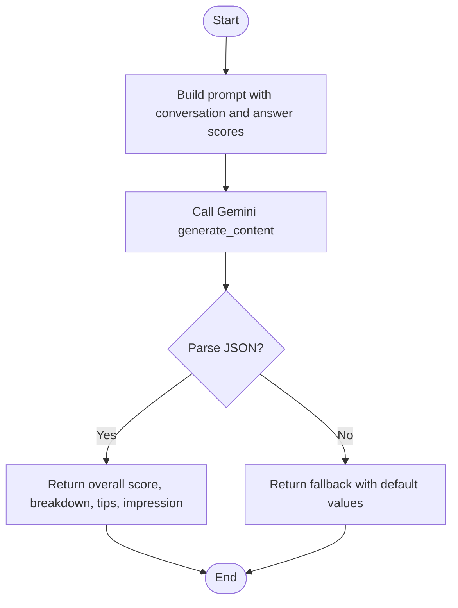
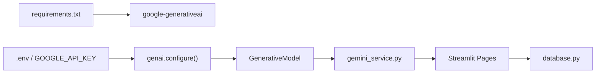

# Gemini Service API

<cite>
**Referenced Files in This Document**
- [gemini_service.py](file://mentorx-ai/src/gemini_service.py)
- [2_Career_Recommendation.py](file://mentorx-ai/pages/2_Career_Recommendation.py)
- [3_Skill_Gap_Analysis.py](file://mentorx-ai/pages/3_Skill_Gap_Analysis.py)
- [4_Learning_Roadmap.py](file://mentorx-ai/pages/4_Learning_Roadmap.py)
- [5_Resume_Analyzer.py](file://mentorx-ai/pages/5_Resume_Analyzer.py)
- [6_AI_Mock_Interview.py](file://mentorx-ai/pages/6_AI_Mock_Interview.py)
- [database.py](file://mentorx-ai/src/database.py)
- [requirements.txt](file://mentorx-ai/requirements.txt)
- [config.toml](file://mentorx-ai/.streamlit/config.toml)
</cite>

## Table of Contents
1. [Introduction](#introduction)
2. [Project Structure](#project-structure)
3. [Core Components](#core-components)
4. [Architecture Overview](#architecture-overview)
5. [Detailed Component Analysis](#detailed-component-analysis)
6. [Dependency Analysis](#dependency-analysis)
7. [Performance Considerations](#performance-considerations)
8. [Troubleshooting Guide](#troubleshooting-guide)
9. [Conclusion](#conclusion)
10. [Appendices](#appendices)

## Introduction
This document provides detailed API documentation for the Gemini service integration module that powers AI-driven career coaching features in MentorX AI. It covers all AI interaction methods including career recommendation generation, skill gap analysis prompts, learning roadmap creation, resume analysis, and mock interview question generation and evaluation. It explains prompt formatting strategies, response parsing mechanisms, error handling approaches, method signatures, input parameters, output data structures, example usage patterns, configuration options, rate limiting considerations, and fallback mechanisms. The service abstracts Google’s Generative AI API calls and returns structured JSON responses tailored to each feature.

## Project Structure
The Gemini service is implemented as a single module that centralizes all LLM interactions with structured JSON prompts. Pages in the Streamlit application call these functions to provide user-facing features. Data generated by the AI is persisted in a local SQLite database for session continuity and dashboard aggregation.

**Diagram sources**
- [gemini_service.py:1-422](file://mentorx-ai/src/gemini_service.py#L1-L422)
- [2_Career_Recommendation.py:1-140](file://mentorx-ai/pages/2_Career_Recommendation.py#L1-L140)
- [3_Skill_Gap_Analysis.py:1-230](file://mentorx-ai/pages/3_Skill_Gap_Analysis.py#L1-L230)
- [4_Learning_Roadmap.py:1-198](file://mentorx-ai/pages/4_Learning_Roadmap.py#L1-L198)
- [5_Resume_Analyzer.py:1-191](file://mentorx-ai/pages/5_Resume_Analyzer.py#L1-L191)
- [6_AI_Mock_Interview.py:1-283](file://mentorx-ai/pages/6_AI_Mock_Interview.py#L1-L283)
- [database.py:1-362](file://mentorx-ai/src/database.py#L1-L362)

**Section sources**
- [gemini_service.py:1-422](file://mentorx-ai/src/gemini_service.py#L1-L422)
- [database.py:1-362](file://mentorx-ai/src/database.py#L1-L362)

## Core Components
The Gemini service exposes seven public methods that encapsulate prompt construction, API invocation, JSON parsing, and fallback behavior. Each method targets a specific career coaching feature and returns a well-defined dictionary structure.

- get_career_recommendations(interest_scores: dict, personality_traits: dict) -> dict
- analyze_skill_gap(target_career: str, current_skills: list) -> dict
- generate_roadmap(target_career: str, gap_skills: list) -> dict
- review_resume(resume_text: str, target_role: str) -> dict
- generate_interview_question(target_role: str, conversation_history: list, question_number: int) -> dict
- evaluate_interview_answer(question: str, answer: str, target_role: str) -> dict
- generate_interview_summary(target_role: str, conversation: list, answer_scores: list) -> dict

Each method constructs a prompt tailored to its feature, sends it to the Gemini model, parses the returned text into JSON, and returns a consistent dictionary. If parsing or API calls fail, a safe fallback is returned to keep the UI functional.

**Section sources**
- [gemini_service.py:66-103](file://mentorx-ai/src/gemini_service.py#L66-L103)
- [gemini_service.py:110-147](file://mentorx-ai/src/gemini_service.py#L110-L147)
- [gemini_service.py:154-201](file://mentorx-ai/src/gemini_service.py#L154-L201)
- [gemini_service.py:208-285](file://mentorx-ai/src/gemini_service.py#L208-L285)
- [gemini_service.py:292-335](file://mentorx-ai/src/gemini_service.py#L292-L335)
- [gemini_service.py:342-371](file://mentorx-ai/src/gemini_service.py#L342-L371)
- [gemini_service.py:378-421](file://mentorx-ai/src/gemini_service.py#L378-L421)

## Architecture Overview
The service abstracts Google’s Generative AI API behind a simple interface. It configures the model once at import time using an environment variable, then routes all requests through a centralized helper that handles errors and JSON extraction.

**Diagram sources**
- [gemini_service.py:32-59](file://mentorx-ai/src/gemini_service.py#L32-L59)
- [2_Career_Recommendation.py:57-68](file://mentorx-ai/pages/2_Career_Recommendation.py#L57-L68)
- [3_Skill_Gap_Analysis.py:90-113](file://mentorx-ai/pages/3_Skill_Gap_Analysis.py#L90-L113)
- [4_Learning_Roadmap.py:60-75](file://mentorx-ai/pages/4_Learning_Roadmap.py#L60-L75)
- [5_Resume_Analyzer.py:84-102](file://mentorx-ai/pages/5_Resume_Analyzer.py#L84-L102)
- [6_AI_Mock_Interview.py:91-104](file://mentorx-ai/pages/6_AI_Mock_Interview.py#L91-L104)

## Detailed Component Analysis

### Career Recommendations
- Purpose: Generate top career matches based on assessment scores and personality traits.
- Method signature: get_career_recommendations(interest_scores: dict, personality_traits: dict) -> dict
- Input parameters:
  - interest_scores: Mapping of interests to numeric scores (1–5 scale).
  - personality_traits: Mapping of trait names to values.
- Output structure:
  - recommendations: List of objects with fields title, match_score (0–100), reasoning, salary_range (PKR), growth_outlook, key_skills (list).
- Prompt strategy: Instructs the model to return only valid JSON in a strict schema focused on Pakistan’s job market context.
- Parsing mechanism: Extracts JSON from potential markdown fences; returns empty recommendations list on failure.
- Fallback: Returns {"recommendations": []} if any error occurs.
- Usage pattern: Called from the Career Recommendation page after assessment completion; results are saved to the database and displayed with match score visualization.

**Diagram sources**
- [gemini_service.py:66-103](file://mentorx-ai/src/gemini_service.py#L66-L103)
- [gemini_service.py:32-59](file://mentorx-ai/src/gemini_service.py#L32-L59)

**Section sources**
- [gemini_service.py:66-103](file://mentorx-ai/src/gemini_service.py#L66-L103)
- [2_Career_Recommendation.py:27-68](file://mentorx-ai/pages/2_Career_Recommendation.py#L27-L68)

### Skill Gap Analysis
- Purpose: Compare user’s current skills against requirements for a target career.
- Method signature: analyze_skill_gap(target_career: str, current_skills: list) -> dict
- Input parameters:
  - target_career: String describing the desired role.
  - current_skills: List of skills the user possesses.
- Output structure:
  - matched_skills: List of {skill, proficiency_note}.
  - gap_skills: List of {skill, priority ("Critical"|"Important"|"Nice-to-have"), description}.
  - overall_match_percentage: Integer percentage.
- Prompt strategy: Requests a precise JSON schema emphasizing realistic skill gaps for the Pakistani market.
- Parsing mechanism: Strips markdown fences and parses JSON; returns default empty lists and zero percentage on error.
- Fallback: {"matched_skills": [], "gap_skills": [], "overall_match_percentage": 0}.
- Usage pattern: Invoked from the Skill Gap Analysis page; results are visualized with charts and stored in the database.

**Diagram sources**
- [gemini_service.py:110-147](file://mentorx-ai/src/gemini_service.py#L110-L147)
- [gemini_service.py:32-59](file://mentorx-ai/src/gemini_service.py#L32-L59)

**Section sources**
- [gemini_service.py:110-147](file://mentorx-ai/src/gemini_service.py#L110-L147)
- [3_Skill_Gap_Analysis.py:90-113](file://mentorx-ai/pages/3_Skill_Gap_Analysis.py#L90-L113)

### Learning Roadmap
- Purpose: Create a phased learning plan to close identified skill gaps.
- Method signature: generate_roadmap(target_career: str, gap_skills: list) -> dict
- Input parameters:
  - target_career: Desired role string.
  - gap_skills: List of skills to learn (strings or dicts with skill field).
- Output structure:
  - phases: List of {name, duration, description, milestones: [{title, resource, resource_type, estimated_hours, is_free}]}.
  - total_estimated_hours: Integer sum of milestone hours.
- Prompt strategy: Requests three phases with real resources accessible from Pakistan, mixing free and paid options.
- Parsing mechanism: Parses JSON; returns empty phases and zero hours on error.
- Fallback: {"phases": [], "total_estimated_hours": 0}.
- Usage pattern: Called from the Learning Roadmap page after skill gap analysis; results are rendered as timeline charts and milestone checklists.

**Diagram sources**
- [gemini_service.py:154-201](file://mentorx-ai/src/gemini_service.py#L154-L201)
- [gemini_service.py:32-59](file://mentorx-ai/src/gemini_service.py#L32-L59)

**Section sources**
- [gemini_service.py:154-201](file://mentorx-ai/src/gemini_service.py#L154-L201)
- [4_Learning_Roadmap.py:60-75](file://mentorx-ai/pages/4_Learning_Roadmap.py#L60-L75)

### Resume Analysis
- Purpose: Evaluate a resume against a target role and provide actionable feedback.
- Method signature: review_resume(resume_text: str, target_role: str) -> dict
- Input parameters:
  - resume_text: Full resume content pasted by the user.
  - target_role: Role the resume is being evaluated for.
- Output structure:
  - overall_score: Integer 0–100.
  - section_feedback: List of {section, score, comments, suggestions}.
  - ats_tips: List of strings.
  - top_improvements: List of strings.
  - strengths: List of strings.
- Prompt strategy: Instructs the model to return only valid JSON with constructive, honest scoring and ATS tips.
- Parsing mechanism: Parses JSON; returns default zero score and empty lists on error.
- Fallback: {"overall_score": 0, "section_feedback": [], "ats_tips": [], "top_improvements": [], "strengths": []}.
- Usage pattern: Triggered from the Resume Analyzer page; results include gauge visualization and section-by-section feedback.

**Diagram sources**
- [gemini_service.py:208-285](file://mentorx-ai/src/gemini_service.py#L208-L285)
- [gemini_service.py:32-59](file://mentorx-ai/src/gemini_service.py#L32-L59)

**Section sources**
- [gemini_service.py:208-285](file://mentorx-ai/src/gemini_service.py#L208-L285)
- [5_Resume_Analyzer.py:84-102](file://mentorx-ai/pages/5_Resume_Analyzer.py#L84-L102)

### Mock Interview – Question Generation
- Purpose: Generate the next interview question based on conversation history and question number.
- Method signature: generate_interview_question(target_role: str, conversation_history: list, question_number: int) -> dict
- Input parameters:
  - target_role: Role for which the interview is conducted.
  - conversation_history: List of prior messages with role and message fields.
  - question_number: Current question index (used to determine final question).
- Output structure:
  - question: String.
  - question_type: Enum-like string ("behavioral" | "technical" | "situational").
  - context: Explanation of why this question is asked.
  - is_final: Boolean indicating whether this is the last question (True when question_number >= 6).
- Prompt strategy: Builds context from conversation history and instructs the model to mix question types and mark final questions appropriately.
- Parsing mechanism: Parses JSON; returns a default opening question and type on error.
- Fallback: {"question": "What interests you most about the target role?", "question_type": "behavioral", "context": "Opening question", "is_final": boolean based on question_number}.
- Usage pattern: Called iteratively during the mock interview flow; results are displayed with metadata and used to drive conversation state.

**Diagram sources**
- [gemini_service.py:292-335](file://mentorx-ai/src/gemini_service.py#L292-L335)
- [6_AI_Mock_Interview.py:91-104](file://mentorx-ai/pages/6_AI_Mock_Interview.py#L91-L104)

**Section sources**
- [gemini_service.py:292-335](file://mentorx-ai/src/gemini_service.py#L292-L335)
- [6_AI_Mock_Interview.py:91-104](file://mentorx-ai/pages/6_AI_Mock_Interview.py#L91-L104)

### Mock Interview – Answer Evaluation
- Purpose: Evaluate a candidate’s answer to a specific question.
- Method signature: evaluate_interview_answer(question: str, answer: str, target_role: str) -> dict
- Input parameters:
  - question: The question asked.
  - answer: Candidate’s response.
  - target_role: Role context for evaluation.
- Output structure:
  - score: Integer 0–100.
  - strengths: List of positive aspects.
  - improvements: List of areas to improve.
  - better_example: A stronger version of the answer.
- Prompt strategy: Requests concise JSON with constructive feedback and a concrete improved example.
- Parsing mechanism: Parses JSON; returns default score and lists on error.
- Fallback: {"score": 50, "strengths": [], "improvements": ["Practice more"], "better_example": ""}.
- Usage pattern: Called immediately after each candidate answer; feedback is shown inline and aggregated for the final summary.

**Diagram sources**
- [gemini_service.py:342-371](file://mentorx-ai/src/gemini_service.py#L342-L371)
- [gemini_service.py:32-59](file://mentorx-ai/src/gemini_service.py#L32-L59)

**Section sources**
- [gemini_service.py:342-371](file://mentorx-ai/src/gemini_service.py#L342-L371)
- [6_AI_Mock_Interview.py:141-178](file://mentorx-ai/pages/6_AI_Mock_Interview.py#L141-L178)

### Mock Interview – Final Summary
- Purpose: Generate a comprehensive performance summary after completing the interview.
- Method signature: generate_interview_summary(target_role: str, conversation: list, answer_scores: list) -> dict
- Input parameters:
  - target_role: Role context.
  - conversation: List of interviewer/candidate messages.
  - answer_scores: List of per-question evaluations with scores and feedback.
- Output structure:
  - overall_score: Integer 0–100.
  - question_breakdown: List of {question, score, feedback}.
  - top_tips: List of improvement tips.
  - overall_impression: Narrative summary.
- Prompt strategy: Assembles full conversation and scores into a prompt requesting a structured JSON summary.
- Parsing mechanism: Parses JSON; returns default score and tips on error.
- Fallback: {"overall_score": 50, "question_breakdown": [], "top_tips": ["Practice with a friend", "Record yourself answering"], "overall_impression": "Keep practicing!"}.
- Usage pattern: Called after the final question; results are saved to the database and displayed as a performance report.

**Diagram sources**
- [gemini_service.py:378-421](file://mentorx-ai/src/gemini_service.py#L378-L421)
- [gemini_service.py:32-59](file://mentorx-ai/src/gemini_service.py#L32-L59)

**Section sources**
- [gemini_service.py:378-421](file://mentorx-ai/src/gemini_service.py#L378-L421)
- [6_AI_Mock_Interview.py:184-211](file://mentorx-ai/pages/6_AI_Mock_Interview.py#L184-L211)

## Dependency Analysis
The Gemini service depends on Google’s Generative AI SDK and environment configuration. Pages depend on the service for AI functionality and on the database layer for persistence.

**Diagram sources**
- [requirements.txt:1-6](file://mentorx-ai/requirements.txt#L1-L6)
- [gemini_service.py:19-25](file://mentorx-ai/src/gemini_service.py#L19-L25)
- [2_Career_Recommendation.py:12-13](file://mentorx-ai/pages/2_Career_Recommendation.py#L12-L13)
- [database.py:1-18](file://mentorx-ai/src/database.py#L1-L18)

**Section sources**
- [requirements.txt:1-6](file://mentorx-ai/requirements.txt#L1-L6)
- [gemini_service.py:19-25](file://mentorx-ai/src/gemini_service.py#L19-L25)
- [database.py:1-18](file://mentorx-ai/src/database.py#L1-L18)

## Performance Considerations
- Rate limiting: The service does not implement explicit rate limiting or retry logic. Calls are direct to the Generative AI API. To mitigate rate limits:
  - Add exponential backoff retries around _call_gemini.
  - Implement request queuing or throttling at the page level.
  - Cache frequent prompts/results where appropriate.
- Prompt size: Large resumes or long conversation histories increase token usage and latency. Consider truncating or summarizing inputs before prompting.
- JSON parsing overhead: The parser strips markdown fences and parses JSON. Ensure prompts consistently return valid JSON to avoid extra processing.
- Database writes: Persisting large payloads can slow down UI updates. Batch writes or defer saving until necessary.

[No sources needed since this section provides general guidance]

## Troubleshooting Guide
Common issues and resolutions:

- Missing API key:
  - Symptom: RuntimeError indicating API key not configured.
  - Resolution: Set GOOGLE_API_KEY in your .env file so genai.configure() can initialize the model.
- Invalid JSON response:
  - Symptom: Empty or partial results due to parse failures.
  - Resolution: Adjust prompt instructions to enforce strict JSON output; add validation and retries in _safe_call.
- No recommendations or analyses:
  - Symptom: Fallback responses returned.
  - Resolution: Check network connectivity, API quotas, and ensure inputs are non-empty and correctly formatted.
- Interview flow stalls:
  - Symptom: Questions not generated or feedback missing.
  - Resolution: Verify conversation_history format and question_number progression; ensure is_final logic triggers summary generation.

**Section sources**
- [gemini_service.py:32-59](file://mentorx-ai/src/gemini_service.py#L32-L59)
- [2_Career_Recommendation.py:57-68](file://mentorx-ai/pages/2_Career_Recommendation.py#L57-L68)
- [3_Skill_Gap_Analysis.py:90-113](file://mentorx-ai/pages/3_Skill_Gap_Analysis.py#L90-L113)
- [4_Learning_Roadmap.py:60-75](file://mentorx-ai/pages/4_Learning_Roadmap.py#L60-L75)
- [5_Resume_Analyzer.py:84-102](file://mentorx-ai/pages/5_Resume_Analyzer.py#L84-L102)
- [6_AI_Mock_Interview.py:91-104](file://mentorx-ai/pages/6_AI_Mock_Interview.py#L91-L104)

## Conclusion
The Gemini service module provides a clean abstraction over Google’s Generative AI API, delivering structured JSON responses for each career coaching feature. It centralizes prompt engineering, response parsing, and error handling, enabling consistent behavior across pages. By persisting results in a local database and presenting them via Streamlit, the system offers a cohesive user experience. Future enhancements should include robust rate limiting, retry logic, and input validation to improve reliability under load.

[No sources needed since this section summarizes without analyzing specific files]

## Appendices

### Configuration Options
- Model name: gemini-2.0-flash
- API key: GOOGLE_API_KEY (loaded from .env)
- Streamlit theme and server settings defined in config.toml

**Section sources**
- [gemini_service.py:19-25](file://mentorx-ai/src/gemini_service.py#L19-L25)
- [config.toml:1-13](file://mentorx-ai/.streamlit/config.toml#L1-L13)

### Example Usage Patterns
- Career Recommendation:
  - Collect interest_scores and personality_traits from assessment.
  - Call get_career_recommendations and display recommendations with match scores.
  - Save results to database for later retrieval.
- Skill Gap Analysis:
  - Gather selected_skills from checkboxes and custom input.
  - Call analyze_skill_gap and visualize matched vs. gap skills.
  - Store analysis for roadmap generation.
- Learning Roadmap:
  - Use gap_skills from previous step.
  - Call generate_roadmap and render phases with milestones.
  - Track milestone completion in session state.
- Resume Analyzer:
  - Accept resume_text and target_role.
  - Call review_resume and show score gauge and section feedback.
  - Persist feedback for dashboard aggregation.
- Mock Interview:
  - Initialize conversation state and iterate through MAX_QUESTIONS.
  - For each answer, call evaluate_interview_answer and display feedback.
  - After final question, call generate_interview_summary and save results.

**Section sources**
- [2_Career_Recommendation.py:27-68](file://mentorx-ai/pages/2_Career_Recommendation.py#L27-L68)
- [3_Skill_Gap_Analysis.py:55-113](file://mentorx-ai/pages/3_Skill_Gap_Analysis.py#L55-L113)
- [4_Learning_Roadmap.py:50-75](file://mentorx-ai/pages/4_Learning_Roadmap.py#L50-L75)
- [5_Resume_Analyzer.py:84-102](file://mentorx-ai/pages/5_Resume_Analyzer.py#L84-L102)
- [6_AI_Mock_Interview.py:91-104](file://mentorx-ai/pages/6_AI_Mock_Interview.py#L91-L104)