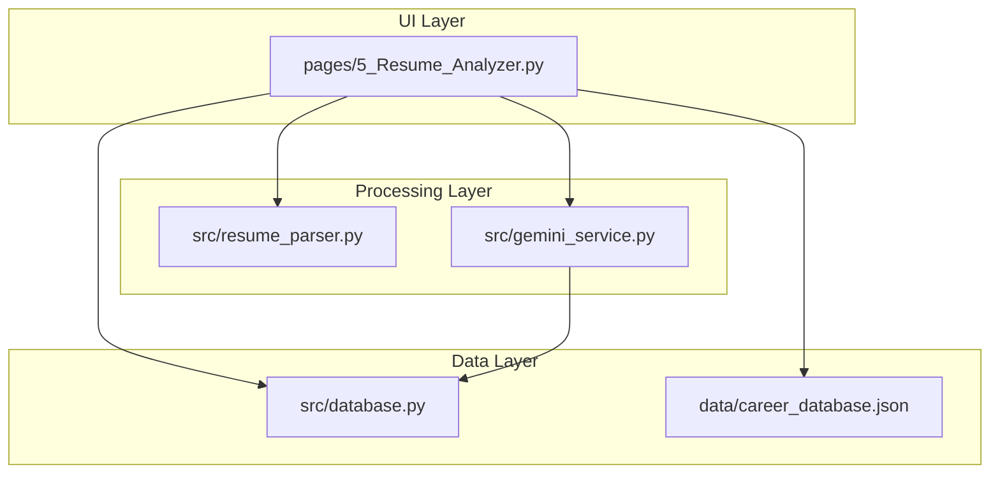
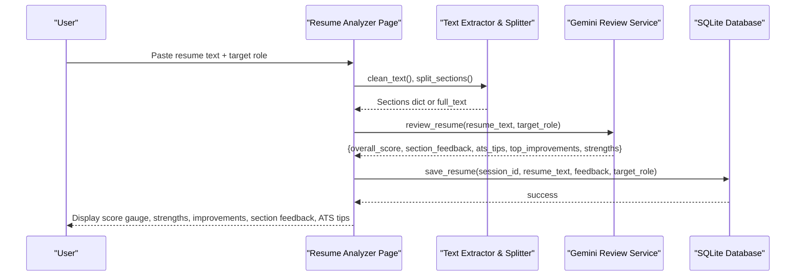
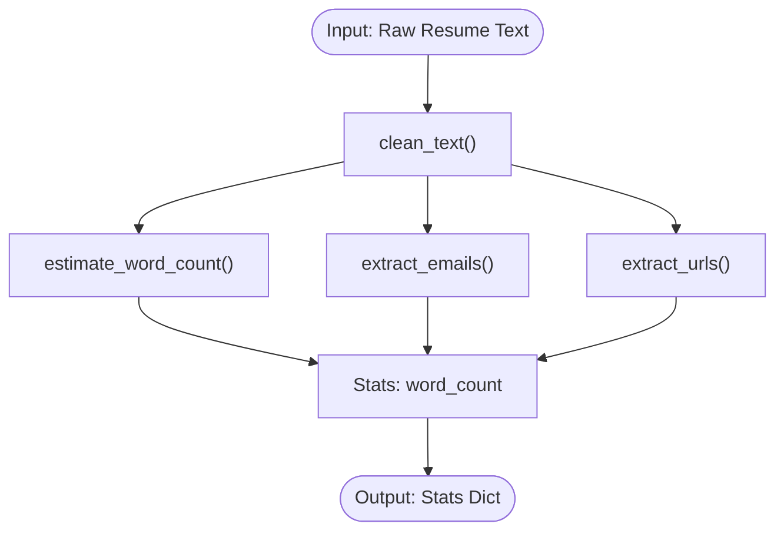
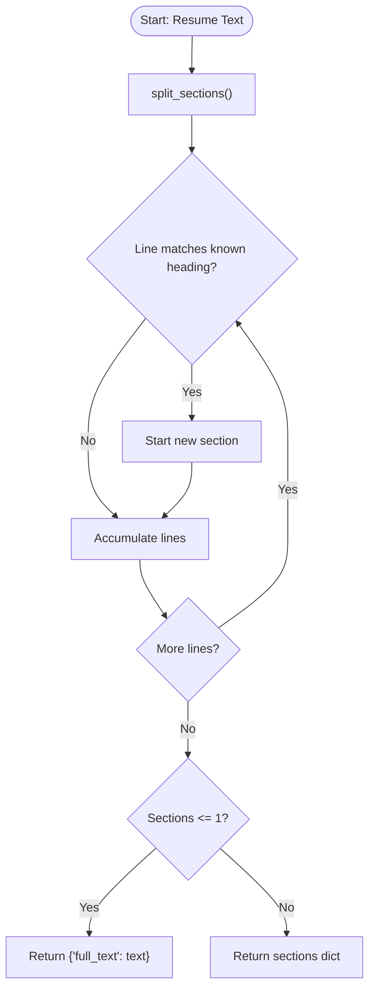
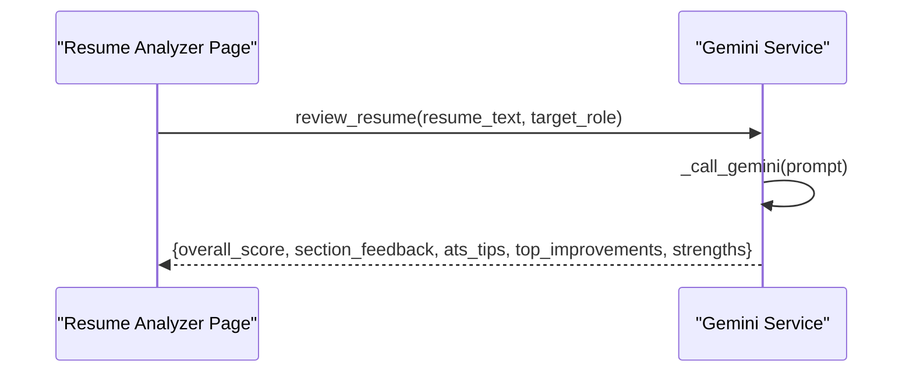
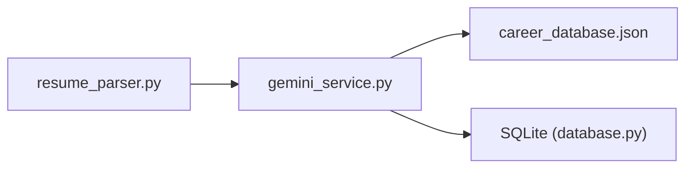
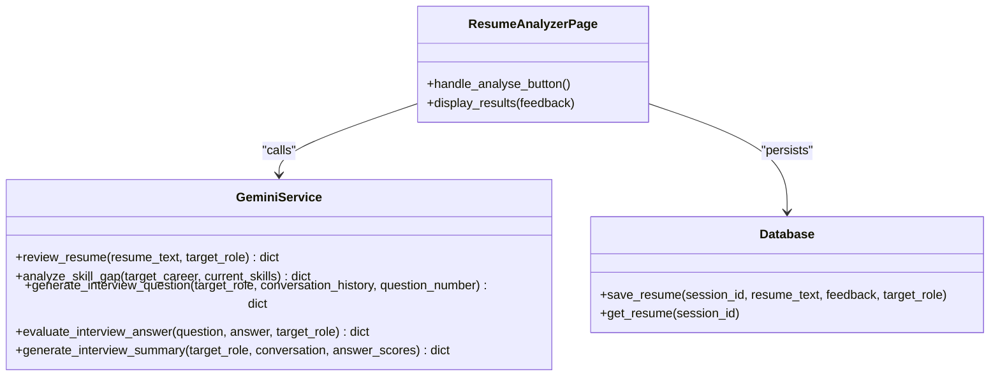
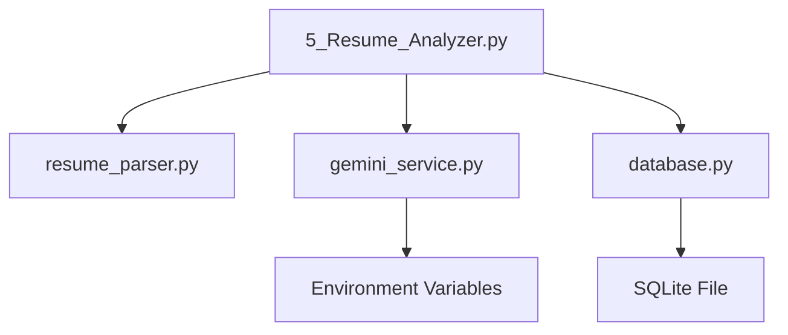

# Resume Parser API

<cite>
**Referenced Files in This Document**
- [resume_parser.py](file://mentorx-ai/src/resume_parser.py)
- [5_Resume_Analyzer.py](file://mentorx-ai/pages/5_Resume_Analyzer.py)
- [gemini_service.py](file://mentorx-ai/src/gemini_service.py)
- [database.py](file://mentorx-ai/src/database.py)
- [utils.py](file://mentorx-ai/src/utils.py)
- [career_database.json](file://mentorx-ai/data/career_database.json)
</cite>

## Table of Contents
1. [Introduction](#introduction)
2. [Project Structure](#project-structure)
3. [Core Components](#core-components)
4. [Architecture Overview](#architecture-overview)
5. [Detailed Component Analysis](#detailed-component-analysis)
6. [Dependency Analysis](#dependency-analysis)
7. [Performance Considerations](#performance-considerations)
8. [Troubleshooting Guide](#troubleshooting-guide)
9. [Conclusion](#conclusion)
10. [Appendices](#appendices)

## Introduction
This document provides detailed API documentation for the resume parsing and analysis module within MentorX AI. It covers text extraction, section identification, content analysis, keyword extraction, skill matching against job requirements, feedback generation, and integration with AI services to deliver ATS optimization recommendations and actionable improvement insights. The goal is to help developers integrate and extend the resume analysis capabilities while understanding data flows, input/output contracts, and error handling.

## Project Structure
The resume analysis feature spans a few key modules:
- Text preprocessing and section splitting utilities
- UI orchestration for resume input and result display
- AI-powered review service that evaluates resumes against target roles
- Database layer for persisting resume text and feedback
- Utilities for scoring and reporting

**Diagram sources**
- [5_Resume_Analyzer.py:1-191](file://mentorx-ai/pages/5_Resume_Analyzer.py#L1-L191)
- [resume_parser.py:1-102](file://mentorx-ai/src/resume_parser.py#L1-L102)
- [gemini_service.py:1-422](file://mentorx-ai/src/gemini_service.py#L1-L422)
- [database.py:1-362](file://mentorx-ai/src/database.py#L1-L362)
- [career_database.json:1-149](file://mentorx-ai/data/career_database.json#L1-L149)

**Section sources**
- [5_Resume_Analyzer.py:1-191](file://mentorx-ai/pages/5_Resume_Analyzer.py#L1-L191)
- [resume_parser.py:1-102](file://mentorx-ai/src/resume_parser.py#L1-L102)
- [gemini_service.py:1-422](file://mentorx-ai/src/gemini_service.py#L1-L422)
- [database.py:1-362](file://mentorx-ai/src/database.py#L1-L362)
- [career_database.json:1-149](file://mentorx-ai/data/career_database.json#L1-L149)

## Core Components
- Text extraction and cleaning: Normalize whitespace, strip control characters, estimate word count, extract emails and URLs.
- Section identification: Detect common headings (summary, experience, education, skills, etc.) and split resume into sections; fallback to full text if detection fails.
- AI-based resume review: Evaluate resume against a target role, produce scores, strengths, improvements, ATS tips, and section-by-section feedback.
- Persistence: Save resume text and feedback to SQLite; retrieve previous analyses per session.
- Utilities: Score formatting, progress tracking, report generation.

**Section sources**
- [resume_parser.py:23-102](file://mentorx-ai/src/resume_parser.py#L23-L102)
- [gemini_service.py:208-285](file://mentorx-ai/src/gemini_service.py#L208-L285)
- [database.py:286-308](file://mentorx-ai/src/database.py#L286-L308)
- [utils.py:16-43](file://mentorx-ai/src/utils.py#L16-L43)

## Architecture Overview
The resume analysis workflow integrates UI, processing, AI, and persistence layers:

**Diagram sources**
- [5_Resume_Analyzer.py:84-104](file://mentorx-ai/pages/5_Resume_Analyzer.py#L84-L104)
- [resume_parser.py:23-74](file://mentorx-ai/src/resume_parser.py#L23-L74)
- [gemini_service.py:208-285](file://mentorx-ai/src/gemini_service.py#L208-L285)
- [database.py:286-308](file://mentorx-ai/src/database.py#L286-L308)

## Detailed Component Analysis

### Text Extraction and Cleaning
- Purpose: Prepare raw resume text for reliable parsing and analysis.
- Key functions:
  - clean_text(text): Removes control characters and normalizes line breaks.
  - estimate_word_count(text): Counts words for length checks.
  - extract_emails(text), extract_urls(text): Regex-based extractions for contact and portfolio links.
- Input format: Plain text string (pasted from PDF/Word).
- Output: Cleaned string, integer word count, lists of emails and URLs.

**Diagram sources**
- [resume_parser.py:23-89](file://mentorx-ai/src/resume_parser.py#L23-L89)

**Section sources**
- [resume_parser.py:23-89](file://mentorx-ai/src/resume_parser.py#L23-L89)

### Section Identification Algorithm
- Purpose: Split resume into named sections for targeted feedback.
- Approach:
  - Scan lines for known section headings (summary, objective, profile, about, experience, work experience, professional experience, employment, education, academic, qualifications, skills, technical skills, core competencies, competencies, projects, portfolio, certifications, certificates, licenses, achievements, awards, honours, languages, interests, hobbies, references).
  - Also detect ALL-CAPS short lines as headings.
  - If fewer than two sections detected, return full_text fallback.
- Input format: Plain text string.
- Output: Dictionary mapping section names to their text blocks; fallback key "full_text".

**Diagram sources**
- [resume_parser.py:30-74](file://mentorx-ai/src/resume_parser.py#L30-L74)

**Section sources**
- [resume_parser.py:30-74](file://mentorx-ai/src/resume_parser.py#L30-L74)

### Content Analysis Functions
- Purpose: Compute basic statistics and metadata about the resume.
- Function: get_resume_stats(text) returns word count, number of sections detected, list of section keys, extracted emails, and URLs.
- Use cases: Length checks, completeness indicators, contact info validation.

**Section sources**
- [resume_parser.py:92-102](file://mentorx-ai/src/resume_parser.py#L92-L102)

### AI-Based Resume Review and Feedback Generation
- Purpose: Provide comprehensive evaluation of resume quality relative to a target role.
- Integration: Calls Gemini model via gemini_service.review_resume().
- Inputs:
  - resume_text: Plain text of the resume.
  - target_role: Target job title or role description.
- Outputs (structured JSON):
  - overall_score: Integer 0–100.
  - section_feedback: List of objects with section name, score, comments, suggestions.
  - ats_tips: List of strings with ATS optimization advice.
  - top_improvements: List of high-impact improvements.
  - strengths: List of positive attributes.
- Error handling: _safe_call wraps LLM calls; on failure returns default empty structures.

**Diagram sources**
- [gemini_service.py:208-285](file://mentorx-ai/src/gemini_service.py#L208-L285)
- [5_Resume_Analyzer.py:84-104](file://mentorx-ai/pages/5_Resume_Analyzer.py#L84-L104)

**Section sources**
- [gemini_service.py:208-285](file://mentorx-ai/src/gemini_service.py#L208-L285)
- [5_Resume_Analyzer.py:84-104](file://mentorx-ai/pages/5_Resume_Analyzer.py#L84-L104)

### Keyword Extraction and Skill Matching Against Job Requirements
- Keywords:
  - Emails and URLs are extracted using regex patterns.
  - Section headings are recognized to isolate skill-related content.
- Skill matching:
  - The system uses static career profiles (key_skills) from career_database.json to inform gap analysis and recommendations.
  - While resume_parser does not directly match skills, the broader flow leverages gemini_service functions like analyze_skill_gap to compare current skills vs required skills for a target career.
- Data source: career_database.json contains career titles, key skills, salary ranges, and descriptions.

**Diagram sources**
- [resume_parser.py:82-89](file://mentorx-ai/src/resume_parser.py#L82-L89)
- [gemini_service.py:110-147](file://mentorx-ai/src/gemini_service.py#L110-L147)
- [career_database.json:1-149](file://mentorx-ai/data/career_database.json#L1-L149)
- [database.py:286-308](file://mentorx-ai/src/database.py#L286-L308)

**Section sources**
- [resume_parser.py:82-89](file://mentorx-ai/src/resume_parser.py#L82-L89)
- [gemini_service.py:110-147](file://mentorx-ai/src/gemini_service.py#L110-L147)
- [career_database.json:1-149](file://mentorx-ai/data/career_database.json#L1-L149)

### Parsing Capabilities for Different Resume Formats
- Supported input: Plain text pasted from PDFs, Word documents, or other formats.
- Preprocessing: Normalization and control character removal improve robustness across varied formats.
- Limitations: No direct file parsing; relies on user-provided text. Complex layouts may require manual cleanup before pasting.

**Section sources**
- [resume_parser.py:23-27](file://mentorx-ai/src/resume_parser.py#L23-L27)
- [5_Resume_Analyzer.py:44-64](file://mentorx-ai/pages/5_Resume_Analyzer.py#L44-L64)

### Method Signatures, Inputs, and Outputs
- Text extraction and stats:
  - clean_text(text: str) -> str
  - estimate_word_count(text: str) -> int
  - extract_emails(text: str) -> list[str]
  - extract_urls(text: str) -> list[str]
  - get_resume_stats(text: str) -> dict
- Section splitting:
  - split_sections(text: str) -> dict[str, str]
- AI review:
  - review_resume(resume_text: str, target_role: str) -> dict
- Persistence:
  - save_resume(session_id: str, resume_text: str, feedback: dict, target_role: str) -> None
  - get_resume(session_id: str) -> dict | None

**Section sources**
- [resume_parser.py:23-102](file://mentorx-ai/src/resume_parser.py#L23-L102)
- [gemini_service.py:208-285](file://mentorx-ai/src/gemini_service.py#L208-L285)
- [database.py:286-308](file://mentorx-ai/src/database.py#L286-L308)

### Parsed Data Structures
- Section split output:
  - Keys: section names (e.g., "Summary", "Experience", "Education", "Skills") or "full_text" when detection fails.
  - Values: concatenated text blocks for each section.
- Resume stats output:
  - word_count: int
  - section_count: int
  - sections_detected: list[str]
  - emails: list[str]
  - urls: list[str]
- AI review output:
  - overall_score: int (0–100)
  - section_feedback: list[{section: str, score: int, comments: str, suggestions: str}]
  - ats_tips: list[str]
  - top_improvements: list[str]
  - strengths: list[str]

**Section sources**
- [resume_parser.py:30-102](file://mentorx-ai/src/resume_parser.py#L30-L102)
- [gemini_service.py:208-285](file://mentorx-ai/src/gemini_service.py#L208-L285)

### Feedback Generation Methods
- Section-by-section feedback:
  - Generated by AI based on target role context.
  - Includes comments and suggestions per section.
- Top improvements and strengths:
  - High-level guidance and positive highlights.
- ATS tips:
  - Actionable recommendations to optimize for Applicant Tracking Systems.

**Section sources**
- [gemini_service.py:208-285](file://mentorx-ai/src/gemini_service.py#L208-L285)
- [5_Resume_Analyzer.py:110-191](file://mentorx-ai/pages/5_Resume_Analyzer.py#L110-L191)

### Integration with AI Services for Enhanced Analysis and ATS Optimization
- Configuration:
  - Model: gemini-2.0-flash
  - API key: GOOGLE_API_KEY environment variable
- Flow:
  - UI triggers review_resume with resume text and target role.
  - Gemini generates structured JSON feedback including ATS tips.
  - Results are saved to database and displayed in UI.

**Diagram sources**
- [gemini_service.py:1-422](file://mentorx-ai/src/gemini_service.py#L1-L422)
- [5_Resume_Analyzer.py:1-191](file://mentorx-ai/pages/5_Resume_Analyzer.py#L1-L191)
- [database.py:1-362](file://mentorx-ai/src/database.py#L1-L362)

**Section sources**
- [gemini_service.py:1-422](file://mentorx-ai/src/gemini_service.py#L1-L422)
- [5_Resume_Analyzer.py:1-191](file://mentorx-ai/pages/5_Resume_Analyzer.py#L1-L191)
- [database.py:1-362](file://mentorx-ai/src/database.py#L1-L362)

## Dependency Analysis
- Coupling:
  - UI depends on parser and AI service for analysis and on database for persistence.
  - AI service depends on environment configuration and returns structured JSON.
  - Database abstracts storage and retrieval for all features.
- External dependencies:
  - Google Generative AI SDK for LLM calls.
  - SQLite for local persistence.
  - Streamlit for UI.
- Potential circular dependencies: None observed between modules.

**Diagram sources**
- [5_Resume_Analyzer.py:1-191](file://mentorx-ai/pages/5_Resume_Analyzer.py#L1-L191)
- [resume_parser.py:1-102](file://mentorx-ai/src/resume_parser.py#L1-L102)
- [gemini_service.py:1-422](file://mentorx-ai/src/gemini_service.py#L1-L422)
- [database.py:1-362](file://mentorx-ai/src/database.py#L1-L362)

**Section sources**
- [5_Resume_Analyzer.py:1-191](file://mentorx-ai/pages/5_Resume_Analyzer.py#L1-L191)
- [resume_parser.py:1-102](file://mentorx-ai/src/resume_parser.py#L1-L102)
- [gemini_service.py:1-422](file://mentorx-ai/src/gemini_service.py#L1-L422)
- [database.py:1-362](file://mentorx-ai/src/database.py#L1-L362)

## Performance Considerations
- Text preprocessing is lightweight and suitable for typical resume lengths.
- Section splitting uses simple regex and line scanning; performance scales linearly with text size.
- AI calls introduce latency; consider caching results per session and limiting re-analyses.
- Database operations are minimal and use SQLite; ensure single-writer concurrency if multiple sessions run concurrently.

[No sources needed since this section provides general guidance]

## Troubleshooting Guide
- Missing API key:
  - Symptom: RuntimeError indicating missing GOOGLE_API_KEY.
  - Resolution: Set GOOGLE_API_KEY in .env file and restart the application.
- Empty or invalid resume text:
  - Symptom: Validation errors prompting user to paste resume and specify target role.
  - Resolution: Ensure non-empty resume text and valid target role.
- AI response parsing failures:
  - Symptom: Errors during JSON parsing; fallback defaults returned.
  - Resolution: Retry analysis; check network connectivity and API availability.
- Database issues:
  - Symptom: Unable to save or retrieve resume feedback.
  - Resolution: Verify SQLite file permissions and database initialization.

**Section sources**
- [gemini_service.py:32-59](file://mentorx-ai/src/gemini_service.py#L32-L59)
- [5_Resume_Analyzer.py:84-104](file://mentorx-ai/pages/5_Resume_Analyzer.py#L84-L104)
- [database.py:286-308](file://mentorx-ai/src/database.py#L286-L308)

## Conclusion
The resume parsing and analysis module combines robust text preprocessing, heuristic section detection, and AI-driven evaluation to provide actionable insights and ATS optimization recommendations. By integrating with a structured database and clear UI workflows, it enables users to iteratively improve their resumes against target roles. Developers can extend functionality by adding more sophisticated parsing techniques, richer skill matching logic, and additional AI-powered features.

[No sources needed since this section summarizes without analyzing specific files]

## Appendices

### Appendix A: Example Input Formats
- Resume text: Plain text copied from PDF/Word, containing headings like SUMMARY, EXPERIENCE, EDUCATION, SKILLS.
- Target role: Role title such as "Software Engineer" or "Data Scientist".

**Section sources**
- [5_Resume_Analyzer.py:44-64](file://mentorx-ai/pages/5_Resume_Analyzer.py#L44-L64)

### Appendix B: Career Profiles Reference
- Static career database includes key skills, salary ranges, and outlook for various roles used in skill gap analysis and recommendations.

**Section sources**
- [career_database.json:1-149](file://mentorx-ai/data/career_database.json#L1-L149)