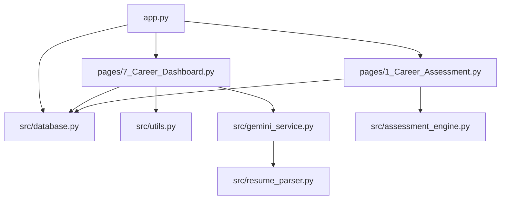
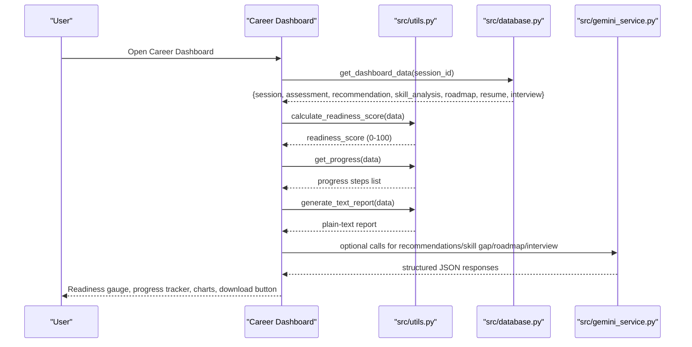
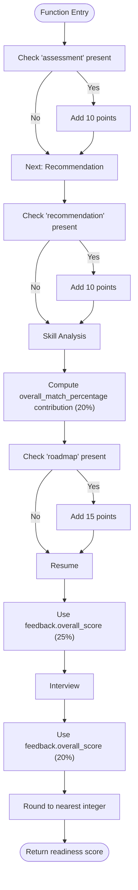
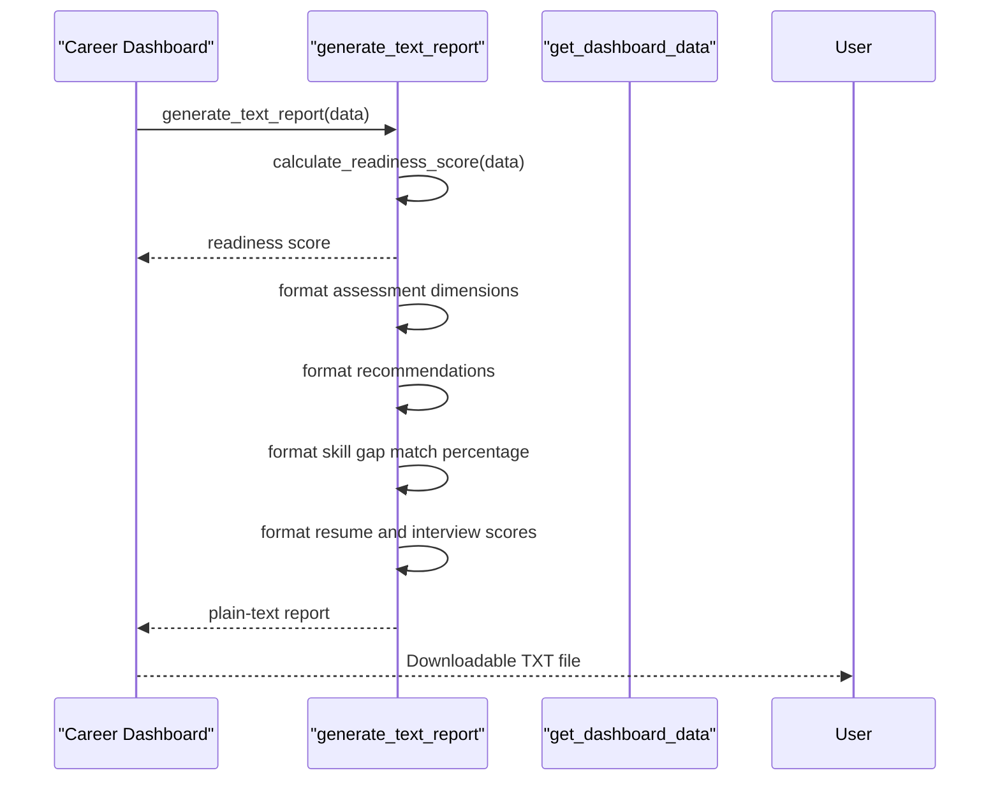
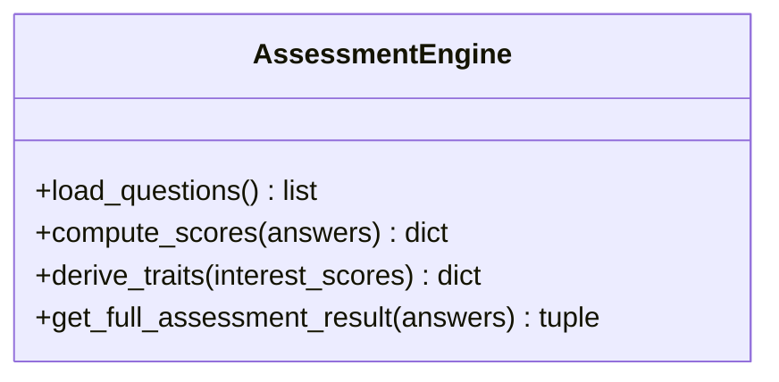
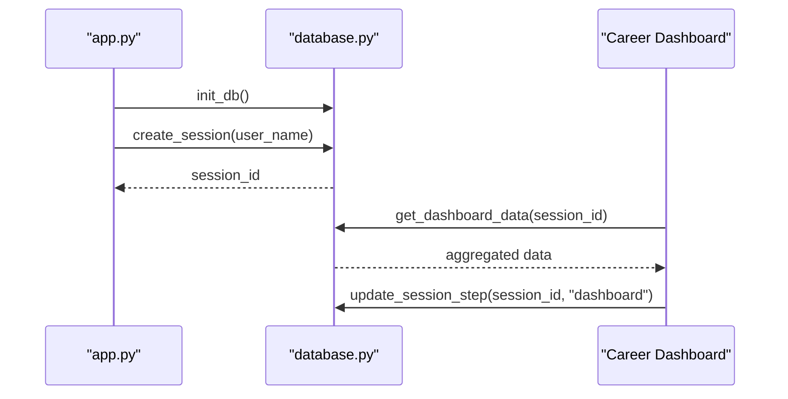
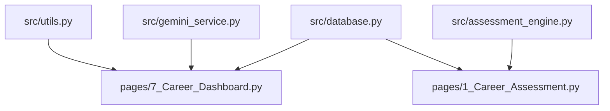

# Utility Functions API

<cite>
**Referenced Files in This Document**
- [utils.py](file://mentorx-ai/src/utils.py)
- [assessment_engine.py](file://mentorx-ai/src/assessment_engine.py)
- [database.py](file://mentorx-ai/src/database.py)
- [gemini_service.py](file://mentorx-ai/src/gemini_service.py)
- [resume_parser.py](file://mentorx-ai/src/resume_parser.py)
- [app.py](file://mentorx-ai/app.py)
- [7_Career_Dashboard.py](file://mentorx-ai/pages/7_Career_Dashboard.py)
- [1_Career_Assessment.py](file://mentorx-ai/pages/1_Career_Assessment.py)
</cite>

## Table of Contents
1. Introduction
2. Project Structure
3. Core Components
4. Architecture Overview
5. Detailed Component Analysis
6. Dependency Analysis
7. Performance Considerations
8. Troubleshooting Guide
9. Conclusion

## Introduction
This document provides comprehensive API documentation for the utility functions used across the Mentor X-AI application. It focuses on progress tracking, report generation, common data processing helpers, and UI formatting utilities. It also documents readiness score calculation, text report generation, data formatting for display, and user state management helpers that support the main application features. Each function includes signatures, parameter descriptions, return value formats, and usage examples with references to where they are used in the app.

## Project Structure
The application is a Streamlit-based career coaching tool with modular components:
- Entry point and session setup: app.py
- Shared utilities for scoring, reporting, and progress: src/utils.py
- Assessment logic and trait derivation: src/assessment_engine.py
- Data persistence and dashboard aggregation: src/database.py
- AI-powered services (recommendations, skill gap, roadmap, resume review, interview): src/gemini_service.py
- Resume parsing helpers: src/resume_parser.py
- Feature pages that consume utilities: pages/7_Career_Dashboard.py, pages/1_Career_Assessment.py

**Diagram sources**
- [app.py:10-14](file://mentorx-ai/app.py#L10-L14)
- [7_Career_Dashboard.py:14-22](file://mentorx-ai/pages/7_Career_Dashboard.py#L14-L22)
- [1_Career_Assessment.py:12-13](file://mentorx-ai/pages/1_Career_Assessment.py#L12-L13)

**Section sources**
- [app.py:1-166](file://mentorx-ai/app.py#L1-L166)
- [7_Career_Dashboard.py:1-272](file://mentorx-ai/pages/7_Career_Dashboard.py#L1-L272)
- [1_Career_Assessment.py:1-138](file://mentorx-ai/pages/1_Career_Assessment.py#L1-L138)

## Core Components
This section summarizes the key utility modules and their responsibilities:
- Progress tracking and readiness scoring: src/utils.py
- Assessment scoring and trait derivation: src/assessment_engine.py
- Session and feature data persistence: src/database.py
- AI service integrations: src/gemini_service.py
- Resume preprocessing: src/resume_parser.py

**Section sources**
- [utils.py:1-205](file://mentorx-ai/src/utils.py#L1-L205)
- [assessment_engine.py:1-144](file://mentorx-ai/src/assessment_engine.py#L1-L144)
- [database.py:1-362](file://mentorx-ai/src/database.py#L1-L362)
- [gemini_service.py:1-422](file://mentorx-ai/src/gemini_service.py#L1-L422)
- [resume_parser.py:1-102](file://mentorx-ai/src/resume_parser.py#L1-L102)

## Architecture Overview
The dashboard page orchestrates utility functions to compute readiness scores, build progress indicators, and generate downloadable reports. The assessment page computes dimension scores and personality traits, which feed into downstream recommendations and analysis via the Gemini service. Database utilities persist and aggregate results for each session.

**Diagram sources**
- [7_Career_Dashboard.py:43-47](file://mentorx-ai/pages/7_Career_Dashboard.py#L43-L47)
- [7_Career_Dashboard.py:249-256](file://mentorx-ai/pages/7_Career_Dashboard.py#L249-L256)
- [utils.py:70-117](file://mentorx-ai/src/utils.py#L70-L117)
- [utils.py:134-144](file://mentorx-ai/src/utils.py#L134-L144)
- [utils.py:151-204](file://mentorx-ai/src/utils.py#L151-L204)
- [database.py:351-361](file://mentorx-ai/src/database.py#L351-L361)
- [gemini_service.py:66-103](file://mentorx-ai/src/gemini_service.py#L66-L103)

## Detailed Component Analysis

### Progress Tracking Utilities (src/utils.py)
These functions provide step status computation and visual helpers for UI components.

- Function: get_progress(dashboard_data: dict) -> list[dict]
  - Purpose: Build a list of step statuses for the progress tracker based on completed sections in dashboard data.
  - Parameters:
    - dashboard_data: Aggregated session data containing keys like assessment, recommendation, skill_analysis, roadmap, resume, interview.
  - Returns: List of dicts with fields:
    - step: Human-readable label
    - completed: Boolean indicating completion
    - icon: Emoji indicator ("✅" or "⬜")
  - Usage example: Called by the dashboard to render step statuses and next recommended action.

- Function: score_color(score: int | float) -> str
  - Purpose: Return a hex color string based on thresholds for UI styling.
  - Parameters:
    - score: Numeric score (0-100).
  - Returns: Hex color string (green/orange/red ranges).
  - Usage example: Applied to readiness gauge bar color.

- Function: score_emoji(score: int | float) -> str
  - Purpose: Return an emoji indicator for a score.
  - Parameters:
    - score: Numeric score (0-100).
  - Returns: Emoji string ("🟢", "🟡", "🔴").
  - Usage example: Used alongside quick stats for skill match, resume score, interview score.

- Function: score_label(score: int | float) -> str
  - Purpose: Return a human-readable label for a score.
  - Parameters:
    - score: Numeric score (0-100).
  - Returns: Label string ("Excellent", "Good", "Fair", "Needs Improvement").
  - Usage example: Can be used for textual summaries or tooltips.

**Diagram sources**
- [utils.py:70-117](file://mentorx-ai/src/utils.py#L70-L117)

**Section sources**
- [utils.py:16-42](file://mentorx-ai/src/utils.py#L16-L42)
- [utils.py:124-144](file://mentorx-ai/src/utils.py#L124-L144)
- [7_Career_Dashboard.py:59-116](file://mentorx-ai/pages/7_Career_Dashboard.py#L59-L116)

### Report Generation Utilities (src/utils.py)
- Function: generate_text_report(dashboard_data: dict) -> str
  - Purpose: Generate a plain-text summary of the user's career coaching journey including session info, readiness score, assessment dimensions, recommendations, skill gap, resume score, and interview score.
  - Parameters:
    - dashboard_data: Aggregated session data.
  - Returns: Multi-line string suitable for download as a .txt file.
  - Usage example: Downloaded from the dashboard via a Streamlit download button.

**Diagram sources**
- [utils.py:151-204](file://mentorx-ai/src/utils.py#L151-L204)
- [7_Career_Dashboard.py:249-256](file://mentorx-ai/pages/7_Career_Dashboard.py#L249-L256)

**Section sources**
- [utils.py:151-204](file://mentorx-ai/src/utils.py#L151-L204)
- [7_Career_Dashboard.py:249-256](file://mentorx-ai/pages/7_Career_Dashboard.py#L249-L256)

### Readiness Score Calculation (src/utils.py)
- Function: calculate_readiness_score(dashboard_data: dict) -> int
  - Purpose: Compute an overall career readiness score (0-100) from dashboard data using weighted contributions:
    - Assessment completed: 10%
    - Recommendation done: 10%
    - Skill analysis: up to 20% based on overall_match_percentage
    - Roadmap generated: 15%
    - Resume score: up to 25% based on feedback.overall_score
    - Interview score: up to 20% based on feedback.overall_score
  - Parameters:
    - dashboard_data: Aggregated session data.
  - Returns: Integer readiness score (0-100).
  - Usage example: Displayed in the readiness gauge and used to determine UI colors and labels.

**Section sources**
- [utils.py:70-117](file://mentorx-ai/src/utils.py#L70-L117)
- [7_Career_Dashboard.py:46-82](file://mentorx-ai/pages/7_Career_Dashboard.py#L46-L82)

### Assessment Engine Utilities (src/assessment_engine.py)
- Function: load_questions() -> list
  - Purpose: Load assessment questions from the JSON data file.
  - Returns: List of question objects.
  - Usage example: Used by the assessment page to render quiz items.

- Function: compute_scores(answers: dict) -> dict
  - Purpose: Compute average score per dimension from raw answers.
  - Parameters:
    - answers: Mapping of question_id (str) to score (int 1-5).
  - Returns: Mapping of dimension to average score (float rounded to 1 decimal).
  - Usage example: Feeds into trait derivation and recommendation generation.

- Function: derive_traits(interest_scores: dict) -> dict
  - Purpose: Derive human-readable personality/career traits from dimension scores.
  - Parameters:
    - interest_scores: Dimension scores from compute_scores.
  - Returns: Mapping of trait_name to description string.
  - Usage example: Stored with assessment results and displayed to users.

- Function: get_full_assessment_result(answers: dict) -> tuple[dict, dict]
  - Purpose: Convenience wrapper to compute scores and derive traits in one call.
  - Parameters:
    - answers: Raw answers mapping.
  - Returns: Tuple of (interest_scores dict, personality_traits dict).
  - Usage example: Called when submitting the assessment.

**Diagram sources**
- [assessment_engine.py:44-81](file://mentorx-ai/src/assessment_engine.py#L44-L81)
- [assessment_engine.py:84-130](file://mentorx-ai/src/assessment_engine.py#L84-L130)
- [assessment_engine.py:133-144](file://mentorx-ai/src/assessment_engine.py#L133-L144)

**Section sources**
- [assessment_engine.py:44-144](file://mentorx-ai/src/assessment_engine.py#L44-L144)
- [1_Career_Assessment.py:91-113](file://mentorx-ai/pages/1_Career_Assessment.py#L91-L113)

### Database and Session Management (src/database.py)
- Function: init_db()
  - Purpose: Create all tables if they do not exist.
  - Usage example: Called once at app startup to ensure schema availability.

- Function: create_session(user_name="") -> str
  - Purpose: Create a new user session and return the session_id.
  - Parameters:
    - user_name: Optional name for the user.
  - Returns: Unique session_id string.
  - Usage example: Used when starting the career journey from the landing page.

- Function: get_session(session_id) -> dict | None
  - Purpose: Fetch a session row by ID.
  - Parameters:
    - session_id: Unique session identifier.
  - Returns: Session dict or None.
  - Usage example: Displayed in sidebar to show current step.

- Function: update_session_step(session_id, step)
  - Purpose: Update the current_step tracker for a session.
  - Parameters:
    - session_id: Unique session identifier.
    - step: Step label (e.g., "assessment", "dashboard").
  - Usage example: Called after completing steps to track progress.

- Function: get_dashboard_data(session_id) -> dict
  - Purpose: Pull together all data for the readiness dashboard.
  - Parameters:
    - session_id: Unique session identifier.
  - Returns: Dict with keys: session, assessment, recommendation, skill_analysis, roadmap, resume, interview.
  - Usage example: Central source for dashboard computations and report generation.

**Diagram sources**
- [app.py:30-32](file://mentorx-ai/app.py#L30-L32)
- [app.py:74-79](file://mentorx-ai/app.py#L74-L79)
- [database.py:21-107](file://mentorx-ai/src/database.py#L21-L107)
- [database.py:114-145](file://mentorx-ai/src/database.py#L114-L145)
- [database.py:351-361](file://mentorx-ai/src/database.py#L351-L361)
- [7_Career_Dashboard.py:43-44](file://mentorx-ai/pages/7_Career_Dashboard.py#L43-L44)

**Section sources**
- [database.py:21-145](file://mentorx-ai/src/database.py#L21-L145)
- [database.py:351-361](file://mentorx-ai/src/database.py#L351-L361)
- [app.py:30-79](file://mentorx-ai/app.py#L30-L79)
- [7_Career_Dashboard.py:43-44](file://mentorx-ai/pages/7_Career_Dashboard.py#L43-L44)

### AI Service Integrations (src/gemini_service.py)
These functions centralize Google Gemini API interactions and return structured JSON responses used by other modules.

- Function: get_career_recommendations(interest_scores: dict, personality_traits: dict) -> dict
  - Purpose: Recommend top careers based on assessment results.
  - Parameters:
    - interest_scores: Dimension scores.
    - personality_traits: Derived traits.
  - Returns: Dict with "recommendations" list containing title, match_score, reasoning, salary_range, growth_outlook, key_skills.
  - Usage example: Consumed by recommendation page; persisted via database.

- Function: analyze_skill_gap(target_career: str, current_skills: list) -> dict
  - Purpose: Compare user skills against target career requirements.
  - Parameters:
    - target_career: Target role.
    - current_skills: List of user skills.
  - Returns: Dict with matched_skills, gap_skills, overall_match_percentage.
  - Usage example: Used to compute readiness contribution and visualize gaps.

- Function: generate_roadmap(target_career: str, gap_skills: list) -> dict
  - Purpose: Generate phased learning roadmap to close skill gaps.
  - Parameters:
    - target_career: Target role.
    - gap_skills: Skills to learn.
  - Returns: Dict with phases and total_estimated_hours.
  - Usage example: Persisted and displayed in roadmap page.

- Function: review_resume(resume_text: str, target_role: str) -> dict
  - Purpose: Analyze resume against target role.
  - Parameters:
    - resume_text: Pasted resume content.
    - target_role: Target job role.
  - Returns: Dict with overall_score, section_feedback, ats_tips, top_improvements, strengths.
  - Usage example: Persisted and shown in resume analyzer page.

- Function: generate_interview_question(target_role: str, conversation_history: list, question_number: int) -> dict
  - Purpose: Generate next interview question based on conversation history.
  - Parameters:
    - target_role: Target role.
    - conversation_history: Previous Q&A pairs.
    - question_number: Current question index.
  - Returns: Dict with question, question_type, context, is_final.
  - Usage example: Drives mock interview flow.

- Function: evaluate_interview_answer(question: str, answer: str, target_role: str) -> dict
  - Purpose: Evaluate a single interview answer.
  - Parameters:
    - question: Question asked.
    - answer: Candidate's response.
    - target_role: Target role.
  - Returns: Dict with score, strengths, improvements, better_example.
  - Usage example: Accumulated for final summary.

- Function: generate_interview_summary(target_role: str, conversation: list, answer_scores: list) -> dict
  - Purpose: Generate final interview performance summary.
  - Parameters:
    - target_role: Target role.
    - conversation: Full conversation log.
    - answer_scores: Individual answer scores.
  - Returns: Dict with overall_score, question_breakdown, top_tips, overall_impression.
  - Usage example: Persisted and displayed in interview page.

**Section sources**
- [gemini_service.py:66-103](file://mentorx-ai/src/gemini_service.py#L66-L103)
- [gemini_service.py:110-147](file://mentorx-ai/src/gemini_service.py#L110-L147)
- [gemini_service.py:154-201](file://mentorx-ai/src/gemini_service.py#L154-L201)
- [gemini_service.py:208-285](file://mentorx-ai/src/gemini_service.py#L208-L285)
- [gemini_service.py:292-335](file://mentorx-ai/src/gemini_service.py#L292-L335)
- [gemini_service.py:342-371](file://mentorx-ai/src/gemini_service.py#L342-L371)
- [gemini_service.py:378-421](file://mentorx-ai/src/gemini_service.py#L378-L421)

### Resume Parsing Helpers (src/resume_parser.py)
- Function: clean_text(text: str) -> str
  - Purpose: Normalize whitespace and strip control characters.
  - Parameters:
    - text: Raw resume text.
  - Returns: Cleaned text string.
  - Usage example: Preprocessing before section splitting.

- Function: split_sections(text: str) -> dict[str, str]
  - Purpose: Split resume into named sections based on headings.
  - Parameters:
    - text: Resume text.
  - Returns: Mapping of section_name to section_text, or {"full_text": text} if no sections detected.
  - Usage example: Used to structure resume content for analysis.

- Function: estimate_word_count(text: str) -> int
  - Purpose: Rough word count.
  - Parameters:
    - text: Text to count.
  - Returns: Integer word count.
  - Usage example: Included in resume statistics.

- Function: extract_emails(text: str) -> list[str]
  - Purpose: Extract email addresses from resume text.
  - Parameters:
    - text: Resume text.
  - Returns: List of email strings.
  - Usage example: Included in resume statistics.

- Function: extract_urls(text: str) -> list[str]
  - Purpose: Extract URLs from resume text.
  - Parameters:
    - text: Resume text.
  - Returns: List of URL strings.
  - Usage example: Included in resume statistics.

- Function: get_resume_stats(text: str) -> dict
  - Purpose: Compute basic statistics about the resume.
  - Parameters:
    - text: Resume text.
  - Returns: Dict with word_count, section_count, sections_detected, emails, urls.
  - Usage example: Displayed in resume analyzer for user insights.

**Section sources**
- [resume_parser.py:23-101](file://mentorx-ai/src/resume_parser.py#L23-L101)

## Dependency Analysis
Utility functions are consumed primarily by the dashboard and assessment pages:
- Dashboard depends on utils for readiness scoring, progress, and report generation; uses database for aggregated data; optionally integrates gemini_service for advanced analytics.
- Assessment page depends on assessment_engine for scoring and traits; persists via database; updates session step.

**Diagram sources**
- [7_Career_Dashboard.py:14-22](file://mentorx-ai/pages/7_Career_Dashboard.py#L14-L22)
- [1_Career_Assessment.py:12-13](file://mentorx-ai/pages/1_Career_Assessment.py#L12-L13)
- [database.py:351-361](file://mentorx-ai/src/database.py#L351-L361)

**Section sources**
- [7_Career_Dashboard.py:14-22](file://mentorx-ai/pages/7_Career_Dashboard.py#L14-L22)
- [1_Career_Assessment.py:12-13](file://mentorx-ai/pages/1_Career_Assessment.py#L12-L13)
- [database.py:351-361](file://mentorx-ai/src/database.py#L351-L361)

## Performance Considerations
- Readiness score calculation performs lightweight dictionary lookups and arithmetic; complexity is O(1) relative to fixed weights.
- Report generation constructs a string from multiple sections; complexity scales linearly with number of sections present.
- Assessment scoring aggregates per-dimension averages; complexity is O(N) where N is number of answered questions.
- Gemini service calls are network-bound and may introduce latency; error handling returns fallback structures to keep UI responsive.
- Resume parsing uses regex operations; complexity is proportional to input size.

## Troubleshooting Guide
Common issues and resolutions:
- Missing or invalid dashboard data: Ensure get_dashboard_data returns expected keys; check database entries for each feature step.
- Readiness score anomalies: Verify presence and values of assessment, recommendation, skill_analysis, roadmap, resume, interview sections; confirm numeric fields are within expected ranges.
- Report generation errors: Confirm dashboard_data contains required nested structures; handle missing keys gracefully.
- Gemini API failures: Validate GOOGLE_API_KEY configuration; use fallback responses provided by _safe_call; inspect logs for error messages.
- Resume parsing edge cases: If sections are not detected, split_sections falls back to full_text; ensure clean_text removes problematic characters.

**Section sources**
- [gemini_service.py:32-59](file://mentorx-ai/src/gemini_service.py#L32-L59)
- [utils.py:70-117](file://mentorx-ai/src/utils.py#L70-L117)
- [utils.py:151-204](file://mentorx-ai/src/utils.py#L151-L204)
- [resume_parser.py:23-74](file://mentorx-ai/src/resume_parser.py#L23-L74)

## Conclusion
The utility functions documented here provide reusable building blocks for progress tracking, readiness scoring, report generation, data processing, and UI formatting across the Mentor X-AI application. They integrate with database persistence and AI services to deliver a cohesive career coaching experience. By following the method signatures, parameters, and return formats outlined above, developers can extend functionality while maintaining consistency and reliability.