# Architecture Overview

<cite>
**Referenced Files in This Document**
- [app.py](file://mentorx-ai/app.py)
- [config.toml](file://mentorx-ai/.streamlit/config.toml)
- [database.py](file://mentorx-ai/src/database.py)
- [gemini_service.py](file://mentorx-ai/src/gemini_service.py)
- [utils.py](file://mentorx-ai/src/utils.py)
- [assessment_engine.py](file://mentorx-ai/src/assessment_engine.py)
- [1_Career_Assessment.py](file://mentorx-ai/pages/1_Career_Assessment.py)
- [2_Career_Recommendation.py](file://mentorx-ai/pages/2_Career_Recommendation.py)
- [3_Skill_Gap_Analysis.py](file://mentorx-ai/pages/3_Skill_Gap_Analysis.py)
- [4_Learning_Roadmap.py](file://mentorx-ai/pages/4_Learning_Roadmap.py)
- [5_Resume_Analyzer.py](file://mentorx-ai/pages/5_Resume_Analyzer.py)
- [6_AI_Mock_Interview.py](file://mentorx-ai/pages/6_AI_Mock_Interview.py)
- [7_Career_Dashboard.py](file://mentorx-ai/pages/7_Career_Dashboard.py)
- [requirements.txt](file://mentorx-ai/requirements.txt)
</cite>

## Table of Contents
1. [Introduction](#introduction)
2. [Project Structure](#project-structure)
3. [Core Components](#core-components)
4. [Architecture Overview](#architecture-overview)
5. [Detailed Component Analysis](#detailed-component-analysis)
6. [Dependency Analysis](#dependency-analysis)
7. [Performance Considerations](#performance-considerations)
8. [Security Considerations](#security-considerations)
9. [Scalability and Deployment Topology](#scalability-and-deployment-topology)
10. [Troubleshooting Guide](#troubleshooting-guide)
11. [Conclusion](#conclusion)

## Introduction
Mentor X-AI is a Streamlit-based web application that guides users through a structured career coaching journey: assessment, recommendation, skill gap analysis, learning roadmap, resume review, mock interview, and an aggregated dashboard. The system follows a modular service-oriented architecture with clear separation between:
- Frontend pages (Streamlit pages under pages/)
- Business logic modules (src/ modules for assessment engine, utilities, database abstraction, and AI integration)
- Data layer (SQLite database via src/database.py)
- External AI service (Google Gemini API via src/gemini_service.py)

The application uses session state to manage user context across pages and persists key artifacts per session in SQLite. It provides visualizations and progress tracking on the dashboard and supports exporting a text report.

## Project Structure
The repository organizes functionality by feature and layer:
- Entry point and landing page: app.py
- Streamlit configuration: .streamlit/config.toml
- Pages (frontend): numbered pages implementing each step of the journey
- Business logic:
  - Assessment scoring and trait derivation: assessment_engine.py
  - Shared helpers and formatting: utils.py
  - Database abstraction and persistence: database.py
  - Google Gemini integration: gemini_service.py
- Dependencies: requirements.txt

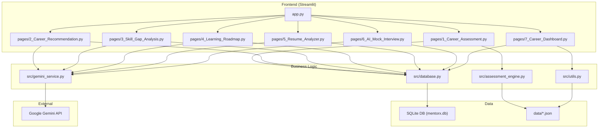

**Diagram sources**
- [app.py:1-166](file://mentorx-ai/app.py#L1-L166)
- [1_Career_Assessment.py:1-138](file://mentorx-ai/pages/1_Career_Assessment.py#L1-L138)
- [2_Career_Recommendation.py:1-140](file://mentorx-ai/pages/2_Career_Recommendation.py#L1-L140)
- [3_Skill_Gap_Analysis.py:1-230](file://mentorx-ai/pages/3_Skill_Gap_Analysis.py#L1-L230)
- [4_Learning_Roadmap.py:1-198](file://mentorx-ai/pages/4_Learning_Roadmap.py#L1-L198)
- [5_Resume_Analyzer.py:1-191](file://mentorx-ai/pages/5_Resume_Analyzer.py#L1-L191)
- [6_AI_Mock_Interview.py:1-283](file://mentorx-ai/pages/6_AI_Mock_Interview.py#L1-L283)
- [7_Career_Dashboard.py:1-272](file://mentorx-ai/pages/7_Career_Dashboard.py#L1-L272)
- [assessment_engine.py:1-144](file://mentorx-ai/src/assessment_engine.py#L1-L144)
- [utils.py:1-205](file://mentorx-ai/src/utils.py#L1-L205)
- [database.py:1-362](file://mentorx-ai/src/database.py#L1-L362)
- [gemini_service.py:1-422](file://mentorx-ai/src/gemini_service.py#L1-L422)

**Section sources**
- [app.py:1-166](file://mentorx-ai/app.py#L1-L166)
- [config.toml:1-13](file://mentorx-ai/.streamlit/config.toml#L1-L13)
- [requirements.txt:1-6](file://mentorx-ai/requirements.txt#L1-L6)

## Core Components
- Streamlit entry and session initialization: app.py initializes the database once, sets up session state for user identity and session ID, and renders the landing page with navigation guidance.
- Page routing mechanism: Streamlit’s pages directory implements multi-page routing; each file is a self-contained page guarded by session checks and orchestrating business logic calls.
- Session state management: Each page validates st.session_state.session_id and other keys to ensure correct flow and data availability.
- Database abstraction: database.py encapsulates SQLite operations, table schema, CRUD functions, and a dashboard aggregation helper.
- AI service integration: gemini_service.py centralizes all Google Gemini API interactions, prompt construction, JSON parsing, and error handling with fallbacks.
- Assessment engine: assessment_engine.py loads questions from data/assessment_questions.json, computes dimension scores, and derives personality traits.
- Utilities: utils.py provides score formatting, readiness calculation, progress tracking, and report generation using data/ files.

**Section sources**
- [app.py:1-166](file://mentorx-ai/app.py#L1-L166)
- [database.py:1-362](file://mentorx-ai/src/database.py#L1-L362)
- [gemini_service.py:1-422](file://mentorx-ai/src/gemini_service.py#L1-L422)
- [assessment_engine.py:1-144](file://mentorx-ai/src/assessment_engine.py#L1-L144)
- [utils.py:1-205](file://mentorx-ai/src/utils.py#L1-L205)

## Architecture Overview
The system follows a layered architecture:
- Presentation layer: Streamlit pages render UI, collect inputs, display results, and orchestrate flows.
- Service layer: Business modules implement domain logic (assessment scoring, readiness calculation), integrate with external AI services, and persist data.
- Data layer: SQLite stores sessions and artifacts per user session; static JSON assets provide question sets and career profiles.
- External dependency: Google Gemini API provides AI capabilities for recommendations, skill gap analysis, roadmaps, resume reviews, and interview simulation.

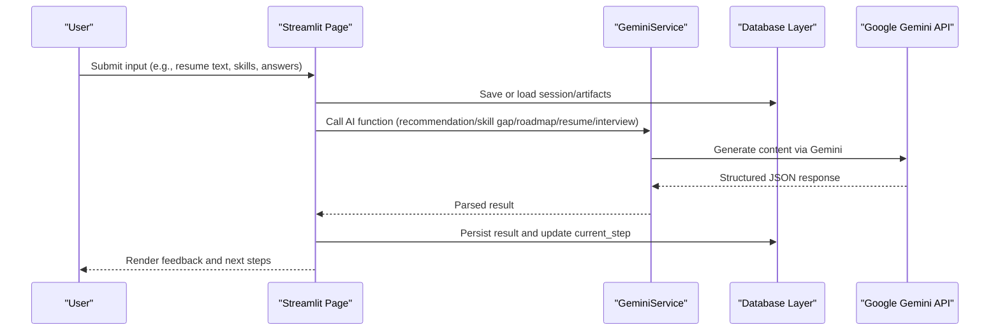

**Diagram sources**
- [2_Career_Recommendation.py:54-68](file://mentorx-ai/pages/2_Career_Recommendation.py#L54-L68)
- [3_Skill_Gap_Analysis.py:90-113](file://mentorx-ai/pages/3_Skill_Gap_Analysis.py#L90-L113)
- [4_Learning_Roadmap.py:60-75](file://mentorx-ai/pages/4_Learning_Roadmap.py#L60-L75)
- [5_Resume_Analyzer.py:84-102](file://mentorx-ai/pages/5_Resume_Analyzer.py#L84-L102)
- [6_AI_Mock_Interview.py:92-104](file://mentorx-ai/pages/6_AI_Mock_Interview.py#L92-L104)
- [gemini_service.py:32-59](file://mentorx-ai/src/gemini_service.py#L32-L59)
- [database.py:114-145](file://mentorx-ai/src/database.py#L114-L145)

## Detailed Component Analysis

### Streamlit Application and Page Routing
- Landing page (app.py) initializes the database once, creates a session if missing, and displays the journey overview. It sets page config and sidebar info.
- Pages are routed automatically by Streamlit based on filenames prefixed with numbers. Each page guards access by checking st.session_state.session_id and relevant prerequisites.
- Session state is used to carry user name, selected career, assessment results, and intermediate artifacts across pages.

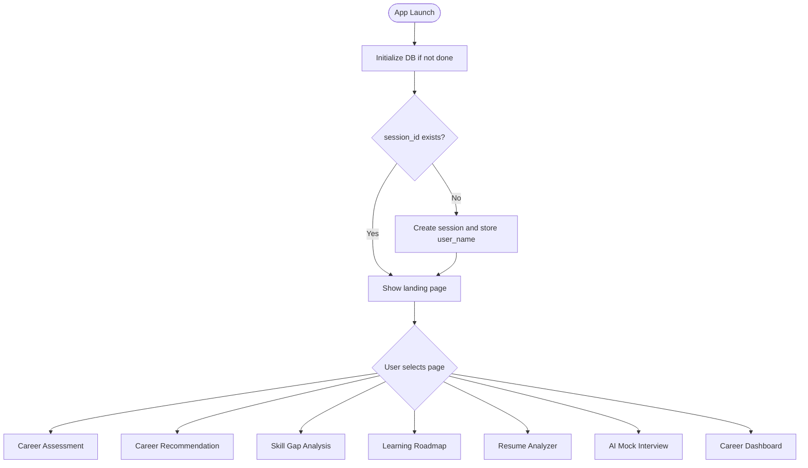

**Diagram sources**
- [app.py:30-82](file://mentorx-ai/app.py#L30-L82)
- [1_Career_Assessment.py:21-24](file://mentorx-ai/pages/1_Career_Assessment.py#L21-L24)
- [2_Career_Recommendation.py:21-30](file://mentorx-ai/pages/2_Career_Recommendation.py#L21-L30)
- [3_Skill_Gap_Analysis.py:22-30](file://mentorx-ai/pages/3_Skill_Gap_Analysis.py#L22-L30)
- [4_Learning_Roadmap.py:22-30](file://mentorx-ai/pages/4_Learning_Roadmap.py#L22-L30)
- [5_Resume_Analyzer.py:22-27](file://mentorx-ai/pages/5_Resume_Analyzer.py#L22-L27)
- [6_AI_Mock_Interview.py:25-33](file://mentorx-ai/pages/6_AI_Mock_Interview.py#L25-L33)
- [7_Career_Dashboard.py:30-34](file://mentorx-ai/pages/7_Career_Dashboard.py#L30-L34)

**Section sources**
- [app.py:1-166](file://mentorx-ai/app.py#L1-L166)
- [1_Career_Assessment.py:1-138](file://mentorx-ai/pages/1_Career_Assessment.py#L1-L138)
- [2_Career_Recommendation.py:1-140](file://mentorx-ai/pages/2_Career_Recommendation.py#L1-L140)
- [3_Skill_Gap_Analysis.py:1-230](file://mentorx-ai/pages/3_Skill_Gap_Analysis.py#L1-L230)
- [4_Learning_Roadmap.py:1-198](file://mentorx-ai/pages/4_Learning_Roadmap.py#L1-L198)
- [5_Resume_Analyzer.py:1-191](file://mentorx-ai/pages/5_Resume_Analyzer.py#L1-L191)
- [6_AI_Mock_Interview.py:1-283](file://mentorx-ai/pages/6_AI_Mock_Interview.py#L1-L283)
- [7_Career_Dashboard.py:1-272](file://mentorx-ai/pages/7_Career_Dashboard.py#L1-L272)

### Database Abstraction Layer
- Schema includes tables for sessions, assessments, recommendations, skill analyses, roadmaps, resumes, and interviews. All relational fields reference session_id.
- Functions provide CRUD operations and JSON serialization/deserialization for complex fields.
- Dashboard aggregation retrieves latest records per session for visualization and readiness calculation.

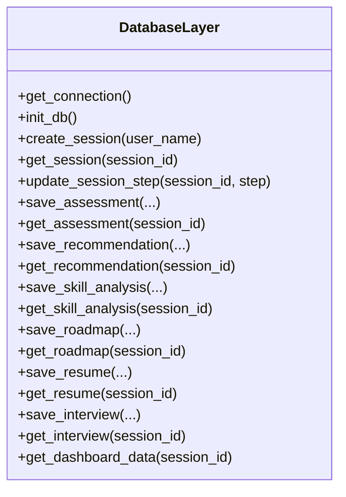

**Diagram sources**
- [database.py:14-107](file://mentorx-ai/src/database.py#L14-L107)
- [database.py:114-362](file://mentorx-ai/src/database.py#L114-L362)

**Section sources**
- [database.py:1-362](file://mentorx-ai/src/database.py#L1-L362)

### AI Service Integration (Google Gemini)
- Centralized module configures the model and API key, exposes safe call wrappers, and defines prompts for each capability:
  - Career recommendations
  - Skill gap analysis
  - Learning roadmap generation
  - Resume review
  - Mock interview question generation, answer evaluation, and final summary
- Robust JSON parsing handles markdown fences; errors return fallback structures to keep UI functional.

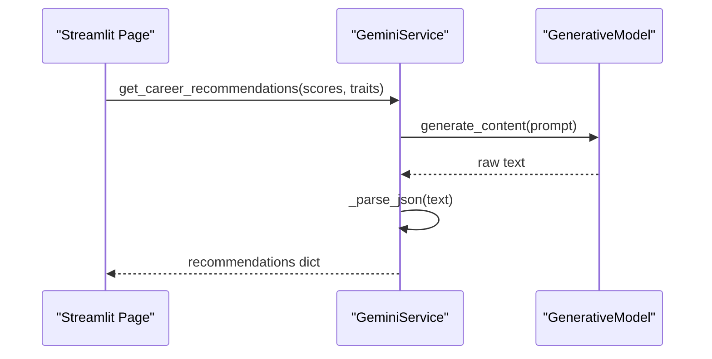

**Diagram sources**
- [gemini_service.py:19-59](file://mentorx-ai/src/gemini_service.py#L19-L59)
- [gemini_service.py:66-103](file://mentorx-ai/src/gemini_service.py#L66-L103)

**Section sources**
- [gemini_service.py:1-422](file://mentorx-ai/src/gemini_service.py#L1-L422)

### Assessment Engine and Utilities
- Assessment engine loads questions from data/assessment_questions.json, computes average scores per dimension, and derives personality traits based on thresholds.
- Utilities compute overall readiness score from dashboard data, format scores with colors/emojis/labels, track progress, and generate a text report.

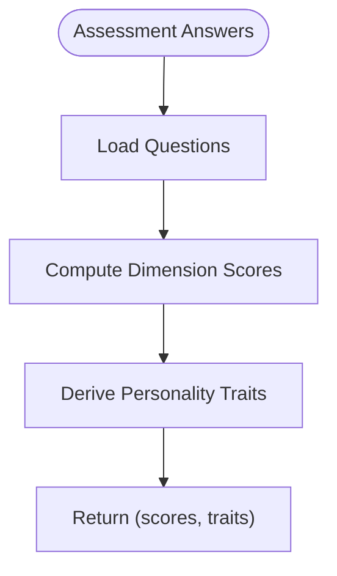

**Diagram sources**
- [assessment_engine.py:44-82](file://mentorx-ai/src/assessment_engine.py#L44-L82)
- [assessment_engine.py:84-144](file://mentorx-ai/src/assessment_engine.py#L84-L144)

**Section sources**
- [assessment_engine.py:1-144](file://mentorx-ai/src/assessment_engine.py#L1-L144)
- [utils.py:1-205](file://mentorx-ai/src/utils.py#L1-L205)

### Page Workflows and Data Flow

#### Career Assessment
- Collects answers grouped by categories, validates completion, computes scores and traits, saves to DB, updates current step, and shows results.

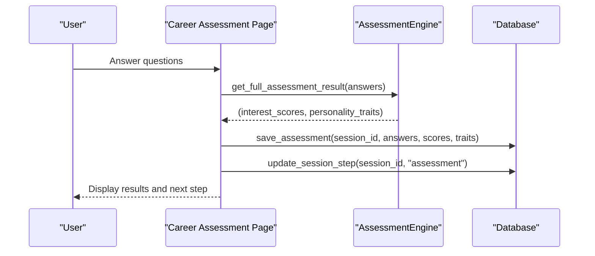

**Diagram sources**
- [1_Career_Assessment.py:91-113](file://mentorx-ai/pages/1_Career_Assessment.py#L91-L113)
- [assessment_engine.py:133-144](file://mentorx-ai/src/assessment_engine.py#L133-L144)
- [database.py:152-183](file://mentorx-ai/src/database.py#L152-L183)

**Section sources**
- [1_Career_Assessment.py:1-138](file://mentorx-ai/pages/1_Career_Assessment.py#L1-L138)
- [assessment_engine.py:1-144](file://mentorx-ai/src/assessment_engine.py#L1-L144)
- [database.py:152-183](file://mentorx-ai/src/database.py#L152-L183)

#### Career Recommendation
- Loads or generates recommendations via Gemini, persists results, updates step, and allows selecting target career.

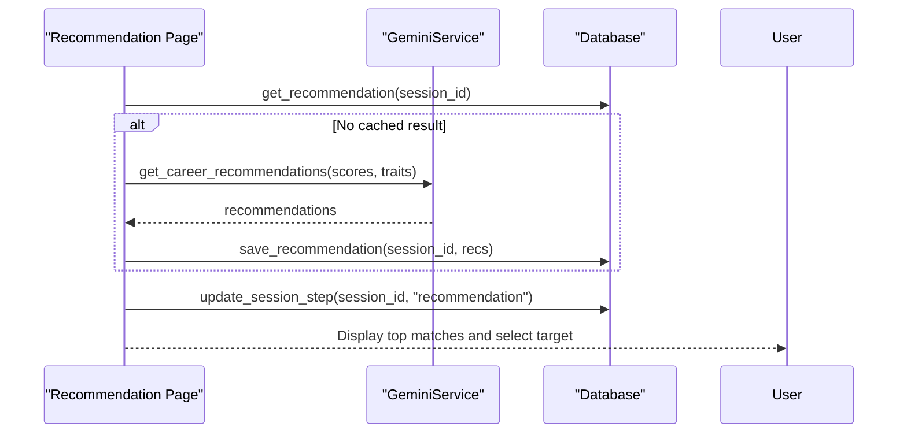

**Diagram sources**
- [2_Career_Recommendation.py:54-68](file://mentorx-ai/pages/2_Career_Recommendation.py#L54-L68)
- [gemini_service.py:66-103](file://mentorx-ai/src/gemini_service.py#L66-L103)
- [database.py:190-213](file://mentorx-ai/src/database.py#L190-L213)

**Section sources**
- [2_Career_Recommendation.py:1-140](file://mentorx-ai/pages/2_Career_Recommendation.py#L1-L140)
- [gemini_service.py:66-103](file://mentorx-ai/src/gemini_service.py#L66-L103)
- [database.py:190-213](file://mentorx-ai/src/database.py#L190-L213)

#### Skill Gap Analysis
- Inputs current skills, calls Gemini to analyze gaps, persists results, updates step, and visualizes match percentage and radar chart.

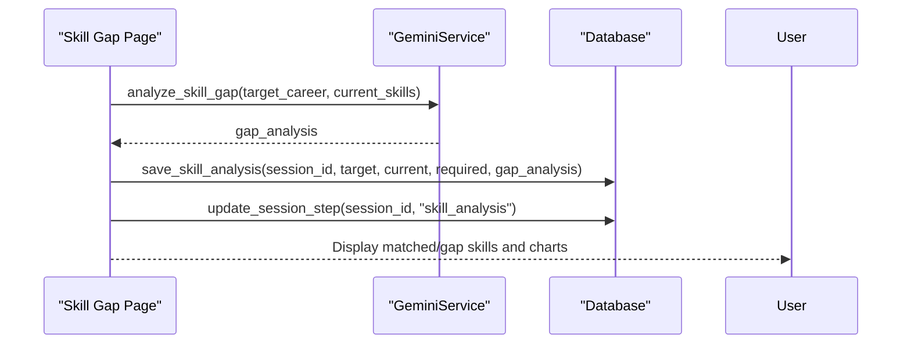

**Diagram sources**
- [3_Skill_Gap_Analysis.py:90-113](file://mentorx-ai/pages/3_Skill_Gap_Analysis.py#L90-L113)
- [gemini_service.py:110-147](file://mentorx-ai/src/gemini_service.py#L110-L147)
- [database.py:220-250](file://mentorx-ai/src/database.py#L220-L250)

**Section sources**
- [3_Skill_Gap_Analysis.py:1-230](file://mentorx-ai/pages/3_Skill_Gap_Analysis.py#L1-L230)
- [gemini_service.py:110-147](file://mentorx-ai/src/gemini_service.py#L110-L147)
- [database.py:220-250](file://mentorx-ai/src/database.py#L220-L250)

#### Learning Roadmap
- Generates phased roadmap based on target career and gap skills, persists phases and total hours, updates step, and displays timeline and milestones.

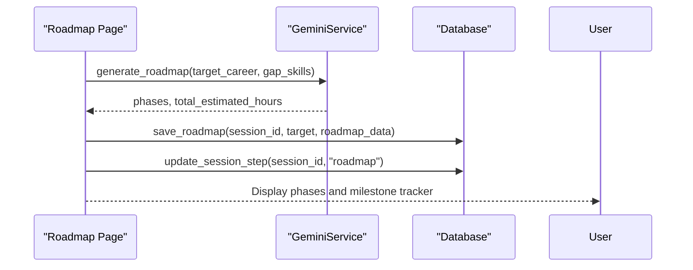

**Diagram sources**
- [4_Learning_Roadmap.py:60-75](file://mentorx-ai/pages/4_Learning_Roadmap.py#L60-L75)
- [gemini_service.py:154-201](file://mentorx-ai/src/gemini_service.py#L154-L201)
- [database.py:257-279](file://mentorx-ai/src/database.py#L257-L279)

**Section sources**
- [4_Learning_Roadmap.py:1-198](file://mentorx-ai/pages/4_Learning_Roadmap.py#L1-L198)
- [gemini_service.py:154-201](file://mentorx-ai/src/gemini_service.py#L154-L201)
- [database.py:257-279](file://mentorx-ai/src/database.py#L257-L279)

#### Resume Analyzer
- Accepts resume text and target role, calls Gemini for review, persists feedback, updates step, and presents section-by-section feedback and ATS tips.

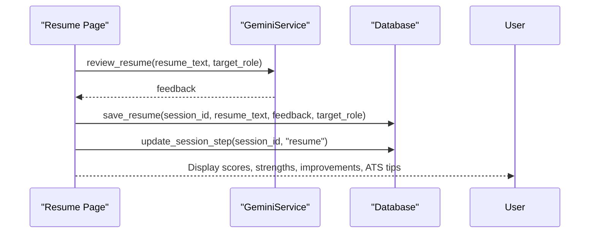

**Diagram sources**
- [5_Resume_Analyzer.py:84-102](file://mentorx-ai/pages/5_Resume_Analyzer.py#L84-L102)
- [gemini_service.py:208-285](file://mentorx-ai/src/gemini_service.py#L208-L285)
- [database.py:286-308](file://mentorx-ai/src/database.py#L286-L308)

**Section sources**
- [5_Resume_Analyzer.py:1-191](file://mentorx-ai/pages/5_Resume_Analyzer.py#L1-L191)
- [gemini_service.py:208-285](file://mentorx-ai/src/gemini_service.py#L208-L285)
- [database.py:286-308](file://mentorx-ai/src/database.py#L286-L308)

#### AI Mock Interview
- Interactive chat-based interview with question generation, answer evaluation, and final summary; persists conversation and feedback, updates step.

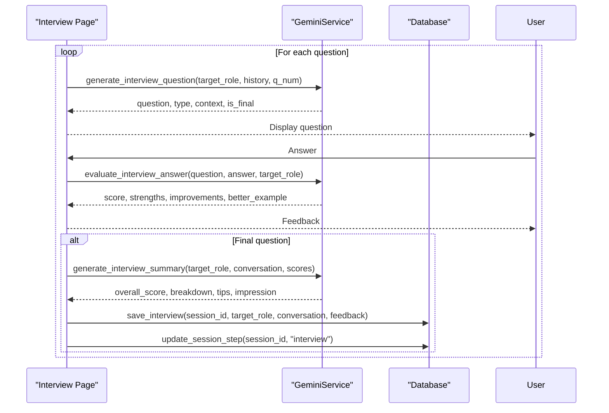

**Diagram sources**
- [6_AI_Mock_Interview.py:92-104](file://mentorx-ai/pages/6_AI_Mock_Interview.py#L92-L104)
- [6_AI_Mock_Interview.py:145-211](file://mentorx-ai/pages/6_AI_Mock_Interview.py#L145-L211)
- [gemini_service.py:292-335](file://mentorx-ai/src/gemini_service.py#L292-L335)
- [gemini_service.py:342-371](file://mentorx-ai/src/gemini_service.py#L342-L371)
- [gemini_service.py:378-421](file://mentorx-ai/src/gemini_service.py#L378-L421)
- [database.py:315-344](file://mentorx-ai/src/database.py#L315-L344)

**Section sources**
- [6_AI_Mock_Interview.py:1-283](file://mentorx-ai/pages/6_AI_Mock_Interview.py#L1-L283)
- [gemini_service.py:292-421](file://mentorx-ai/src/gemini_service.py#L292-L421)
- [database.py:315-344](file://mentorx-ai/src/database.py#L315-L344)

#### Career Dashboard
- Aggregates all session data, calculates readiness score, displays progress tracker, charts, and offers downloadable report.

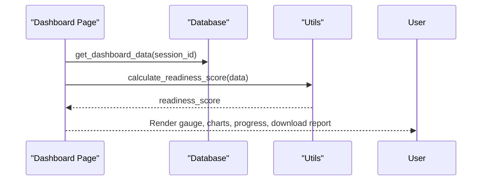

**Diagram sources**
- [7_Career_Dashboard.py:43-47](file://mentorx-ai/pages/7_Career_Dashboard.py#L43-L47)
- [utils.py:70-117](file://mentorx-ai/src/utils.py#L70-L117)
- [database.py:351-362](file://mentorx-ai/src/database.py#L351-L362)

**Section sources**
- [7_Career_Dashboard.py:1-272](file://mentorx-ai/pages/7_Career_Dashboard.py#L1-L272)
- [utils.py:70-117](file://mentorx-ai/src/utils.py#L70-L117)
- [database.py:351-362](file://mentorx-ai/src/database.py#L351-L362)

## Dependency Analysis
- Streamlit pages depend on:
  - src/database.py for persistence and session management
  - src/gemini_service.py for AI capabilities
  - src/assessment_engine.py for assessment scoring
  - src/utils.py for dashboard calculations and reporting
- External dependencies defined in requirements.txt include Streamlit, Google Generative AI, Pandas, Plotly, and python-dotenv.
- Configuration in .streamlit/config.toml sets theme and server behavior.

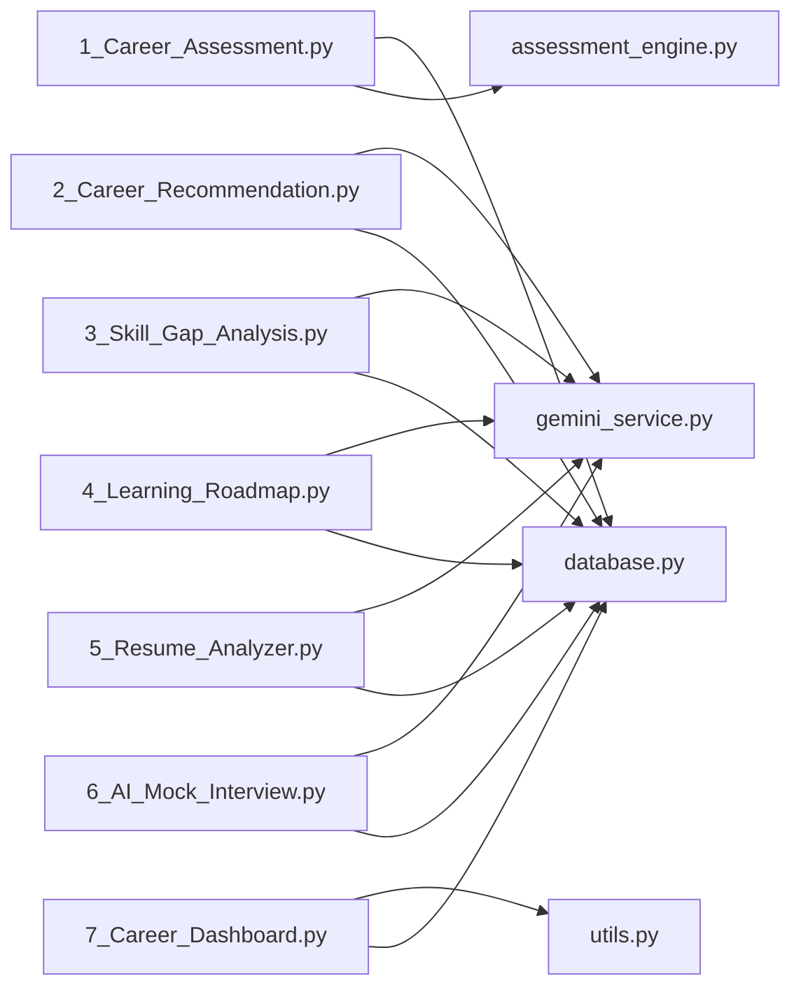

**Diagram sources**
- [requirements.txt:1-6](file://mentorx-ai/requirements.txt#L1-L6)
- [config.toml:1-13](file://mentorx-ai/.streamlit/config.toml#L1-L13)
- [1_Career_Assessment.py:12-13](file://mentorx-ai/pages/1_Career_Assessment.py#L12-L13)
- [2_Career_Recommendation.py:12-13](file://mentorx-ai/pages/2_Career_Recommendation.py#L12-L13)
- [3_Skill_Gap_Analysis.py:13-14](file://mentorx-ai/pages/3_Skill_Gap_Analysis.py#L13-L14)
- [4_Learning_Roadmap.py:13-14](file://mentorx-ai/pages/4_Learning_Roadmap.py#L13-L14)
- [5_Resume_Analyzer.py:13-14](file://mentorx-ai/pages/5_Resume_Analyzer.py#L13-L14)
- [6_AI_Mock_Interview.py:12-16](file://mentorx-ai/pages/6_AI_Mock_Interview.py#L12-L16)
- [7_Career_Dashboard.py:14-21](file://mentorx-ai/pages/7_Career_Dashboard.py#L14-L21)

**Section sources**
- [requirements.txt:1-6](file://mentorx-ai/requirements.txt#L1-L6)
- [config.toml:1-13](file://mentorx-ai/.streamlit/config.toml#L1-L13)

## Performance Considerations
- AI calls are centralized and wrapped with safe error handling to avoid blocking UI on failures; fallbacks ensure continuity.
- Database operations use single connections per function call; consider connection pooling for high concurrency.
- Streamlit reruns on actions; minimize redundant computations by caching results in session state and database.
- Visualization libraries (Plotly, Pandas) are used for rendering; limit dataset sizes in charts to maintain responsiveness.
- Static data loading (questions, career profiles) occurs per request; consider caching at module level if accessed frequently.

[No sources needed since this section provides general guidance]

## Security Considerations
- API key management: GOOGLE_API_KEY is loaded via dotenv; ensure it is not committed to version control and restrict environment access.
- Input validation: Pages validate required inputs before calling AI or saving to DB; guard clauses prevent unauthorized access without active sessions.
- Data storage: SQLite file should be protected; consider file permissions and backups. Avoid storing sensitive personal data beyond necessary scope.
- Output sanitization: HTML rendering uses unsafe_allow_html sparingly; prefer safer alternatives where possible.

**Section sources**
- [gemini_service.py:19-24](file://mentorx-ai/src/gemini_service.py#L19-L24)
- [1_Career_Assessment.py:21-24](file://mentorx-ai/pages/1_Career_Assessment.py#L21-L24)
- [5_Resume_Analyzer.py:84-89](file://mentorx-ai/pages/5_Resume_Analyzer.py#L84-L89)

## Scalability and Deployment Topology
- Current topology: Single-process Streamlit app with local SQLite and external Gemini API. Suitable for small-scale or prototype deployments.
- Scaling considerations:
  - Stateless pages: Streamlit pages are stateless; session state is in-memory. For horizontal scaling, use shared session storage (e.g., Redis) and externalize SQLite to a managed database.
  - Concurrency: Streamlit runs per-user processes; consider reverse proxy and process managers for multiple instances.
  - Caching: Introduce application-level caching for frequent AI responses or static data to reduce latency and costs.
  - External services: Gemini API rate limits and quotas require monitoring and retry/backoff strategies.
- Deployment options:
  - Local development: Run Streamlit locally with .env for API key.
  - Cloud hosting: Deploy Streamlit app on platforms supporting Python environments; configure environment variables and secure secrets management.
  - Headless mode: Configured in config.toml for server deployments.

**Section sources**
- [config.toml:8-10](file://mentorx-ai/.streamlit/config.toml#L8-L10)
- [gemini_service.py:19-24](file://mentorx-ai/src/gemini_service.py#L19-L24)

## Troubleshooting Guide
- Missing API key: If GOOGLE_API_KEY is not set, Gemini calls raise an error; verify environment configuration and restart the app.
- Session not initialized: Pages guard against missing session_id; ensure users start from the home page to create a session.
- Incomplete assessments: Validation prevents submission unless all questions are answered; guide users to complete required fields.
- AI service errors: Fallback responses are returned; check logs for error messages and retry after resolving API issues.
- Database issues: Ensure SQLite file is writable and not locked; reinitialize DB if schema corruption occurs.

**Section sources**
- [gemini_service.py:32-39](file://mentorx-ai/src/gemini_service.py#L32-L39)
- [1_Career_Assessment.py:21-24](file://mentorx-ai/pages/1_Career_Assessment.py#L21-L24)
- [1_Career_Assessment.py:91-94](file://mentorx-ai/pages/1_Career_Assessment.py#L91-L94)
- [2_Career_Recommendation.py:57-64](file://mentorx-ai/pages/2_Career_Recommendation.py#L57-L64)
- [database.py:21-107](file://mentorx-ai/src/database.py#L21-L107)

## Conclusion
Mentor X-AI implements a clean, modular architecture separating presentation, business logic, data persistence, and external AI services. Streamlit pages provide an intuitive guided workflow with robust session management and persistent artifacts in SQLite. The Gemini integration is centralized with resilient error handling and structured outputs. The system is well-suited for small to medium deployments, with clear pathways to scale via session sharing, external databases, and caching strategies. Security measures focus on secret management and input validation, while performance considerations emphasize efficient data handling and minimal redundant computation.