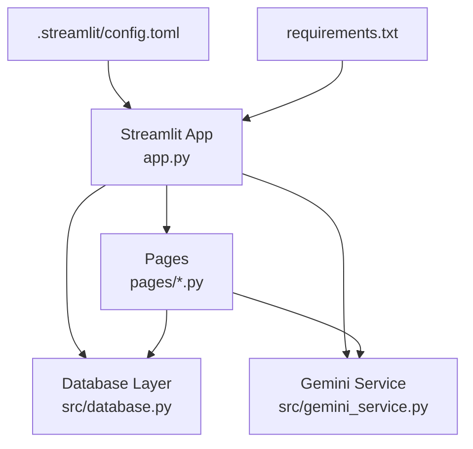
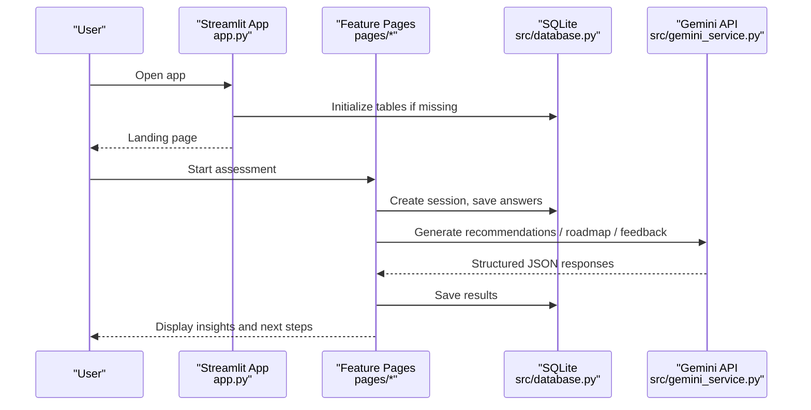
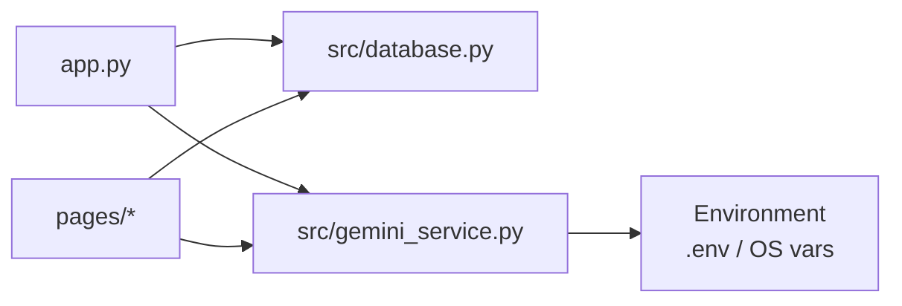

# Configuration and Deployment

<cite>
**Referenced Files in This Document**
- [config.toml](file://mentorx-ai/.streamlit/config.toml)
- [requirements.txt](file://mentorx-ai/requirements.txt)
- [app.py](file://mentorx-ai/app.py)
- [database.py](file://mentorx-ai/src/database.py)
- [gemini_service.py](file://mentorx-ai/src/gemini_service.py)
- [1_Career_Assessment.py](file://mentorx-ai/pages/1_Career_Assessment.py)
</cite>

## Table of Contents
1. [Introduction](#introduction)
2. [Project Structure](#project-structure)
3. [Core Components](#core-components)
4. [Architecture Overview](#architecture-overview)
5. [Detailed Component Analysis](#detailed-component-analysis)
6. [Dependency Analysis](#dependency-analysis)
7. [Performance Considerations](#performance-considerations)
8. [Troubleshooting Guide](#troubleshooting-guide)
9. [Conclusion](#conclusion)
10. [Appendices](#appendices)

## Introduction
This document provides comprehensive configuration and deployment guidance for Mentor X-AI, a Streamlit-based career coaching application. It covers Streamlit configuration via config.toml (theme, layout, server options), environment variable management for API keys, dependency management with requirements.txt, local development setup, production hosting strategies, scaling considerations, Docker containerization, cloud deployment patterns, monitoring, backup and recovery for the SQLite database, log management, performance tuning, security considerations, access control, and data privacy measures for production environments.

## Project Structure
Mentor X-AI is organized as a Streamlit application with:
- A main entry point that initializes the UI and database session
- Feature pages under pages/
- Shared modules under src/ for database operations and AI service integration
- Data assets under data/
- Streamlit configuration under .streamlit/
- Dependency definitions in requirements.txt

**Diagram sources**
- [app.py:19-32](file://mentorx-ai/app.py#L19-L32)
- [database.py:21-107](file://mentorx-ai/src/database.py#L21-L107)
- [gemini_service.py:19-25](file://mentorx-ai/src/gemini_service.py#L19-L25)
- [1_Career_Assessment.py:12-15](file://mentorx-ai/pages/1_Career_Assessment.py#L12-L15)

**Section sources**
- [app.py:1-32](file://mentorx-ai/app.py#L1-L32)
- [database.py:1-107](file://mentorx-ai/src/database.py#L1-L107)
- [gemini_service.py:1-25](file://mentorx-ai/src/gemini_service.py#L1-L25)
- [1_Career_Assessment.py:1-20](file://mentorx-ai/pages/1_Career_Assessment.py#L1-L20)

## Core Components
- Streamlit configuration: theme colors, font, server headless mode, usage stats collection
- Environment variables: Google API key loaded via dotenv for Gemini integration
- Dependencies: Streamlit, Google Generative AI SDK, pandas, plotly, python-dotenv
- Database: SQLite file with tables for sessions, assessments, recommendations, skill analyses, roadmaps, resumes, interviews
- Pages: Multi-page Streamlit app including Career Assessment page

Key implementation references:
- Streamlit page config and initial DB initialization are set at startup
- Gemini service reads GOOGLE_API_KEY from environment and configures the model
- Database layer creates tables on first run and provides CRUD helpers

**Section sources**
- [config.toml:1-13](file://mentorx-ai/.streamlit/config.toml#L1-L13)
- [requirements.txt:1-6](file://mentorx-ai/requirements.txt#L1-L6)
- [app.py:19-32](file://mentorx-ai/app.py#L19-L32)
- [gemini_service.py:19-25](file://mentorx-ai/src/gemini_service.py#L19-L25)
- [database.py:21-107](file://mentorx-ai/src/database.py#L21-L107)

## Architecture Overview
The application follows a layered architecture:
- Presentation: Streamlit pages and main app
- Business logic: Page-specific flows and shared utilities
- Integration: Gemini API for AI-powered features
- Persistence: SQLite database for user sessions and feature outputs

**Diagram sources**
- [app.py:19-32](file://mentorx-ai/app.py#L19-L32)
- [database.py:114-146](file://mentorx-ai/src/database.py#L114-L146)
- [gemini_service.py:32-60](file://mentorx-ai/src/gemini_service.py#L32-L60)
- [1_Career_Assessment.py:91-113](file://mentorx-ai/pages/1_Career_Assessment.py#L91-L113)

## Detailed Component Analysis

### Streamlit Configuration (config.toml)
- Theme settings: primary color, background colors, text color, font family
- Server settings: headless mode enabled for non-interactive deployments
- Browser settings: disable usage statistics collection

These settings influence the visual appearance and runtime behavior of the Streamlit server.

**Section sources**
- [config.toml:1-13](file://mentorx-ai/.streamlit/config.toml#L1-L13)

### Environment Variables and API Key Management
- The Gemini service loads environment variables using python-dotenv
- The application expects GOOGLE_API_KEY to be present; if missing, calls raise an error indicating configuration is required
- Ensure a .env file exists with GOOGLE_API_KEY when running locally or in production

Operational notes:
- Keep .env out of version control
- Provide GOOGLE_API_KEY through your platform’s secret management (e.g., environment variables, secret managers)
- Validate that the key is correctly set before starting the app

**Section sources**
- [gemini_service.py:6-25](file://mentorx-ai/src/gemini_service.py#L6-L25)
- [gemini_service.py:32-39](file://mentorx-ai/src/gemini_service.py#L32-L39)

### Dependency Management (requirements.txt)
- Streamlit >= 1.30.0
- Google Generative AI SDK >= 0.3.0
- pandas >= 2.0.0
- plotly >= 5.18.0
- python-dotenv >= 1.0.0

Recommendations:
- Pin exact versions in production for reproducibility
- Use a virtual environment or containerized build to isolate dependencies
- Regularly update dependencies and test compatibility

**Section sources**
- [requirements.txt:1-6](file://mentorx-ai/requirements.txt#L1-L6)

### Database Schema and Session Management
- SQLite file named mentorx.db in the application directory
- Tables include sessions, assessments, recommendations, skill_analyses, roadmaps, resumes, interviews
- Initialization runs once per app start to ensure schema exists
- Session creation stores user_name and current_step; helper functions provide CRUD operations

Backup implications:
- Back up the SQLite file regularly to preserve user data
- Consider locking or consistent snapshots during backups to avoid corruption

**Section sources**
- [database.py:11-107](file://mentorx-ai/src/database.py#L11-L107)
- [database.py:114-146](file://mentorx-ai/src/database.py#L114-L146)

### Page Flow Example: Career Assessment
- Requires an active session created from the landing page
- Collects answers across categories and saves them to the database
- Updates session step and persists results

Operational notes:
- Guard against missing sessions by redirecting users back to the home page
- Progress indicator shows completion status

**Section sources**
- [1_Career_Assessment.py:18-23](file://mentorx-ai/pages/1_Career_Assessment.py#L18-L23)
- [1_Career_Assessment.py:91-113](file://mentorx-ai/pages/1_Career_Assessment.py#L91-L113)

## Dependency Analysis
The application has clear separation between UI, business logic, integration, and persistence:
- app.py orchestrates page configuration and database initialization
- Pages depend on database and gemini_service modules
- gemini_service depends on environment variables and the Google Generative AI SDK
- database module encapsulates all SQLite interactions

**Diagram sources**
- [app.py:11-14](file://mentorx-ai/app.py#L11-L14)
- [gemini_service.py:6-13](file://mentorx-ai/src/gemini_service.py#L6-L13)
- [1_Career_Assessment.py:12-13](file://mentorx-ai/pages/1_Career_Assessment.py#L12-L13)

**Section sources**
- [app.py:11-14](file://mentorx-ai/app.py#L11-L14)
- [gemini_service.py:6-13](file://mentorx-ai/src/gemini_service.py#L6-L13)
- [1_Career_Assessment.py:12-13](file://mentorx-ai/pages/1_Career_Assessment.py#L12-L13)

## Performance Considerations
- Streamlit caching: Leverage @st.cache_data or @st.cache_resource for expensive computations and repeated queries
- Database: SQLite is suitable for low-to-moderate concurrency; consider read replicas or external databases for high load
- Gemini API: Implement retries and timeouts; cache frequent responses where appropriate
- UI: Minimize reruns; use session state efficiently to avoid recomputation
- Logging: Add structured logs for request tracing and error diagnostics

[No sources needed since this section provides general guidance]

## Troubleshooting Guide
Common issues and resolutions:
- Missing API key: If GOOGLE_API_KEY is not set, Gemini calls will fail with a configuration error. Ensure .env contains the correct key and is loaded by the application.
- Database not initialized: On first run, tables are created automatically. If errors occur, verify write permissions to the application directory and that init_db runs before any DB operations.
- Session errors: Pages require an active session_id. Ensure users start from the landing page to create a session before accessing feature pages.

Operational checks:
- Confirm Streamlit server starts without errors
- Verify .env presence and correctness
- Check SQLite file permissions and disk space
- Monitor logs for exceptions and rate limits from Gemini API

**Section sources**
- [gemini_service.py:32-39](file://mentorx-ai/src/gemini_service.py#L32-L39)
- [database.py:21-33](file://mentorx-ai/src/database.py#L21-L33)
- [1_Career_Assessment.py:18-23](file://mentorx-ai/pages/1_Career_Assessment.py#L18-L23)

## Conclusion
Mentor X-AI is a modular Streamlit application with clear separation of concerns, SQLite persistence, and AI-driven features via Google Gemini. Proper configuration of Streamlit, environment variables, and dependencies ensures reliable operation. For production, focus on secure secret management, robust backups, logging, monitoring, and scaling strategies aligned with expected traffic and data growth.

[No sources needed since this section summarizes without analyzing specific files]

## Appendices

### Local Development Setup
- Install dependencies from requirements.txt
- Set GOOGLE_API_KEY in a .env file in the project root
- Run the Streamlit app from the mentorx-ai directory
- Ensure mentorx.db is writable by the process

**Section sources**
- [requirements.txt:1-6](file://mentorx-ai/requirements.txt#L1-L6)
- [gemini_service.py:6-13](file://mentorx-ai/src/gemini_service.py#L6-L13)
- [database.py:11-18](file://mentorx-ai/src/database.py#L11-L18)

### Production Hosting Options
- Streamlit Cloud: Deploy directly from a Git repository; configure secrets for GOOGLE_API_KEY
- PaaS platforms (e.g., Heroku, Render): Set environment variables and run Streamlit server
- Self-hosted: Use a web server (e.g., Nginx) in front of Streamlit; enable HTTPS and authentication

[No sources needed since this section provides general guidance]

### Scaling Considerations
- Horizontal scaling: Run multiple Streamlit instances behind a load balancer; share state externally if needed
- Database scaling: Migrate from SQLite to a managed relational database for higher concurrency and durability
- Caching: Cache Gemini responses and computed results to reduce latency and costs
- Rate limiting: Protect backend services and manage API quotas

[No sources needed since this section provides general guidance]

### Docker Containerization
- Create a Dockerfile based on a Python image
- Copy requirements.txt and install dependencies
- Copy application code and .env (via build args or runtime secrets)
- Expose the Streamlit port and run the app in headless mode as configured

[No sources needed since this section provides general guidance]

### Cloud Deployment Strategies
- Secrets management: Store GOOGLE_API_KEY in platform secret stores and inject as environment variables
- Monitoring: Enable application metrics, error tracking, and uptime checks
- CI/CD: Automate testing and deployment pipelines

[No sources needed since this section provides general guidance]

### Monitoring Setup
- Application logs: Capture stdout/stderr and centralize logs
- Error tracking: Integrate error reporting tools
- Metrics: Track request counts, response times, and error rates
- External service health: Monitor Gemini API availability and latency

[No sources needed since this section provides general guidance]

### Backup and Recovery Procedures
- SQLite backup: Schedule regular copies of mentorx.db; use consistent snapshots to prevent corruption
- Recovery: Restore the latest backup to the application directory and restart the app
- Versioning: Maintain multiple backup generations and retention policies

**Section sources**
- [database.py:11-18](file://mentorx-ai/src/database.py#L11-L18)

### Log Management
- Centralize logs for Streamlit processes
- Rotate logs to manage disk usage
- Include correlation IDs for request tracing

[No sources needed since this section provides general guidance]

### Performance Tuning Options
- Streamlit: Use caching decorators for heavy computations and repeated queries
- Database: Optimize queries and consider indexing if migrating to a relational database
- Gemini API: Implement retries, timeouts, and response caching where applicable
- UI: Reduce unnecessary reruns and optimize page layouts

[No sources needed since this section provides general guidance]

### Security Considerations
- Secrets: Never commit .env; use environment variables or secret managers
- Access control: Restrict app access via reverse proxy authentication and network policies
- Input validation: Sanitize user inputs to prevent injection attacks
- Data privacy: Encrypt sensitive data at rest and in transit; minimize data retention

[No sources needed since this section provides general guidance]

### Data Privacy Measures
- Limit collection of personal information to what is necessary
- Provide clear privacy notices and terms of use
- Allow users to export or delete their data where feasible
- Secure storage and transmission of sensitive information

[No sources needed since this section provides general guidance]