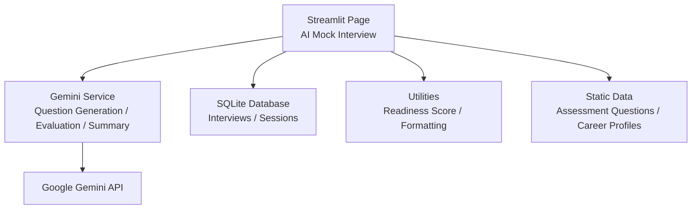
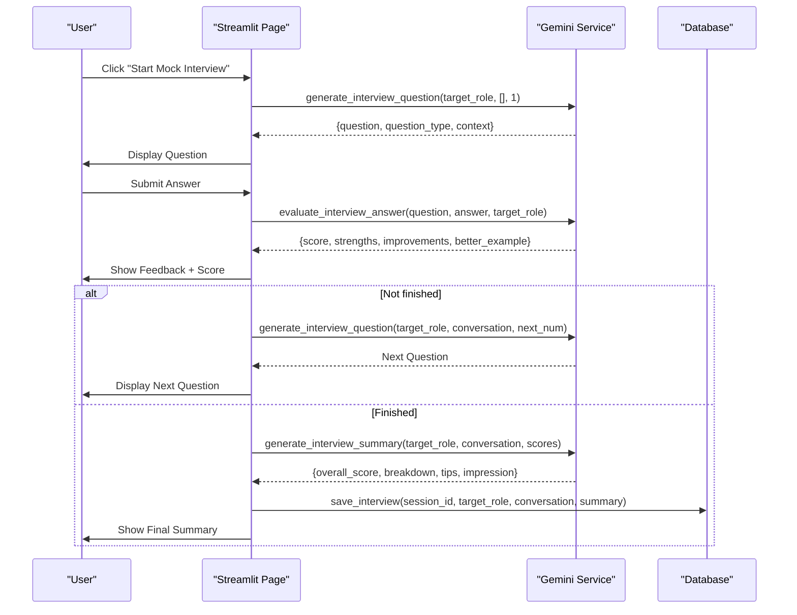
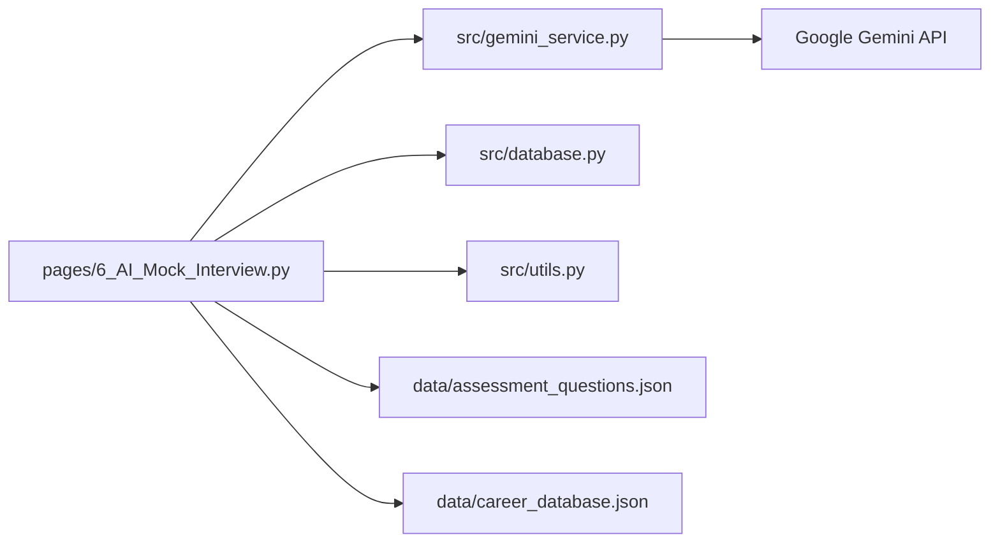

# AI Mock Interview System

<cite>
**Referenced Files in This Document**
- [6_AI_Mock_Interview.py](file://mentorx-ai/pages/6_AI_Mock_Interview.py)
- [gemini_service.py](file://mentorx-ai/src/gemini_service.py)
- [database.py](file://mentorx-ai/src/database.py)
- [utils.py](file://mentorx-ai/src/utils.py)
- [assessment_questions.json](file://mentorx-ai/data/assessment_questions.json)
- [career_database.json](file://mentorx-ai/data/career_database.json)
- [app.py](file://mentorx-ai/app.py)
</cite>

## Table of Contents
1. [Introduction](#introduction)
2. [Project Structure](#project-structure)
3. [Core Components](#core-components)
4. [Architecture Overview](#architecture-overview)
5. [Detailed Component Analysis](#detailed-component-analysis)
6. [Dependency Analysis](#dependency-analysis)
7. [Performance Considerations](#performance-considerations)
8. [Troubleshooting Guide](#troubleshooting-guide)
9. [Conclusion](#conclusion)
10. [Appendices](#appendices)

## Introduction
This document explains the AI Mock Interview System within MentorX AI, a Streamlit-based application that simulates job interviews with adaptive questioning and real-time feedback. The system guides users through a structured interview flow for a target role, generates behavioral, technical, and situational questions, evaluates answers instantly, and produces a final performance summary. It also integrates with earlier steps (assessment, recommendations, skill gap analysis, roadmap, resume review) to compute an overall readiness score on the dashboard.

## Project Structure
The mock interview feature is implemented as a Streamlit page that orchestrates user interactions, maintains conversation state, and delegates AI-driven logic to a centralized service module. Data persistence is handled by a local SQLite database. Supporting data files provide assessment question sets and career profiles used across the app.

**Diagram sources**
- [6_AI_Mock_Interview.py:1-283](file://mentorx-ai/pages/6_AI_Mock_Interview.py#L1-L283)
- [gemini_service.py:1-422](file://mentorx-ai/src/gemini_service.py#L1-L422)
- [database.py:1-362](file://mentorx-ai/src/database.py#L1-L362)
- [utils.py:1-205](file://mentorx-ai/src/utils.py#L1-L205)
- [assessment_questions.json:1-134](file://mentorx-ai/data/assessment_questions.json#L1-L134)
- [career_database.json:1-149](file://mentorx-ai/data/career_database.json#L1-L149)

**Section sources**
- [app.py:1-166](file://mentorx-ai/app.py#L1-L166)
- [6_AI_Mock_Interview.py:1-283](file://mentorx-ai/pages/6_AI_Mock_Interview.py#L1-L283)

## Core Components
- Streamlit Interview Page: Manages session state, renders chat-like interface, collects answers, triggers evaluation and next-question generation, and displays final summary.
- Gemini Service: Centralized LLM integration for generating interview questions, evaluating answers, and producing summaries using structured prompts and JSON responses.
- Database Layer: Persists interview conversations and feedback, tracks sessions, and aggregates dashboard data.
- Utilities: Provides scoring helpers, progress tracking, and report generation utilities used across pages.
- Static Data: Assessment question sets and career profiles inform earlier steps and contextualize the interview experience.

Key responsibilities:
- Adaptive questioning based on conversation history and question number.
- Real-time answer evaluation with strengths, improvements, and example rewrites.
- Final summary generation including overall score, per-question breakdown, and tips.
- Persistence of conversation and results for later review and dashboard aggregation.

**Section sources**
- [6_AI_Mock_Interview.py:41-233](file://mentorx-ai/pages/6_AI_Mock_Interview.py#L41-L233)
- [gemini_service.py:292-422](file://mentorx-ai/src/gemini_service.py#L292-L422)
- [database.py:315-362](file://mentorx-ai/src/database.py#L315-L362)
- [utils.py:70-117](file://mentorx-ai/src/utils.py#L70-L117)

## Architecture Overview
The mock interview flow is event-driven within Streamlit. When the user starts the interview, the page initializes state and requests the first question from the Gemini service. After each answer, the page evaluates the response and either continues to the next question or generates a final summary. All conversation and feedback are persisted to the database.

**Diagram sources**
- [6_AI_Mock_Interview.py:83-233](file://mentorx-ai/pages/6_AI_Mock_Interview.py#L83-L233)
- [gemini_service.py:292-422](file://mentorx-ai/src/gemini_service.py#L292-L422)
- [database.py:315-344](file://mentorx-ai/src/database.py#L315-L344)

## Detailed Component Analysis

### Streamlit Interview Page
Responsibilities:
- Guardrails: Ensures prior steps are completed and session exists.
- State management: Tracks messages, question count, scores, and completion flags.
- Conversation rendering: Displays interviewer messages, candidate answers, and feedback.
- Flow control: Triggers evaluation after each answer; advances to next question or finalizes.
- Persistence: Saves conversation and summary to the database upon completion.

Key behaviors:
- Maximum of six questions per interview.
- Uses conversation history when requesting subsequent questions to maintain continuity.
- Displays per-answer feedback with strengths, improvements, and a stronger example.
- Generates a comprehensive summary at the end and persists it.

**Section sources**
- [6_AI_Mock_Interview.py:25-104](file://mentorx-ai/pages/6_AI_Mock_Interview.py#L25-L104)
- [6_AI_Mock_Interview.py:110-233](file://mentorx-ai/pages/6_AI_Mock_Interview.py#L110-L233)
- [6_AI_Mock_Interview.py:239-283](file://mentorx-ai/pages/6_AI_Mock_Interview.py#L239-L283)

### Gemini Service (LLM Integration)
Responsibilities:
- Centralized configuration for Google Gemini model and API key.
- Robust prompt handling with JSON parsing and fallbacks.
- Three core functions for the mock interview:
  - Question generation: Produces behavioral, technical, or situational questions tailored to the target role and adapts based on conversation history.
  - Answer evaluation: Scores answers and provides constructive feedback with examples.
  - Summary generation: Aggregates conversation and scores into a final performance report.

Implementation patterns:
- Structured prompts enforce consistent JSON outputs.
- Error-safe calls return sensible defaults if parsing fails.
- Contextualization via conversation history ensures coherent progression.

**Section sources**
- [gemini_service.py:15-60](file://mentorx-ai/src/gemini_service.py#L15-L60)
- [gemini_service.py:292-335](file://mentorx-ai/src/gemini_service.py#L292-L335)
- [gemini_service.py:342-371](file://mentorx-ai/src/gemini_service.py#L342-L371)
- [gemini_service.py:378-422](file://mentorx-ai/src/gemini_service.py#L378-L422)

### Database Layer
Responsibilities:
- Schema initialization for sessions, assessments, recommendations, skill analyses, roadmaps, resumes, and interviews.
- CRUD operations for each entity, including JSON serialization/deserialization.
- Dashboard aggregation function to combine all step results.

Interview-specific operations:
- Save interview conversation and feedback.
- Retrieve latest interview for a session to restore previous results.

**Section sources**
- [database.py:21-107](file://mentorx-ai/src/database.py#L21-L107)
- [database.py:315-344](file://mentorx-ai/src/database.py#L315-L344)
- [database.py:351-362](file://mentorx-ai/src/database.py#L351-L362)

### Utilities
Responsibilities:
- Score formatting helpers (color, emoji, label).
- Readiness score calculation combining assessment, recommendation, skill analysis, roadmap, resume, and interview scores.
- Progress tracking and text report generation.

Relevance to mock interview:
- Readiness score incorporates interview performance to reflect overall career readiness.

**Section sources**
- [utils.py:16-43](file://mentorx-ai/src/utils.py#L16-L43)
- [utils.py:70-117](file://mentorx-ai/src/utils.py#L70-L117)
- [utils.py:124-144](file://mentorx-ai/src/utils.py#L124-L144)
- [utils.py:151-205](file://mentorx-ai/src/utils.py#L151-L205)

### Static Data
- Assessment questions define categories and dimensions used in earlier steps to shape recommendations and skill gaps.
- Career database provides role-specific skills and market insights that inform the interview context and realism.

**Section sources**
- [assessment_questions.json:1-134](file://mentorx-ai/data/assessment_questions.json#L1-L134)
- [career_database.json:1-149](file://mentorx-ai/data/career_database.json#L1-L149)

## Dependency Analysis
The mock interview page depends on:
- Gemini service for AI-driven question generation, evaluation, and summarization.
- Database layer for persisting interview data and restoring previous sessions.
- Utilities for scoring and reporting.
- Static data indirectly influences earlier steps that feed into the target role selection.

**Diagram sources**
- [6_AI_Mock_Interview.py:1-283](file://mentorx-ai/pages/6_AI_Mock_Interview.py#L1-L283)
- [gemini_service.py:1-422](file://mentorx-ai/src/gemini_service.py#L1-L422)
- [database.py:1-362](file://mentorx-ai/src/database.py#L1-L362)
- [utils.py:1-205](file://mentorx-ai/src/utils.py#L1-L205)
- [assessment_questions.json:1-134](file://mentorx-ai/data/assessment_questions.json#L1-L134)
- [career_database.json:1-149](file://mentorx-ai/data/career_database.json#L1-L149)

**Section sources**
- [6_AI_Mock_Interview.py:12-17](file://mentorx-ai/pages/6_AI_Mock_Interview.py#L12-L17)
- [gemini_service.py:6-25](file://mentorx-ai/src/gemini_service.py#L6-L25)
- [database.py:1-18](file://mentorx-ai/src/database.py#L1-L18)

## Performance Considerations
- LLM call frequency: Each answer triggers an evaluation call; consider batching or caching where appropriate to reduce latency and cost.
- Prompt size: Conversation history grows with each question; ensure prompts remain concise to avoid token limits.
- JSON parsing robustness: The service includes fallbacks; monitor error rates and refine prompts if parsing fails frequently.
- Database writes: Persist only necessary fields; avoid redundant writes during long sessions.
- UI responsiveness: Use spinners and reruns judiciously to keep the interface responsive while waiting for LLM responses.

[No sources needed since this section provides general guidance]

## Troubleshooting Guide
Common issues and resolutions:
- Missing API key: If the Gemini API key is not configured, LLM calls will fail. Ensure GOOGLE_API_KEY is set in environment variables.
- JSON parse errors: If the LLM returns malformed JSON, the service falls back to defaults; check prompts and model behavior.
- Session prerequisites: The interview page requires a valid session and prior steps; ensure the user navigates from the home page and completes required steps.
- Data restoration: If previous interview data does not load, verify database integrity and that the latest interview record exists for the session.

**Section sources**
- [gemini_service.py:32-60](file://mentorx-ai/src/gemini_service.py#L32-L60)
- [6_AI_Mock_Interview.py:25-33](file://mentorx-ai/pages/6_AI_Mock_Interview.py#L25-L33)
- [database.py:332-344](file://mentorx-ai/src/database.py#L332-L344)

## Conclusion
The AI Mock Interview System delivers a realistic, adaptive interview experience powered by structured prompts and real-time feedback. It combines conversational flow control, intelligent question generation, and comprehensive evaluation to help users prepare effectively for actual job interviews. By integrating with earlier career coaching steps and persisting results, it contributes to a holistic readiness profile visible on the dashboard.

[No sources needed since this section summarizes without analyzing specific files]

## Appendices

### Interview Simulation Techniques
- Adaptive questioning: Uses conversation history to tailor subsequent questions and maintain coherence.
- Mixed question types: Balances behavioral, technical, and situational prompts to assess diverse competencies.
- Realistic context: Targets roles relevant to the Pakistani job market, aligning questions with industry expectations.

**Section sources**
- [gemini_service.py:292-335](file://mentorx-ai/src/gemini_service.py#L292-L335)
- [career_database.json:1-149](file://mentorx-ai/data/career_database.json#L1-L149)

### Evaluation Criteria and Feedback Generation
- Scoring: Answers receive a numeric score reflecting quality relative to the target role.
- Strengths and improvements: Constructive feedback highlights what worked well and areas to enhance.
- Example rewrites: Provides a stronger version of the answer to guide improvement.

**Section sources**
- [gemini_service.py:342-371](file://mentorx-ai/src/gemini_service.py#L342-L371)
- [6_AI_Mock_Interview.py:141-178](file://mentorx-ai/pages/6_AI_Mock_Interview.py#L141-L178)

### Conversation History Management
- In-memory state: Maintains messages, question counts, and scores during the session.
- Persistence: Saves conversation and feedback to the database for later retrieval and dashboard aggregation.

**Section sources**
- [6_AI_Mock_Interview.py:41-52](file://mentorx-ai/pages/6_AI_Mock_Interview.py#L41-L52)
- [database.py:315-344](file://mentorx-ai/src/database.py#L315-L344)

### Final Performance Summaries
- Overall score: Aggregated from individual answer evaluations.
- Breakdown: Per-question feedback included for detailed review.
- Tips: Actionable advice to improve future performance.

**Section sources**
- [gemini_service.py:378-422](file://mentorx-ai/src/gemini_service.py#L378-L422)
- [6_AI_Mock_Interview.py:184-211](file://mentorx-ai/pages/6_AI_Mock_Interview.py#L184-L211)
- [6_AI_Mock_Interview.py:239-283](file://mentorx-ai/pages/6_AI_Mock_Interview.py#L239-L283)