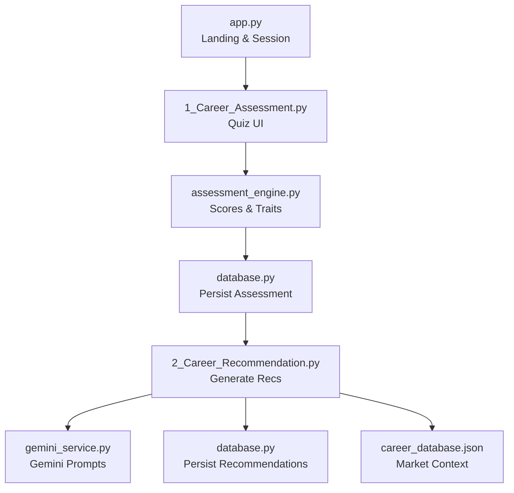
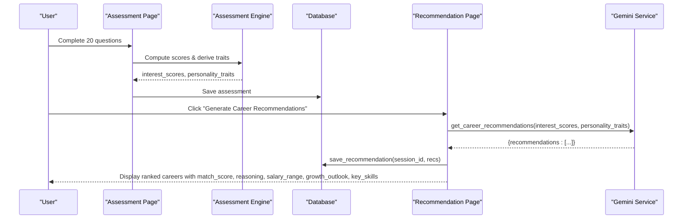
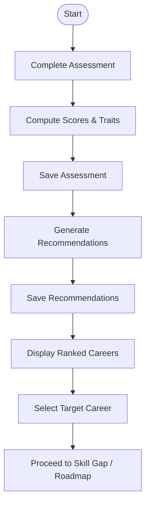
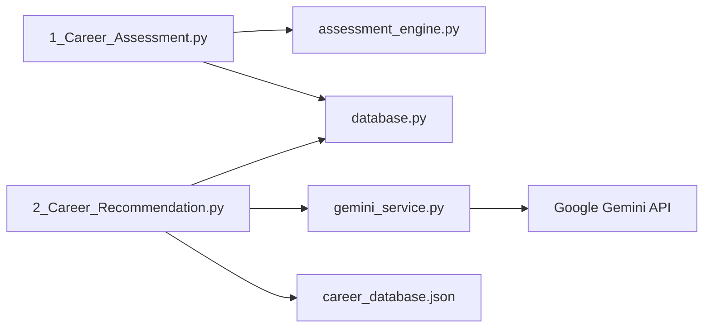

# AI-Powered Career Recommendations

<cite>
**Referenced Files in This Document**
- [app.py](file://mentorx-ai/app.py)
- [1_Career_Assessment.py](file://mentorx-ai/pages/1_Career_Assessment.py)
- [2_Career_Recommendation.py](file://mentorx-ai/pages/2_Career_Recommendation.py)
- [assessment_engine.py](file://mentorx-ai/src/assessment_engine.py)
- [gemini_service.py](file://mentorx-ai/src/gemini_service.py)
- [database.py](file://mentorx-ai/src/database.py)
- [career_database.json](file://mentorx-ai/data/career_database.json)
- [assessment_questions.json](file://mentorx-ai/data/assessment_questions.json)
</cite>

## Table of Contents
1. Introduction
2. Project Structure
3. Core Components
4. Architecture Overview
5. Detailed Component Analysis
6. Dependency Analysis
7. Performance Considerations
8. Troubleshooting Guide
9. Conclusion

## Introduction
This document explains the AI-Powered Career Recommendations feature that transforms assessment results into personalized career suggestions tailored to the Pakistani job market. The system uses Google Gemini API to analyze user assessment data and generate recommendations including match scores, reasoning, salary ranges, growth outlook, and key skills. It also documents how the assessment engine computes interest scores and personality traits, how prompts are engineered for Gemini, and how results are persisted and displayed across the Streamlit application.

## Project Structure
The feature spans multiple pages and modules:
- User enters a name and starts a session on the landing page.
- Users complete a 20-question assessment that produces dimension scores and derived traits.
- The recommendation page calls Gemini with structured prompts using assessment inputs to produce top career matches.
- Results are saved to a local SQLite database and shown in the UI.
- A curated career database provides market context (skills, salary ranges, outlook).

**Diagram sources**
- [app.py:13-79](file://mentorx-ai/app.py#L13-L79)
- [1_Career_Assessment.py:35-113](file://mentorx-ai/pages/1_Career_Assessment.py#L35-L113)
- [assessment_engine.py:44-143](file://mentorx-ai/src/assessment_engine.py#L44-L143)
- [database.py:21-107](file://mentorx-ai/src/database.py#L21-L107)
- [2_Career_Recommendation.py:39-68](file://mentorx-ai/pages/2_Career_Recommendation.py#L39-L68)
- [gemini_service.py:66-103](file://mentorx-ai/src/gemini_service.py#L66-L103)
- [career_database.json:1-149](file://mentorx-ai/data/career_database.json#L1-L149)

**Section sources**
- [app.py:13-79](file://mentorx-ai/app.py#L13-L79)
- [1_Career_Assessment.py:35-113](file://mentorx-ai/pages/1_Career_Assessment.py#L35-L113)
- [assessment_engine.py:44-143](file://mentorx-ai/src/assessment_engine.py#L44-L143)
- [database.py:21-107](file://mentorx-ai/src/database.py#L21-L107)
- [2_Career_Recommendation.py:39-68](file://mentorx-ai/pages/2_Career_Recommendation.py#L39-L68)
- [gemini_service.py:66-103](file://mentorx-ai/src/gemini_service.py#L66-L103)
- [career_database.json:1-149](file://mentorx-ai/data/career_database.json#L1-L149)

## Core Components
- Assessment Engine: Computes dimension scores from answers and derives human-readable personality traits used as personalization factors.
- Gemini Service: Centralizes all LLM interactions with structured JSON prompts; includes career recommendation generation, skill gap analysis, roadmap creation, resume review, and interview features.
- Database Layer: Manages sessions, assessments, recommendations, skill analyses, roadmaps, resumes, interviews, and dashboard aggregation via SQLite.
- Career Database: Curated dataset of careers with key skills, salary ranges (PKR), and growth outlook relevant to Pakistan.
- UI Pages: Streamlit pages orchestrate user flow, persist state, and render outputs.

Key responsibilities:
- Personalization: Interest scores and personality traits drive prompt construction and matching logic.
- Market alignment: Prompt engineering emphasizes Pakistani job market context; career database supplies concrete salary and outlook references.
- Persistence: All intermediate and final artifacts are stored per session for later retrieval and dashboarding.

**Section sources**
- [assessment_engine.py:44-143](file://mentorx-ai/src/assessment_engine.py#L44-L143)
- [gemini_service.py:66-103](file://mentorx-ai/src/gemini_service.py#L66-L103)
- [database.py:114-213](file://mentorx-ai/src/database.py#L114-L213)
- [career_database.json:1-149](file://mentorx-ai/data/career_database.json#L1-L149)
- [1_Career_Assessment.py:35-113](file://mentorx-ai/pages/1_Career_Assessment.py#L35-L113)
- [2_Career_Recommendation.py:39-68](file://mentorx-ai/pages/2_Career_Recommendation.py#L39-L68)

## Architecture Overview
The recommendation workflow integrates assessment scoring, AI prompt engineering, and market-aware outputs.

**Diagram sources**
- [1_Career_Assessment.py:91-113](file://mentorx-ai/pages/1_Career_Assessment.py#L91-L113)
- [assessment_engine.py:133-143](file://mentorx-ai/src/assessment_engine.py#L133-L143)
- [database.py:152-183](file://mentorx-ai/src/database.py#L152-L183)
- [2_Career_Recommendation.py:54-68](file://mentorx-ai/pages/2_Career_Recommendation.py#L54-L68)
- [gemini_service.py:66-103](file://mentorx-ai/src/gemini_service.py#L66-L103)

## Detailed Component Analysis

### Assessment Engine: Scoring and Trait Derivation
- Loads questions from assessment_questions.json and maps each answer to its dimension.
- Computes average scores per dimension and returns a normalized interest_scores dict.
- Derives personality traits based on thresholds across interests, work style, skills, and values categories.
- Provides a convenience wrapper to compute both scores and traits together.

Complexity:
- Time complexity is O(Q) where Q is the number of questions; space is proportional to unique dimensions.

Error handling:
- Gracefully handles missing answers by averaging only available scores.

Personalization factors:
- Dimensions include technical, creative, social, analytical, entrepreneurial, teamwork, flexibility, communication, leadership, problem solving, creativity, salary motivation, work-life balance, impact, growth, stability.
- Derived traits such as Tech-Oriented, Creative Thinker, People-Focused, Analytical Mind, Entrepreneurial Spirit, Team Player, Independent Worker, Adaptable, Natural Leader, Strong Problem Solver, Effective Communicator, Growth-Driven, Impact-Oriented, Versatile.

**Section sources**
- [assessment_questions.json:11-132](file://mentorx-ai/data/assessment_questions.json#L11-L132)
- [assessment_engine.py:44-143](file://mentorx-ai/src/assessment_engine.py#L44-L143)

### Gemini Service: Career Recommendations and Prompt Engineering
- Configures Google Generative AI with model gemini-2.0-flash and an API key from environment variables.
- Encapsulates safe calls to Gemini with JSON parsing and fallbacks.
- For career recommendations, constructs a prompt embedding interest_scores and personality_traits, instructing the model to return exactly five top careers with fields: title, match_score, reasoning, salary_range (PKR), growth_outlook, key_skills.
- Emphasizes relevance to Pakistan’s growing economy, remote work, freelancing, and startups.

Prompt engineering highlights:
- Structured output enforced via strict JSON schema in the prompt.
- Match score constrained to 0–100 integer.
- Reasoning explicitly tied to user profile.
- Salary range expressed in PKR to reflect local market conditions.

Fallback behavior:
- On errors or parse failures, returns empty recommendations list to avoid crashes.

**Section sources**
- [gemini_service.py:19-25](file://mentorx-ai/src/gemini_service.py#L19-L25)
- [gemini_service.py:32-59](file://mentorx-ai/src/gemini_service.py#L32-L59)
- [gemini_service.py:66-103](file://mentorx-ai/src/gemini_service.py#L66-L103)

### Career Matching Algorithm and Personalization
- Input: interest_scores (dimension averages) and personality_traits (derived labels).
- Process:
  - The prompt encodes these inputs so the model can infer which careers align best with the user’s interests, work style, skills, and values.
  - The model evaluates fit against the Pakistani job market context and returns a ranked set of careers.
- Output:
  - Each recommendation includes a match_score (0–100), reasoning explaining fit, salary_range in PKR, growth_outlook, and key_skills list.
- Personalization factors:
  - High technical interest + strong problem-solving → software roles.
  - Creative orientation + design skills → UX/UI or content roles.
  - Social orientation + communication → people-facing or consulting roles.
  - Entrepreneurial drive + adaptability → startup/freelance paths.
  - Values like stability vs growth influence emphasis on corporate vs freelance trajectories.

Note: The matching is primarily driven by the LLM’s reasoning over the provided profile rather than a hard-coded rule engine.

**Section sources**
- [gemini_service.py:66-103](file://mentorx-ai/src/gemini_service.py#L66-L103)
- [assessment_engine.py:84-130](file://mentorx-ai/src/assessment_engine.py#L84-L130)

### Salary Range Analysis and Growth Outlook
- Salary ranges are returned by the model in PKR, contextualized to the Pakistani market.
- Growth outlook is included as a descriptive field indicating demand trends (e.g., Very High Demand, High Demand, Growing).
- The career_database.json contains reference salary ranges and outlooks per career, which inform the broader market context even though the primary salary/outlook values come from the model response.

Integration points:
- UI displays salary_range and growth_outlook alongside match_score and reasoning.
- Subsequent steps (skill gap, roadmap) use selected career and key_skills to tailor learning plans.

**Section sources**
- [gemini_service.py:66-103](file://mentorx-ai/src/gemini_service.py#L66-L103)
- [career_database.json:1-149](file://mentorx-ai/data/career_database.json#L1-L149)
- [2_Career_Recommendation.py:80-111](file://mentorx-ai/pages/2_Career_Recommendation.py#L80-L111)

### Key Skills Identification
- The model returns a list of key_skills for each recommended career, aligned with role requirements in Pakistan.
- These skills feed into subsequent skill gap analysis and learning roadmap generation.

Example usage:
- After selecting a career, the system stores key_skills for targeted gap analysis and phased learning milestones.

**Section sources**
- [gemini_service.py:66-103](file://mentorx-ai/src/gemini_service.py#L66-L103)
- [2_Career_Recommendation.py:121-135](file://mentorx-ai/pages/2_Career_Recommendation.py#L121-L135)

### Data Flow and Persistence
- Assessment results are saved to assessments table with interest_scores and personality_traits.
- Recommendations are saved to recommendations table with recommended_careers and raw_response for auditability.
- Session step tracking ensures users proceed through the guided journey.

**Diagram sources**
- [1_Career_Assessment.py:91-113](file://mentorx-ai/pages/1_Career_Assessment.py#L91-L113)
- [assessment_engine.py:133-143](file://mentorx-ai/src/assessment_engine.py#L133-L143)
- [database.py:152-213](file://mentorx-ai/src/database.py#L152-L213)
- [2_Career_Recommendation.py:54-68](file://mentorx-ai/pages/2_Career_Recommendation.py#L54-L68)

**Section sources**
- [database.py:152-213](file://mentorx-ai/src/database.py#L152-L213)
- [2_Career_Recommendation.py:54-68](file://mentorx-ai/pages/2_Career_Recommendation.py#L54-L68)

## Dependency Analysis
- UI pages depend on assessment_engine and database for input processing and persistence.
- Recommendation page depends on gemini_service for AI-powered outputs and database for saving/loading results.
- gemini_service depends on environment configuration for API access and uses robust JSON parsing with fallbacks.
- career_database.json serves as a reference dataset for market context but does not directly constrain the model’s output.

**Diagram sources**
- [1_Career_Assessment.py:12-13](file://mentorx-ai/pages/1_Career_Assessment.py#L12-L13)
- [2_Career_Recommendation.py:12-13](file://mentorx-ai/pages/2_Career_Recommendation.py#L12-L13)
- [gemini_service.py:10-25](file://mentorx-ai/src/gemini_service.py#L10-L25)
- [career_database.json:1-149](file://mentorx-ai/data/career_database.json#L1-L149)

**Section sources**
- [1_Career_Assessment.py:12-13](file://mentorx-ai/pages/1_Career_Assessment.py#L12-L13)
- [2_Career_Recommendation.py:12-13](file://mentorx-ai/pages/2_Career_Recommendation.py#L12-L13)
- [gemini_service.py:10-25](file://mentorx-ai/src/gemini_service.py#L10-L25)
- [career_database.json:1-149](file://mentorx-ai/data/career_database.json#L1-L149)

## Performance Considerations
- LLM calls are centralized and wrapped with error handling to prevent UI stalls; fallbacks ensure graceful degradation.
- JSON parsing strips markdown fences before parsing to reduce errors.
- Persisting results avoids repeated recomputation within a session.
- Consider caching recommendations per session to minimize redundant API calls if the same profile is regenerated.

[No sources needed since this section provides general guidance]

## Troubleshooting Guide
Common issues and resolutions:
- Missing API key: If GOOGLE_API_KEY is not configured, Gemini calls raise a runtime error. Ensure the environment variable is set before running.
- Empty recommendations: If the model fails to return valid JSON or encounters an error, the service returns an empty list. Check network connectivity and API key validity.
- Parsing errors: The parser expects JSON possibly wrapped in markdown code blocks; malformed responses will trigger fallbacks. Review logs for exceptions.
- Session guards: Pages require an active session_id; ensure users start from the landing page.

Operational checks:
- Verify .env contains GOOGLE_API_KEY.
- Confirm database initialization occurs on app start.
- Validate that assessment completion sets required session flags before generating recommendations.

**Section sources**
- [gemini_service.py:19-25](file://mentorx-ai/src/gemini_service.py#L19-L25)
- [gemini_service.py:32-59](file://mentorx-ai/src/gemini_service.py#L32-L59)
- [2_Career_Recommendation.py:21-30](file://mentorx-ai/pages/2_Career_Recommendation.py#L21-L30)
- [app.py:30-32](file://mentorx-ai/app.py#L30-L32)

## Conclusion
The AI-Powered Career Recommendations feature combines a structured assessment process, robust prompt engineering, and market-aware outputs to deliver personalized career suggestions for the Pakistani job market. By encoding user interests, personality traits, and values into precise prompts, the system generates actionable insights including match scores, reasoning, salary ranges, growth outlook, and key skills. Results are persisted for continuity and integrated into subsequent steps like skill gap analysis and learning roadmaps. The architecture balances reliability with flexibility, leveraging the strengths of large language models while maintaining clear data flows and user experience safeguards.

[No sources needed since this section summarizes without analyzing specific files]