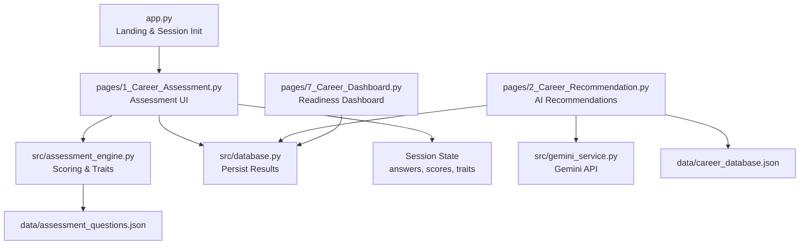
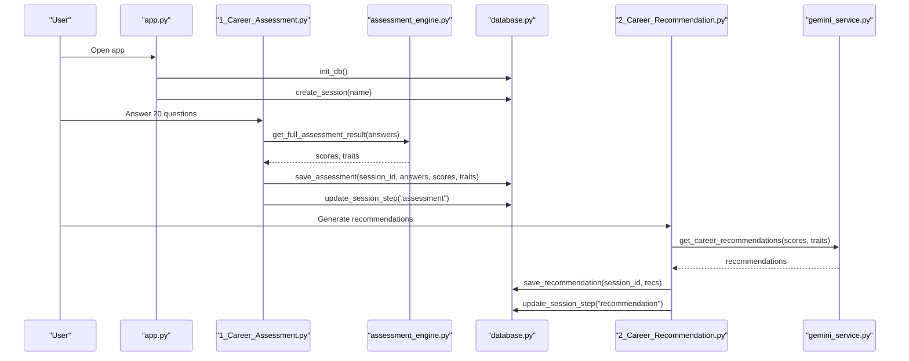
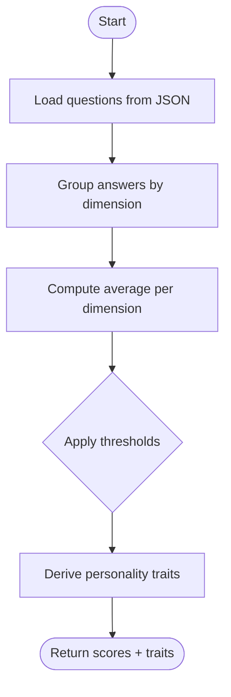
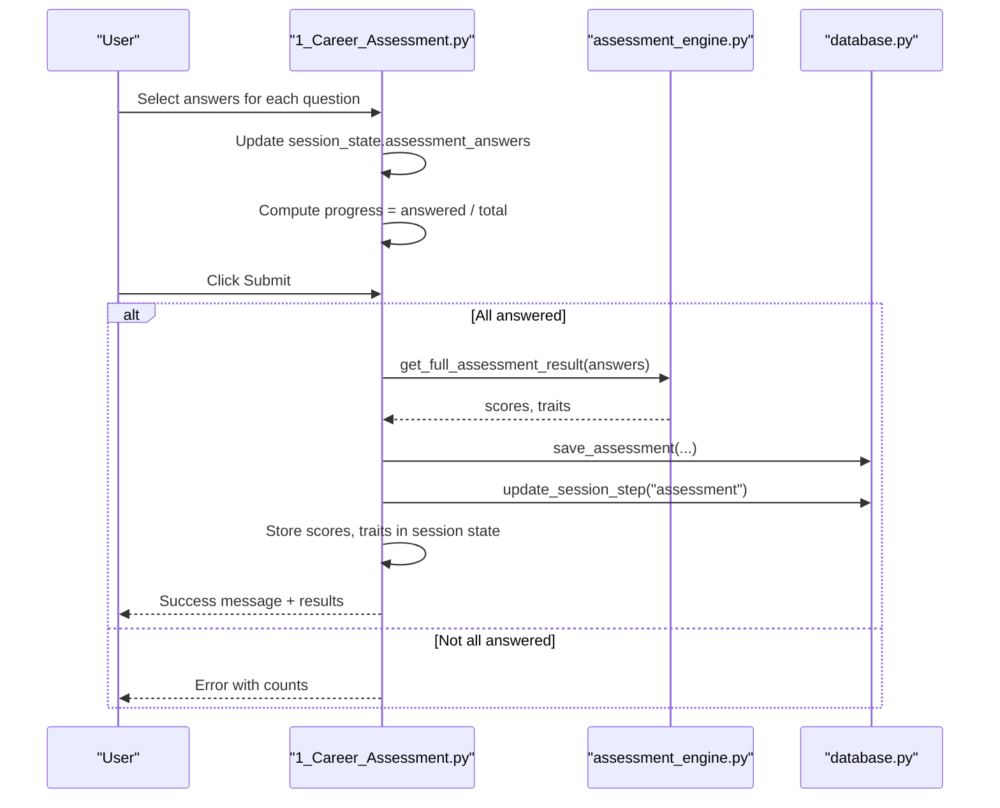
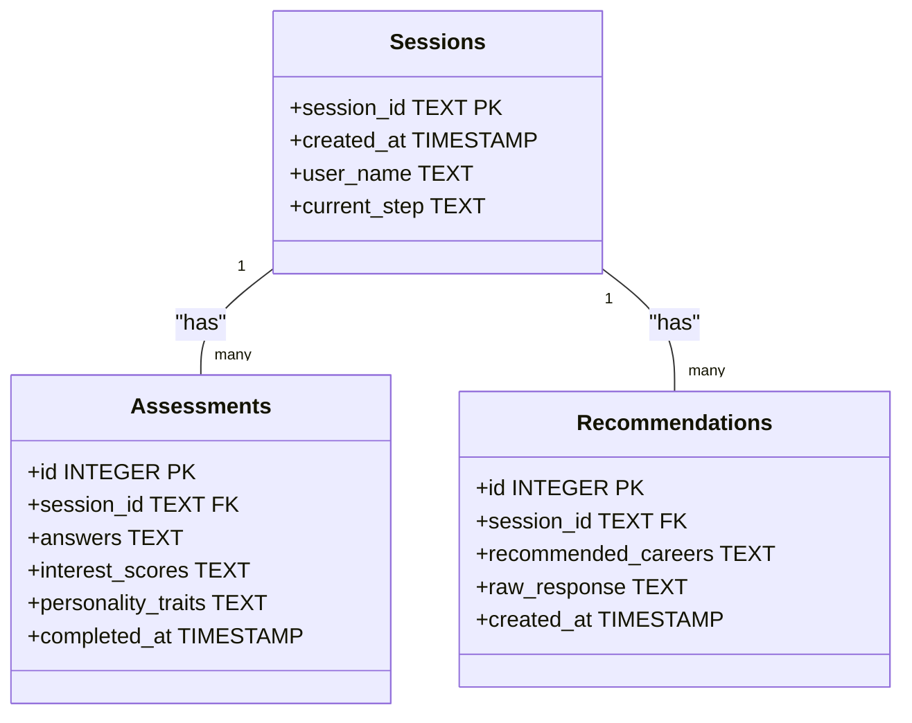
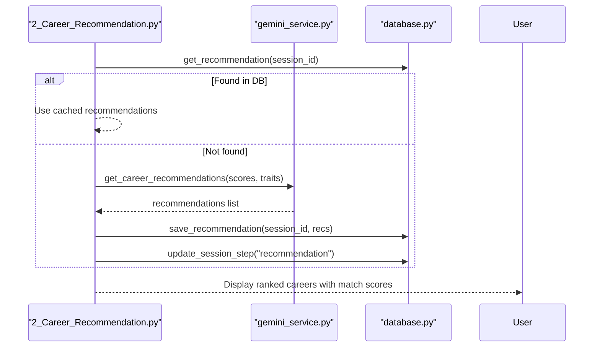
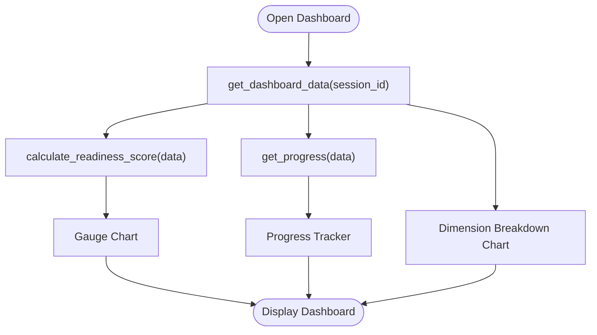
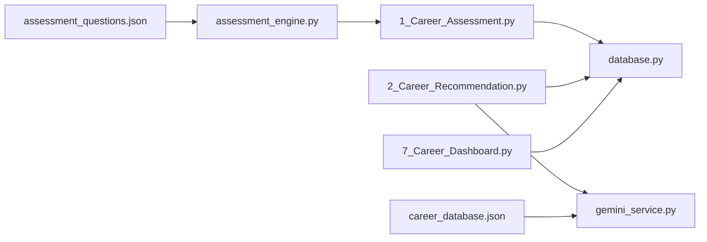

# Career Assessment System

<cite>
**Referenced Files in This Document**
- [app.py](file://mentorx-ai/app.py)
- [1_Career_Assessment.py](file://mentorx-ai/pages/1_Career_Assessment.py)
- [2_Career_Recommendation.py](file://mentorx-ai/pages/2_Career_Recommendation.py)
- [7_Career_Dashboard.py](file://mentorx-ai/pages/7_Career_Dashboard.py)
- [assessment_engine.py](file://mentorx-ai/src/assessment_engine.py)
- [database.py](file://mentorx-ai/src/database.py)
- [gemini_service.py](file://mentorx-ai/src/gemini_service.py)
- [assessment_questions.json](file://mentorx-ai/data/assessment_questions.json)
- [career_database.json](file://mentorx-ai/data/career_database.json)
- [requirements.txt](file://mentorx-ai/requirements.txt)
</cite>

## Table of Contents
1. [Introduction](#introduction)
2. [Project Structure](#project-structure)
3. [Core Components](#core-components)
4. [Architecture Overview](#architecture-overview)
5. [Detailed Component Analysis](#detailed-component-analysis)
6. [Dependency Analysis](#dependency-analysis)
7. [Performance Considerations](#performance-considerations)
8. [Troubleshooting Guide](#troubleshooting-guide)
9. [Conclusion](#conclusion)
10. [Appendices](#appendices)

## Introduction
This document explains the Career Assessment System that powers Mentor X-AI’s career coaching journey. It covers the 20-question assessment methodology across interests, work style preferences, skills evaluation, and career values; the multi-dimensional scoring system that produces personality traits and interest scores; question categorization and response validation; progress tracking; storage and sharing of results; and how assessment outputs feed into downstream features like career recommendations, skill gap analysis, learning roadmaps, resume review, mock interviews, and a readiness dashboard.

## Project Structure
The application is a Streamlit-based web app with:
- A landing page that initializes the database and session state
- A 20-question assessment page that collects responses and computes scores
- A recommendation page that uses AI to suggest careers based on assessment results
- A dashboard page that aggregates all data for a readiness overview
- An assessment engine that loads questions, computes dimension scores, and derives traits
- A SQLite-backed database layer for sessions, assessments, recommendations, and more
- A Gemini service module for AI-powered features
- Data files defining assessment questions and a career knowledge base

**Diagram sources**
- [app.py:1-166](file://mentorx-ai/app.py#L1-L166)
- [1_Career_Assessment.py:1-138](file://mentorx-ai/pages/1_Career_Assessment.py#L1-L138)
- [assessment_engine.py:1-144](file://mentorx-ai/src/assessment_engine.py#L1-L144)
- [database.py:1-362](file://mentorx-ai/src/database.py#L1-L362)
- [gemini_service.py:1-422](file://mentorx-ai/src/gemini_service.py#L1-L422)
- [assessment_questions.json:1-134](file://mentorx-ai/data/assessment_questions.json#L1-L134)
- [career_database.json:1-149](file://mentorx-ai/data/career_database.json#L1-L149)

**Section sources**
- [app.py:1-166](file://mentorx-ai/app.py#L1-L166)
- [1_Career_Assessment.py:1-138](file://mentorx-ai/pages/1_Career_Assessment.py#L1-L138)
- [assessment_engine.py:1-144](file://mentorx-ai/src/assessment_engine.py#L1-L144)
- [database.py:1-362](file://mentorx-ai/src/database.py#L1-L362)
- [gemini_service.py:1-422](file://mentorx-ai/src/gemini_service.py#L1-L422)
- [assessment_questions.json:1-134](file://mentorx-ai/data/assessment_questions.json#L1-L134)
- [career_database.json:1-149](file://mentorx-ai/data/career_database.json#L1-L149)

## Core Components
- Assessment UI (Streamlit page): Presents 20 questions grouped by category (interests, work style, skills, values), validates completion, tracks progress, and submits answers.
- Assessment Engine: Loads questions from JSON, computes per-dimension average scores (1–5 scale), and derives human-readable personality traits based on thresholds.
- Database Layer: Manages SQLite schema and CRUD operations for sessions, assessments, recommendations, skill analyses, roadmaps, resumes, interviews, and dashboard aggregation.
- Gemini Service: Centralized interface to Google Gemini for generating career recommendations, skill gap analysis, learning roadmaps, resume reviews, and interview flows.
- Data Assets: Assessment questions and a career database used to inform AI prompts and display contextual information.

Key responsibilities:
- Question categorization and mapping to dimensions
- Response validation and progress tracking
- Multi-dimensional scoring and trait derivation
- Persistent storage and retrieval of assessment outcomes
- Integration with downstream AI-driven features

**Section sources**
- [1_Career_Assessment.py:1-138](file://mentorx-ai/pages/1_Career_Assessment.py#L1-L138)
- [assessment_engine.py:1-144](file://mentorx-ai/src/assessment_engine.py#L1-L144)
- [database.py:1-362](file://mentorx-ai/src/database.py#L1-L362)
- [gemini_service.py:1-422](file://mentorx-ai/src/gemini_service.py#L1-L422)
- [assessment_questions.json:1-134](file://mentorx-ai/data/assessment_questions.json#L1-L134)

## Architecture Overview
The assessment flow begins at the landing page, which initializes the database and creates a user session. The assessment page loads questions, collects responses, computes scores and traits, persists them, and updates session progress. Subsequent pages consume these stored results to generate recommendations and other insights via the Gemini service.

**Diagram sources**
- [app.py:1-166](file://mentorx-ai/app.py#L1-L166)
- [1_Career_Assessment.py:1-138](file://mentorx-ai/pages/1_Career_Assessment.py#L1-L138)
- [assessment_engine.py:1-144](file://mentorx-ai/src/assessment_engine.py#L1-L144)
- [database.py:1-362](file://mentorx-ai/src/database.py#L1-L362)
- [2_Career_Recommendation.py:1-140](file://mentorx-ai/pages/2_Career_Recommendation.py#L1-L140)
- [gemini_service.py:1-422](file://mentorx-ai/src/gemini_service.py#L1-L422)

## Detailed Component Analysis

### Assessment Questions and Categorization
- The assessment contains 20 questions distributed across four categories:
  - Interests: technical, creative, social, analytical, entrepreneurial
  - Work Style: teamwork, flexibility, communication, leadership (and one additional item)
  - Skills: problem solving, communication, creativity, technical ability, analytical thinking
  - Values: salary, work-life balance, impact, growth, stability
- Each question maps to a specific dimension used for scoring. Some dimensions appear in multiple categories to capture both interest and self-rated skill or value emphasis.

Example question references:
- Interest example: “I enjoy solving technical problems using code and software tools.”
- Work style example: “I prefer working in teams rather than working alone.”
- Skill example: “I enjoy finding creative solutions to challenges that others find difficult.”
- Value example: “Having a healthy work-life balance is more important than rapid career growth.”

These examples are defined in the assessment questions file.

**Section sources**
- [assessment_questions.json:1-134](file://mentorx-ai/data/assessment_questions.json#L1-L134)

### Scoring Algorithm and Trait Derivation
- compute_scores:
  - Groups answers by dimension
  - Computes average score per dimension over 1–5 scale
  - Returns rounded averages per dimension
- derive_traits:
  - Applies threshold rules to map dimension scores to personality/career traits
  - Examples:
    - Technical >= 3.5 → Tech-Oriented
    - Creative >= 3.5 → Creative Thinker
    - Social >= 3.5 → People-Focused
    - Analytical >= 3.5 → Analytical Mind
    - Entrepreneurial >= 3.5 → Entrepreneurial Spirit
    - Teamwork >= 4.0 → Team Player; <= 2.0 → Independent Worker
    - Flexibility >= 4.0 → Adaptable
    - Leadership >= 4.0 → Natural Leader
    - Problem Solving >= 4.0 → Strong Problem Solver
    - Communication >= 4.0 → Effective Communicator
    - Growth >= 4.0 → Growth-Driven
    - Impact >= 4.0 → Impact-Oriented
  - Fallback: Versatile if no traits qualify

**Diagram sources**
- [assessment_engine.py:44-81](file://mentorx-ai/src/assessment_engine.py#L44-L81)
- [assessment_engine.py:84-130](file://mentorx-ai/src/assessment_engine.py#L84-L130)

**Section sources**
- [assessment_engine.py:44-81](file://mentorx-ai/src/assessment_engine.py#L44-L81)
- [assessment_engine.py:84-130](file://mentorx-ai/src/assessment_engine.py#L84-L130)

### Assessment UI, Validation, and Progress Tracking
- Displays questions grouped by category with labeled headers
- Uses radio buttons for 1–5 scale responses
- Tracks answered count vs total and shows a progress bar
- Validates that all questions are answered before submission
- On submit:
  - Computes scores and traits
  - Persists results to the database
  - Updates session step to “assessment”
  - Stores scores and traits in session state for downstream pages
  - Shows results summary on the same page

**Diagram sources**
- [1_Career_Assessment.py:31-113](file://mentorx-ai/pages/1_Career_Assessment.py#L31-L113)
- [assessment_engine.py:133-144](file://mentorx-ai/src/assessment_engine.py#L133-L144)
- [database.py:152-183](file://mentorx-ai/src/database.py#L152-L183)

**Section sources**
- [1_Career_Assessment.py:31-113](file://mentorx-ai/pages/1_Career_Assessment.py#L31-L113)

### Storage and Sharing of Assessment Results
- Database schema includes:
  - sessions: tracks user_name and current_step
  - assessments: stores answers, interest_scores, personality_traits, completed_at
  - recommendations: stores recommended_careers and raw_response
  - Additional tables for skill_analyses, roadmaps, resumes, interviews
- Functions:
  - save_assessment: persists latest assessment per session
  - get_assessment: retrieves most recent assessment and deserializes JSON fields
  - update_session_step: advances workflow stage
- Session state:
  - interest_scores and personality_traits are kept in memory for immediate use across pages
  - Recommendations are cached in session state after generation and also persisted

**Diagram sources**
- [database.py:21-106](file://mentorx-ai/src/database.py#L21-L106)

**Section sources**
- [database.py:21-106](file://mentorx-ai/src/database.py#L21-L106)
- [database.py:152-183](file://mentorx-ai/src/database.py#L152-L183)
- [database.py:190-213](file://mentorx-ai/src/database.py#L190-L213)

### How Results Feed Into Career Recommendation
- The recommendation page checks that assessment is complete
- Retrieves saved recommendations from DB if available; otherwise calls Gemini to generate new ones
- Sends interest_scores and personality_traits to Gemini
- Parses structured JSON output containing top career matches with match_score, reasoning, salary_range, growth_outlook, key_skills
- Saves recommendations to DB and updates session step
- Allows user to select a target career to proceed to skill gap analysis and roadmap

**Diagram sources**
- [2_Career_Recommendation.py:27-69](file://mentorx-ai/pages/2_Career_Recommendation.py#L27-L69)
- [gemini_service.py:66-103](file://mentorx-ai/src/gemini_service.py#L66-L103)
- [database.py:190-213](file://mentorx-ai/src/database.py#L190-L213)

**Section sources**
- [2_Career_Recommendation.py:27-69](file://mentorx-ai/pages/2_Career_Recommendation.py#L27-L69)
- [gemini_service.py:66-103](file://mentorx-ai/src/gemini_service.py#L66-L103)

### Dashboard Aggregation and Readiness Metrics
- The dashboard pulls together all data for a session:
  - session info, assessment, recommendation, skill analysis, roadmap, resume, interview
- Computes readiness score and progress status
- Visualizes:
  - Readiness gauge
  - Progress tracker
  - Quick stats (skill match, resume score, interview score)
  - Assessment dimension breakdown chart
  - Downloadable text report

**Diagram sources**
- [7_Career_Dashboard.py:36-47](file://mentorx-ai/pages/7_Career_Dashboard.py#L36-L47)
- [database.py:351-362](file://mentorx-ai/src/database.py#L351-L362)

**Section sources**
- [7_Career_Dashboard.py:36-47](file://mentorx-ai/pages/7_Career_Dashboard.py#L36-L47)
- [database.py:351-362](file://mentorx-ai/src/database.py#L351-L362)

## Dependency Analysis
- Pages depend on:
  - assessment_engine for scoring and traits
  - database for persistence and session management
  - gemini_service for AI features
- Data dependencies:
  - assessment_questions.json defines the 20 questions and their mappings
  - career_database.json provides career metadata used by prompts and displays
- External dependencies:
  - Streamlit for UI
  - Google Generative AI for LLM interactions
  - Pandas and Plotly for data visualization
  - python-dotenv for environment configuration

**Diagram sources**
- [assessment_questions.json:1-134](file://mentorx-ai/data/assessment_questions.json#L1-L134)
- [assessment_engine.py:1-144](file://mentorx-ai/src/assessment_engine.py#L1-L144)
- [1_Career_Assessment.py:1-138](file://mentorx-ai/pages/1_Career_Assessment.py#L1-L138)
- [database.py:1-362](file://mentorx-ai/src/database.py#L1-L362)
- [2_Career_Recommendation.py:1-140](file://mentorx-ai/pages/2_Career_Recommendation.py#L1-L140)
- [gemini_service.py:1-422](file://mentorx-ai/src/gemini_service.py#L1-L422)
- [career_database.json:1-149](file://mentorx-ai/data/career_database.json#L1-L149)

**Section sources**
- [requirements.txt:1-6](file://mentorx-ai/requirements.txt#L1-L6)
- [assessment_questions.json:1-134](file://mentorx-ai/data/assessment_questions.json#L1-L134)
- [career_database.json:1-149](file://mentorx-ai/data/career_database.json#L1-L149)

## Performance Considerations
- Local SQLite storage ensures fast read/write for small datasets typical of single-user sessions
- JSON serialization/deserialization is lightweight but should be minimized where possible
- Gemini API calls can be latency-sensitive; caching recommendations in session state and DB reduces redundant calls
- Visualization libraries (Plotly, Pandas) are efficient for moderate-sized dashboards
- Avoid recomputing scores by reusing session state when possible

[No sources needed since this section provides general guidance]

## Troubleshooting Guide
- Missing or invalid API key:
  - If GOOGLE_API_KEY is not set, Gemini calls will raise an error; ensure .env is configured
- No assessment completed:
  - Recommendation page guards against missing assessment; complete Step 1 first
- Incomplete answers:
  - Submission requires all 20 questions; progress indicator helps identify missing items
- Database initialization:
  - Ensure init_db runs on startup to create required tables
- Session state issues:
  - Verify session_id exists and assessment_done flag is set after submission

**Section sources**
- [gemini_service.py:19-39](file://mentorx-ai/src/gemini_service.py#L19-L39)
- [2_Career_Recommendation.py:21-30](file://mentorx-ai/pages/2_Career_Recommendation.py#L21-L30)
- [1_Career_Assessment.py:82-113](file://mentorx-ai/pages/1_Career_Assessment.py#L82-L113)
- [app.py:26-32](file://mentorx-ai/app.py#L26-L32)

## Conclusion
The Career Assessment System provides a robust foundation for personalized career coaching. It captures a comprehensive profile through a well-structured 20-question assessment, computes meaningful multi-dimensional scores, and translates those into actionable personality traits. These outputs drive AI-powered recommendations and subsequent steps in the coaching journey, all while persisting data for continuity and enabling a unified dashboard view. The modular design separates concerns between UI, scoring logic, storage, and AI services, making it maintainable and extensible.

[No sources needed since this section summarizes without analyzing specific files]

## Appendices

### Example Assessment Questions by Category
- Interests:
  - “I enjoy solving technical problems using code and software tools.”
  - “I enjoy creating visual designs, graphics, or creative content.”
  - “I find it fulfilling to help others learn and grow.”
  - “I enjoy analysing data, finding patterns, and drawing insights.”
  - “I am drawn to building businesses and exploring new ventures.”
- Work Style:
  - “I prefer working in teams rather than working alone.”
  - “I thrive in dynamic environments where priorities change frequently.”
  - “I would prefer a remote or hybrid work setup over a traditional office.”
  - “I enjoy presenting ideas and communicating with diverse audiences.”
  - “I naturally take charge and guide others towards a common goal.”
- Skills:
  - “I am good at breaking down complex problems into smaller, manageable parts.”
  - “I can explain technical or complex concepts clearly to non-experts.”
  - “I enjoy finding creative solutions to challenges that others find difficult.”
  - “I often think of innovative approaches that others have not considered.”
  - “I am comfortable learning and using new software, tools, and technologies.”
- Values:
  - “Financial compensation is the most important factor in my career choice.”
  - “Having a healthy work-life balance is more important than rapid career growth.”
  - “I want my work to make a meaningful difference in society.”
  - “I prioritise continuous learning and professional development opportunities.”
  - “I prefer a stable, predictable career over a high-risk, high-reward path.”

**Section sources**
- [assessment_questions.json:11-131](file://mentorx-ai/data/assessment_questions.json#L11-L131)

### Scoring and Trait Rules Summary
- Dimension averages computed per mapped question groupings
- Trait thresholds applied to produce readable labels
- Fallback trait ensures a positive profile even with balanced scores

**Section sources**
- [assessment_engine.py:52-81](file://mentorx-ai/src/assessment_engine.py#L52-L81)
- [assessment_engine.py:84-130](file://mentorx-ai/src/assessment_engine.py#L84-L130)

### Downstream Feature Integration
- Career recommendations:
  - Uses interest_scores and personality_traits to prompt Gemini
  - Outputs structured JSON with match_score, reasoning, salary_range, growth_outlook, key_skills
- Skill gap analysis and roadmaps:
  - Leverage target career and current skills to generate tailored learning plans
- Resume review and mock interviews:
  - Provide role-specific feedback and practice scenarios

**Section sources**
- [gemini_service.py:66-103](file://mentorx-ai/src/gemini_service.py#L66-L103)
- [gemini_service.py:110-147](file://mentorx-ai/src/gemini_service.py#L110-L147)
- [gemini_service.py:154-201](file://mentorx-ai/src/gemini_service.py#L154-L201)
- [gemini_service.py:208-285](file://mentorx-ai/src/gemini_service.py#L208-L285)
- [gemini_service.py:292-335](file://mentorx-ai/src/gemini_service.py#L292-L335)
- [gemini_service.py:342-371](file://mentorx-ai/src/gemini_service.py#L342-L371)
- [gemini_service.py:378-421](file://mentorx-ai/src/gemini_service.py#L378-L421)