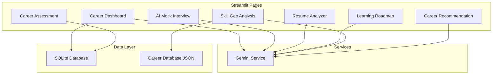
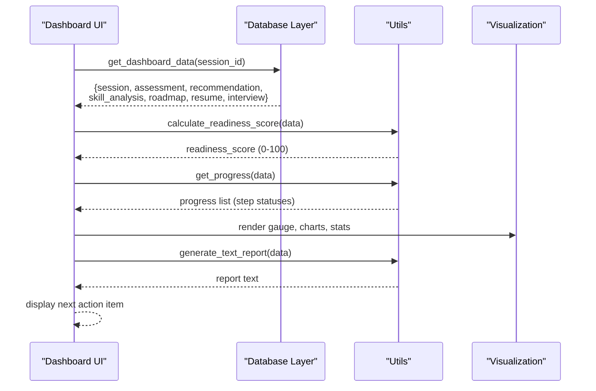
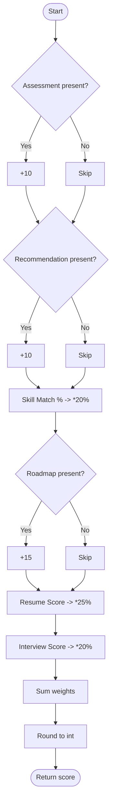
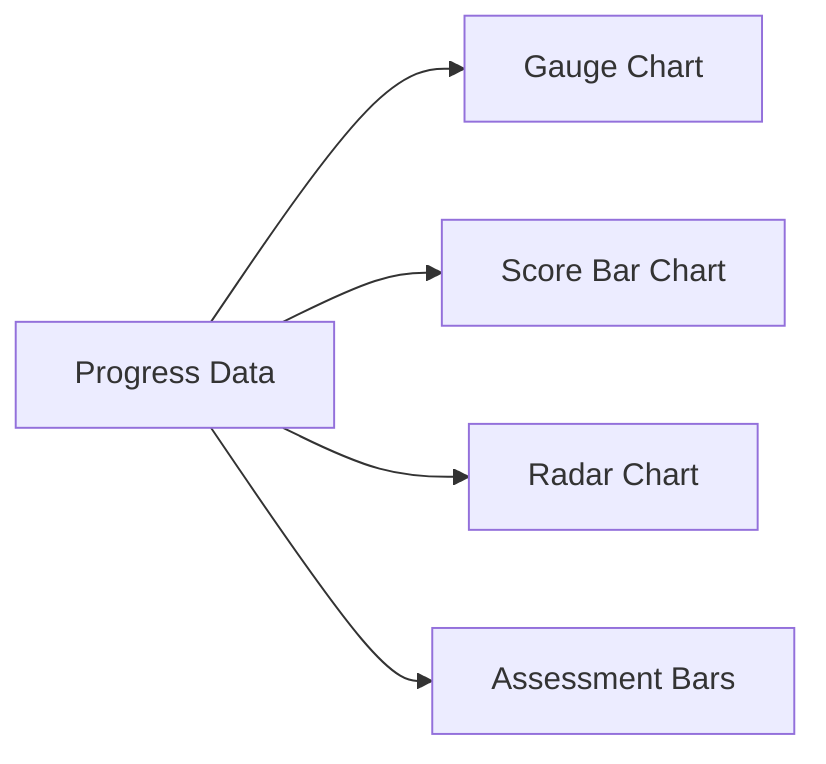
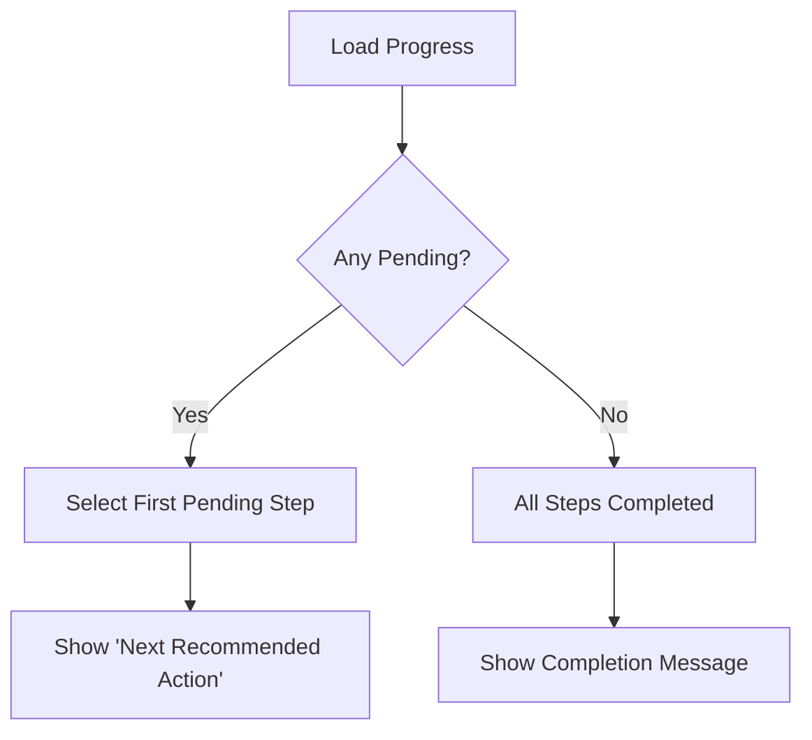
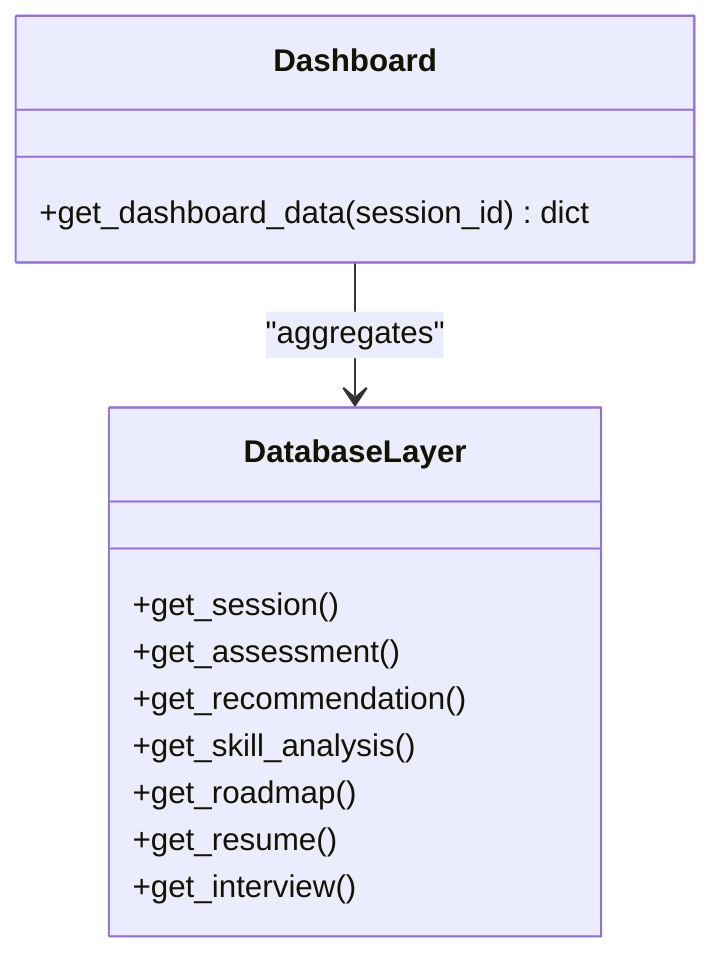
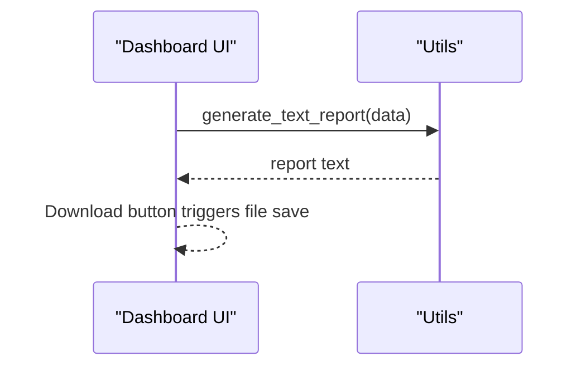
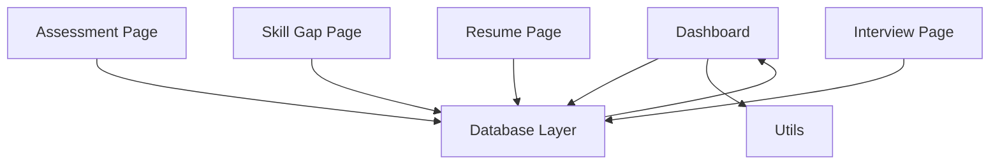
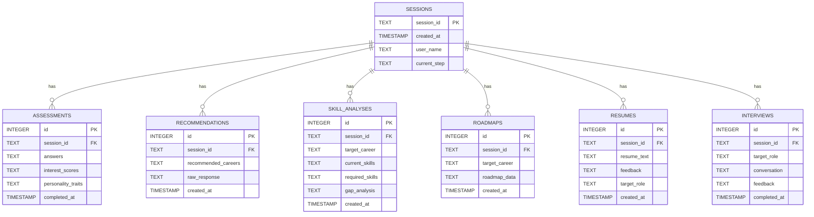

# Career Dashboard

<cite>
**Referenced Files in This Document**
- [7_Career_Dashboard.py](file://mentorx-ai/pages/7_Career_Dashboard.py)
- [utils.py](file://mentorx-ai/src/utils.py)
- [database.py](file://mentorx-ai/src/database.py)
- [app.py](file://mentorx-ai/app.py)
- [1_Career_Assessment.py](file://mentorx-ai/pages/1_Career_Assessment.py)
- [3_Skill_Gap_Analysis.py](file://mentorx-ai/pages/3_Skill_Gap_Analysis.py)
- [5_Resume_Analyzer.py](file://mentorx-ai/pages/5_Resume_Analyzer.py)
- [6_AI_Mock_Interview.py](file://mentorx-ai/pages/6_AI_Mock_Interview.py)
- [gemini_service.py](file://mentorx-ai/src/gemini_service.py)
- [career_database.json](file://mentorx-ai/data/career_database.json)
</cite>

## Table of Contents
1. [Introduction](#introduction)
2. [Project Structure](#project-structure)
3. [Core Components](#core-components)
4. [Architecture Overview](#architecture-overview)
5. [Detailed Component Analysis](#detailed-component-analysis)
6. [Dependency Analysis](#dependency-analysis)
7. [Performance Considerations](#performance-considerations)
8. [Troubleshooting Guide](#troubleshooting-guide)
9. [Conclusion](#conclusion)
10. [Appendices](#appendices)

## Introduction
The Career Dashboard is the central hub that aggregates results from all prior coaching steps and presents an overall readiness score, progress tracking, visual insights, and actionable next steps. It synthesizes data from assessment, career recommendation, skill gap analysis, learning roadmap, resume review, and mock interview modules to provide a comprehensive snapshot of a user’s career readiness and guidance for improvement.

## Project Structure
The dashboard is implemented as a Streamlit page that:
- Loads aggregated session data from the database layer
- Computes readiness scores and progress metrics using shared utilities
- Renders interactive charts and summary panels
- Exports a text report summarizing the entire journey

**Diagram sources**
- [7_Career_Dashboard.py:1-272](file://mentorx-ai/pages/7_Career_Dashboard.py#L1-L272)
- [database.py:1-362](file://mentorx-ai/src/database.py#L1-L362)
- [gemini_service.py:1-422](file://mentorx-ai/src/gemini_service.py#L1-L422)
- [career_database.json:1-149](file://mentorx-ai/data/career_database.json#L1-L149)

**Section sources**
- [app.py:1-166](file://mentorx-ai/app.py#L1-L166)
- [7_Career_Dashboard.py:1-272](file://mentorx-ai/pages/7_Career_Dashboard.py#L1-L272)

## Core Components
- Readiness Score Calculation: Weighted aggregation across completed steps and their quality scores (assessment completion, recommendation completion, skill match percentage, roadmap generation, resume score, interview score).
- Progress Tracking: Boolean completion status per step with icons and counts.
- Next Action Identification: Determines the first incomplete step to guide users toward improving readiness.
- Visualization: Gauge chart for readiness, bar charts for category scores, radar chart for skill proficiency vs required levels, horizontal bar chart for assessment dimensions.
- Report Generation: Plain-text summary exportable via download button.

**Section sources**
- [utils.py:66-144](file://mentorx-ai/src/utils.py#L66-L144)
- [7_Career_Dashboard.py:43-130](file://mentorx-ai/pages/7_Career_Dashboard.py#L43-L130)
- [utils.py:151-205](file://mentorx-ai/src/utils.py#L151-L205)

## Architecture Overview
The dashboard orchestrates data retrieval, computation, and visualization:

**Diagram sources**
- [7_Career_Dashboard.py:43-130](file://mentorx-ai/pages/7_Career_Dashboard.py#L43-L130)
- [utils.py:66-144](file://mentorx-ai/src/utils.py#L66-L144)
- [database.py:351-362](file://mentorx-ai/src/database.py#L351-L362)

## Detailed Component Analysis

### Readiness Score Calculation Methodology
- Weights:
  - Assessment completed: 10%
  - Recommendation done: 10%
  - Skill analysis: 20% weighted by overall_match_percentage
  - Roadmap generated: 15%
  - Resume score: 25% weighted by overall_score
  - Interview score: 20% weighted by overall_score
- The function sums weighted contributions and rounds to an integer 0–100.

**Diagram sources**
- [utils.py:70-118](file://mentorx-ai/src/utils.py#L70-L118)

**Section sources**
- [utils.py:66-118](file://mentorx-ai/src/utils.py#L66-L118)

### Progress Visualization Mechanisms
- Step completion is determined by presence of data keys for each step.
- Icons indicate completed/pending states; counts show total completed vs total steps.
- Visuals include:
  - Gauge indicator for readiness
  - Bar chart comparing Skill Match, Resume, and Interview scores
  - Horizontal bar chart for assessment dimension scores
  - Radar chart comparing user skill levels vs required levels

**Diagram sources**
- [7_Career_Dashboard.py:56-117](file://mentorx-ai/pages/7_Career_Dashboard.py#L56-L117)
- [7_Career_Dashboard.py:136-240](file://mentorx-ai/pages/7_Career_Dashboard.py#L136-L240)
- [utils.py:124-144](file://mentorx-ai/src/utils.py#L124-L144)

**Section sources**
- [7_Career_Dashboard.py:56-240](file://mentorx-ai/pages/7_Career_Dashboard.py#L56-L240)
- [utils.py:124-144](file://mentorx-ai/src/utils.py#L124-L144)

### Next Action Item Identification System
- Identifies pending steps by filtering progress list for incomplete items.
- Displays the first pending step as the recommended next action.
- If all steps are complete, shows a success message encouraging review and continued improvement.

**Diagram sources**
- [7_Career_Dashboard.py:122-131](file://mentorx-ai/pages/7_Career_Dashboard.py#L122-L131)
- [utils.py:124-144](file://mentorx-ai/src/utils.py#L124-L144)

**Section sources**
- [7_Career_Dashboard.py:122-131](file://mentorx-ai/pages/7_Career_Dashboard.py#L122-L131)

### Data Aggregation from Previous Steps
- The dashboard pulls together:
  - Session metadata
  - Assessment results (interest scores)
  - Career recommendations
  - Skill gap analysis (matched/gap skills and match percentage)
  - Learning roadmap
  - Resume feedback (overall score and details)
  - Interview feedback (overall score and breakdown)
- Aggregation is centralized in the database layer and consumed by the dashboard.

**Diagram sources**
- [database.py:351-362](file://mentorx-ai/src/database.py#L351-L362)

**Section sources**
- [database.py:351-362](file://mentorx-ai/src/database.py#L351-L362)
- [7_Career_Dashboard.py:43-47](file://mentorx-ai/pages/7_Career_Dashboard.py#L43-L47)

### Comprehensive Progress Reports and Export
- Generates a plain-text report including:
  - User and session info
  - Overall readiness score
  - Assessment dimension scores
  - Recommended careers and match percentages
  - Skill gap analysis summary
  - Resume and interview scores
- Users can download the report directly from the dashboard.

**Diagram sources**
- [utils.py:151-205](file://mentorx-ai/src/utils.py#L151-L205)
- [7_Career_Dashboard.py:246-256](file://mentorx-ai/pages/7_Career_Dashboard.py#L246-L256)

**Section sources**
- [utils.py:151-205](file://mentorx-ai/src/utils.py#L151-L205)
- [7_Career_Dashboard.py:246-256](file://mentorx-ai/pages/7_Career_Dashboard.py#L246-L256)

### Scoring Algorithms and Metrics
- Readiness score uses fixed weights and normalized inputs:
  - Binary flags for completion contribute fixed percentages
  - Percentages from skill match and scores from resume/interview are scaled by their respective weights
- Category metrics:
  - Skill Match: derived from skill gap analysis overall_match_percentage
  - Resume Score: overall_score from resume feedback
  - Interview Score: overall_score from interview summary

**Section sources**
- [utils.py:70-118](file://mentorx-ai/src/utils.py#L70-L118)
- [7_Career_Dashboard.py:92-113](file://mentorx-ai/pages/7_Career_Dashboard.py#L92-L113)

### Central Hub for Monitoring Effectiveness
- Provides a unified view of:
  - Overall readiness
  - Step-by-step progress
  - Quick stats for key areas
  - Visual comparisons and assessments
  - Actionable next steps
- Encourages iterative improvement by highlighting gaps and recommending actions.

**Section sources**
- [7_Career_Dashboard.py:53-131](file://mentorx-ai/pages/7_Career_Dashboard.py#L53-L131)

## Dependency Analysis
- Dashboard depends on:
  - Database layer for data retrieval and session updates
  - Utilities for scoring, progress, and reporting
  - Gemini service indirectly through earlier steps that populate data used by the dashboard
- Earlier pages persist results into the database, which the dashboard reads:
  - Assessment page saves assessment results and updates current step
  - Skill Gap Analysis page saves gap analysis and updates current step
  - Resume Analyzer page saves resume feedback and updates current step
  - AI Mock Interview page saves conversation and feedback and updates current step

**Diagram sources**
- [7_Career_Dashboard.py:14-22](file://mentorx-ai/pages/7_Career_Dashboard.py#L14-L22)
- [database.py:114-145](file://mentorx-ai/src/database.py#L114-L145)
- [1_Career_Assessment.py:98-113](file://mentorx-ai/pages/1_Career_Assessment.py#L98-L113)
- [3_Skill_Gap_Analysis.py:94-116](file://mentorx-ai/pages/3_Skill_Gap_Analysis.py#L94-L116)
- [5_Resume_Analyzer.py:84-104](file://mentorx-ai/pages/5_Resume_Analyzer.py#L84-L104)
- [6_AI_Mock_Interview.py:198-211](file://mentorx-ai/pages/6_AI_Mock_Interview.py#L198-L211)

**Section sources**
- [1_Career_Assessment.py:98-113](file://mentorx-ai/pages/1_Career_Assessment.py#L98-L113)
- [3_Skill_Gap_Analysis.py:94-116](file://mentorx-ai/pages/3_Skill_Gap_Analysis.py#L94-L116)
- [5_Resume_Analyzer.py:84-104](file://mentorx-ai/pages/5_Resume_Analyzer.py#L84-L104)
- [6_AI_Mock_Interview.py:198-211](file://mentorx-ai/pages/6_AI_Mock_Interview.py#L198-L211)
- [7_Career_Dashboard.py:43-47](file://mentorx-ai/pages/7_Career_Dashboard.py#L43-L47)

## Performance Considerations
- Data retrieval is lightweight SQLite queries; ensure indexes if dataset grows significantly.
- Visualization rendering uses Plotly; limit number of series (e.g., radar chart caps at top matched/gap skills) to maintain responsiveness.
- Avoid redundant API calls; rely on persisted data in the dashboard.
- Use session state efficiently to avoid re-computation during reruns.

[No sources needed since this section provides general guidance]

## Troubleshooting Guide
- Missing session: Ensure users start from the home page to create a session before accessing the dashboard.
- No data available: Verify that previous steps have been completed and saved to the database; check current_step updates.
- API key issues: If any prior steps fail due to missing or invalid Google API key, downstream dashboard metrics may be incomplete.
- Visualization anomalies: Confirm expected fields exist in aggregated data (e.g., interest_scores, gap_analysis, feedback structures).

**Section sources**
- [7_Career_Dashboard.py:30-32](file://mentorx-ai/pages/7_Career_Dashboard.py#L30-L32)
- [gemini_service.py:32-39](file://mentorx-ai/src/gemini_service.py#L32-L39)
- [database.py:137-145](file://mentorx-ai/src/database.py#L137-L145)

## Conclusion
The Career Dashboard consolidates multi-step coaching outcomes into a single, actionable overview. By computing a weighted readiness score, visualizing progress and performance, and identifying next steps, it serves as the central monitoring point for evaluating and advancing a user’s career development journey. Its design emphasizes clarity, measurability, and continuous improvement through targeted insights and downloadable reports.

[No sources needed since this section summarizes without analyzing specific files]

## Appendices

### Data Model Relationships

**Diagram sources**
- [database.py:21-104](file://mentorx-ai/src/database.py#L21-L104)