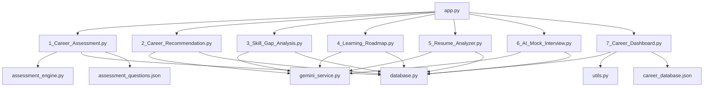
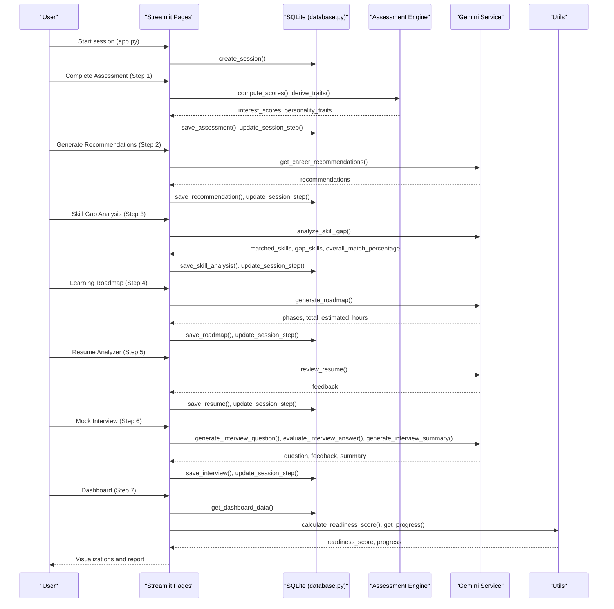
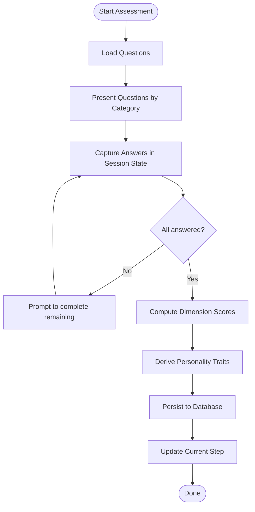
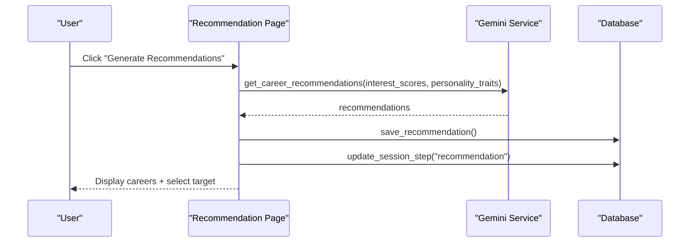
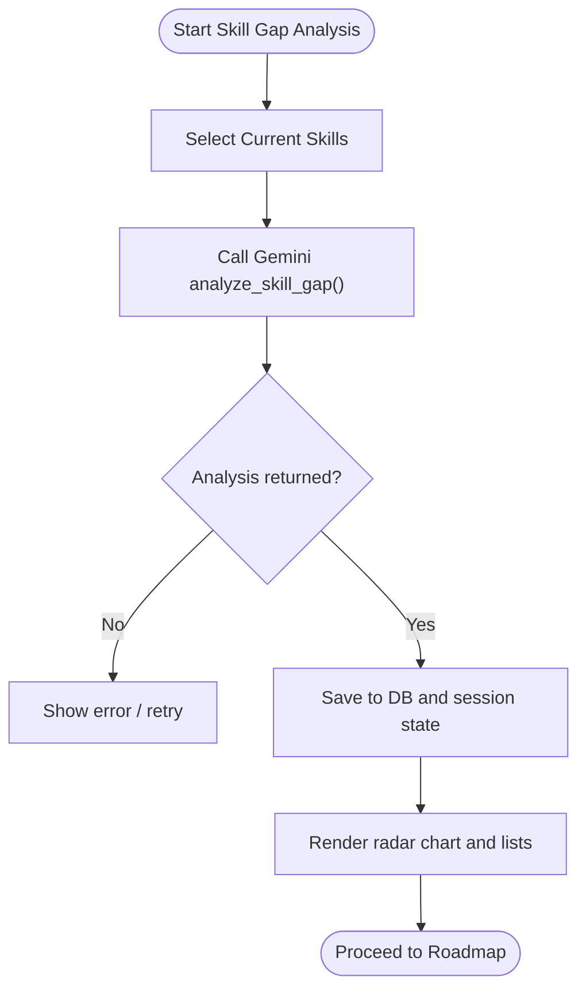
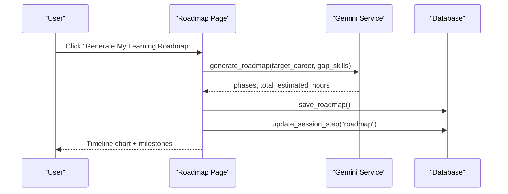
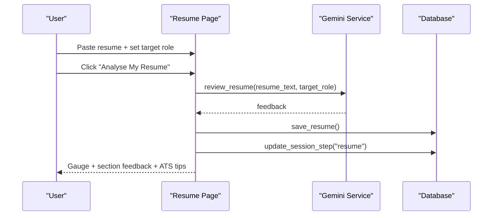
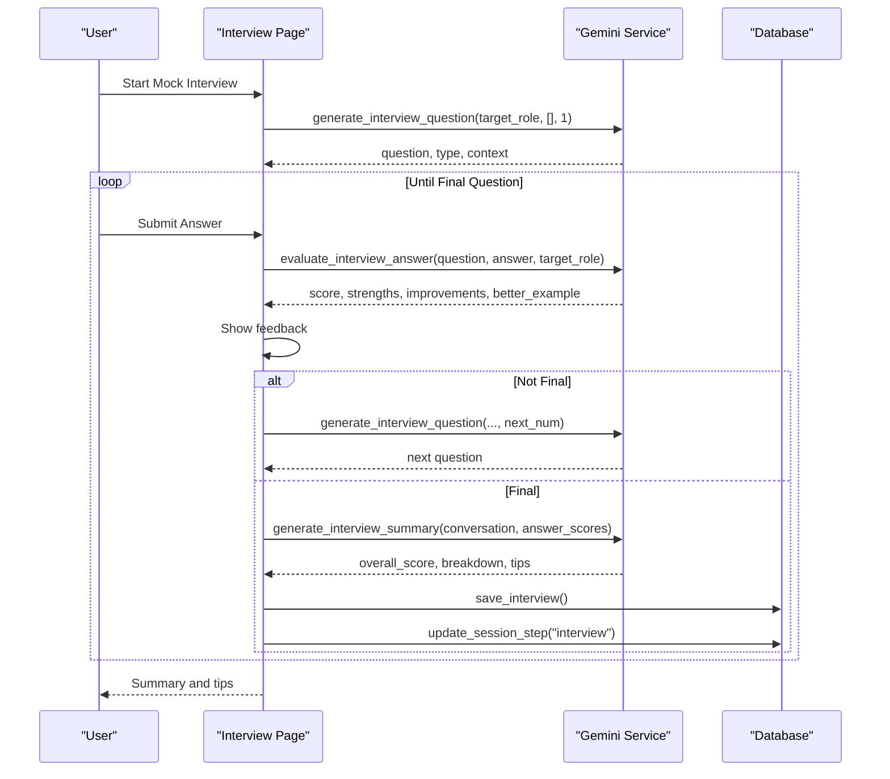
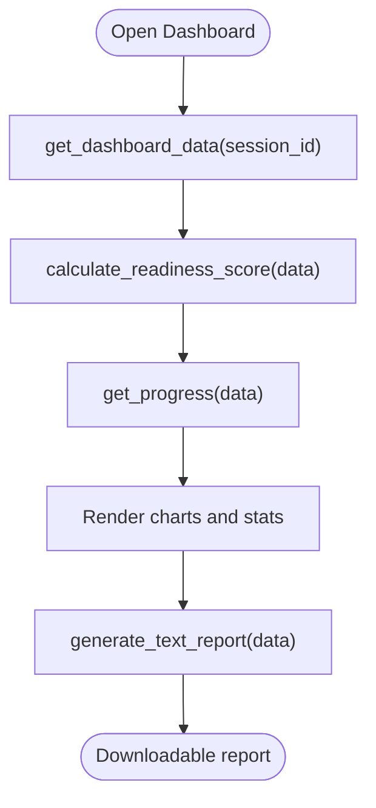

# Core Features

<cite>
**Referenced Files in This Document**
- [app.py](file://mentorx-ai/app.py)
- [1_Career_Assessment.py](file://mentorx-ai/pages/1_Career_Assessment.py)
- [2_Career_Recommendation.py](file://mentorx-ai/pages/2_Career_Recommendation.py)
- [3_Skill_Gap_Analysis.py](file://mentorx-ai/pages/3_Skill_Gap_Analysis.py)
- [4_Learning_Roadmap.py](file://mentorx-ai/pages/4_Learning_Roadmap.py)
- [5_Resume_Analyzer.py](file://mentorx-ai/pages/5_Resume_Analyzer.py)
- [6_AI_Mock_Interview.py](file://mentorx-ai/pages/6_AI_Mock_Interview.py)
- [7_Career_Dashboard.py](file://mentorx-ai/pages/7_Career_Dashboard.py)
- [assessment_engine.py](file://mentorx-ai/src/assessment_engine.py)
- [database.py](file://mentorx-ai/src/database.py)
- [gemini_service.py](file://mentorx-ai/src/gemini_service.py)
- [resume_parser.py](file://mentorx-ai/src/resume_parser.py)
- [utils.py](file://mentorx-ai/src/utils.py)
- [assessment_questions.json](file://mentorx-ai/data/assessment_questions.json)
- [career_database.json](file://mentorx-ai/data/career_database.json)
</cite>

## Table of Contents
1. Introduction
2. Project Structure
3. Core Components
4. Architecture Overview
5. Detailed Component Analysis
6. Dependency Analysis
7. Performance Considerations
8. Troubleshooting Guide
9. Conclusion

## Introduction
This document explains Mentor X-AI’s seven-step career coaching journey and how each feature builds on the previous one to create a cohesive, AI-enhanced experience. It covers user workflows, data sharing mechanisms, state persistence, interdependencies, and the assessment methodology, recommendation algorithms, skill gap analysis techniques, and interview simulation approaches used throughout the platform.

## Project Structure
Mentor X-AI is a Streamlit application with:
- A main entry point that initializes the database and manages session state
- Seven feature pages implementing the coaching steps
- Shared services for assessment scoring, Gemini-powered AI, and SQLite persistence
- Static data for assessment questions and career profiles
- Utilities for scoring, progress tracking, and report generation

**Diagram sources**
- [app.py:1-166](file://mentorx-ai/app.py#L1-L166)
- [1_Career_Assessment.py:1-138](file://mentorx-ai/pages/1_Career_Assessment.py#L1-L138)
- [2_Career_Recommendation.py:1-140](file://mentorx-ai/pages/2_Career_Recommendation.py#L1-L140)
- [3_Skill_Gap_Analysis.py:1-230](file://mentorx-ai/pages/3_Skill_Gap_Analysis.py#L1-L230)
- [4_Learning_Roadmap.py:1-198](file://mentorx-ai/pages/4_Learning_Roadmap.py#L1-L198)
- [5_Resume_Analyzer.py:1-191](file://mentorx-ai/pages/5_Resume_Analyzer.py#L1-L191)
- [6_AI_Mock_Interview.py:1-283](file://mentorx-ai/pages/6_AI_Mock_Interview.py#L1-L283)
- [7_Career_Dashboard.py:1-272](file://mentorx-ai/pages/7_Career_Dashboard.py#L1-L272)
- [assessment_engine.py:1-144](file://mentorx-ai/src/assessment_engine.py#L1-L144)
- [gemini_service.py:1-422](file://mentorx-ai/src/gemini_service.py#L1-L422)
- [database.py:1-362](file://mentorx-ai/src/database.py#L1-L362)
- [utils.py:1-205](file://mentorx-ai/src/utils.py#L1-L205)
- [assessment_questions.json:1-134](file://mentorx-ai/data/assessment_questions.json#L1-L134)
- [career_database.json:1-149](file://mentorx-ai/data/career_database.json#L1-L149)

**Section sources**
- [app.py:1-166](file://mentorx-ai/app.py#L1-L166)

## Core Components
- Session and navigation: The app creates a session, tracks current step, and guides users through the seven steps.
- Assessment engine: Loads questions, computes dimension scores, and derives personality traits.
- Gemini service: Centralized LLM calls for recommendations, skill gap analysis, roadmap generation, resume review, and mock interview question generation/evaluation/summary.
- Database layer: SQLite schema and CRUD operations for sessions, assessments, recommendations, skill analyses, roadmaps, resumes, interviews, and dashboard aggregation.
- Utilities: Readiness score calculation, progress tracking, and text report generation.
- Data assets: Assessment questions and career database.

Key responsibilities and interactions are detailed in subsequent sections.

**Section sources**
- [assessment_engine.py:1-144](file://mentorx-ai/src/assessment_engine.py#L1-L144)
- [gemini_service.py:1-422](file://mentorx-ai/src/gemini_service.py#L1-L422)
- [database.py:1-362](file://mentorx-ai/src/database.py#L1-L362)
- [utils.py:1-205](file://mentorx-ai/src/utils.py#L1-L205)
- [assessment_questions.json:1-134](file://mentorx-ai/data/assessment_questions.json#L1-L134)
- [career_database.json:1-149](file://mentorx-ai/data/career_database.json#L1-L149)

## Architecture Overview
The system follows a page-driven architecture where each step is a Streamlit page that reads/writes shared state and persists results via the database. AI capabilities are centralized in a single service module.

**Diagram sources**
- [app.py:1-166](file://mentorx-ai/app.py#L1-L166)
- [1_Career_Assessment.py:1-138](file://mentorx-ai/pages/1_Career_Assessment.py#L1-L138)
- [2_Career_Recommendation.py:1-140](file://mentorx-ai/pages/2_Career_Recommendation.py#L1-L140)
- [3_Skill_Gap_Analysis.py:1-230](file://mentorx-ai/pages/3_Skill_Gap_Analysis.py#L1-L230)
- [4_Learning_Roadmap.py:1-198](file://mentorx-ai/pages/4_Learning_Roadmap.py#L1-L198)
- [5_Resume_Analyzer.py:1-191](file://mentorx-ai/pages/5_Resume_Analyzer.py#L1-L191)
- [6_AI_Mock_Interview.py:1-283](file://mentorx-ai/pages/6_AI_Mock_Interview.py#L1-L283)
- [7_Career_Dashboard.py:1-272](file://mentorx-ai/pages/7_Career_Dashboard.py#L1-L272)
- [assessment_engine.py:1-144](file://mentorx-ai/src/assessment_engine.py#L1-L144)
- [gemini_service.py:1-422](file://mentorx-ai/src/gemini_service.py#L1-L422)
- [database.py:1-362](file://mentorx-ai/src/database.py#L1-L362)
- [utils.py:1-205](file://mentorx-ai/src/utils.py#L1-L205)

## Detailed Component Analysis

### Step 1: Career Assessment
- Purpose: Collect user responses across interests, work style, skills, and values; compute dimension scores and derive personality traits.
- Workflow:
  - Load questions from JSON and present grouped by category.
  - Store answers in session state; validate completion.
  - Compute scores and traits using the assessment engine.
  - Persist results and update session step.
- Data flow:
  - Input: answers mapping question IDs to scores.
  - Processing: average per dimension, trait derivation based on thresholds.
  - Output: interest_scores and personality_traits stored in DB and session state.
- Interdependencies: Feeds Step 2 (recommendations).

**Diagram sources**
- [1_Career_Assessment.py:1-138](file://mentorx-ai/pages/1_Career_Assessment.py#L1-L138)
- [assessment_engine.py:1-144](file://mentorx-ai/src/assessment_engine.py#L1-L144)
- [assessment_questions.json:1-134](file://mentorx-ai/data/assessment_questions.json#L1-L134)
- [database.py:152-183](file://mentorx-ai/src/database.py#L152-L183)

**Section sources**
- [1_Career_Assessment.py:1-138](file://mentorx-ai/pages/1_Career_Assessment.py#L1-L138)
- [assessment_engine.py:44-144](file://mentorx-ai/src/assessment_engine.py#L44-L144)
- [assessment_questions.json:1-134](file://mentorx-ai/data/assessment_questions.json#L1-L134)
- [database.py:152-183](file://mentorx-ai/src/database.py#L152-L183)

### Step 2: Career Recommendation
- Purpose: Generate top career matches tailored to the user’s profile.
- Workflow:
  - Guard requires completed assessment.
  - Call Gemini to produce recommendations with match scores, reasoning, salary ranges, growth outlook, and key skills.
  - Persist recommendations and update session step.
  - Allow user to select target career and propagate key skills to later steps.
- Data flow:
  - Input: interest_scores, personality_traits.
  - Processing: LLM-based matching and ranking.
  - Output: recommended_careers list saved to DB and session state.

**Diagram sources**
- [2_Career_Recommendation.py:1-140](file://mentorx-ai/pages/2_Career_Recommendation.py#L1-L140)
- [gemini_service.py:66-103](file://mentorx-ai/src/gemini_service.py#L66-L103)
- [database.py:190-213](file://mentorx-ai/src/database.py#L190-L213)

**Section sources**
- [2_Career_Recommendation.py:1-140](file://mentorx-ai/pages/2_Career_Recommendation.py#L1-L140)
- [gemini_service.py:66-103](file://mentorx-ai/src/gemini_service.py#L66-L103)
- [database.py:190-213](file://mentorx-ai/src/database.py#L190-L213)

### Step 3: Skill Gap Analysis
- Purpose: Compare user’s current skills against target role requirements and identify gaps.
- Workflow:
  - Guard requires selected career from Step 2.
  - Collect current skills (suggested + general + custom).
  - Call Gemini to analyze gaps and compute overall match percentage.
  - Persist analysis and update session step.
  - Visualize matched vs required skills via radar chart.
- Data flow:
  - Input: target_career, current_skills.
  - Processing: LLM-based gap identification and prioritization.
  - Output: matched_skills, gap_skills, overall_match_percentage stored in DB and session state.

**Diagram sources**
- [3_Skill_Gap_Analysis.py:1-230](file://mentorx-ai/pages/3_Skill_Gap_Analysis.py#L1-L230)
- [gemini_service.py:110-147](file://mentorx-ai/src/gemini_service.py#L110-L147)
- [database.py:220-250](file://mentorx-ai/src/database.py#L220-L250)

**Section sources**
- [3_Skill_Gap_Analysis.py:1-230](file://mentorx-ai/pages/3_Skill_Gap_Analysis.py#L1-L230)
- [gemini_service.py:110-147](file://mentorx-ai/src/gemini_service.py#L110-L147)
- [database.py:220-250](file://mentorx-ai/src/database.py#L220-L250)

### Step 4: Learning Roadmap
- Purpose: Generate a phased learning plan with milestones, resources, and time estimates.
- Workflow:
  - Guard requires completed Steps 1–3 and identified gap skills.
  - Call Gemini to produce phases and milestones tailored to target career and gaps.
  - Persist roadmap and update session step.
  - Visualize timeline and allow milestone tracking.
- Data flow:
  - Input: target_career, gap_skills.
  - Processing: LLM-based roadmap generation with free/paid resources.
  - Output: phases, total_estimated_hours stored in DB and session state.

**Diagram sources**
- [4_Learning_Roadmap.py:1-198](file://mentorx-ai/pages/4_Learning_Roadmap.py#L1-L198)
- [gemini_service.py:154-201](file://mentorx-ai/src/gemini_service.py#L154-L201)
- [database.py:257-279](file://mentorx-ai/src/database.py#L257-L279)

**Section sources**
- [4_Learning_Roadmap.py:1-198](file://mentorx-ai/pages/4_Learning_Roadmap.py#L1-L198)
- [gemini_service.py:154-201](file://mentorx-ai/src/gemini_service.py#L154-L201)
- [database.py:257-279](file://mentorx-ai/src/database.py#L257-L279)

### Step 5: Resume Analyzer
- Purpose: Evaluate resume content against a target role and provide actionable feedback.
- Workflow:
  - Auto-fill target role from Step 2 if available.
  - Accept resume text input.
  - Call Gemini to review and return structured feedback including section scores, strengths, improvements, ATS tips.
  - Persist feedback and update session step.
  - Visualize overall score and section-by-section feedback.
- Data flow:
  - Input: resume_text, target_role.
  - Processing: LLM-based evaluation and scoring.
  - Output: feedback object stored in DB and session state.

**Diagram sources**
- [5_Resume_Analyzer.py:1-191](file://mentorx-ai/pages/5_Resume_Analyzer.py#L1-L191)
- [gemini_service.py:208-285](file://mentorx-ai/src/gemini_service.py#L208-L285)
- [database.py:286-308](file://mentorx-ai/src/database.py#L286-L308)

**Section sources**
- [5_Resume_Analyzer.py:1-191](file://mentorx-ai/pages/5_Resume_Analyzer.py#L1-L191)
- [gemini_service.py:208-285](file://mentorx-ai/src/gemini_service.py#L208-L285)
- [database.py:286-308](file://mentorx-ai/src/database.py#L286-L308)

### Step 6: AI Mock Interview
- Purpose: Conduct a chat-based mock interview with real-time feedback and final summary.
- Workflow:
  - Guard requires completed Steps 1–2.
  - Initialize conversation state and generate first question.
  - For each answer: evaluate with Gemini, show immediate feedback, then generate next question or finalize.
  - After final question: generate summary, persist conversation and feedback, update session step.
  - Display overall score, breakdown, and improvement tips.
- Data flow:
  - Input: target_role, conversation history.
  - Processing: LLM-based question generation, answer evaluation, and summary synthesis.
  - Output: conversation and feedback stored in DB and session state.

**Diagram sources**
- [6_AI_Mock_Interview.py:1-283](file://mentorx-ai/pages/6_AI_Mock_Interview.py#L1-L283)
- [gemini_service.py:292-421](file://mentorx-ai/src/gemini_service.py#L292-L421)
- [database.py:315-344](file://mentorx-ai/src/database.py#L315-L344)

**Section sources**
- [6_AI_Mock_Interview.py:1-283](file://mentorx-ai/pages/6_AI_Mock_Interview.py#L1-L283)
- [gemini_service.py:292-421](file://mentorx-ai/src/gemini_service.py#L292-L421)
- [database.py:315-344](file://mentorx-ai/src/database.py#L315-L344)

### Step 7: Career Dashboard
- Purpose: Aggregate all prior steps into a readiness overview with visualizations and downloadable report.
- Workflow:
  - Fetch aggregated data from DB.
  - Calculate readiness score using weighted contributions from each step.
  - Render progress tracker, quick stats, radar charts, bar charts, and assessment breakdown.
  - Provide next recommended action and downloadable text report.
- Data flow:
  - Input: session_id.
  - Processing: DB aggregation and utility calculations.
  - Output: readiness_score, progress, charts, report.

**Diagram sources**
- [7_Career_Dashboard.py:1-272](file://mentorx-ai/pages/7_Career_Dashboard.py#L1-L272)
- [database.py:351-362](file://mentorx-ai/src/database.py#L351-L362)
- [utils.py:70-117](file://mentorx-ai/src/utils.py#L70-L117)
- [utils.py:134-144](file://mentorx-ai/src/utils.py#L134-L144)
- [utils.py:151-205](file://mentorx-ai/src/utils.py#L151-L205)

**Section sources**
- [7_Career_Dashboard.py:1-272](file://mentorx-ai/pages/7_Career_Dashboard.py#L1-L272)
- [database.py:351-362](file://mentorx-ai/src/database.py#L351-L362)
- [utils.py:70-117](file://mentorx-ai/src/utils.py#L70-L117)
- [utils.py:134-144](file://mentorx-ai/src/utils.py#L134-L144)
- [utils.py:151-205](file://mentorx-ai/src/utils.py#L151-L205)

## Dependency Analysis
- Feature interdependencies:
  - Step 2 depends on Step 1 outputs (interest_scores, personality_traits).
  - Step 3 depends on Step 2 selection (target_career, key_skills).
  - Step 4 depends on Step 3 gaps (gap_skills).
  - Step 5 uses target role from Step 2.
  - Step 6 uses target role from Step 2.
  - Step 7 aggregates all prior steps.
- Data sharing:
  - In-memory session state carries intermediate results between pages within a Streamlit session.
  - Persistent storage via SQLite ensures cross-page continuity and dashboard aggregation.
- External dependencies:
  - Google Gemini API for AI features; errors handled with safe fallbacks.
  - Plotly for visualizations; pandas for tabular processing in dashboard.

```mermaid
graph LR
S1["Step 1: Assessment"] --> S2["Step 2: Recommendations"]
S2 --> S3["Step 3: Skill Gap"]
S3 --> S4["Step 4: Roadmap"]
S2 --> S5["Step 5: Resume"]
S2 --> S6["Step 6: Interview"]
S1 --> S7["Step 7: Dashboard"]
S2 --> S7
S3 --> S7
S4 --> S7
S5 --> S7
S6 --> S7
```

**Diagram sources**
- [1_Career_Assessment.py:1-138](file://mentorx-ai/pages/1_Career_Assessment.py#L1-L138)
- [2_Career_Recommendation.py:1-140](file://mentorx-ai/pages/2_Career_Recommendation.py#L1-L140)
- [3_Skill_Gap_Analysis.py:1-230](file://mentorx-ai/pages/3_Skill_Gap_Analysis.py#L1-L230)
- [4_Learning_Roadmap.py:1-198](file://mentorx-ai/pages/4_Learning_Roadmap.py#L1-L198)
- [5_Resume_Analyzer.py:1-191](file://mentorx-ai/pages/5_Resume_Analyzer.py#L1-L191)
- [6_AI_Mock_Interview.py:1-283](file://mentorx-ai/pages/6_AI_Mock_Interview.py#L1-L283)
- [7_Career_Dashboard.py:1-272](file://mentorx-ai/pages/7_Career_Dashboard.py#L1-L272)

**Section sources**
- [database.py:1-362](file://mentorx-ai/src/database.py#L1-L362)
- [gemini_service.py:1-422](file://mentorx-ai/src/gemini_service.py#L1-L422)

## Performance Considerations
- Minimize redundant LLM calls by caching results in session state and persisting to DB; pages check DB before regenerating.
- Use lightweight local computations (e.g., radar charts, readiness score) to reduce server load.
- Batch UI updates with reruns only when necessary to avoid excessive re-execution.
- Ensure efficient queries by fetching latest records per session and limiting result sets for charts.

[No sources needed since this section provides general guidance]

## Troubleshooting Guide
- Missing API key: If GOOGLE_API_KEY is not configured, Gemini calls raise an error; ensure environment configuration and retry.
- Empty or invalid responses: Pages handle empty results with user-friendly messages and prompts to retry.
- Session issues: If session_id is missing, pages guard and prompt users to start from the home page.
- Database initialization: The app initializes the database on first run; verify tables exist if data appears missing.

**Section sources**
- [gemini_service.py:32-59](file://mentorx-ai/src/gemini_service.py#L32-L59)
- [2_Career_Recommendation.py:21-30](file://mentorx-ai/pages/2_Career_Recommendation.py#L21-L30)
- [3_Skill_Gap_Analysis.py:22-30](file://mentorx-ai/pages/3_Skill_Gap_Analysis.py#L22-L30)
- [4_Learning_Roadmap.py:22-30](file://mentorx-ai/pages/4_Learning_Roadmap.py#L22-L30)
- [5_Resume_Analyzer.py:22-28](file://mentorx-ai/pages/5_Resume_Analyzer.py#L22-L28)
- [6_AI_Mock_Interview.py:25-33](file://mentorx-ai/pages/6_AI_Mock_Interview.py#L25-L33)
- [7_Career_Dashboard.py:30-33](file://mentorx-ai/pages/7_Career_Dashboard.py#L30-L33)
- [app.py:27-32](file://mentorx-ai/app.py#L27-L32)

## Conclusion
Mentor X-AI delivers a structured, AI-powered career coaching journey across seven steps. Each step builds upon prior outputs, ensuring coherent progression from self-assessment to interview readiness. The centralized Gemini service powers personalized recommendations, skill gap analysis, learning roadmaps, resume reviews, and mock interviews. SQLite persistence and session state maintain continuity, while the dashboard consolidates insights and progress. Together, these components create a comprehensive, scalable platform for career development.

[No sources needed since this section summarizes without analyzing specific files]