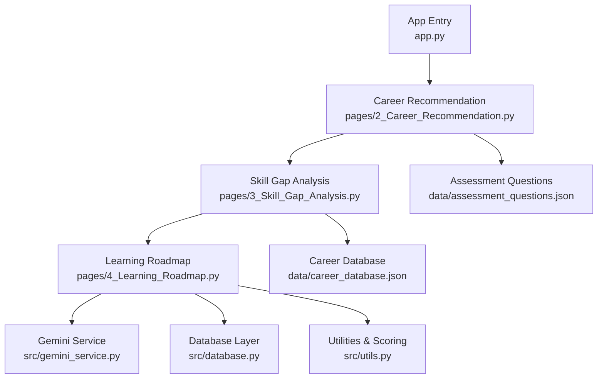
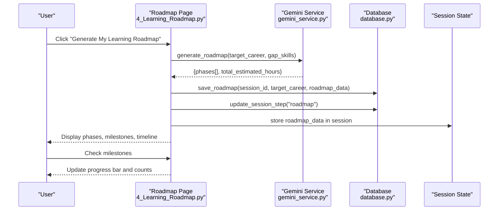
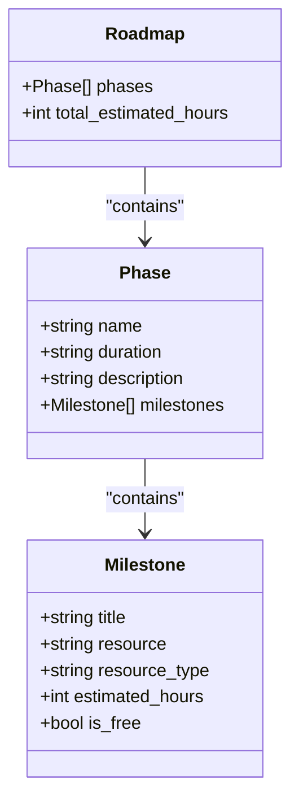
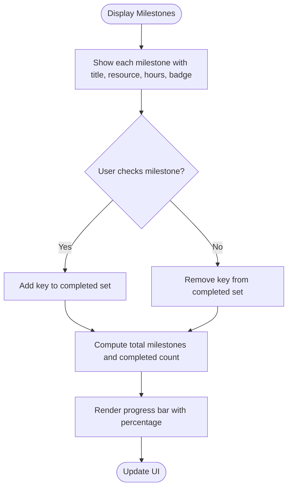
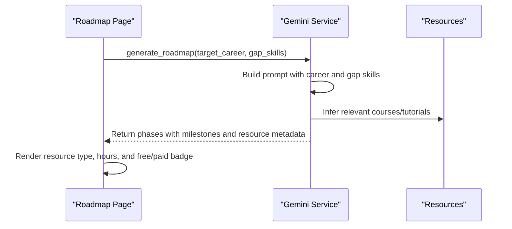
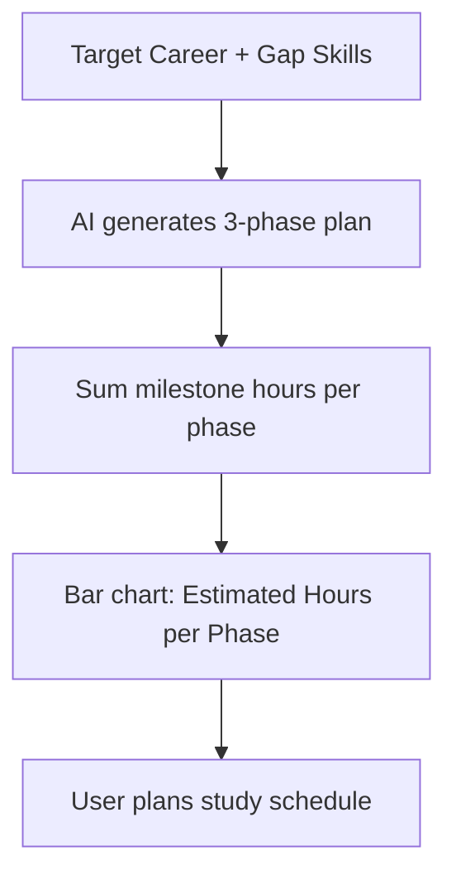
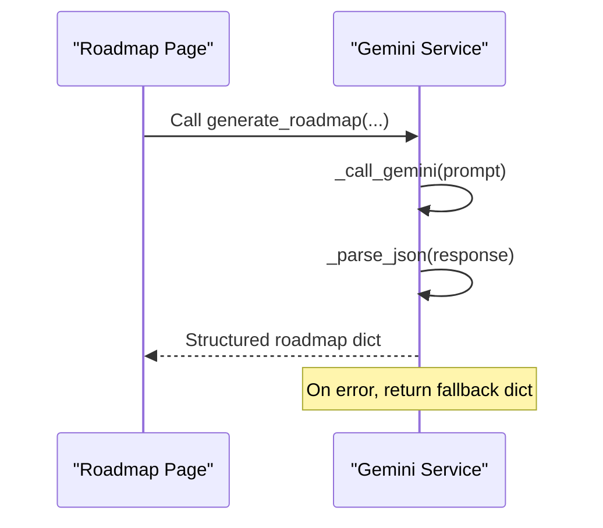
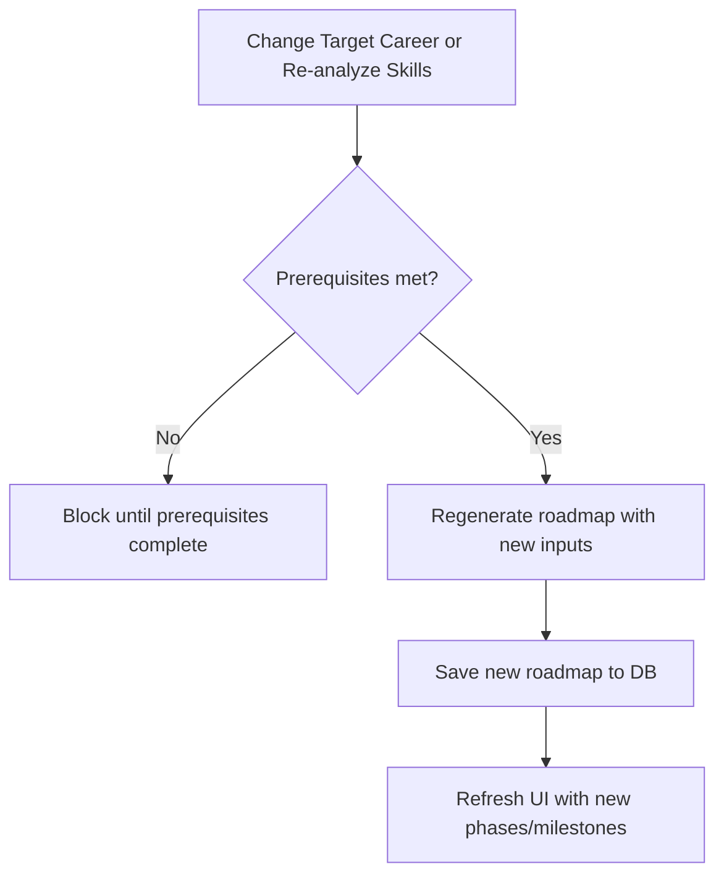
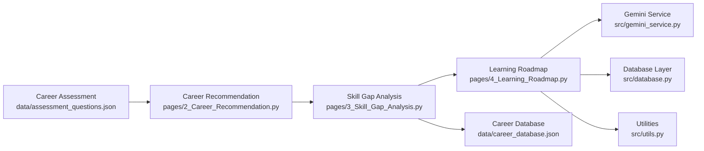
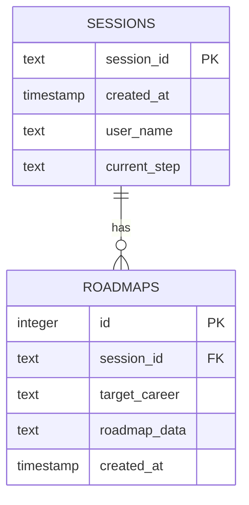

# Learning Roadmap Generator

<cite>
**Referenced Files in This Document**
- [4_Learning_Roadmap.py](file://mentorx-ai/pages/4_Learning_Roadmap.py)
- [gemini_service.py](file://mentorx-ai/src/gemini_service.py)
- [database.py](file://mentorx-ai/src/database.py)
- [utils.py](file://mentorx-ai/src/utils.py)
- [career_database.json](file://mentorx-ai/data/career_database.json)
- [assessment_questions.json](file://mentorx-ai/data/assessment_questions.json)
- [app.py](file://mentorx-ai/app.py)
- [3_Skill_Gap_Analysis.py](file://mentorx-ai/pages/3_Skill_Gap_Analysis.py)
- [2_Career_Recommendation.py](file://mentorx-ai/pages/2_Career_Recommendation.py)
</cite>

## Table of Contents
1. [Introduction](#introduction)
2. [Project Structure](#project-structure)
3. [Core Components](#core-components)
4. [Architecture Overview](#architecture-overview)
5. [Detailed Component Analysis](#detailed-component-analysis)
6. [Dependency Analysis](#dependency-analysis)
7. [Performance Considerations](#performance-considerations)
8. [Troubleshooting Guide](#troubleshooting-guide)
9. [Conclusion](#conclusion)
10. [Appendices](#appendices)

## Introduction
This document explains the Learning Roadmap Generator that creates phased learning plans based on skill gap analysis results. It details the three-phase learning structure, milestone definition and tracking system, and resource recommendation engine. It also describes how personalized learning paths are generated with estimated time commitments, free and paid resource suggestions, and progress monitoring capabilities. Finally, it documents AI-powered content generation, milestone completion tracking, and how roadmaps adapt as users progress or change career goals.

## Project Structure
The Learning Roadmap feature is part of a multi-step career coaching application built with Streamlit. The roadmap page consumes outputs from earlier steps (Career Assessment, Career Recommendation, Skill Gap Analysis), generates a structured plan via an AI service, persists results to a local database, and provides interactive milestone tracking.

**Diagram sources**
- [app.py:1-166](file://mentorx-ai/app.py#L1-L166)
- [2_Career_Recommendation.py:1-140](file://mentorx-ai/pages/2_Career_Recommendation.py#L1-L140)
- [3_Skill_Gap_Analysis.py:1-230](file://mentorx-ai/pages/3_Skill_Gap_Analysis.py#L1-L230)
- [4_Learning_Roadmap.py:1-198](file://mentorx-ai/pages/4_Learning_Roadmap.py#L1-L198)
- [gemini_service.py:1-422](file://mentorx-ai/src/gemini_service.py#L1-L422)
- [database.py:1-362](file://mentorx-ai/src/database.py#L1-L362)
- [utils.py:1-205](file://mentorx-ai/src/utils.py#L1-L205)
- [career_database.json:1-149](file://mentorx-ai/data/career_database.json#L1-L149)
- [assessment_questions.json:1-134](file://mentorx-ai/data/assessment_questions.json#L1-L134)

**Section sources**
- [app.py:1-166](file://mentorx-ai/app.py#L1-L166)
- [4_Learning_Roadmap.py:1-198](file://mentorx-ai/pages/4_Learning_Roadmap.py#L1-L198)

## Core Components
- Learning Roadmap Page: Orchestrates user input validation, triggers AI-based roadmap generation, displays phases and milestones, and tracks progress.
- Gemini Service: Centralized LLM integration for generating structured JSON responses including the three-phase roadmap with milestones and resource recommendations.
- Database Layer: Persists sessions, assessments, recommendations, skill analyses, roadmaps, resumes, interviews, and aggregates dashboard data.
- Utilities: Provides scoring helpers, readiness calculation, progress tracking, and report generation used across pages.
- Data Assets: Static career profiles and assessment questions inform recommendations and context.

Key responsibilities:
- Generate a three-phase learning plan tailored to target career and identified skill gaps.
- Provide milestones with titles, resources, types, estimated hours, and free/paid indicators.
- Persist roadmap data per session and update current step.
- Track milestone completion and compute overall progress.

**Section sources**
- [4_Learning_Roadmap.py:1-198](file://mentorx-ai/pages/4_Learning_Roadmap.py#L1-L198)
- [gemini_service.py:150-201](file://mentorx-ai/src/gemini_service.py#L150-L201)
- [database.py:257-279](file://mentorx-ai/src/database.py#L257-L279)
- [utils.py:70-144](file://mentorx-ai/src/utils.py#L70-L144)

## Architecture Overview
The Learning Roadmap Generator follows a clear pipeline:
1. Prerequisites: User completes Career Assessment and selects a target career; Skill Gap Analysis identifies missing skills.
2. Generation: The roadmap page calls the Gemini service to produce a three-phase plan with milestones and resource suggestions.
3. Persistence: Results are saved to the database under the active session.
4. Visualization: Phases and milestones are displayed with a timeline chart and expandable sections.
5. Tracking: Users check off milestones; progress is shown via a progress bar and contributes to readiness metrics.

**Diagram sources**
- [4_Learning_Roadmap.py:60-75](file://mentorx-ai/pages/4_Learning_Roadmap.py#L60-L75)
- [gemini_service.py:154-201](file://mentorx-ai/src/gemini_service.py#L154-L201)
- [database.py:257-279](file://mentorx-ai/src/database.py#L257-L279)

## Detailed Component Analysis

### Three-Phase Learning Structure
The system requests a three-phase roadmap from the AI service. Each phase includes:
- Name and duration
- Description
- Milestones list with title, resource, resource type, estimated hours, and free/paid indicator

The AI prompt enforces this structure and ensures realistic, accessible resources for Pakistan’s job market.

**Diagram sources**
- [gemini_service.py:154-201](file://mentorx-ai/src/gemini_service.py#L154-L201)
- [4_Learning_Roadmap.py:68-75](file://mentorx-ai/pages/4_Learning_Roadmap.py#L68-L75)

**Section sources**
- [gemini_service.py:154-201](file://mentorx-ai/src/gemini_service.py#L154-L201)
- [4_Learning_Roadmap.py:68-75](file://mentorx-ai/pages/4_Learning_Roadmap.py#L68-L75)

### Milestone Definition and Tracking System
- Milestones are presented with badges indicating free or paid resources and estimated hours.
- Users can check off milestones; the UI maintains a set of completed keys in session state.
- Progress is computed as completed milestones over total milestones and shown via a progress bar.

**Diagram sources**
- [4_Learning_Roadmap.py:172-194](file://mentorx-ai/pages/4_Learning_Roadmap.py#L172-L194)

**Section sources**
- [4_Learning_Roadmap.py:151-194](file://mentorx-ai/pages/4_Learning_Roadmap.py#L151-L194)

### Resource Recommendation Engine
- The AI service returns specific, real-world resources (e.g., video courses, tutorials) with type and cost indicators.
- Resources are curated to be accessible from Pakistan and include both free and paid options.
- Estimated hours per milestone enable planning and time commitment estimation.

**Diagram sources**
- [gemini_service.py:154-201](file://mentorx-ai/src/gemini_service.py#L154-L201)
- [4_Learning_Roadmap.py:151-162](file://mentorx-ai/pages/4_Learning_Roadmap.py#L151-L162)

**Section sources**
- [gemini_service.py:154-201](file://mentorx-ai/src/gemini_service.py#L154-L201)
- [4_Learning_Roadmap.py:151-162](file://mentorx-ai/pages/4_Learning_Roadmap.py#L151-L162)

### Personalized Learning Paths and Time Commitments
- Personalization derives from the selected target career and identified gap skills.
- Total estimated hours aggregate milestone hours to provide a high-level time commitment.
- Timeline visualization shows estimated hours per phase to aid planning.

**Diagram sources**
- [4_Learning_Roadmap.py:107-133](file://mentorx-ai/pages/4_Learning_Roadmap.py#L107-L133)
- [gemini_service.py:154-201](file://mentorx-ai/src/gemini_service.py#L154-L201)

**Section sources**
- [4_Learning_Roadmap.py:107-133](file://mentorx-ai/pages/4_Learning_Roadmap.py#L107-L133)

### AI-Powered Content Generation
- The Gemini service centralizes all LLM interactions with structured prompts and JSON parsing.
- For roadmaps, the prompt specifies a three-phase structure, milestone fields, and resource accessibility constraints.
- Error handling wraps calls with safe fallbacks to ensure robustness.

**Diagram sources**
- [gemini_service.py:32-59](file://mentorx-ai/src/gemini_service.py#L32-L59)
- [gemini_service.py:154-201](file://mentorx-ai/src/gemini_service.py#L154-L201)

**Section sources**
- [gemini_service.py:32-59](file://mentorx-ai/src/gemini_service.py#L32-L59)
- [gemini_service.py:154-201](file://mentorx-ai/src/gemini_service.py#L154-L201)

### Roadmap Adaptation Based on Progress and Changing Goals
- If the user changes their target career or re-runs skill gap analysis, the roadmap can be regenerated reflecting updated gaps.
- The roadmap page guards against missing prerequisites and uses stored gap skills to tailor content.
- Session state holds the current roadmap; regeneration replaces previous content and updates persistence.

**Diagram sources**
- [4_Learning_Roadmap.py:22-33](file://mentorx-ai/pages/4_Learning_Roadmap.py#L22-L33)
- [4_Learning_Roadmap.py:60-75](file://mentorx-ai/pages/4_Learning_Roadmap.py#L60-L75)

**Section sources**
- [4_Learning_Roadmap.py:22-33](file://mentorx-ai/pages/4_Learning_Roadmap.py#L22-L33)
- [4_Learning_Roadmap.py:60-75](file://mentorx-ai/pages/4_Learning_Roadmap.py#L60-L75)

## Dependency Analysis
The Learning Roadmap depends on upstream components and shared services:

**Diagram sources**
- [assessment_questions.json:1-134](file://mentorx-ai/data/assessment_questions.json#L1-L134)
- [2_Career_Recommendation.py:1-140](file://mentorx-ai/pages/2_Career_Recommendation.py#L1-L140)
- [3_Skill_Gap_Analysis.py:1-230](file://mentorx-ai/pages/3_Skill_Gap_Analysis.py#L1-L230)
- [4_Learning_Roadmap.py:1-198](file://mentorx-ai/pages/4_Learning_Roadmap.py#L1-L198)
- [gemini_service.py:1-422](file://mentorx-ai/src/gemini_service.py#L1-L422)
- [database.py:1-362](file://mentorx-ai/src/database.py#L1-L362)
- [utils.py:1-205](file://mentorx-ai/src/utils.py#L1-L205)
- [career_database.json:1-149](file://mentorx-ai/data/career_database.json#L1-L149)

**Section sources**
- [4_Learning_Roadmap.py:1-198](file://mentorx-ai/pages/4_Learning_Roadmap.py#L1-L198)
- [gemini_service.py:1-422](file://mentorx-ai/src/gemini_service.py#L1-L422)
- [database.py:1-362](file://mentorx-ai/src/database.py#L1-L362)

## Performance Considerations
- API Calls: Each roadmap generation invokes the Gemini API; caching or reusing existing roadmaps reduces latency and costs.
- Parsing Overhead: JSON extraction handles markdown fences; ensure minimal retries and robust fallbacks.
- UI Rendering: Bar charts and milestone lists render per phase; keep milestone counts reasonable to avoid heavy DOM updates.
- Database Writes: Save roadmap once per generation; avoid redundant writes during UI interactions.

[No sources needed since this section provides general guidance]

## Troubleshooting Guide
Common issues and resolutions:
- Missing API Key: If the Gemini API key is not configured, roadmap generation fails. Ensure GOOGLE_API_KEY is set in environment configuration.
- Missing Prerequisites: The roadmap page requires a valid session and prior steps (assessment, recommendation, skill gap analysis). Complete earlier steps before generating the roadmap.
- No Gap Skills: Without identified skill gaps, the roadmap cannot be generated. Run the Skill Gap Analysis first.
- Empty Phases: If the AI response lacks phases, verify the API key and retry.

**Section sources**
- [gemini_service.py:32-39](file://mentorx-ai/src/gemini_service.py#L32-L39)
- [4_Learning_Roadmap.py:22-33](file://mentorx-ai/pages/4_Learning_Roadmap.py#L22-L33)
- [4_Learning_Roadmap.py:50-67](file://mentorx-ai/pages/4_Learning_Roadmap.py#L50-L67)

## Conclusion
The Learning Roadmap Generator delivers a structured, AI-driven approach to building personalized learning plans. By leveraging skill gap analysis, it produces a three-phase roadmap with actionable milestones, resource recommendations, and time estimates. The integrated milestone tracking and progress visualization support continuous learning and adaptation as users evolve their goals.

[No sources needed since this section summarizes without analyzing specific files]

## Appendices

### Data Models and Storage
The database layer defines tables for sessions, assessments, recommendations, skill analyses, roadmaps, resumes, and interviews. Roadmap data is persisted as JSON within the roadmaps table keyed by session.

**Diagram sources**
- [database.py:21-80](file://mentorx-ai/src/database.py#L21-L80)
- [database.py:257-279](file://mentorx-ai/src/database.py#L257-L279)

**Section sources**
- [database.py:21-80](file://mentorx-ai/src/database.py#L21-L80)
- [database.py:257-279](file://mentorx-ai/src/database.py#L257-L279)