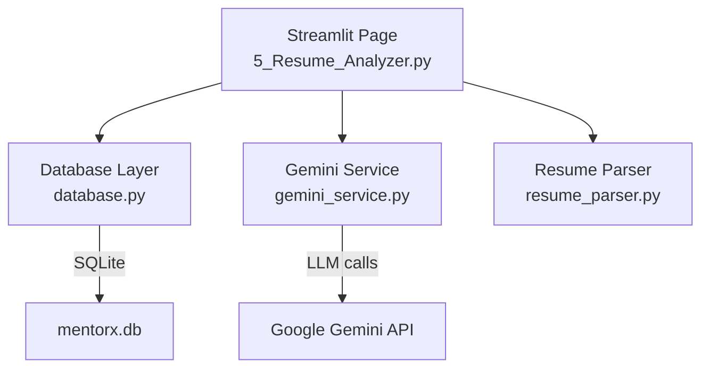
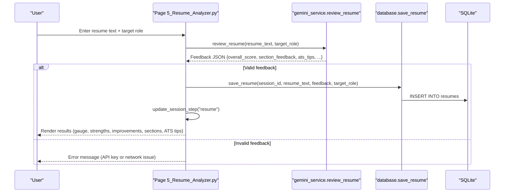
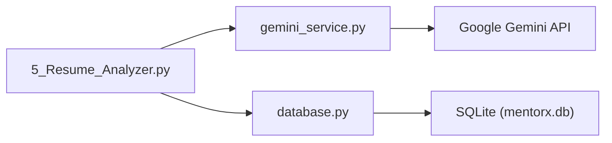

# Resume Analyzer

<cite>
**Referenced Files in This Document**
- [5_Resume_Analyzer.py](file://mentorx-ai/pages/5_Resume_Analyzer.py)
- [resume_parser.py](file://mentorx-ai/src/resume_parser.py)
- [gemini_service.py](file://mentorx-ai/src/gemini_service.py)
- [database.py](file://mentorx-ai/src/database.py)
- [app.py](file://mentorx-ai/app.py)
</cite>

## Table of Contents
1. [Introduction](#introduction)
2. [Project Structure](#project-structure)
3. [Core Components](#core-components)
4. [Architecture Overview](#architecture-overview)
5. [Detailed Component Analysis](#detailed-component-analysis)
6. [Dependency Analysis](#dependency-analysis)
7. [Performance Considerations](#performance-considerations)
8. [Troubleshooting Guide](#troubleshooting-guide)
9. [Conclusion](#conclusion)

## Introduction
The Resume Analyzer is a Streamlit-powered feature that evaluates pasted resume text against a target role and returns structured, actionable feedback. It integrates with the broader MentorX AI career preparation workflow to help users optimize resumes for Applicant Tracking Systems (ATS), identify strengths and improvement areas, and proceed to subsequent steps like mock interviews and dashboard tracking.

Key capabilities:
- Resume parsing and section detection
- Section-by-section evaluation and scoring
- AI-powered feedback generation via Google Gemini
- ATS optimization tips
- Persistence of results and session progression

## Project Structure
The Resume Analyzer spans UI, parsing utilities, AI service integration, and data persistence:
- UI page orchestrates user input, triggers analysis, and renders results
- Parser extracts sections and basic stats from raw resume text
- Gemini service generates structured JSON feedback based on prompts
- Database layer stores resume content, feedback, and updates session state

**Diagram sources**
- [5_Resume_Analyzer.py:1-191](file://mentorx-ai/pages/5_Resume_Analyzer.py#L1-L191)
- [resume_parser.py:1-102](file://mentorx-ai/src/resume_parser.py#L1-L102)
- [gemini_service.py:1-422](file://mentorx-ai/src/gemini_service.py#L1-L422)
- [database.py:1-362](file://mentorx-ai/src/database.py#L1-L362)

**Section sources**
- [5_Resume_Analyzer.py:1-191](file://mentorx-ai/pages/5_Resume_Analyzer.py#L1-L191)
- [app.py:1-166](file://mentorx-ai/app.py#L1-L166)

## Core Components
- Resume Analyzer UI: Collects target role and resume text, triggers analysis, displays scores, strengths, improvements, section feedback, and ATS tips. Persists results and advances session step.
- Resume Parser: Cleans text, splits into named sections using known headings or ALL-CAPS short lines, estimates word count, extracts emails and URLs, and computes basic stats.
- Gemini Service: Centralized LLM interface with structured prompts returning JSON for resume review, including overall score, section feedback, ATS tips, top improvements, and strengths.
- Database Layer: SQLite-based storage for sessions, assessments, recommendations, skill analyses, roadmaps, resumes, and interviews; includes CRUD helpers and dashboard aggregation.

**Section sources**
- [5_Resume_Analyzer.py:1-191](file://mentorx-ai/pages/5_Resume_Analyzer.py#L1-L191)
- [resume_parser.py:1-102](file://mentorx-ai/src/resume_parser.py#L1-L102)
- [gemini_service.py:1-422](file://mentorx-ai/src/gemini_service.py#L1-L422)
- [database.py:1-362](file://mentorx-ai/src/database.py#L1-L362)

## Architecture Overview
The Resume Analyzer follows a clear pipeline:
- User provides resume text and target role
- UI validates inputs and calls the Gemini service to generate structured feedback
- Results are stored in the database and session step is updated
- UI renders a gauge chart, strengths, improvements, section-by-section feedback, and ATS tips

**Diagram sources**
- [5_Resume_Analyzer.py:84-104](file://mentorx-ai/pages/5_Resume_Analyzer.py#L84-L104)
- [gemini_service.py:208-285](file://mentorx-ai/src/gemini_service.py#L208-L285)
- [database.py:286-308](file://mentorx-ai/src/database.py#L286-L308)

## Detailed Component Analysis

### Resume Analyzer UI (Page 5)
Responsibilities:
- Guard session existence and display welcome context
- Accept target role and resume text
- Trigger analysis and handle spinner/loading states
- Persist feedback and update session step
- Render results: overall score gauge, strengths, top improvements, section-by-section feedback, ATS tips

Parsing and display logic:
- Uses Plotly gauge to visualize overall score
- Iterates over section_feedback to show per-section comments and suggestions
- Displays ATS tips list

Integration points:
- Calls gemini_service.review_resume for AI feedback
- Uses database.save_resume to persist results
- Updates session step via database.update_session_step

**Section sources**
- [5_Resume_Analyzer.py:22-104](file://mentorx-ai/pages/5_Resume_Analyzer.py#L22-L104)
- [5_Resume_Analyzer.py:110-191](file://mentorx-ai/pages/5_Resume_Analyzer.py#L110-L191)

### Resume Parser
Responsibilities:
- Clean resume text by removing control characters and normalizing whitespace
- Split resume into sections using known headings or ALL-CAPS short lines
- Estimate word count
- Extract emails and URLs
- Compute resume statistics including detected sections

Algorithm highlights:
- SECTION_PATTERNS defines recognized headings across common resume sections
- split_sections iterates line-by-line, detects headings, and accumulates content into sections
- Fallback returns full_text if only one section is detected

Complexity considerations:
- Time complexity O(N) where N is number of lines
- Space complexity proportional to output sections

**Section sources**
- [resume_parser.py:9-20](file://mentorx-ai/src/resume_parser.py#L9-L20)
- [resume_parser.py:23-74](file://mentorx-ai/src/resume_parser.py#L23-L74)
- [resume_parser.py:77-102](file://mentorx-ai/src/resume_parser.py#L77-L102)

### Gemini Service (Resume Review)
Responsibilities:
- Configure model and API key
- Provide safe wrapper for LLM calls with JSON parsing and fallbacks
- Generate structured resume review feedback via prompt engineering

Resume review flow:
- Constructs a prompt embedding target role and resume text
- Requests JSON with fields: overall_score, section_feedback, ats_tips, top_improvements, strengths
- Parses response, stripping markdown fences if present
- Returns structured dict or fallback on error

Scoring and criteria:
- The prompt instructs the model to evaluate comprehensively and return realistic scores
- Section-level feedback includes comments and suggestions
- ATS tips focus on keyword usage and standard headings
- Top improvements highlight high-impact changes
- Strengths capture positive aspects

Error handling:
- _safe_call catches exceptions and returns default structures
- Missing or invalid API key raises runtime error during call

**Section sources**
- [gemini_service.py:15-25](file://mentorx-ai/src/gemini_service.py#L15-L25)
- [gemini_service.py:32-59](file://mentorx-ai/src/gemini_service.py#L32-L59)
- [gemini_service.py:208-285](file://mentorx-ai/src/gemini_service.py#L208-L285)

### Database Layer (Resumes and Session)
Responsibilities:
- Initialize schema including resumes table
- Save resume text, feedback, and target role
- Retrieve latest resume feedback for a session
- Update session step to reflect completion of resume analysis

Schema details:
- resumes table stores session_id, resume_text, feedback (JSON), target_role, created_at
- Foreign key references sessions table

Persistence behavior:
- save_resume inserts a new row with feedback serialized to JSON
- get_resume retrieves latest row and deserializes feedback JSON
- update_session_step sets current_step to "resume" after successful analysis

**Section sources**
- [database.py:82-92](file://mentorx-ai/src/database.py#L82-L92)
- [database.py:286-308](file://mentorx-ai/src/database.py#L286-L308)
- [database.py:137-145](file://mentorx-ai/src/database.py#L137-L145)

### Integration with Career Workflow
The Resume Analyzer is Step 5 in the guided journey:
- Users start at the landing page, create a session, and progress through assessment, recommendation, skill gap analysis, learning roadmap, resume analyzer, mock interview, and dashboard
- After resume analysis, users can proceed to mock interview or check dashboard readiness

Navigation and context:
- app.py outlines the 7-step journey and displays icons/descriptions
- Sidebar shows current step and instructions
- Resume Analyzer updates session step to "resume" upon success

**Section sources**
- [app.py:87-120](file://mentorx-ai/app.py#L87-L120)
- [5_Resume_Analyzer.py:95-102](file://mentorx-ai/pages/5_Resume_Analyzer.py#L95-L102)

## Dependency Analysis
Component relationships:
- Page depends on gemini_service for AI feedback and database for persistence
- Parser is available for preprocessing but not strictly required by the UI path shown
- Gemini service depends on environment configuration for API key
- Database layer manages all persistent state across features

**Diagram sources**
- [5_Resume_Analyzer.py:13-14](file://mentorx-ai/pages/5_Resume_Analyzer.py#L13-L14)
- [gemini_service.py:6-25](file://mentorx-ai/src/gemini_service.py#L6-L25)
- [database.py:6-18](file://mentorx-ai/src/database.py#L6-L18)

**Section sources**
- [5_Resume_Analyzer.py:13-14](file://mentorx-ai/pages/5_Resume_Analyzer.py#L13-L14)
- [gemini_service.py:6-25](file://mentorx-ai/src/gemini_service.py#L6-L25)
- [database.py:6-18](file://mentorx-ai/src/database.py#L6-L18)

## Performance Considerations
- LLM calls dominate latency; ensure efficient prompting and minimal retries
- Parsing is lightweight and linear in resume size
- Database operations use simple inserts and single-row selects; consider indexing session_id if scaling beyond local usage
- UI rendering uses Plotly gauge; keep result payloads small to avoid heavy serialization overhead

[No sources needed since this section provides general guidance]

## Troubleshooting Guide
Common issues and resolutions:
- Missing or invalid API key:
  - Symptom: Runtime error indicating API key not configured
  - Resolution: Set GOOGLE_API_KEY in .env file before running
- No feedback returned:
  - Symptom: Error message about inability to analyze resume
  - Resolution: Check network connectivity and API availability; verify resume text is non-empty and target role is specified
- Session guard warning:
  - Symptom: Warning to start from home page
  - Resolution: Ensure session_id exists in session state by starting at the landing page

**Section sources**
- [gemini_service.py:32-39](file://mentorx-ai/src/gemini_service.py#L32-L39)
- [5_Resume_Analyzer.py:22-24](file://mentorx-ai/pages/5_Resume_Analyzer.py#L22-L24)
- [5_Resume_Analyzer.py:84-104](file://mentorx-ai/pages/5_Resume_Analyzer.py#L84-L104)

## Conclusion
The Resume Analyzer delivers a streamlined, AI-driven evaluation experience integrated into the broader MentorX AI workflow. It parses resume text, generates structured feedback with section-level insights and ATS tips, persists results, and advances user progress. By centralizing LLM interactions and leveraging a simple parser and robust database layer, it balances usability, extensibility, and maintainability while providing actionable guidance for resume optimization.

[No sources needed since this section summarizes without analyzing specific files]