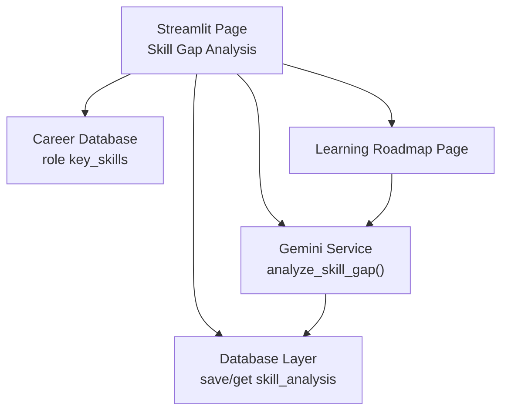
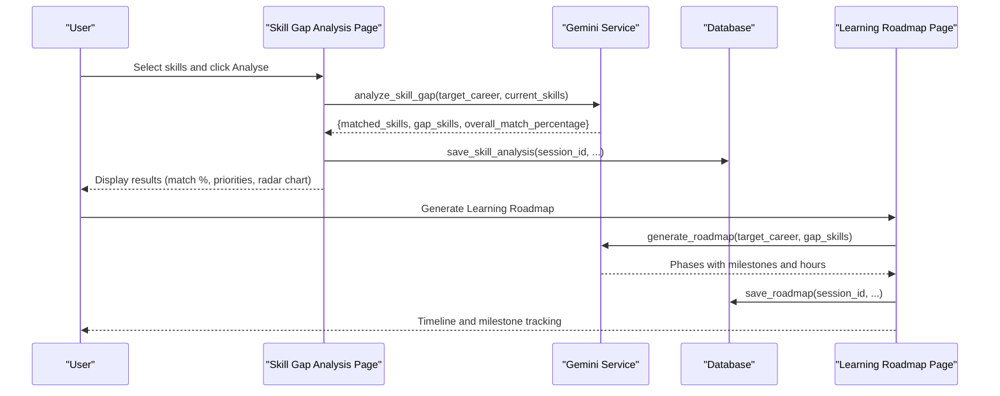
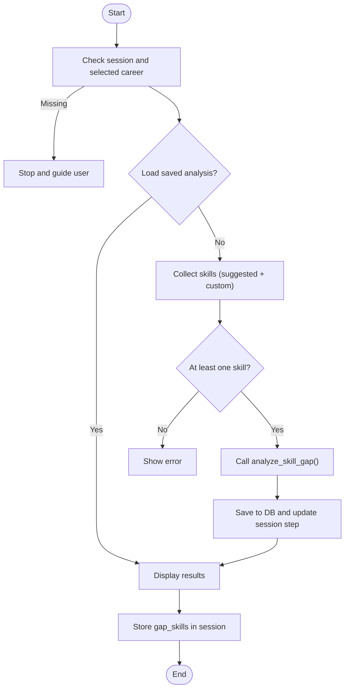
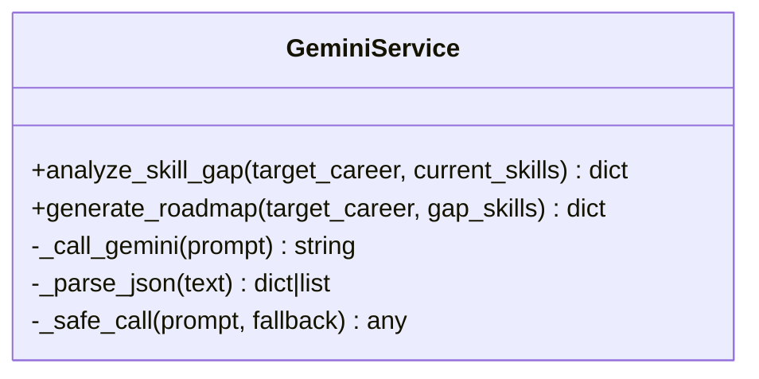
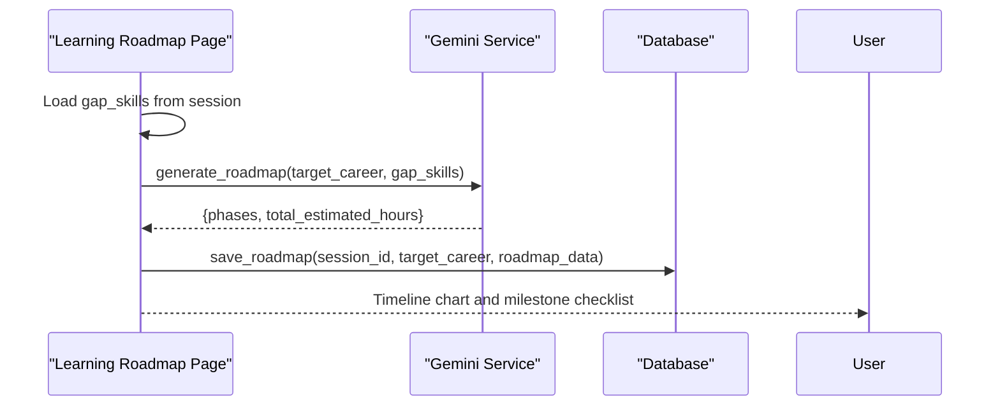
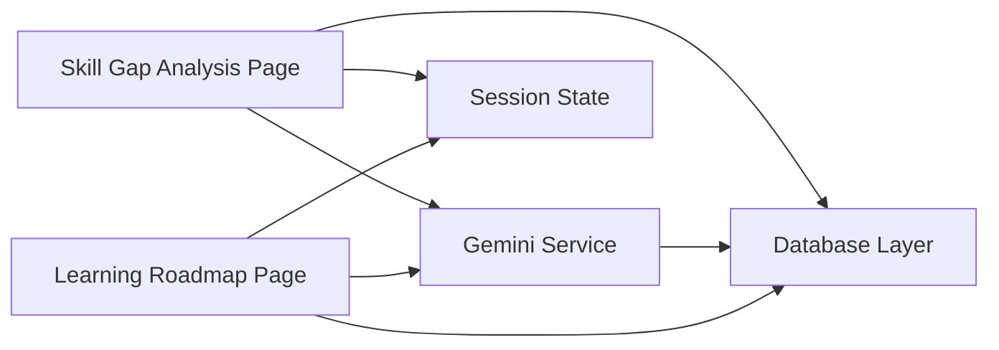

# Skill Gap Analysis

<cite>
**Referenced Files in This Document**
- [3_Skill_Gap_Analysis.py](file://mentorx-ai/pages/3_Skill_Gap_Analysis.py)
- [4_Learning_Roadmap.py](file://mentorx-ai/pages/4_Learning_Roadmap.py)
- [gemini_service.py](file://mentorx-ai/src/gemini_service.py)
- [database.py](file://mentorx-ai/src/database.py)
- [career_database.json](file://mentorx-ai/data/career_database.json)
- [assessment_questions.json](file://mentorx-ai/data/assessment_questions.json)
</cite>

## Table of Contents
1. [Introduction](#introduction)
2. [Project Structure](#project-structure)
3. [Core Components](#core-components)
4. [Architecture Overview](#architecture-overview)
5. [Detailed Component Analysis](#detailed-component-analysis)
6. [Dependency Analysis](#dependency-analysis)
7. [Performance Considerations](#performance-considerations)
8. [Troubleshooting Guide](#troubleshooting-guide)
9. [Conclusion](#conclusion)
10. [Appendices](#appendices)

## Introduction
This document explains the Skill Gap Analysis feature that compares a user’s current skills against target career requirements and produces actionable improvement recommendations. It covers:
- How user skill assessments are captured and processed
- How skills are mapped to career-specific requirements
- The gap identification methodology and priority classification system (Critical, Important, Nice-to-have)
- Overall match percentage calculation
- AI-powered analysis via Gemini
- Skill requirement databases used by the system
- How results feed into learning roadmap generation

## Project Structure
The Skill Gap Analysis spans UI, AI service, data persistence, and reference data:
- Streamlit page collects user skills and displays results
- Gemini service performs AI-driven gap analysis and roadmap generation
- Database module persists session state, skill analyses, and roadmaps
- Career database provides role definitions and key skills for context

**Diagram sources**
- [3_Skill_Gap_Analysis.py:90-116](file://mentorx-ai/pages/3_Skill_Gap_Analysis.py#L90-L116)
- [gemini_service.py:110-147](file://mentorx-ai/src/gemini_service.py#L110-L147)
- [database.py:220-250](file://mentorx-ai/src/database.py#L220-L250)
- [career_database.json:1-149](file://mentorx-ai/data/career_database.json#L1-L149)
- [4_Learning_Roadmap.py:50-75](file://mentorx-ai/pages/4_Learning_Roadmap.py#L50-L75)

**Section sources**
- [3_Skill_Gap_Analysis.py:1-230](file://mentorx-ai/pages/3_Skill_Gap_Analysis.py#L1-L230)
- [gemini_service.py:1-422](file://mentorx-ai/src/gemini_service.py#L1-L422)
- [database.py:1-362](file://mentorx-ai/src/database.py#L1-L362)
- [career_database.json:1-149](file://mentorx-ai/data/career_database.json#L1-L149)
- [4_Learning_Roadmap.py:1-198](file://mentorx-ai/pages/4_Learning_Roadmap.py#L1-L198)

## Core Components
- Skill Gap Analysis UI: Captures selected skills, triggers analysis, stores results, and visualizes matched vs. gap skills with an overall match percentage and radar chart.
- AI Skill Gap Analyzer: Uses Gemini to compare current skills against target career needs, returning matched skills, prioritized gaps, and an overall match percentage.
- Persistence Layer: Saves and retrieves skill analysis results per session for continuity across steps.
- Learning Roadmap Integration: Consumes identified gap skills to generate a phased learning plan with milestones and resources.

Key responsibilities:
- Input validation and user guidance
- AI prompt construction and response parsing
- Priority classification and match percentage computation
- Data storage and retrieval
- Visualization and downstream integration

**Section sources**
- [3_Skill_Gap_Analysis.py:55-116](file://mentorx-ai/pages/3_Skill_Gap_Analysis.py#L55-L116)
- [gemini_service.py:110-147](file://mentorx-ai/src/gemini_service.py#L110-L147)
- [database.py:220-250](file://mentorx-ai/src/database.py#L220-L250)
- [4_Learning_Roadmap.py:50-75](file://mentorx-ai/pages/4_Learning_Roadmap.py#L50-L75)

## Architecture Overview
End-to-end flow from skill input to roadmap generation:

**Diagram sources**
- [3_Skill_Gap_Analysis.py:90-116](file://mentorx-ai/pages/3_Skill_Gap_Analysis.py#L90-L116)
- [gemini_service.py:110-147](file://mentorx-ai/src/gemini_service.py#L110-L147)
- [database.py:220-250](file://mentorx-ai/src/database.py#L220-L250)
- [4_Learning_Roadmap.py:50-75](file://mentorx-ai/pages/4_Learning_Roadmap.py#L50-L75)

## Detailed Component Analysis

### Skill Gap Analysis UI
- Collects user skills from suggested lists and custom input
- Validates selection and calls AI analyzer
- Persists results and updates session step
- Displays:
  - Overall match percentage
  - Matched skills with proficiency notes
  - Gap skills grouped by priority (Critical, Important, Nice-to-have)
  - Radar chart comparing user level vs required level
- Stores gap skills in session state for roadmap generation

**Diagram sources**
- [3_Skill_Gap_Analysis.py:22-33](file://mentorx-ai/pages/3_Skill_Gap_Analysis.py#L22-L33)
- [3_Skill_Gap_Analysis.py:55-116](file://mentorx-ai/pages/3_Skill_Gap_Analysis.py#L55-L116)
- [3_Skill_Gap_Analysis.py:123-229](file://mentorx-ai/pages/3_Skill_Gap_Analysis.py#L123-L229)

**Section sources**
- [3_Skill_Gap_Analysis.py:22-116](file://mentorx-ai/pages/3_Skill_Gap_Analysis.py#L22-L116)
- [3_Skill_Gap_Analysis.py:123-229](file://mentorx-ai/pages/3_Skill_Gap_Analysis.py#L123-L229)

### AI-Powered Skill Gap Analysis
- Constructs a structured prompt with target career and current skills
- Requests JSON output including:
  - matched_skills: list of skills the user already has, with proficiency notes
  - gap_skills: list of missing skills with priority classification and descriptions
  - overall_match_percentage: integer representing fit
- Parses JSON safely and returns fallback on errors

**Diagram sources**
- [gemini_service.py:110-147](file://mentorx-ai/src/gemini_service.py#L110-L147)
- [gemini_service.py:154-201](file://mentorx-ai/src/gemini_service.py#L154-L201)
- [gemini_service.py:32-59](file://mentorx-ai/src/gemini_service.py#L32-L59)

**Section sources**
- [gemini_service.py:110-147](file://mentorx-ai/src/gemini_service.py#L110-L147)
- [gemini_service.py:32-59](file://mentorx-ai/src/gemini_service.py#L32-L59)

### Priority Classification System
- Critical: Must-have skills for the target role; essential for employability
- Important: Strongly recommended; significantly improves competitiveness
- Nice-to-have: Beneficial but not mandatory; differentiates candidates

These priorities are assigned by the AI based on role relevance and market context, then displayed grouped in the UI.

**Section sources**
- [3_Skill_Gap_Analysis.py:157-171](file://mentorx-ai/pages/3_Skill_Gap_Analysis.py#L157-L171)
- [gemini_service.py:110-147](file://mentorx-ai/src/gemini_service.py#L110-L147)

### Overall Match Percentage Calculation
- Returned by the AI as part of the gap analysis result
- Used to display a single metric indicating how well the user’s current skills align with the target career
- Visualized prominently in the UI and informs subsequent steps

Note: The exact formula is determined by the AI model based on the provided prompt and context.

**Section sources**
- [3_Skill_Gap_Analysis.py:129-142](file://mentorx-ai/pages/3_Skill_Gap_Analysis.py#L129-L142)
- [gemini_service.py:110-147](file://mentorx-ai/src/gemini_service.py#L110-L147)

### Skill Requirement Databases
- Career database contains role titles, key skills, salary ranges, outlook, and descriptions
- Assessment questions define dimensions and categories used earlier in the workflow
- While the skill gap analysis primarily relies on AI reasoning, these datasets provide contextual grounding for career mapping and recommendations

**Section sources**
- [career_database.json:1-149](file://mentorx-ai/data/career_database.json#L1-L149)
- [assessment_questions.json:1-134](file://mentorx-ai/data/assessment_questions.json#L1-L134)

### Learning Roadmap Generation from Gap Analysis
- Reads gap skills from session state populated by the Skill Gap Analysis page
- Calls the AI to generate a phased roadmap with milestones, resources, estimated hours, and free/paid indicators
- Persists roadmap data and displays timeline visualization and milestone tracking

**Diagram sources**
- [4_Learning_Roadmap.py:50-75](file://mentorx-ai/pages/4_Learning_Roadmap.py#L50-L75)
- [gemini_service.py:154-201](file://mentorx-ai/src/gemini_service.py#L154-L201)
- [database.py:257-279](file://mentorx-ai/src/database.py#L257-L279)

**Section sources**
- [4_Learning_Roadmap.py:50-75](file://mentorx-ai/pages/4_Learning_Roadmap.py#L50-L75)
- [4_Learning_Roadmap.py:82-198](file://mentorx-ai/pages/4_Learning_Roadmap.py#L82-L198)
- [gemini_service.py:154-201](file://mentorx-ai/src/gemini_service.py#L154-L201)
- [database.py:257-279](file://mentorx-ai/src/database.py#L257-L279)

## Dependency Analysis
- UI depends on:
  - Gemini service for AI analysis and roadmap generation
  - Database for persistence and session step updates
  - Session state for passing gap skills between pages
- Gemini service depends on:
  - Environment configuration (API key)
  - Structured prompts to produce consistent JSON outputs
- Database layer abstracts SQLite operations for all modules
- Reference data supports contextual understanding and consistency

**Diagram sources**
- [3_Skill_Gap_Analysis.py:13-15](file://mentorx-ai/pages/3_Skill_Gap_Analysis.py#L13-L15)
- [4_Learning_Roadmap.py:13-14](file://mentorx-ai/pages/4_Learning_Roadmap.py#L13-L14)
- [gemini_service.py:6-25](file://mentorx-ai/src/gemini_service.py#L6-L25)
- [database.py:1-18](file://mentorx-ai/src/database.py#L1-L18)

**Section sources**
- [3_Skill_Gap_Analysis.py:13-15](file://mentorx-ai/pages/3_Skill_Gap_Analysis.py#L13-L15)
- [4_Learning_Roadmap.py:13-14](file://mentorx-ai/pages/4_Learning_Roadmap.py#L13-L14)
- [gemini_service.py:6-25](file://mentorx-ai/src/gemini_service.py#L6-L25)
- [database.py:1-18](file://mentorx-ai/src/database.py#L1-L18)

## Performance Considerations
- AI calls are network-bound and may introduce latency; UI uses spinner feedback during processing
- Parsing robustness mitigates failures from unexpected LLM responses
- Persisting results avoids recomputation and enables seamless navigation between steps
- Visualization renders limited sets of skills to maintain responsiveness

[No sources needed since this section provides general guidance]

## Troubleshooting Guide
Common issues and resolutions:
- Missing API key: Ensure GOOGLE_API_KEY is set; otherwise, AI functions raise runtime errors or return fallbacks
- No skills selected: Validation prevents proceeding without at least one skill
- Empty results: If AI fails to return expected structure, UI shows an error and suggests retrying
- Session guards: Pages require prior steps; missing session data stops execution and guides users

Operational checks:
- Verify environment variables and connectivity
- Confirm session state includes selected career and gap skills
- Inspect persisted records in the database if results do not appear

**Section sources**
- [gemini_service.py:32-59](file://mentorx-ai/src/gemini_service.py#L32-L59)
- [3_Skill_Gap_Analysis.py:22-33](file://mentorx-ai/pages/3_Skill_Gap_Analysis.py#L22-L33)
- [3_Skill_Gap_Analysis.py:90-116](file://mentorx-ai/pages/3_Skill_Gap_Analysis.py#L90-L116)
- [4_Learning_Roadmap.py:22-33](file://mentorx-ai/pages/4_Learning_Roadmap.py#L22-L33)
- [4_Learning_Roadmap.py:50-75](file://mentorx-ai/pages/4_Learning_Roadmap.py#L50-L75)

## Conclusion
The Skill Gap Analysis feature leverages AI to compare user skills against target career requirements, classify gaps by priority, and compute an overall match percentage. Results are persisted and visualized, then used to generate a personalized learning roadmap with actionable milestones. The design balances usability, reliability, and extensibility through clear separation of concerns and robust error handling.

[No sources needed since this section summarizes without analyzing specific files]

## Appendices

### Data Models and Storage
- Skill analysis record includes target career, current skills, required skills, and full gap analysis payload
- Roadmap record stores phases and total estimated hours
- Session step tracking ensures correct progression through the workflow

**Section sources**
- [database.py:58-80](file://mentorx-ai/src/database.py#L58-L80)
- [database.py:220-250](file://mentorx-ai/src/database.py#L220-L250)
- [database.py:257-279](file://mentorx-ai/src/database.py#L257-L279)

### Prompt Engineering Notes
- Skill gap analysis prompt specifies target career, current skills, and desired JSON schema
- Priorities are explicitly defined to ensure consistent classification
- Roadmap prompt requests phased plans with milestones, resource types, hours, and cost indicators

**Section sources**
- [gemini_service.py:110-147](file://mentorx-ai/src/gemini_service.py#L110-L147)
- [gemini_service.py:154-201](file://mentorx-ai/src/gemini_service.py#L154-L201)