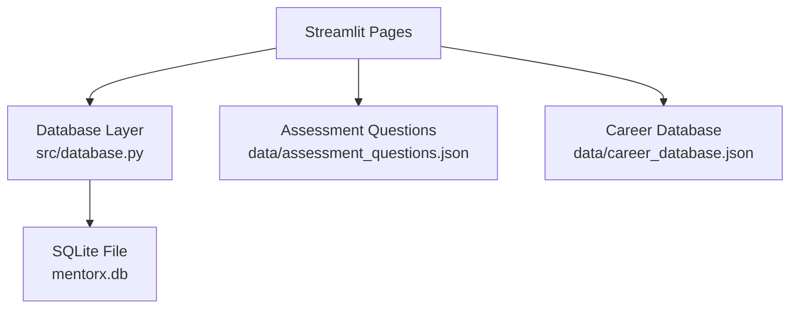
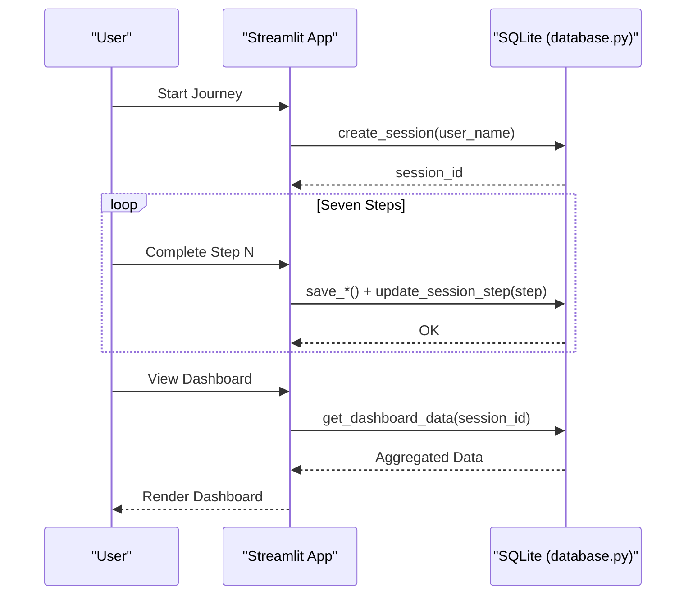
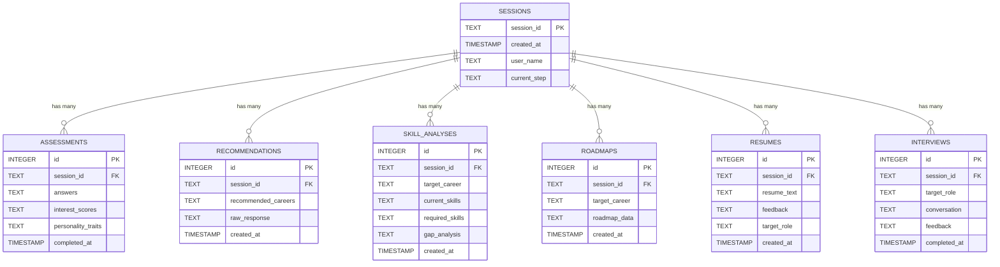
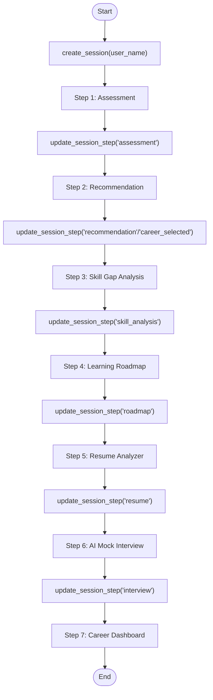
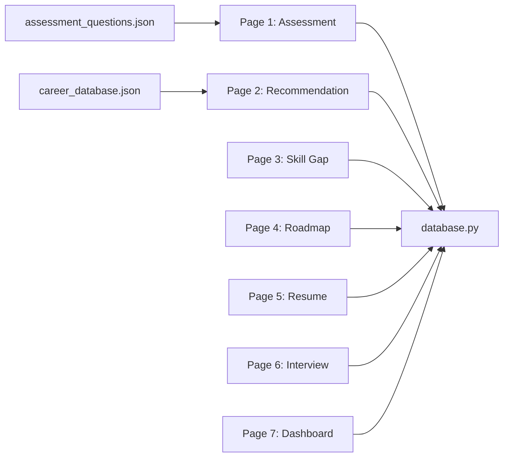

# Database Design

<cite>
**Referenced Files in This Document**
- [database.py](file://mentorx-ai/src/database.py)
- [app.py](file://mentorx-ai/app.py)
- [1_Career_Assessment.py](file://mentorx-ai/pages/1_Career_Assessment.py)
- [2_Career_Recommendation.py](file://mentorx-ai/pages/2_Career_Recommendation.py)
- [3_Skill_Gap_Analysis.py](file://mentorx-ai/pages/3_Skill_Gap_Analysis.py)
- [4_Learning_Roadmap.py](file://mentorx-ai/pages/4_Learning_Roadmap.py)
- [5_Resume_Analyzer.py](file://mentorx-ai/pages/5_Resume_Analyzer.py)
- [6_AI_Mock_Interview.py](file://mentorx-ai/pages/6_AI_Mock_Interview.py)
- [7_Career_Dashboard.py](file://mentorx-ai/pages/7_Career_Dashboard.py)
- [assessment_questions.json](file://mentorx-ai/data/assessment_questions.json)
- [career_database.json](file://mentorx-ai/data/career_database.json)
</cite>

## Table of Contents
1. Introduction
2. Project Structure
3. Core Components
4. Architecture Overview
5. Detailed Component Analysis
6. Dependency Analysis
7. Performance Considerations
8. Troubleshooting Guide
9. Conclusion
10. Appendices

## Introduction
This document describes the data model and persistence strategy for Mentor X-AI’s local SQLite database. It covers schema design, entity relationships, constraints, validation rules, session-based data tracking across a seven-step career coaching journey, JSON data structures used by the application, and practical guidance for migration, backup, performance, and common queries.

## Project Structure
The application is a Streamlit app with page modules that orchestrate user flows and persist results to a single SQLite file. The database layer centralizes table creation and CRUD operations. Static JSON files provide assessment questions and a career reference dataset.

**Diagram sources**
- [database.py:21-107](file://mentorx-ai/src/database.py#L21-L107)
- [assessment_questions.json:1-134](file://mentorx-ai/data/assessment_questions.json#L1-L134)
- [career_database.json:1-149](file://mentorx-ai/data/career_database.json#L1-L149)

**Section sources**
- [app.py:27-32](file://mentorx-ai/app.py#L27-L32)
- [database.py:21-107](file://mentorx-ai/src/database.py#L21-L107)

## Core Components
- Session management: creates and tracks per-user sessions and current step.
- Assessment storage: persists answers, interest scores, and personality traits.
- Recommendations storage: stores AI-generated career suggestions.
- Skill analysis storage: captures target career, current skills, required skills, and gap analysis.
- Roadmap storage: saves phased learning plans.
- Resume storage: keeps resume text, feedback, and target role.
- Interview storage: records conversation history and final feedback summary.
- Dashboard aggregation: fetches all related data for a session.

Key implementation references:
- Schema creation and helpers: [database.py:21-107](file://mentorx-ai/src/database.py#L21-L107)
- Session helpers: [database.py:114-145](file://mentorx-ai/src/database.py#L114-L145)
- Assessment CRUD: [database.py:152-183](file://mentorx-ai/src/database.py#L152-L183)
- Recommendation CRUD: [database.py:190-213](file://mentorx-ai/src/database.py#L190-L213)
- Skill analysis CRUD: [database.py:220-250](file://mentorx-ai/src/database.py#L220-L250)
- Roadmap CRUD: [database.py:257-279](file://mentorx-ai/src/database.py#L257-L279)
- Resume CRUD: [database.py:286-308](file://mentorx-ai/src/database.py#L286-L308)
- Interview CRUD: [database.py:315-344](file://mentorx-ai/src/database.py#L315-L344)
- Dashboard aggregation: [database.py:351-361](file://mentorx-ai/src/database.py#L351-L361)

**Section sources**
- [database.py:21-361](file://mentorx-ai/src/database.py#L21-L361)

## Architecture Overview
The system follows a session-centric architecture. Each user interaction begins with a session record that anchors all subsequent data (assessments, recommendations, skill analyses, roadmaps, resumes, interviews). Pages update the session’s current_step to reflect progress through the seven steps.

**Diagram sources**
- [app.py:67-79](file://mentorx-ai/app.py#L67-L79)
- [database.py:114-145](file://mentorx-ai/src/database.py#L114-L145)
- [database.py:152-361](file://mentorx-ai/src/database.py#L152-L361)
- [7_Career_Dashboard.py:43-47](file://mentorx-ai/pages/7_Career_Dashboard.py#L43-L47)

## Detailed Component Analysis

### Entity Relationship Model
The database uses a star-like schema centered on sessions. All feature tables link back to sessions via a foreign key.

**Diagram sources**
- [database.py:26-104](file://mentorx-ai/src/database.py#L26-L104)

**Section sources**
- [database.py:26-104](file://mentorx-ai/src/database.py#L26-L104)

### Field Definitions and Constraints
- sessions
  - session_id: TEXT PRIMARY KEY; unique identifier per user journey
  - created_at: TIMESTAMP DEFAULT CURRENT_TIMESTAMP
  - user_name: TEXT; optional display name
  - current_step: TEXT DEFAULT 'landing'; tracks progress through steps
- assessments
  - id: INTEGER PRIMARY KEY AUTOINCREMENT
  - session_id: TEXT NOT NULL; FOREIGN KEY -> sessions(session_id)
  - answers: TEXT; JSON-encoded mapping of question IDs to numeric responses
  - interest_scores: TEXT; JSON-encoded dimension scores
  - personality_traits: TEXT; JSON-encoded trait descriptions
  - completed_at: TIMESTAMP DEFAULT CURRENT_TIMESTAMP
- recommendations
  - id: INTEGER PRIMARY KEY AUTOINCREMENT
  - session_id: TEXT NOT NULL; FOREIGN KEY -> sessions(session_id)
  - recommended_careers: TEXT; JSON-encoded list of career objects
  - raw_response: TEXT; optional raw AI response
  - created_at: TIMESTAMP DEFAULT CURRENT_TIMESTAMP
- skill_analyses
  - id: INTEGER PRIMARY KEY AUTOINCREMENT
  - session_id: TEXT NOT NULL; FOREIGN KEY -> sessions(session_id)
  - target_career: TEXT; selected career title
  - current_skills: TEXT; JSON-encoded list of user skills
  - required_skills: TEXT; JSON-encoded list of missing or needed skills
  - gap_analysis: TEXT; JSON-encoded detailed analysis object
  - created_at: TIMESTAMP DEFAULT CURRENT_TIMESTAMP
- roadmaps
  - id: INTEGER PRIMARY KEY AUTOINCREMENT
  - session_id: TEXT NOT NULL; FOREIGN KEY -> sessions(session_id)
  - target_career: TEXT; selected career title
  - roadmap_data: TEXT; JSON-encoded phases and milestones
  - created_at: TIMESTAMP DEFAULT CURRENT_TIMESTAMP
- resumes
  - id: INTEGER PRIMARY KEY AUTOINCREMENT
  - session_id: TEXT NOT NULL; FOREIGN KEY -> sessions(session_id)
  - resume_text: TEXT; user-provided resume content
  - feedback: TEXT; JSON-encoded evaluation object
  - target_role: TEXT; role context for evaluation
  - created_at: TIMESTAMP DEFAULT CURRENT_TIMESTAMP
- interviews
  - id: INTEGER PRIMARY KEY AUTOINCREMENT
  - session_id: TEXT NOT NULL; FOREIGN KEY -> sessions(session_id)
  - target_role: TEXT; role context for interview
  - conversation: TEXT; JSON-encoded message history
  - feedback: TEXT; JSON-encoded final summary and tips
  - completed_at: TIMESTAMP DEFAULT CURRENT_TIMESTAMP

Validation notes:
- Foreign keys are declared but not enforced at the SQLite level in this codebase; application logic ensures referential integrity by always linking to an existing session_id.
- JSON fields are validated implicitly by the application layers before serialization/deserialization.

**Section sources**
- [database.py:26-104](file://mentorx-ai/src/database.py#L26-L104)

### Session-Based Progress Tracking
The current_step field in sessions advances as users complete each step. Pages call update_session_step after successful writes.

**Diagram sources**
- [database.py:137-145](file://mentorx-ai/src/database.py#L137-L145)
- [1_Career_Assessment.py:98-105](file://mentorx-ai/pages/1_Career_Assessment.py#L98-L105)
- [2_Career_Recommendation.py:66-67](file://mentorx-ai/pages/2_Career_Recommendation.py#L66-L67)
- [3_Skill_Gap_Analysis.py:104-111](file://mentorx-ai/pages/3_Skill_Gap_Analysis.py#L104-L111)
- [4_Learning_Roadmap.py:73-74](file://mentorx-ai/pages/4_Learning_Roadmap.py#L73-L74)
- [5_Resume_Analyzer.py:95-101](file://mentorx-ai/pages/5_Resume_Analyzer.py#L95-L101)
- [6_AI_Mock_Interview.py:204-210](file://mentorx-ai/pages/6_AI_Mock_Interview.py#L204-L210)
- [7_Career_Dashboard.py:43-44](file://mentorx-ai/pages/7_Career_Dashboard.py#L43-L44)

**Section sources**
- [database.py:137-145](file://mentorx-ai/src/database.py#L137-L145)
- [1_Career_Assessment.py:98-105](file://mentorx-ai/pages/1_Career_Assessment.py#L98-L105)
- [2_Career_Recommendation.py:66-67](file://mentorx-ai/pages/2_Career_Recommendation.py#L66-L67)
- [3_Skill_Gap_Analysis.py:104-111](file://mentorx-ai/pages/3_Skill_Gap_Analysis.py#L104-L111)
- [4_Learning_Roadmap.py:73-74](file://mentorx-ai/pages/4_Learning_Roadmap.py#L73-L74)
- [5_Resume_Analyzer.py:95-101](file://mentorx-ai/pages/5_Resume_Analyzer.py#L95-L101)
- [6_AI_Mock_Interview.py:204-210](file://mentorx-ai/pages/6_AI_Mock_Interview.py#L204-L210)
- [7_Career_Dashboard.py:43-44](file://mentorx-ai/pages/7_Career_Dashboard.py#L43-L44)

### JSON Data Structures

#### Assessment Questions (assessment_questions.json)
- Root-level metadata: title, description, scale mapping from numeric values to labels.
- questions: array of items with id, category (interests/work_style/skills/values), dimension, and statement.
- Validation rules applied by the UI:
  - Responses must be integers within the defined scale.
  - All questions must be answered before submission.

Common usage:
- Load questions into UI, collect answers keyed by question id, compute scores and traits, then persist to assessments.

**Section sources**
- [assessment_questions.json:1-134](file://mentorx-ai/data/assessment_questions.json#L1-L134)
- [1_Career_Assessment.py:35-75](file://mentorx-ai/pages/1_Career_Assessment.py#L35-L75)
- [1_Career_Assessment.py:91-113](file://mentorx-ai/pages/1_Career_Assessment.py#L91-L113)

#### Career Database (career_database.json)
- careers: array of career objects including title, key_skills, salary ranges (PKR), outlook, and description.
- Used as reference data for recommendation and skill gap contexts.

**Section sources**
- [career_database.json:1-149](file://mentorx-ai/data/career_database.json#L1-L149)

### Data Access Patterns and Example Queries
Note: These are conceptual SQL patterns aligned with the schema and functions used in the app.

- Create a new session
  - INSERT INTO sessions (session_id, user_name) VALUES (?, ?)
  - Reference: [database.py:114-124](file://mentorx-ai/src/database.py#L114-L124)

- Save assessment
  - INSERT INTO assessments (session_id, answers, interest_scores, personality_traits) VALUES (?, ?, ?, ?)
  - Reference: [database.py:152-167](file://mentorx-ai/src/database.py#L152-L167)

- Get latest assessment for a session
  - SELECT * FROM assessments WHERE session_id = ? ORDER BY id DESC LIMIT 1
  - Reference: [database.py:170-183](file://mentorx-ai/src/database.py#L170-L183)

- Save recommendation
  - INSERT INTO recommendations (session_id, recommended_careers, raw_response) VALUES (?, ?, ?)
  - Reference: [database.py:190-199](file://mentorx-ai/src/database.py#L190-L199)

- Get latest recommendation for a session
  - SELECT * FROM recommendations WHERE session_id = ? ORDER BY id DESC LIMIT 1
  - Reference: [database.py:202-213](file://mentorx-ai/src/database.py#L202-L213)

- Save skill analysis
  - INSERT INTO skill_analyses (session_id, target_career, current_skills, required_skills, gap_analysis) VALUES (?, ?, ?, ?, ?)
  - Reference: [database.py:220-235](file://mentorx-ai/src/database.py#L220-L235)

- Get latest skill analysis for a session
  - SELECT * FROM skill_analyses WHERE session_id = ? ORDER BY id DESC LIMIT 1
  - Reference: [database.py:238-250](file://mentorx-ai/src/database.py#L238-L250)

- Save roadmap
  - INSERT INTO roadmaps (session_id, target_career, roadmap_data) VALUES (?, ?, ?)
  - Reference: [database.py:257-265](file://mentorx-ai/src/database.py#L257-L265)

- Get latest roadmap for a session
  - SELECT * FROM roadmaps WHERE session_id = ? ORDER BY id DESC LIMIT 1
  - Reference: [database.py:268-279](file://mentorx-ai/src/database.py#L268-L279)

- Save resume
  - INSERT INTO resumes (session_id, resume_text, feedback, target_role) VALUES (?, ?, ?, ?)
  - Reference: [database.py:286-294](file://mentorx-ai/src/database.py#L286-L294)

- Get latest resume for a session
  - SELECT * FROM resumes WHERE session_id = ? ORDER BY id DESC LIMIT 1
  - Reference: [database.py:297-308](file://mentorx-ai/src/database.py#L297-L308)

- Save interview
  - INSERT INTO interviews (session_id, target_role, conversation, feedback) VALUES (?, ?, ?, ?)
  - Reference: [database.py:315-329](file://mentorx-ai/src/database.py#L315-L329)

- Get latest interview for a session
  - SELECT * FROM interviews WHERE session_id = ? ORDER BY id DESC LIMIT 1
  - Reference: [database.py:332-344](file://mentorx-ai/src/database.py#L332-L344)

- Dashboard aggregation
  - Combine multiple SELECTs per session to assemble readiness view
  - Reference: [database.py:351-361](file://mentorx-ai/src/database.py#L351-L361)

**Section sources**
- [database.py:114-361](file://mentorx-ai/src/database.py#L114-L361)

## Dependency Analysis
- Pages depend on database layer functions for persistence and step updates.
- Application initializes the database once per run.
- JSON files are consumed by pages and services to drive assessment and career context.

**Diagram sources**
- [1_Career_Assessment.py:12-13](file://mentorx-ai/pages/1_Career_Assessment.py#L12-L13)
- [2_Career_Recommendation.py:12-13](file://mentorx-ai/pages/2_Career_Recommendation.py#L12-L13)
- [3_Skill_Gap_Analysis.py:13-14](file://mentorx-ai/pages/3_Skill_Gap_Analysis.py#L13-L14)
- [4_Learning_Roadmap.py:13-14](file://mentorx-ai/pages/4_Learning_Roadmap.py#L13-L14)
- [5_Resume_Analyzer.py:13-14](file://mentorx-ai/pages/5_Resume_Analyzer.py#L13-L14)
- [6_AI_Mock_Interview.py:12-17](file://mentorx-ai/pages/6_AI_Mock_Interview.py#L12-L17)
- [7_Career_Dashboard.py:14-22](file://mentorx-ai/pages/7_Career_Dashboard.py#L14-L22)
- [assessment_questions.json:1-134](file://mentorx-ai/data/assessment_questions.json#L1-L134)
- [career_database.json:1-149](file://mentorx-ai/data/career_database.json#L1-L149)

**Section sources**
- [app.py:27-32](file://mentorx-ai/app.py#L27-L32)
- [database.py:21-107](file://mentorx-ai/src/database.py#L21-L107)

## Performance Considerations
- Single-file SQLite: Simple and portable; suitable for local, single-user scenarios.
- Row factory: Using row factory improves readability but adds minor overhead; acceptable for this workload.
- JSON fields: Stored as TEXT; avoid storing excessively large payloads to keep queries fast.
- Indexing: No indexes beyond primary keys; if query volume grows, consider indexing frequently filtered columns such as session_id in child tables.
- Connection lifecycle: Connections are opened per operation; for high-throughput scenarios, consider connection pooling or transaction batching.
- Backup: Copy mentorx.db while the app is idle to ensure consistency.

[No sources needed since this section provides general guidance]

## Troubleshooting Guide
- Missing session: Pages guard against missing session_id and stop early. Ensure the user starts from the home page to create a session.
  - References: [app.py:67-79](file://mentorx-ai/app.py#L67-L79), [1_Career_Assessment.py:21-23](file://mentorx-ai/pages/1_Career_Assessment.py#L21-L23)
- Unanswered questions: Assessment requires all questions answered before submission.
  - Reference: [1_Career_Assessment.py:91-94](file://mentorx-ai/pages/1_Career_Assessment.py#L91-L94)
- API failures: If external AI calls fail, error messages guide retry or configuration checks.
  - References: [2_Career_Recommendation.py:62-64](file://mentorx-ai/pages/2_Career_Recommendation.py#L62-L64), [3_Skill_Gap_Analysis.py:114-115](file://mentorx-ai/pages/3_Skill_Gap_Analysis.py#L114-L115), [4_Learning_Roadmap.py:65-66](file://mentorx-ai/pages/4_Learning_Roadmap.py#L65-L66), [5_Resume_Analyzer.py:103-104](file://mentorx-ai/pages/5_Resume_Analyzer.py#L103-L104)
- Data not persisted: Verify that save_* functions are called and update_session_step is invoked after success.
  - References: [database.py:152-344](file://mentorx-ai/src/database.py#L152-L344)

**Section sources**
- [app.py:67-79](file://mentorx-ai/app.py#L67-L79)
- [1_Career_Assessment.py:91-94](file://mentorx-ai/pages/1_Career_Assessment.py#L91-L94)
- [2_Career_Recommendation.py:62-64](file://mentorx-ai/pages/2_Career_Recommendation.py#L62-L64)
- [3_Skill_Gap_Analysis.py:114-115](file://mentorx-ai/pages/3_Skill_Gap_Analysis.py#L114-L115)
- [4_Learning_Roadmap.py:65-66](file://mentorx-ai/pages/4_Learning_Roadmap.py#L65-L66)
- [5_Resume_Analyzer.py:103-104](file://mentorx-ai/pages/5_Resume_Analyzer.py#L103-L104)
- [database.py:152-344](file://mentorx-ai/src/database.py#L152-L344)

## Conclusion
Mentor X-AI employs a straightforward, session-centric SQLite schema that cleanly separates concerns across the seven-step career coaching journey. JSON fields enable flexible storage of complex results while keeping the relational structure simple. The design supports local-first operation with clear extension points for indexing, backups, and future migrations.

[No sources needed since this section summarizes without analyzing specific files]

## Appendices

### Migration Strategy
- Versioned schema: Add a schema_version column to sessions or a separate metadata table to track DB version.
- Migration scripts: On startup, compare stored version with expected version and apply incremental changes (e.g., add columns, rename fields).
- Rollback plan: Keep previous DB copies until migration is verified.

[No sources needed since this section provides general guidance]

### Backup Procedures
- Stop the app to avoid concurrent writes.
- Copy mentorx.db to a secure location.
- Optionally compress and timestamp backups for retention policies.

[No sources needed since this section provides general guidance]

### Common Query Examples
- Retrieve full dashboard data for a session:
  - Use get_dashboard_data(session_id) which aggregates session, assessment, recommendation, skill analysis, roadmap, resume, and interview.
  - Reference: [database.py:351-361](file://mentorx-ai/src/database.py#L351-L361)
- Latest assessment for a session:
  - SELECT * FROM assessments WHERE session_id = ? ORDER BY id DESC LIMIT 1
  - Reference: [database.py:170-183](file://mentorx-ai/src/database.py#L170-L183)
- Latest roadmap for a session:
  - SELECT * FROM roadmaps WHERE session_id = ? ORDER BY id DESC LIMIT 1
  - Reference: [database.py:268-279](file://mentorx-ai/src/database.py#L268-L279)

**Section sources**
- [database.py:170-183](file://mentorx-ai/src/database.py#L170-L183)
- [database.py:268-279](file://mentorx-ai/src/database.py#L268-L279)
- [database.py:351-361](file://mentorx-ai/src/database.py#L351-L361)