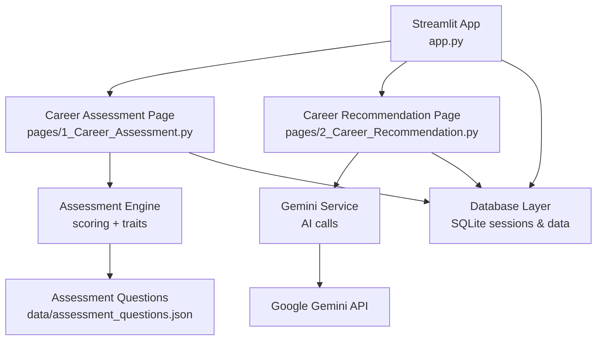
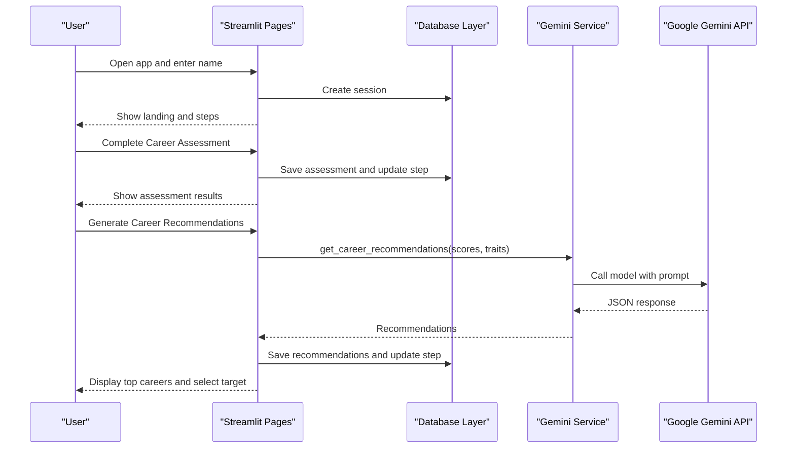
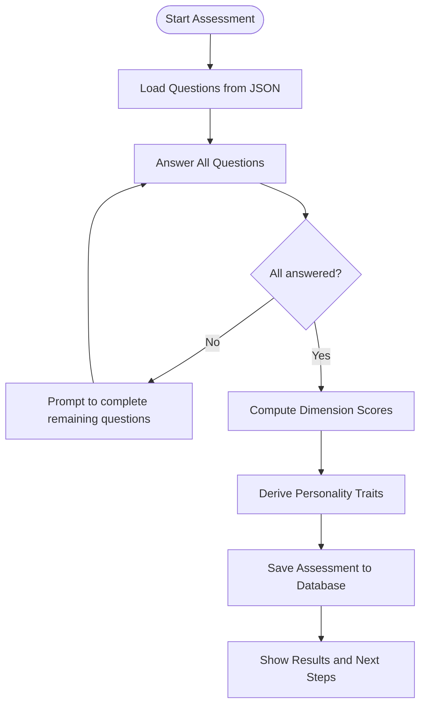
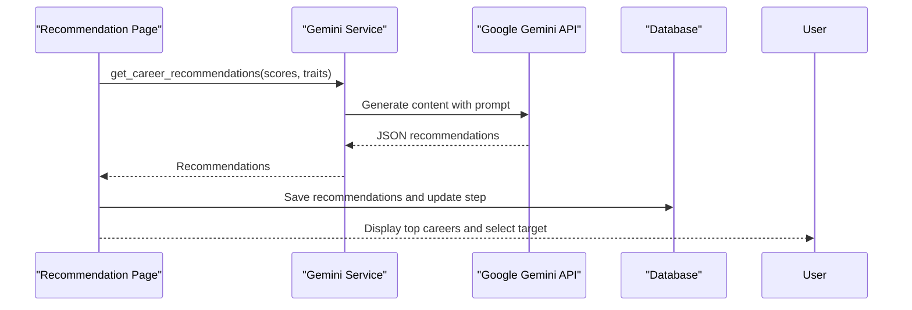

# Getting Started

<cite>
**Referenced Files in This Document**
- [requirements.txt](file://mentorx-ai/requirements.txt)
- [app.py](file://mentorx-ai/app.py)
- [.streamlit/config.toml](file://mentorx-ai/.streamlit/config.toml)
- [src/gemini_service.py](file://mentorx-ai/src/gemini_service.py)
- [src/database.py](file://mentorx-ai/src/database.py)
- [pages/1_Career_Assessment.py](file://mentorx-ai/pages/1_Career_Assessment.py)
- [pages/2_Career_Recommendation.py](file://mentorx-ai/pages/2_Career_Recommendation.py)
- [data/assessment_questions.json](file://mentorx-ai/data/assessment_questions.json)
</cite>

## Table of Contents
1. Introduction
2. Project Structure
3. Core Components
4. Architecture Overview
5. Detailed Component Analysis
6. Dependency Analysis
7. Performance Considerations
8. Troubleshooting Guide
9. Conclusion

## Introduction
Mentor X-AI is a Streamlit-based career coaching application that guides users through a structured journey: self-assessment, AI-powered career recommendations, skill gap analysis, learning roadmap generation, resume review, mock interviews, and a readiness dashboard. It uses Google Gemini for AI features and persists user progress locally via SQLite.

This guide helps you set up the environment, configure the Google Gemini API key, run the app locally, and complete your first session from registration to the initial assessment.

## Project Structure
The project is organized into:
- Entry point and landing page
- Streamlit pages for each step of the coaching journey
- Shared logic for database, Gemini integration, and assessment scoring
- Data files for assessment questions and career information
- Streamlit configuration for theme and server behavior

**Diagram sources**
- [app.py:1-166](file://mentorx-ai/app.py#L1-L166)
- [pages/1_Career_Assessment.py:1-138](file://mentorx-ai/pages/1_Career_Assessment.py#L1-L138)
- [pages/2_Career_Recommendation.py:1-140](file://mentorx-ai/pages/2_Career_Recommendation.py#L1-L140)
- [src/database.py:1-362](file://mentorx-ai/src/database.py#L1-L362)
- [src/gemini_service.py:1-422](file://mentorx-ai/src/gemini_service.py#L1-L422)
- [data/assessment_questions.json:1-134](file://mentorx-ai/data/assessment_questions.json#L1-L134)

**Section sources**
- [app.py:1-166](file://mentorx-ai/app.py#L1-L166)
- [.streamlit/config.toml:1-13](file://mentorx-ai/.streamlit/config.toml#L1-L13)

## Core Components
- Streamlit entrypoint and session management: initializes the database, creates a user session, and displays the landing page with navigation steps.
- Career Assessment page: presents a 20-question quiz grouped by categories, computes scores and personality traits, saves results, and advances the session step.
- Career Recommendation page: calls Gemini to generate tailored career suggestions based on assessment results and allows selecting a target career.
- Gemini service: centralizes all Google Gemini API interactions, loads environment variables, and returns structured JSON responses for various tasks (recommendations, skill gaps, roadmaps, resume review, interview Q&A).
- Database layer: manages SQLite schema, session tracking, and persistence of assessments, recommendations, skill analyses, roadmaps, resumes, and interviews.

**Section sources**
- [app.py:26-82](file://mentorx-ai/app.py#L26-L82)
- [pages/1_Career_Assessment.py:17-113](file://mentorx-ai/pages/1_Career_Assessment.py#L17-L113)
- [pages/2_Career_Recommendation.py:17-69](file://mentorx-ai/pages/2_Career_Recommendation.py#L17-L69)
- [src/gemini_service.py:1-60](file://mentorx-ai/src/gemini_service.py#L1-L60)
- [src/database.py:21-145](file://mentorx-ai/src/database.py#L21-L145)

## Architecture Overview
The application follows a layered architecture:
- UI layer: Streamlit pages orchestrate user flows and display results.
- Business logic: Assessment engine computes scores and derives traits; Gemini service orchestrates AI prompts and parses JSON outputs.
- Persistence layer: SQLite stores sessions and feature-specific data.
- External integration: Google Gemini API provides AI capabilities.

**Diagram sources**
- [app.py:67-82](file://mentorx-ai/app.py#L67-L82)
- [pages/1_Career_Assessment.py:88-113](file://mentorx-ai/pages/1_Career_Assessment.py#L88-L113)
- [pages/2_Career_Recommendation.py:54-69](file://mentorx-ai/pages/2_Career_Recommendation.py#L54-L69)
- [src/gemini_service.py:66-103](file://mentorx-ai/src/gemini_service.py#L66-L103)
- [src/database.py:114-145](file://mentorx-ai/src/database.py#L114-L145)

## Detailed Component Analysis

### Installation and Environment Setup
- Python version: Use a recent Python 3.x interpreter.
- Virtual environment: Recommended to isolate dependencies.
- Install dependencies:
  - Navigate to the project root (mentorx-ai).
  - Run the dependency installer using requirements.txt.
- Verify installation:
  - Ensure streamlit, google-generativeai, pandas, plotly, and python-dotenv are installed.

**Section sources**
- [requirements.txt:1-6](file://mentorx-ai/requirements.txt#L1-L6)

### Google Gemini API Configuration
- Obtain an API key from Google’s developer console for Gemini.
- Create a .env file in the mentorx-ai directory with the following variable:
  - GOOGLE_API_KEY=your_api_key_here
- The application loads this variable at startup via the Gemini service module.

Notes:
- If the API key is missing or invalid, Gemini calls will fail and the app may show errors when generating recommendations or other AI features.
- Keep the .env file out of version control.

**Section sources**
- [src/gemini_service.py:6-25](file://mentorx-ai/src/gemini_service.py#L6-L25)
- [src/gemini_service.py:32-40](file://mentorx-ai/src/gemini_service.py#L32-L40)

### Running the Application Locally
- Start the Streamlit server from the mentorx-ai directory:
  - Run the Streamlit command to launch the app.
- The app config sets headless mode and theme settings.
- After starting, open the local URL shown by Streamlit in your browser.

Tips:
- If you encounter port conflicts, specify a different port.
- If running headless causes issues in your environment, adjust the server setting accordingly.

**Section sources**
- [app.py:19-24](file://mentorx-ai/app.py#L19-L24)
- [.streamlit/config.toml:8-12](file://mentorx-ai/.streamlit/config.toml#L8-L12)

### First-Time User Walkthrough
- Name registration and session creation:
  - Enter your name on the landing page and click the start button to create a session.
- Career Assessment:
  - Answer all 20 questions across interests, work style, skills, and values.
  - Submit to compute dimension scores and derive personality traits.
- Career Recommendation:
  - Generate AI-powered recommendations based on your profile.
  - Select a target career to proceed to subsequent steps.

Navigation:
- Use the sidebar and page links to move between steps.
- Each step updates your current step in the session.

**Section sources**
- [app.py:67-82](file://mentorx-ai/app.py#L67-L82)
- [pages/1_Career_Assessment.py:25-113](file://mentorx-ai/pages/1_Career_Assessment.py#L25-L113)
- [pages/2_Career_Recommendation.py:25-69](file://mentorx-ai/pages/2_Career_Recommendation.py#L25-L69)

### Basic Usage Patterns and Session Management
- Sessions:
  - Each user gets a unique session ID stored in the database and tracked in Streamlit session state.
- Progress tracking:
  - The current step is updated after completing major actions (assessment, recommendation selection).
- Data persistence:
  - Assessments, recommendations, skill analyses, roadmaps, resumes, and interviews are saved per session.

How to navigate:
- From the landing page, go to Step 1 (Career Assessment), then Step 2 (Career Recommendation), and continue sequentially.
- Return to any page to view or update results for that step.

**Section sources**
- [app.py:26-82](file://mentorx-ai/app.py#L26-L82)
- [src/database.py:114-145](file://mentorx-ai/src/database.py#L114-L145)
- [pages/1_Career_Assessment.py:88-113](file://mentorx-ai/pages/1_Career_Assessment.py#L88-L113)
- [pages/2_Career_Recommendation.py:54-69](file://mentorx-ai/pages/2_Career_Recommendation.py#L54-L69)

### Assessment Flow Details
- Question loading:
  - Questions are loaded from the assessment JSON file.
- Scoring:
  - Answers are aggregated per dimension to compute average scores.
- Traits derivation:
  - Personality/career traits are derived from dimension thresholds.
- Persistence:
  - Results are saved to the database and displayed to the user.

**Diagram sources**
- [pages/1_Career_Assessment.py:31-113](file://mentorx-ai/pages/1_Career_Assessment.py#L31-L113)
- [data/assessment_questions.json:1-134](file://mentorx-ai/data/assessment_questions.json#L1-L134)

**Section sources**
- [pages/1_Career_Assessment.py:31-113](file://mentorx-ai/pages/1_Career_Assessment.py#L31-L113)
- [data/assessment_questions.json:1-134](file://mentorx-ai/data/assessment_questions.json#L1-L134)

### Recommendation Flow Details
- Input:
  - Uses assessment scores and derived traits.
- AI call:
  - Sends a structured prompt to Gemini to return top career matches with reasoning, salary ranges, growth outlook, and key skills.
- Output:
  - Displays recommendations and allows selecting a target career for further steps.

**Diagram sources**
- [pages/2_Career_Recommendation.py:54-69](file://mentorx-ai/pages/2_Career_Recommendation.py#L54-L69)
- [src/gemini_service.py:66-103](file://mentorx-ai/src/gemini_service.py#L66-L103)
- [src/database.py:190-213](file://mentorx-ai/src/database.py#L190-L213)

**Section sources**
- [pages/2_Career_Recommendation.py:54-69](file://mentorx-ai/pages/2_Career_Recommendation.py#L54-L69)
- [src/gemini_service.py:66-103](file://mentorx-ai/src/gemini_service.py#L66-L103)

## Dependency Analysis
Key runtime dependencies:
- streamlit: UI framework
- google-generativeai: Gemini API client
- pandas: Data manipulation (used elsewhere in the app)
- plotly: Visualization (used elsewhere in the app)
- python-dotenv: Environment variable loading

These are declared in requirements.txt and must be installed before running the app.

**Section sources**
- [requirements.txt:1-6](file://mentorx-ai/requirements.txt#L1-L6)

## Performance Considerations
- Gemini API calls can be slow; use spinners and avoid redundant calls by caching results in session state and database.
- Minimize repeated queries by reusing session-scoped data.
- For large datasets or heavy computations, consider pagination or lazy loading within pages.

[No sources needed since this section provides general guidance]

## Troubleshooting Guide
Common setup issues and resolutions:
- Missing dependencies:
  - Symptom: Import errors when launching Streamlit.
  - Resolution: Install dependencies using requirements.txt.
- API key not configured:
  - Symptom: Errors when generating recommendations or other AI features.
  - Resolution: Add GOOGLE_API_KEY to .env in the mentorx-ai directory and restart the app.
- Streamlit server startup errors:
  - Symptom: Port conflicts or headless mode issues.
  - Resolution: Change the port or adjust server settings in .streamlit/config.toml if necessary.
- No session created:
  - Symptom: Warning to start from the home page.
  - Resolution: Enter your name on the landing page and click the start button to create a session.
- Assessment cannot be submitted:
  - Symptom: Error indicating incomplete answers.
  - Resolution: Answer all 20 questions before submitting.

**Section sources**
- [requirements.txt:1-6](file://mentorx-ai/requirements.txt#L1-L6)
- [src/gemini_service.py:32-40](file://mentorx-ai/src/gemini_service.py#L32-L40)
- [.streamlit/config.toml:8-12](file://mentorx-ai/.streamlit/config.toml#L8-L12)
- [pages/1_Career_Assessment.py:88-94](file://mentorx-ai/pages/1_Career_Assessment.py#L88-L94)

## Conclusion
You now have everything needed to install Mentor X-AI, configure the Google Gemini API, run the app locally, and complete your first coaching session. Follow the steps above to set up your environment, register your name, take the assessment, and explore AI-powered recommendations. Use the troubleshooting guide to resolve common issues quickly.

[No sources needed since this section summarizes without analyzing specific files]