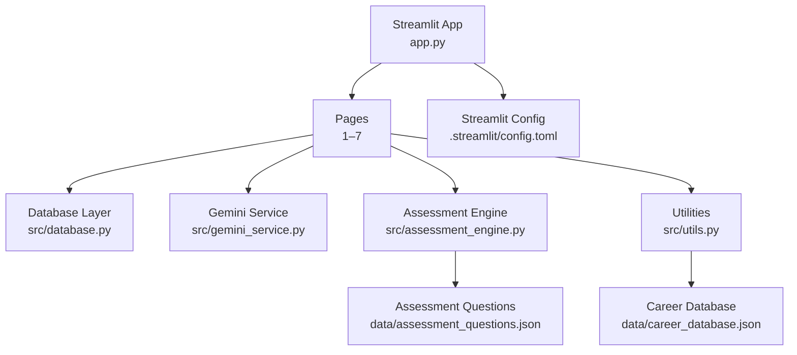
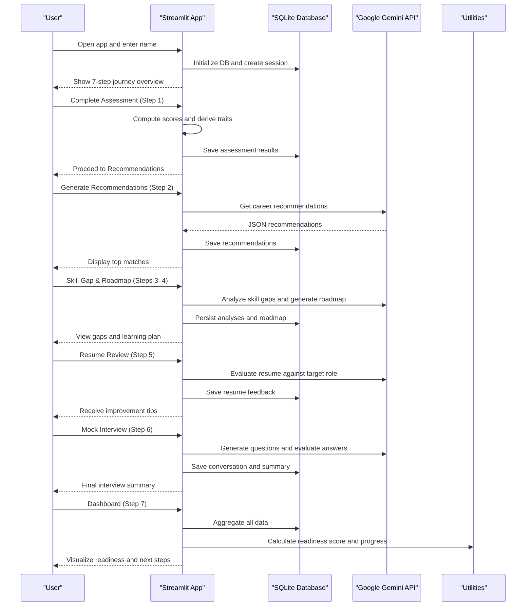
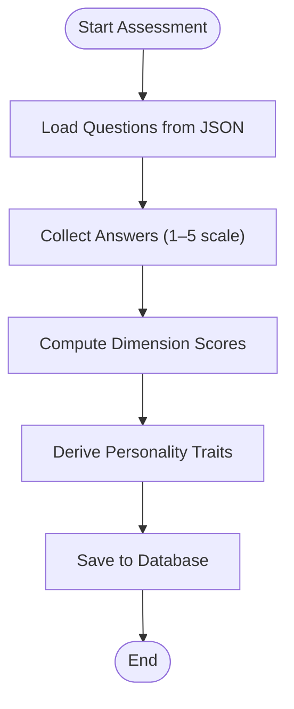
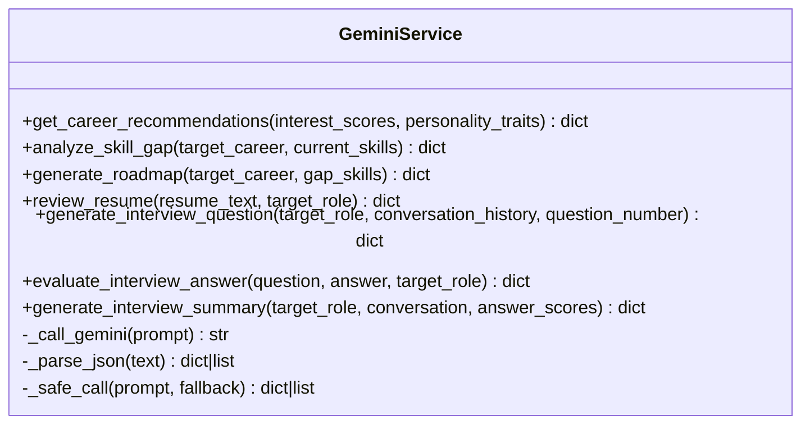
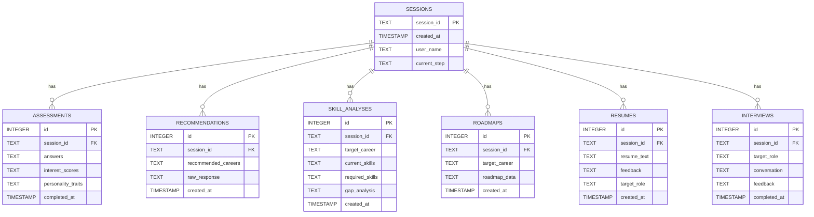
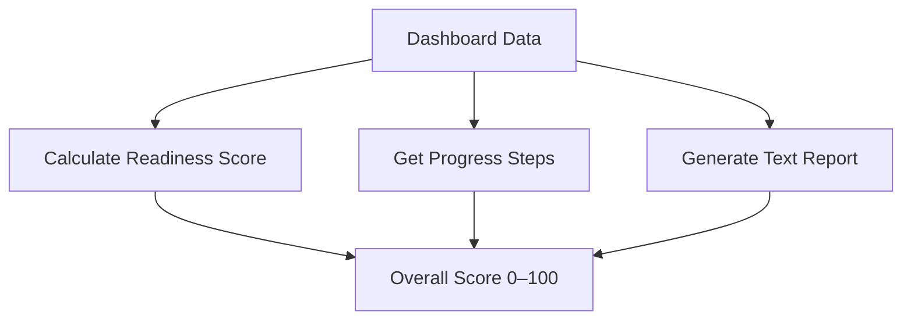
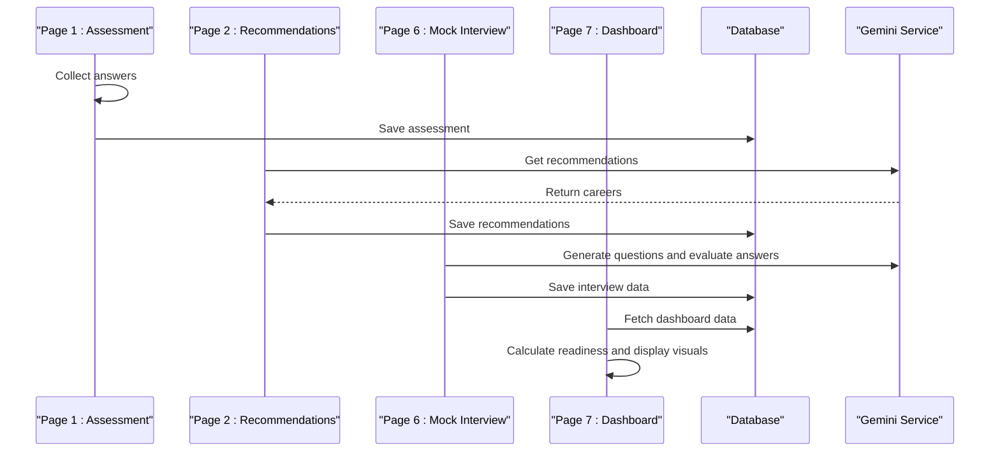
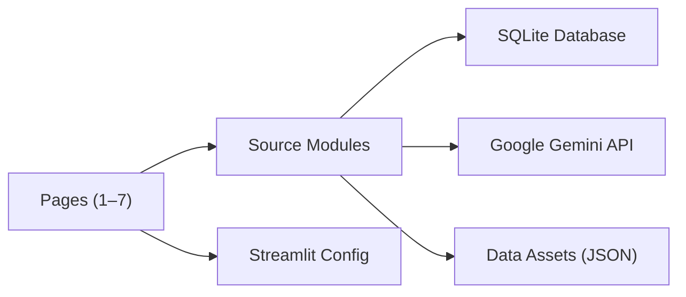

# Project Overview

<cite>
**Referenced Files in This Document**
- [app.py](file://mentorx-ai/app.py)
- [requirements.txt](file://mentorx-ai/requirements.txt)
- [database.py](file://mentorx-ai/src/database.py)
- [gemini_service.py](file://mentorx-ai/src/gemini_service.py)
- [assessment_engine.py](file://mentorx-ai/src/assessment_engine.py)
- [utils.py](file://mentorx-ai/src/utils.py)
- [1_Career_Assessment.py](file://mentorx-ai/pages/1_Career_Assessment.py)
- [2_Career_Recommendation.py](file://mentorx-ai/pages/2_Career_Recommendation.py)
- [6_AI_Mock_Interview.py](file://mentorx-ai/pages/6_AI_Mock_Interview.py)
- [7_Career_Dashboard.py](file://mentorx-ai/pages/7_Career_Dashboard.py)
- [assessment_questions.json](file://mentorx-ai/data/assessment_questions.json)
- [career_database.json](file://mentorx-ai/data/career_database.json)
- [config.toml](file://mentorx-ai/.streamlit/config.toml)
</cite>

## Table of Contents
1. [Introduction](#introduction)
2. [Project Structure](#project-structure)
3. [Core Components](#core-components)
4. [Architecture Overview](#architecture-overview)
5. [Detailed Component Analysis](#detailed-component-analysis)
6. [Dependency Analysis](#dependency-analysis)
7. [Performance Considerations](#performance-considerations)
8. [Troubleshooting Guide](#troubleshooting-guide)
9. [Conclusion](#conclusion)
10. [Appendices](#appendices)

## Introduction
Mentor X-AI is Pakistan’s Personal Career Coach—an AI-powered career development platform that guides users through a structured 7-step journey from self-discovery to interview readiness. It combines a guided assessment, AI-driven career recommendations, skill gap analysis, personalized learning roadmaps, resume review, and an interactive mock interview experience, culminating in a comprehensive readiness dashboard. The platform is purpose-built for Pakistani professionals navigating the local job market, with culturally aware guidance and practical insights tailored to opportunities in tech, freelancing, startups, and remote work.

Mission statement: Empower Pakistani professionals to make informed career decisions and achieve measurable readiness through personalized AI coaching—accessible, actionable, and locally relevant.

Key benefits:
- Personalized guidance based on interests, skills, values, and work style
- AI-generated career matches aligned with Pakistan’s growing economy
- Clear skill gaps and phased learning plans with real resources
- Resume optimization and ATS-friendly tips
- Real-time mock interview practice with constructive feedback
- Centralized dashboard tracking progress and overall readiness

How it differs from traditional counseling:
- Always-on, scalable AI support vs. limited availability
- Data-driven personalization using structured assessments and analytics
- Continuous iteration and immediate feedback loops
- Localized focus on Pakistan’s job market dynamics and opportunities

Target audience:
- Pakistani professionals at any stage—students, early-career, mid-career, or transitioning roles
- Individuals seeking clarity on career direction, skill development, and interview performance
- Freelancers and remote workers aiming to align skills with high-demand roles

Cultural and market context:
- Emphasis on roles with strong demand in Pakistan (software engineering, data science, cloud/DevOps, product management, cybersecurity, fintech, EdTech, blockchain)
- Recognition of freelancing and remote work as viable pathways
- Salary ranges and growth outlooks contextualized for PKR and local ecosystems

Technology stack overview:
- Frontend and app framework: Streamlit
- AI engine: Google Gemini API (Gemini model)
- Data persistence: SQLite database
- Language and ecosystem: Python with pandas, Plotly, python-dotenv

[No sources needed since this section provides general project context]

## Project Structure
The application follows a modular design:
- Entry point and landing page orchestrate session creation and user onboarding
- Pages implement each step of the 7-step journey
- Source modules encapsulate core logic: assessment scoring, Gemini interactions, database layer, and utilities
- Data assets include assessment questions and a curated career database focused on Pakistan

**Diagram sources**
- [app.py:1-166](file://mentorx-ai/app.py#L1-L166)
- [database.py:1-362](file://mentorx-ai/src/database.py#L1-L362)
- [gemini_service.py:1-422](file://mentorx-ai/src/gemini_service.py#L1-L422)
- [assessment_engine.py:1-144](file://mentorx-ai/src/assessment_engine.py#L1-L144)
- [utils.py:1-205](file://mentorx-ai/src/utils.py#L1-L205)
- [assessment_questions.json:1-134](file://mentorx-ai/data/assessment_questions.json#L1-L134)
- [career_database.json:1-149](file://mentorx-ai/data/career_database.json#L1-L149)
- [config.toml:1-13](file://mentorx-ai/.streamlit/config.toml#L1-L13)

**Section sources**
- [app.py:1-166](file://mentorx-ai/app.py#L1-L166)
- [requirements.txt:1-6](file://mentorx-ai/requirements.txt#L1-L6)

## Core Components
- Session and Landing Page: Initializes database, manages user sessions, and presents the 7-step journey overview.
- Assessment Engine: Loads questions, computes dimension scores, and derives personality traits.
- Gemini Service: Centralizes all LLM calls for recommendations, skill gap analysis, roadmap generation, resume review, and mock interview flows.
- Database Layer: Manages SQLite schema, CRUD operations, and aggregated dashboard data retrieval.
- Utilities: Score formatting, readiness calculation, progress tracking, report generation, and career database helpers.
- Pages: Implement each step of the journey with UI, state management, and integration with services and database.

**Section sources**
- [app.py:1-166](file://mentorx-ai/app.py#L1-L166)
- [assessment_engine.py:1-144](file://mentorx-ai/src/assessment_engine.py#L1-L144)
- [gemini_service.py:1-422](file://mentorx-ai/src/gemini_service.py#L1-L422)
- [database.py:1-362](file://mentorx-ai/src/database.py#L1-L362)
- [utils.py:1-205](file://mentorx-ai/src/utils.py#L1-L205)

## Architecture Overview
The system integrates a Streamlit frontend with a Python backend that orchestrates assessment logic, AI-driven insights via Google Gemini, and persistent storage in SQLite. Each page corresponds to a step in the coaching journey and interacts with shared services and data assets.

**Diagram sources**
- [app.py:1-166](file://mentorx-ai/app.py#L1-L166)
- [database.py:1-362](file://mentorx-ai/src/database.py#L1-L362)
- [gemini_service.py:1-422](file://mentorx-ai/src/gemini_service.py#L1-L422)
- [utils.py:1-205](file://mentorx-ai/src/utils.py#L1-L205)
- [1_Career_Assessment.py:1-138](file://mentorx-ai/pages/1_Career_Assessment.py#L1-L138)
- [2_Career_Recommendation.py:1-140](file://mentorx-ai/pages/2_Career_Recommendation.py#L1-L140)
- [6_AI_Mock_Interview.py:1-283](file://mentorx-ai/pages/6_AI_Mock_Interview.py#L1-L283)
- [7_Career_Dashboard.py:1-272](file://mentorx-ai/pages/7_Career_Dashboard.py#L1-L272)

## Detailed Component Analysis

### Assessment Engine
Computes dimension scores from user responses and derives personality traits used by downstream AI prompts. It loads questions from a structured JSON file and aggregates scores per dimension, then maps thresholds to human-readable traits.

**Diagram sources**
- [assessment_engine.py:1-144](file://mentorx-ai/src/assessment_engine.py#L1-L144)
- [assessment_questions.json:1-134](file://mentorx-ai/data/assessment_questions.json#L1-L134)
- [database.py:152-183](file://mentorx-ai/src/database.py#L152-L183)

**Section sources**
- [assessment_engine.py:1-144](file://mentorx-ai/src/assessment_engine.py#L1-L144)
- [1_Career_Assessment.py:1-138](file://mentorx-ai/pages/1_Career_Assessment.py#L1-L138)

### Gemini Service
Centralizes all interactions with Google Gemini API, including prompt construction, response parsing, and error handling with fallbacks. Functions cover career recommendations, skill gap analysis, roadmap generation, resume review, and mock interview question generation and evaluation.

**Diagram sources**
- [gemini_service.py:1-422](file://mentorx-ai/src/gemini_service.py#L1-L422)

**Section sources**
- [gemini_service.py:1-422](file://mentorx-ai/src/gemini_service.py#L1-L422)

### Database Layer
Manages SQLite schema initialization and provides CRUD functions for sessions, assessments, recommendations, skill analyses, roadmaps, resumes, interviews, and dashboard aggregation. Uses JSON serialization for complex fields and foreign key relationships between tables.

**Diagram sources**
- [database.py:21-107](file://mentorx-ai/src/database.py#L21-L107)

**Section sources**
- [database.py:1-362](file://mentorx-ai/src/database.py#L1-L362)

### Utilities
Provides score formatting, readiness score calculation, progress tracking, text report generation, and career database lookup. These utilities standardize visualization and reporting across pages.

**Diagram sources**
- [utils.py:70-117](file://mentorx-ai/src/utils.py#L70-L117)
- [utils.py:124-144](file://mentorx-ai/src/utils.py#L124-L144)
- [utils.py:151-205](file://mentorx-ai/src/utils.py#L151-L205)

**Section sources**
- [utils.py:1-205](file://mentorx-ai/src/utils.py#L1-L205)

### Pages: Step-by-Step Journey
- Step 1 – Career Assessment: Presents a 20-question quiz grouped by categories; computes and saves results.
- Step 2 – Career Recommendation: Calls Gemini to generate top career matches based on assessment profile; persists and displays results.
- Step 6 – AI Mock Interview: Interactive chat-based interview with question generation, answer evaluation, and final summary; persists conversation and feedback.
- Step 7 – Career Dashboard: Aggregates all data, calculates readiness score, visualizes progress and metrics, and allows report download.

**Diagram sources**
- [1_Career_Assessment.py:1-138](file://mentorx-ai/pages/1_Career_Assessment.py#L1-L138)
- [2_Career_Recommendation.py:1-140](file://mentorx-ai/pages/2_Career_Recommendation.py#L1-L140)
- [6_AI_Mock_Interview.py:1-283](file://mentorx-ai/pages/6_AI_Mock_Interview.py#L1-L283)
- [7_Career_Dashboard.py:1-272](file://mentorx-ai/pages/7_Career_Dashboard.py#L1-L272)
- [database.py:1-362](file://mentorx-ai/src/database.py#L1-L362)
- [gemini_service.py:1-422](file://mentorx-ai/src/gemini_service.py#L1-L422)

**Section sources**
- [1_Career_Assessment.py:1-138](file://mentorx-ai/pages/1_Career_Assessment.py#L1-L138)
- [2_Career_Recommendation.py:1-140](file://mentorx-ai/pages/2_Career_Recommendation.py#L1-L140)
- [6_AI_Mock_Interview.py:1-283](file://mentorx-ai/pages/6_AI_Mock_Interview.py#L1-L283)
- [7_Career_Dashboard.py:1-272](file://mentorx-ai/pages/7_Career_Dashboard.py#L1-L272)

## Dependency Analysis
The application relies on a clear separation of concerns:
- Streamlit pages depend on source modules for business logic and data access
- Source modules depend on data assets (JSON files) and external services (Gemini)
- Database layer abstracts persistence and provides aggregated views for dashboards
- Utilities are reused across pages for consistent scoring and reporting

**Diagram sources**
- [requirements.txt:1-6](file://mentorx-ai/requirements.txt#L1-L6)
- [config.toml:1-13](file://mentorx-ai/.streamlit/config.toml#L1-L13)
- [database.py:1-362](file://mentorx-ai/src/database.py#L1-L362)
- [gemini_service.py:1-422](file://mentorx-ai/src/gemini_service.py#L1-L422)
- [assessment_questions.json:1-134](file://mentorx-ai/data/assessment_questions.json#L1-L134)
- [career_database.json:1-149](file://mentorx-ai/data/career_database.json#L1-L149)

**Section sources**
- [requirements.txt:1-6](file://mentorx-ai/requirements.txt#L1-L6)
- [config.toml:1-13](file://mentorx-ai/.streamlit/config.toml#L1-L13)

## Performance Considerations
- Minimize redundant Gemini calls by caching recommendations and interview summaries in the database
- Use efficient queries and avoid loading large datasets repeatedly; leverage session state for transient data
- Optimize dashboard rendering by limiting chart complexity and using pagination if necessary
- Handle network latency with spinner indicators and graceful fallbacks when API calls fail
- Keep JSON payloads concise to reduce parsing overhead and improve response times

[No sources needed since this section provides general guidance]

## Troubleshooting Guide
Common issues and resolutions:
- Missing or invalid API key: Ensure GOOGLE_API_KEY is set in environment variables; the service will raise a runtime error if not configured.
- No recommendations generated: Verify assessment completion and check API connectivity; fallbacks return empty structures which should be handled gracefully.
- Database errors: Confirm SQLite file permissions and ensure init_db runs before any writes; verify table schemas match expected structure.
- Dashboard inconsistencies: Validate that all steps have persisted data; use get_dashboard_data to aggregate and inspect missing components.
- Streamlit configuration: Check theme and server settings in config.toml; headless mode may affect local debugging.

**Section sources**
- [gemini_service.py:19-39](file://mentorx-ai/src/gemini_service.py#L19-L39)
- [database.py:21-107](file://mentorx-ai/src/database.py#L21-L107)
- [7_Career_Dashboard.py:43-47](file://mentorx-ai/pages/7_Career_Dashboard.py#L43-L47)
- [config.toml:1-13](file://mentorx-ai/.streamlit/config.toml#L1-L13)

## Conclusion
Mentor X-AI delivers a comprehensive, AI-powered career coaching experience tailored to Pakistani professionals. By combining structured assessments, localized career insights, and interactive preparation tools, it offers a modern alternative to traditional counseling—scalable, data-driven, and continuously improving. The architecture ensures modularity, maintainability, and extensibility, while the dashboard provides clear visibility into progress and readiness.

[No sources needed since this section summarizes without analyzing specific files]

## Appendices
- Technology stack details:
  - Streamlit for interactive web interface
  - Google Gemini API for AI-driven insights
  - SQLite for lightweight, local data persistence
  - Python ecosystem including pandas and Plotly for data processing and visualization
- Data assets:
  - Assessment questions covering interests, work style, skills, and values
  - Curated career database with roles relevant to Pakistan’s job market

[No sources needed since this section provides general reference information]