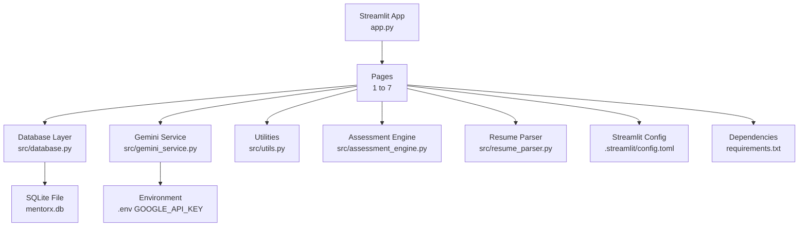
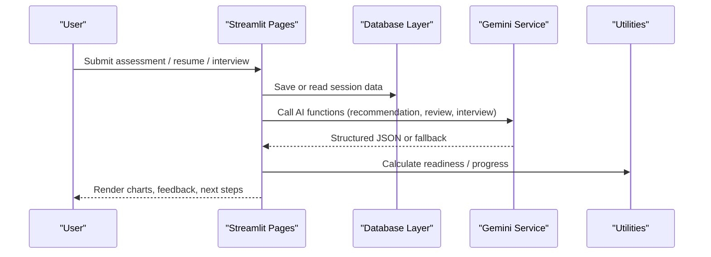
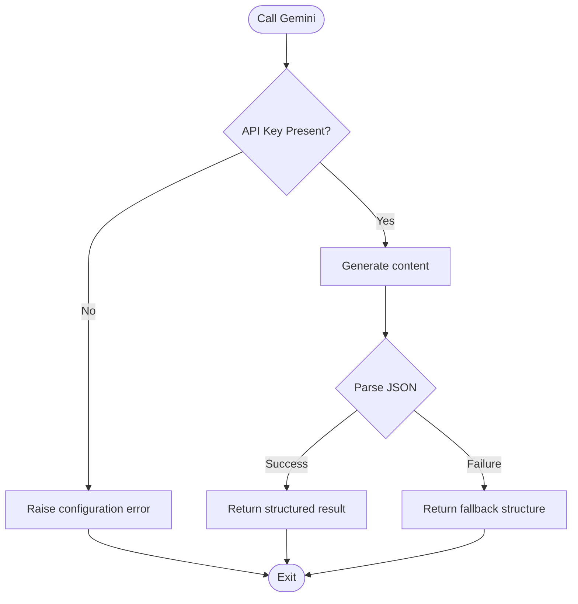
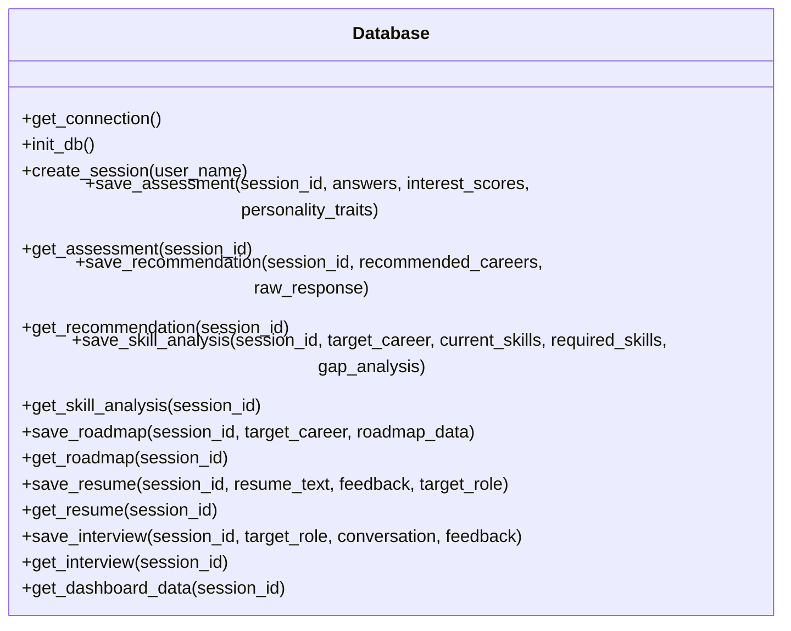
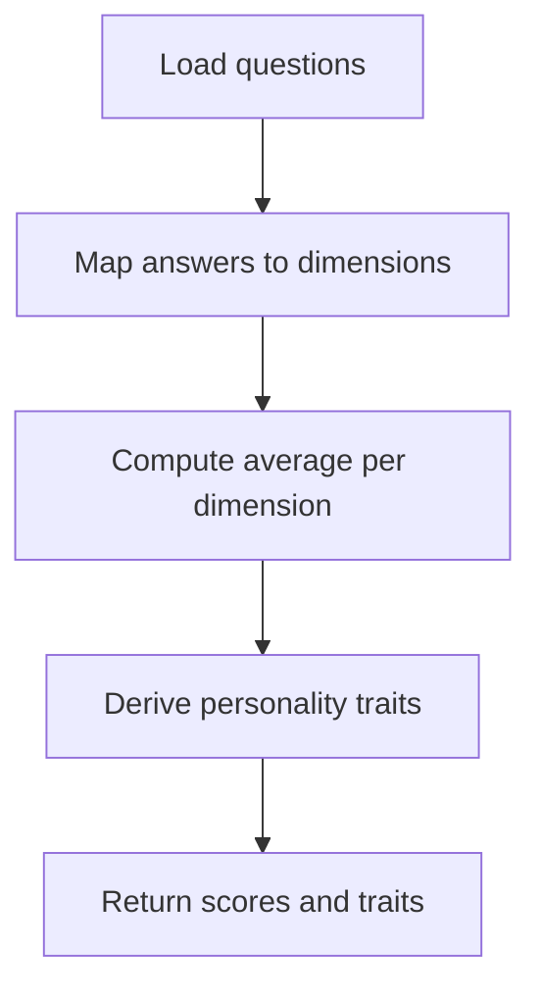
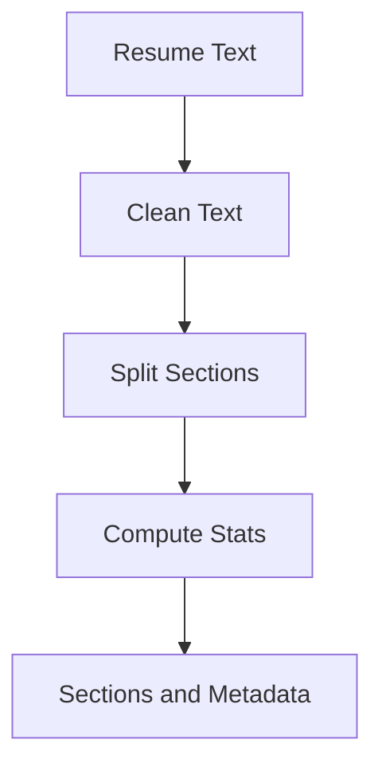
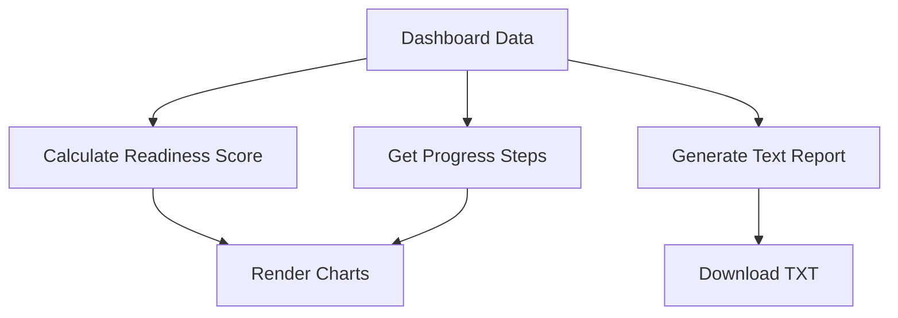
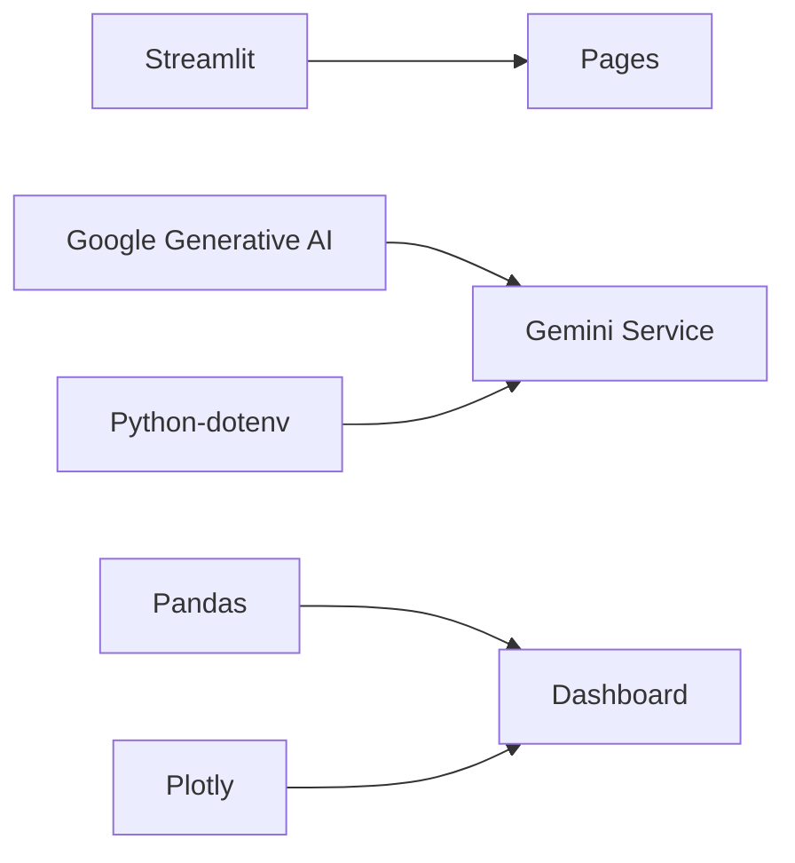

# Troubleshooting and FAQ

<cite>
**Referenced Files in This Document**
- [app.py](file://mentorx-ai/app.py)
- [config.toml](file://mentorx-ai/.streamlit/config.toml)
- [requirements.txt](file://mentorx-ai/requirements.txt)
- [gemini_service.py](file://mentorx-ai/src/gemini_service.py)
- [database.py](file://mentorx-ai/src/database.py)
- [assessment_engine.py](file://mentorx-ai/src/assessment_engine.py)
- [resume_parser.py](file://mentorx-ai/src/resume_parser.py)
- [utils.py](file://mentorx-ai/src/utils.py)
- [1_Career_Assessment.py](file://mentorx-ai/pages/1_Career_Assessment.py)
- [5_Resume_Analyzer.py](file://mentorx-ai/pages/5_Resume_Analyzer.py)
- [7_Career_Dashboard.py](file://mentorx-ai/pages/7_Career_Dashboard.py)
- [assessment_questions.json](file://mentorx-ai/data/assessment_questions.json)
- [career_database.json](file://mentorx-ai/data/career_database.json)
</cite>

## Table of Contents
1. Introduction
2. Project Structure
3. Core Components
4. Architecture Overview
5. Detailed Component Analysis
6. Dependency Analysis
7. Performance Considerations
8. Troubleshooting Guide
9. Conclusion
10. Appendices

## Introduction
This document provides comprehensive troubleshooting guidance for Mentor X-AI, covering common issues such as Google Gemini API connectivity, authentication failures, rate limiting, database connectivity, session state corruption, Streamlit rendering problems, AI response parsing errors, assessment calculation issues, resume analysis failures, performance optimization, memory management, logging strategies, and user-facing symptoms like incomplete assessments, missing recommendations, and dashboard display problems. It includes step-by-step diagnostics, error message interpretations, and resolution workflows for both technical and non-technical users.

## Project Structure
Mentor X-AI is a Streamlit application with:
- A main entry point that initializes the database and manages sessions
- Page modules for each feature (assessment, recommendation, skill gap, roadmap, resume analyzer, mock interview, dashboard)
- Shared services for Gemini API calls, SQLite persistence, assessment scoring, resume parsing, and utilities
- Data files for assessment questions and career profiles
- Streamlit configuration and dependency definitions

**Diagram sources**
- [app.py:1-166](file://mentorx-ai/app.py#L1-L166)
- [1_Career_Assessment.py:1-138](file://mentorx-ai/pages/1_Career_Assessment.py#L1-L138)
- [5_Resume_Analyzer.py:1-191](file://mentorx-ai/pages/5_Resume_Analyzer.py#L1-L191)
- [7_Career_Dashboard.py:1-272](file://mentorx-ai/pages/7_Career_Dashboard.py#L1-L272)
- [database.py:1-362](file://mentorx-ai/src/database.py#L1-L362)
- [gemini_service.py:1-422](file://mentorx-ai/src/gemini_service.py#L1-L422)
- [assessment_engine.py:1-144](file://mentorx-ai/src/assessment_engine.py#L1-L144)
- [resume_parser.py:1-102](file://mentorx-ai/src/resume_parser.py#L1-L102)
- [utils.py:1-205](file://mentorx-ai/src/utils.py#L1-L205)
- [config.toml:1-13](file://mentorx-ai/.streamlit/config.toml#L1-L13)
- [requirements.txt:1-6](file://mentorx-ai/requirements.txt#L1-L6)

**Section sources**
- [app.py:1-166](file://mentorx-ai/app.py#L1-L166)
- [config.toml:1-13](file://mentorx-ai/.streamlit/config.toml#L1-L13)
- [requirements.txt:1-6](file://mentorx-ai/requirements.txt#L1-L6)

## Core Components
- Streamlit pages orchestrate user interactions and call shared services
- Gemini service centralizes all LLM calls with structured JSON prompts and fallbacks
- Database layer persists sessions, assessments, recommendations, skill analyses, roadmaps, resumes, interviews, and aggregates dashboard data
- Assessment engine computes dimension scores and derives personality traits from answers
- Resume parser cleans text, splits sections, and extracts metadata
- Utilities provide score formatting, readiness calculations, progress tracking, and report generation

Key responsibilities and failure points are mapped below to guide troubleshooting.

**Section sources**
- [gemini_service.py:1-422](file://mentorx-ai/src/gemini_service.py#L1-L422)
- [database.py:1-362](file://mentorx-ai/src/database.py#L1-L362)
- [assessment_engine.py:1-144](file://mentorx-ai/src/assessment_engine.py#L1-L144)
- [resume_parser.py:1-102](file://mentorx-ai/src/resume_parser.py#L1-L102)
- [utils.py:1-205](file://mentorx-ai/src/utils.py#L1-L205)

## Architecture Overview
The application follows a layered architecture:
- UI layer: Streamlit pages render inputs and results
- Service layer: Gemini service handles AI responses; utilities compute metrics
- Data layer: SQLite stores persistent state and results
- Configuration: Environment variables and Streamlit config control behavior

**Diagram sources**
- [1_Career_Assessment.py:1-138](file://mentorx-ai/pages/1_Career_Assessment.py#L1-L138)
- [5_Resume_Analyzer.py:1-191](file://mentorx-ai/pages/5_Resume_Analyzer.py#L1-L191)
- [7_Career_Dashboard.py:1-272](file://mentorx-ai/pages/7_Career_Dashboard.py#L1-L272)
- [gemini_service.py:1-422](file://mentorx-ai/src/gemini_service.py#L1-L422)
- [database.py:1-362](file://mentorx-ai/src/database.py#L1-L362)
- [utils.py:1-205](file://mentorx-ai/src/utils.py#L1-L205)

## Detailed Component Analysis

### Gemini Service
- Centralizes model initialization, prompt construction, JSON parsing, and safe calls with fallbacks
- Common failure modes:
  - Missing or invalid API key leads to runtime errors when calling the model
  - Network timeouts or rate limits cause exceptions during content generation
  - Non-JSON responses break parsing; fallback returns empty structures
- Mitigations:
  - Validate environment variable presence before model usage
  - Wrap calls with try/except and return safe defaults
  - Log errors for debugging

**Diagram sources**
- [gemini_service.py:1-422](file://mentorx-ai/src/gemini_service.py#L1-L422)

**Section sources**
- [gemini_service.py:1-422](file://mentorx-ai/src/gemini_service.py#L1-L422)

### Database Layer
- Manages SQLite connections, table creation, CRUD operations, and dashboard aggregation
- Failure modes:
  - SQLite file permissions or path issues prevent connection
  - Corrupted JSON fields cause deserialization errors on read
  - Missing foreign keys or schema mismatches lead to query failures
- Mitigations:
  - Ensure write permissions to the database directory
  - Guard JSON loads with checks and defaults
  - Reinitialize tables safely if needed

**Diagram sources**
- [database.py:1-362](file://mentorx-ai/src/database.py#L1-L362)

**Section sources**
- [database.py:1-362](file://mentorx-ai/src/database.py#L1-L362)

### Assessment Engine
- Loads questions from JSON, computes per-dimension averages, and derives personality traits
- Failure modes:
  - Missing or malformed assessment_questions.json causes load errors
  - Dimension labels mismatch between questions and engine logic can produce unexpected traits
- Mitigations:
  - Validate question file integrity and encoding
  - Ensure dimension keys match engine expectations

**Diagram sources**
- [assessment_engine.py:1-144](file://mentorx-ai/src/assessment_engine.py#L1-L144)
- [assessment_questions.json:1-134](file://mentorx-ai/data/assessment_questions.json#L1-L134)

**Section sources**
- [assessment_engine.py:1-144](file://mentorx-ai/src/assessment_engine.py#L1-L144)
- [assessment_questions.json:1-134](file://mentorx-ai/data/assessment_questions.json#L1-L134)

### Resume Parser
- Cleans text, splits into sections, extracts emails and URLs, and computes stats
- Failure modes:
  - Unstructured input may not split into sections; fallback returns full text
  - Regex patterns may miss unusual headings
- Mitigations:
  - Normalize whitespace and strip control characters
  - Provide clear instructions to users for pasting structured resumes

**Diagram sources**
- [resume_parser.py:1-102](file://mentorx-ai/src/resume_parser.py#L1-L102)

**Section sources**
- [resume_parser.py:1-102](file://mentorx-ai/src/resume_parser.py#L1-L102)

### Utilities
- Provides score formatting, readiness calculation, progress tracking, and report generation
- Failure modes:
  - Missing dashboard data leads to default values in readiness calculation
  - Inconsistent data shapes cause type errors in chart rendering
- Mitigations:
  - Guard dictionary access with defaults
  - Validate types before plotting

**Diagram sources**
- [utils.py:1-205](file://mentorx-ai/src/utils.py#L1-L205)
- [7_Career_Dashboard.py:1-272](file://mentorx-ai/pages/7_Career_Dashboard.py#L1-L272)

**Section sources**
- [utils.py:1-205](file://mentorx-ai/src/utils.py#L1-L205)
- [7_Career_Dashboard.py:1-272](file://mentorx-ai/pages/7_Career_Dashboard.py#L1-L272)

## Dependency Analysis
External dependencies and their roles:
- Streamlit: UI framework and page routing
- Google Generative AI: LLM integration via Gemini
- Pandas and Plotly: Data processing and visualization
- Python-dotenv: Environment variable loading

Potential issues:
- Version mismatches can cause import errors or API changes
- Missing packages block app startup

**Diagram sources**
- [requirements.txt:1-6](file://mentorx-ai/requirements.txt#L1-L6)
- [gemini_service.py:1-422](file://mentorx-ai/src/gemini_service.py#L1-L422)
- [7_Career_Dashboard.py:1-272](file://mentorx-ai/pages/7_Career_Dashboard.py#L1-L272)

**Section sources**
- [requirements.txt:1-6](file://mentorx-ai/requirements.txt#L1-L6)

## Performance Considerations
- Minimize redundant API calls by caching results in session state where appropriate
- Use efficient queries and avoid unnecessary re-renders in Streamlit
- Limit large text payloads to Gemini to reduce latency and token costs
- Prefer incremental updates and conditional rendering based on session flags
- Monitor memory usage for large datasets in dashboards; consider pagination or sampling

[No sources needed since this section provides general guidance]

## Troubleshooting Guide

### Google Gemini API Connection Issues
Symptoms:
- Errors indicating API key not configured
- No responses or blank results from AI features
- Timeouts or network errors during content generation

Diagnostic steps:
- Verify that the environment variable for the API key is set and loaded
- Confirm the model name matches available endpoints
- Test connectivity by making a simple request outside the app

Resolution workflow:
- Set the correct API key in your environment configuration
- Restart the application to reload configuration
- Retry the operation; if rate limited, wait and retry with backoff

**Section sources**
- [gemini_service.py:1-422](file://mentorx-ai/src/gemini_service.py#L1-L422)

### Authentication Failures
Symptoms:
- Immediate runtime error when attempting AI calls
- Features disabled or returning fallback data

Diagnostic steps:
- Check that the environment variable exists and is non-empty
- Ensure no typos or extra whitespace in the key value
- Confirm the account has access to the specified model

Resolution workflow:
- Regenerate or update the API key if compromised or expired
- Reload the environment and restart the app
- Validate by invoking a protected function and observing successful initialization

**Section sources**
- [gemini_service.py:1-422](file://mentorx-ai/src/gemini_service.py#L1-L422)

### Rate Limiting Errors
Symptoms:
- Intermittent failures during high-frequency requests
- Responses delayed or throttled

Diagnostic steps:
- Observe error messages indicating quota exceeded or throttling
- Check request frequency and batch size

Resolution workflow:
- Implement retries with exponential backoff
- Reduce concurrent calls and add delays between requests
- Consider caching repeated prompts or results

**Section sources**
- [gemini_service.py:1-422](file://mentorx-ai/src/gemini_service.py#L1-L422)

### Database Connectivity Problems
Symptoms:
- Errors opening or writing to the database file
- Missing or corrupted records after crashes

Diagnostic steps:
- Verify file permissions for the database directory
- Check that the database file exists and is writable
- Inspect recent writes for partial transactions

Resolution workflow:
- Fix permissions and ensure the process has write access
- Reinitialize tables if schema is inconsistent
- Back up the database before running maintenance

**Section sources**
- [database.py:1-362](file://mentorx-ai/src/database.py#L1-L362)

### Session State Corruption
Symptoms:
- Unexpected resets of user progress
- Inconsistent data across pages

Diagnostic steps:
- Inspect session flags used to track completion states
- Check for race conditions where multiple reruns overwrite state

Resolution workflow:
- Clear session state and recreate the session
- Add guards to prevent overwriting critical state
- Persist critical state to the database promptly

**Section sources**
- [app.py:1-166](file://mentorx-ai/app.py#L1-L166)
- [1_Career_Assessment.py:1-138](file://mentorx-ai/pages/1_Career_Assessment.py#L1-L138)

### Streamlit Rendering Issues
Symptoms:
- Charts not displaying or showing empty axes
- Layout misalignment or truncated content

Diagnostic steps:
- Validate data shapes passed to Plotly and Pandas
- Check for None or empty lists causing rendering failures
- Review Streamlit configuration settings

Resolution workflow:
- Provide default values for missing data
- Adjust layout parameters and container widths
- Update Streamlit version if compatibility issues arise

**Section sources**
- [7_Career_Dashboard.py:1-272](file://mentorx-ai/pages/7_Career_Dashboard.py#L1-L272)
- [config.toml:1-13](file://mentorx-ai/.streamlit/config.toml#L1-L13)

### AI Response Parsing Errors
Symptoms:
- Errors when parsing JSON from AI responses
- Fallback responses returned instead of expected data

Diagnostic steps:
- Inspect raw responses for markdown fences or malformed JSON
- Validate the structure against expected schemas

Resolution workflow:
- Strip markdown wrappers before parsing
- Implement robust fallbacks with sensible defaults
- Log raw responses for debugging

**Section sources**
- [gemini_service.py:1-422](file://mentorx-ai/src/gemini_service.py#L1-L422)

### Assessment Calculation Problems
Symptoms:
- Incorrect dimension scores or missing traits
- Incomplete assessment results

Diagnostic steps:
- Verify all questions answered and mapped to dimensions
- Check question file integrity and encoding

Resolution workflow:
- Ensure complete answers before submission
- Validate question IDs and dimension mappings
- Recompute scores and regenerate traits

**Section sources**
- [assessment_engine.py:1-144](file://mentorx-ai/src/assessment_engine.py#L1-L144)
- [assessment_questions.json:1-134](file://mentorx-ai/data/assessment_questions.json#L1-L134)

### Resume Analysis Failures
Symptoms:
- No feedback generated or zero scores
- Errors during resume parsing or AI review

Diagnostic steps:
- Confirm resume text is non-empty and target role specified
- Check AI service availability and response format

Resolution workflow:
- Paste well-formatted resume text and specify a valid target role
- Retry analysis; if failures persist, check API key and network
- Use fallbacks and inspect logs for parsing issues

**Section sources**
- [5_Resume_Analyzer.py:1-191](file://mentorx-ai/pages/5_Resume_Analyzer.py#L1-L191)
- [gemini_service.py:1-422](file://mentorx-ai/src/gemini_service.py#L1-L422)

### Performance Optimization Tips
- Cache expensive computations and API responses in session state
- Avoid re-running heavy blocks on every rerun
- Use lazy loading for charts and large datasets
- Batch requests to reduce overhead

[No sources needed since this section provides general guidance]

### Memory Management Considerations
- Limit stored text sizes in session state and database
- Clear temporary variables after use
- Monitor memory usage during large PDF or resume processing

[No sources needed since this section provides general guidance]

### Logging Strategies
- Log configuration validation and initialization steps
- Capture error traces for AI calls and database operations
- Include context identifiers like session ID in logs for traceability

[No sources needed since this section provides general guidance]

### User-Facing Issues

#### Incomplete Assessments
Symptoms:
- Submission blocked due to unanswered questions
- Partial results saved

Resolution:
- Prompt users to answer all questions before submitting
- Show progress indicators and highlight unanswered items

**Section sources**
- [1_Career_Assessment.py:1-138](file://mentorx-ai/pages/1_Career_Assessment.py#L1-L138)

#### Missing Recommendations
Symptoms:
- No career suggestions displayed
- Empty recommendation list

Resolution:
- Verify AI service availability and API key
- Check that assessment data was saved correctly
- Retry with updated inputs

**Section sources**
- [gemini_service.py:1-422](file://mentorx-ai/src/gemini_service.py#L1-L422)
- [database.py:1-362](file://mentorx-ai/src/database.py#L1-L362)

#### Dashboard Display Problems
Symptoms:
- Readiness score not updating
- Charts missing or incorrect

Resolution:
- Ensure all steps completed and data persisted
- Validate data shapes for charts
- Refresh the page and re-run calculations

**Section sources**
- [7_Career_Dashboard.py:1-272](file://mentorx-ai/pages/7_Career_Dashboard.py#L1-L272)
- [utils.py:1-205](file://mentorx-ai/src/utils.py#L1-L205)

## Conclusion
This troubleshooting guide addresses the most common issues in Mentor X-AI, focusing on Gemini API connectivity, authentication, rate limiting, database and session state integrity, Streamlit rendering, AI response parsing, assessment calculations, resume analysis, performance, memory, and logging. By following the diagnostic steps and resolution workflows, both technical and non-technical users can identify and resolve problems efficiently.

[No sources needed since this section summarizes without analyzing specific files]

## Appendices

### Step-by-Step Diagnostic Procedures

- Verify environment configuration:
  - Ensure API key is set and loaded
  - Confirm Streamlit configuration is correct

- Validate data files:
  - Check assessment questions and career database integrity
  - Ensure proper encoding and structure

- Test core services:
  - Run a minimal Gemini call to confirm connectivity
  - Create and read a session to verify database operations

- Inspect logs and errors:
  - Capture exception traces for AI and database calls
  - Record session IDs for traceability

[No sources needed since this section provides general guidance]

### Error Message Interpretations

- API key not configured: Indicates missing or invalid environment variable
- Network timeout or rate limit: Suggests throttling or connectivity issues
- JSON parse error: Points to malformed AI response or prompt mismatch
- Database write error: Signals permission or schema problems
- Session state reset: Implies rerun conflicts or missing guards

[No sources needed since this section provides general guidance]