# User Interface

<cite>
**Referenced Files in This Document**
- [app.py](file://mentorx-ai/app.py)
- [config.toml](file://mentorx-ai/.streamlit/config.toml)
- [1_Career_Assessment.py](file://mentorx-ai/pages/1_Career_Assessment.py)
- [2_Career_Recommendation.py](file://mentorx-ai/pages/2_Career_Recommendation.py)
- [3_Skill_Gap_Analysis.py](file://mentorx-ai/pages/3_Skill_Gap_Analysis.py)
- [4_Learning_Roadmap.py](file://mentorx-ai/pages/4_Learning_Roadmap.py)
- [5_Resume_Analyzer.py](file://mentorx-ai/pages/5_Resume_Analyzer.py)
- [6_AI_Mock_Interview.py](file://mentorx-ai/pages/6_AI_Mock_Interview.py)
- [7_Career_Dashboard.py](file://mentorx-ai/pages/7_Career_Dashboard.py)
- [database.py](file://mentorx-ai/src/database.py)
- [utils.py](file://mentorx-ai/src/utils.py)
- [requirements.txt](file://mentorx-ai/requirements.txt)
</cite>

## Table of Contents
1. [Introduction](#introduction)
2. [Project Structure](#project-structure)
3. [Core Components](#core-components)
4. [Architecture Overview](#architecture-overview)
5. [Detailed Component Analysis](#detailed-component-analysis)
6. [Dependency Analysis](#dependency-analysis)
7. [Performance Considerations](#performance-considerations)
8. [Troubleshooting Guide](#troubleshooting-guide)
9. [Conclusion](#conclusion)
10. [Appendices](#appendices)

## Introduction
This document explains the Streamlit-based user interface for Mentor X-AI, a seven-step career coaching application tailored for Pakistani professionals. It covers page structure, navigation flow, session state management, responsive design, visual components, accessibility considerations, styling and theme configuration, and error handling across all pages. The UI guides users from self-discovery to interview readiness with clear progress tracking and actionable insights.

## Project Structure
The application is organized as a Streamlit multi-page app:
- Entry point and landing page at the root
- Seven numbered pages implementing each coaching step
- Shared utilities and database layer under src
- Theme and server configuration under .streamlit
- Data assets under data (assessment questions and career database)

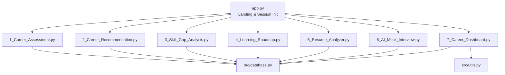

**Diagram sources**
- [app.py:19-24](file://mentorx-ai/app.py#L19-L24)
- [1_Career_Assessment.py:15-16](file://mentorx-ai/pages/1_Career_Assessment.py#L15-L16)
- [2_Career_Recommendation.py:15-16](file://mentorx-ai/pages/2_Career_Recommendation.py#L15-L16)
- [3_Skill_Gap_Analysis.py:16-17](file://mentorx-ai/pages/3_Skill_Gap_Analysis.py#L16-L17)
- [4_Learning_Roadmap.py:16-17](file://mentorx-ai/pages/4_Learning_Roadmap.py#L16-L17)
- [5_Resume_Analyzer.py:16-17](file://mentorx-ai/pages/5_Resume_Analyzer.py#L16-L17)
- [6_AI_Mock_Interview.py:19-20](file://mentorx-ai/pages/6_AI_Mock_Interview.py#L19-L20)
- [7_Career_Dashboard.py:24-25](file://mentorx-ai/pages/7_Career_Dashboard.py#L24-L25)
- [database.py:21-107](file://mentorx-ai/src/database.py#L21-L107)
- [utils.py:124-144](file://mentorx-ai/src/utils.py#L124-L144)

**Section sources**
- [app.py:19-24](file://mentorx-ai/app.py#L19-L24)
- [config.toml:1-13](file://mentorx-ai/.streamlit/config.toml#L1-L13)
- [requirements.txt:1-6](file://mentorx-ai/requirements.txt#L1-L6)

## Core Components
- Landing page: Initializes DB, creates sessions, collects user name, shows journey overview, and sidebar guidance.
- Assessment: Interactive quiz grouped by categories with progress tracking and results display.
- Recommendation: AI-powered suggestions based on assessment profile; allows selection of target career.
- Skill Gap Analysis: Collects current skills, compares against target role, visualizes gaps via radar chart.
- Learning Roadmap: Generates phased learning plan with milestones and progress tracking.
- Resume Analyzer: Evaluates resume text against target role with section feedback and ATS tips.
- AI Mock Interview: Chat-style mock interview with per-question feedback and final summary.
- Career Dashboard: Aggregates all steps into a readiness score, charts, and downloadable report.

Session state is used to maintain context across pages (e.g., session_id, user_name, selected_career, scores). Database persistence ensures continuity between reruns.

**Section sources**
- [app.py:30-82](file://mentorx-ai/app.py#L30-L82)
- [1_Career_Assessment.py:38-113](file://mentorx-ai/pages/1_Career_Assessment.py#L38-L113)
- [2_Career_Recommendation.py:28-68](file://mentorx-ai/pages/2_Career_Recommendation.py#L28-L68)
- [3_Skill_Gap_Analysis.py:39-116](file://mentorx-ai/pages/3_Skill_Gap_Analysis.py#L39-L116)
- [4_Learning_Roadmap.py:39-76](file://mentorx-ai/pages/4_Learning_Roadmap.py#L39-L76)
- [5_Resume_Analyzer.py:72-105](file://mentorx-ai/pages/5_Resume_Analyzer.py#L72-L105)
- [6_AI_Mock_Interview.py:41-104](file://mentorx-ai/pages/6_AI_Mock_Interview.py#L41-L104)
- [7_Career_Dashboard.py:43-48](file://mentorx-ai/pages/7_Career_Dashboard.py#L43-L48)

## Architecture Overview
The UI follows a linear coaching flow with optional re-visits. Each page guards access using session state and persists intermediate results to SQLite. Visualizations are built with Plotly; theme and layout are configured via Streamlit config and per-page set_page_config.

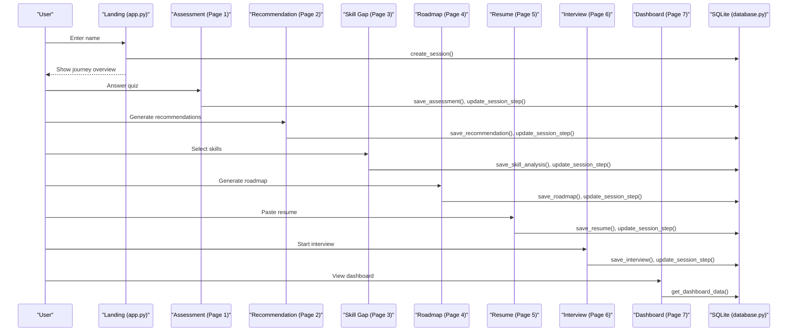

**Diagram sources**
- [app.py:67-82](file://mentorx-ai/app.py#L67-L82)
- [1_Career_Assessment.py:91-113](file://mentorx-ai/pages/1_Career_Assessment.py#L91-L113)
- [2_Career_Recommendation.py:57-68](file://mentorx-ai/pages/2_Career_Recommendation.py#L57-L68)
- [3_Skill_Gap_Analysis.py:90-116](file://mentorx-ai/pages/3_Skill_Gap_Analysis.py#L90-L116)
- [4_Learning_Roadmap.py:60-76](file://mentorx-ai/pages/4_Learning_Roadmap.py#L60-L76)
- [5_Resume_Analyzer.py:84-105](file://mentorx-ai/pages/5_Resume_Analyzer.py#L84-L105)
- [6_AI_Mock_Interview.py:83-104](file://mentorx-ai/pages/6_AI_Mock_Interview.py#L83-L104)
- [7_Career_Dashboard.py:43-48](file://mentorx-ai/pages/7_Career_Dashboard.py#L43-L48)
- [database.py:114-145](file://mentorx-ai/src/database.py#L114-L145)

## Detailed Component Analysis

### Landing Page (app.py)
- Sets wide layout, branding, and expanded sidebar.
- Initializes SQLite once per run and tracks initialization flag.
- Creates a session when the user provides a name; stores session_id and user_name in session state.
- Displays a seven-step journey overview with icons and descriptions.
- Sidebar shows current user and step, plus usage instructions and session-based privacy note.

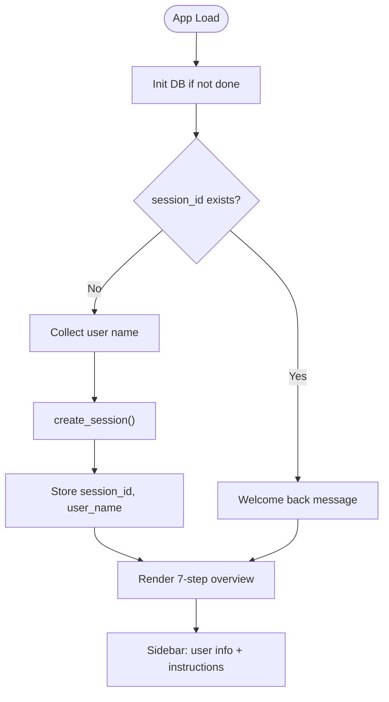

**Diagram sources**
- [app.py:30-33](file://mentorx-ai/app.py#L30-L33)
- [app.py:67-82](file://mentorx-ai/app.py#L67-L82)
- [app.py:87-134](file://mentorx-ai/app.py#L87-L134)
- [app.py:140-165](file://mentorx-ai/app.py#L140-L165)

**Section sources**
- [app.py:19-24](file://mentorx-ai/app.py#L19-L24)
- [app.py:30-82](file://mentorx-ai/app.py#L30-L82)
- [app.py:87-165](file://mentorx-ai/app.py#L87-L165)

### Step 1: Career Assessment
- Groups 20 questions by category with radio inputs and horizontal layout.
- Tracks answers in session state and shows a progress bar.
- Validates completion before submission; saves results and updates current step.
- Displays dimension scores and personality traits after submission.

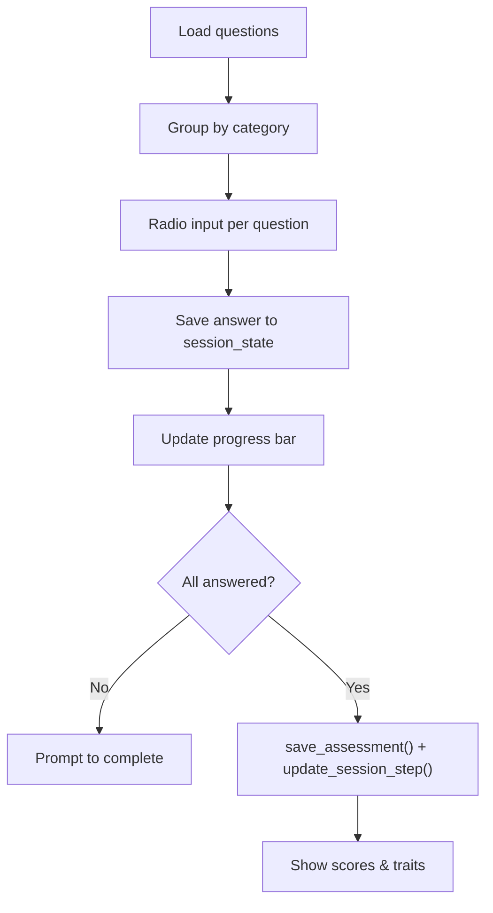

**Diagram sources**
- [1_Career_Assessment.py:35-75](file://mentorx-ai/pages/1_Career_Assessment.py#L35-L75)
- [1_Career_Assessment.py:82-113](file://mentorx-ai/pages/1_Career_Assessment.py#L82-L113)
- [1_Career_Assessment.py:119-138](file://mentorx-ai/pages/1_Career_Assessment.py#L119-L138)

**Section sources**
- [1_Career_Assessment.py:15-16](file://mentorx-ai/pages/1_Career_Assessment.py#L15-L16)
- [1_Career_Assessment.py:35-113](file://mentorx-ai/pages/1_Career_Assessment.py#L35-L113)
- [1_Career_Assessment.py:119-138](file://mentorx-ai/pages/1_Career_Assessment.py#L119-L138)

### Step 2: Career Recommendation
- Guards access until assessment is completed.
- Loads or generates AI recommendations; saves to DB and updates step.
- Displays match scores, reasoning, key skills, growth outlook, and salary range.
- Allows selecting a target career and storing related metadata for later steps.

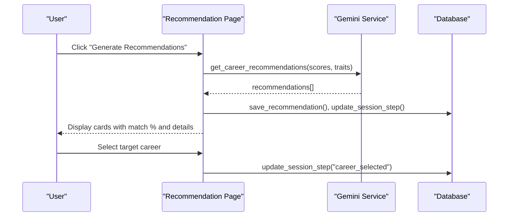

**Diagram sources**
- [2_Career_Recommendation.py:28-68](file://mentorx-ai/pages/2_Career_Recommendation.py#L28-L68)
- [2_Career_Recommendation.py:75-140](file://mentorx-ai/pages/2_Career_Recommendation.py#L75-L140)

**Section sources**
- [2_Career_Recommendation.py:15-16](file://mentorx-ai/pages/2_Career_Recommendation.py#L15-L16)
- [2_Career_Recommendation.py:28-68](file://mentorx-ai/pages/2_Career_Recommendation.py#L28-L68)
- [2_Career_Recommendation.py:75-140](file://mentorx-ai/pages/2_Career_Recommendation.py#L75-L140)

### Step 3: Skill Gap Analysis
- Requires a selected career; loads previous analysis if available.
- Presents suggested and general skills as checkboxes; supports custom skills.
- Analyzes gaps via AI service; saves results and updates step.
- Shows overall match percentage, matched/gap lists, and a radar chart comparing user vs required levels.

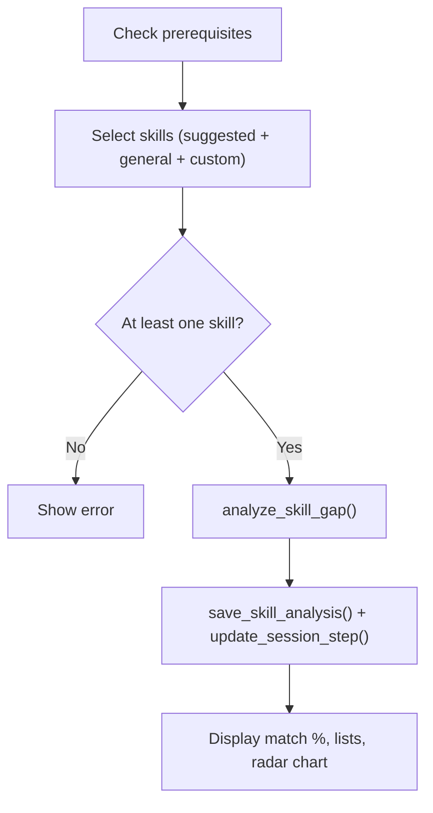

**Diagram sources**
- [3_Skill_Gap_Analysis.py:39-116](file://mentorx-ai/pages/3_Skill_Gap_Analysis.py#L39-L116)
- [3_Skill_Gap_Analysis.py:123-230](file://mentorx-ai/pages/3_Skill_Gap_Analysis.py#L123-L230)

**Section sources**
- [3_Skill_Gap_Analysis.py:16-17](file://mentorx-ai/pages/3_Skill_Gap_Analysis.py#L16-L17)
- [3_Skill_Gap_Analysis.py:39-116](file://mentorx-ai/pages/3_Skill_Gap_Analysis.py#L39-L116)
- [3_Skill_Gap_Analysis.py:123-230](file://mentorx-ai/pages/3_Skill_Gap_Analysis.py#L123-L230)

### Step 4: Learning Roadmap
- Requires prior steps; loads roadmap if present.
- Generates phases with milestones and estimated hours; saves and updates step.
- Visualizes timeline with a horizontal bar chart and expands phase details.
- Provides milestone checkboxes and a progress bar for tracking completion.

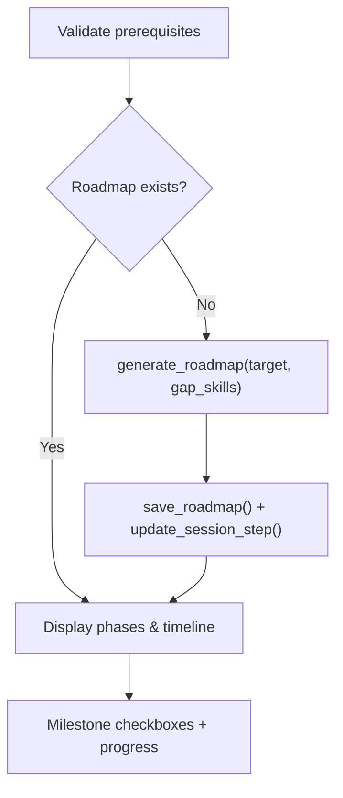

**Diagram sources**
- [4_Learning_Roadmap.py:39-76](file://mentorx-ai/pages/4_Learning_Roadmap.py#L39-L76)
- [4_Learning_Roadmap.py:82-198](file://mentorx-ai/pages/4_Learning_Roadmap.py#L82-L198)

**Section sources**
- [4_Learning_Roadmap.py:16-17](file://mentorx-ai/pages/4_Learning_Roadmap.py#L16-L17)
- [4_Learning_Roadmap.py:39-76](file://mentorx-ai/pages/4_Learning_Roadmap.py#L39-L76)
- [4_Learning_Roadmap.py:82-198](file://mentorx-ai/pages/4_Learning_Roadmap.py#L82-L198)

### Step 5: Resume Analyzer
- Auto-fills target role from recommendation; accepts resume text.
- Analyzes resume against target role; saves feedback and updates step.
- Displays gauge chart for overall score, strengths, improvements, section-by-section feedback, and ATS tips.

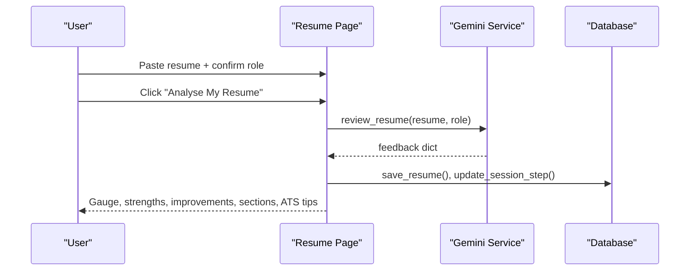

**Diagram sources**
- [5_Resume_Analyzer.py:72-105](file://mentorx-ai/pages/5_Resume_Analyzer.py#L72-L105)
- [5_Resume_Analyzer.py:110-191](file://mentorx-ai/pages/5_Resume_Analyzer.py#L110-L191)

**Section sources**
- [5_Resume_Analyzer.py:16-17](file://mentorx-ai/pages/5_Resume_Analyzer.py#L16-L17)
- [5_Resume_Analyzer.py:72-105](file://mentorx-ai/pages/5_Resume_Analyzer.py#L72-L105)
- [5_Resume_Analyzer.py:110-191](file://mentorx-ai/pages/5_Resume_Analyzer.py#L110-L191)

### Step 6: AI Mock Interview
- Maintains conversation history, question number, and scores in session state.
- Starts interview by generating first question; evaluates each answer with immediate feedback.
- After fixed number of questions, generates summary, saves conversation and feedback, and updates step.
- Displays overall score, impression, question breakdown, and improvement tips.

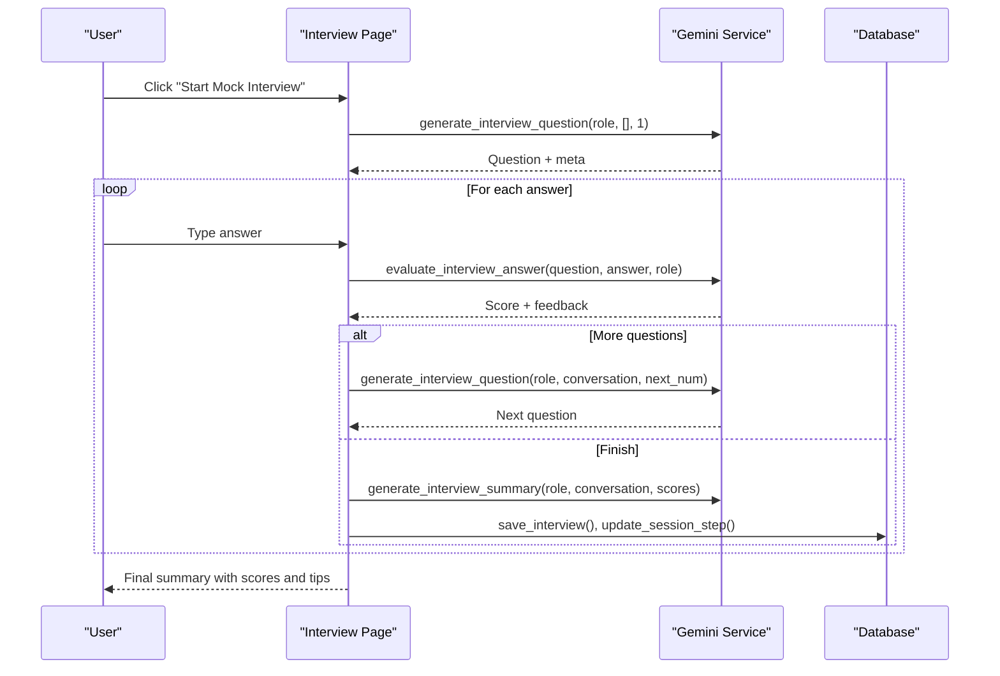

**Diagram sources**
- [6_AI_Mock_Interview.py:41-104](file://mentorx-ai/pages/6_AI_Mock_Interview.py#L41-L104)
- [6_AI_Mock_Interview.py:110-233](file://mentorx-ai/pages/6_AI_Mock_Interview.py#L110-L233)
- [6_AI_Mock_Interview.py:239-283](file://mentorx-ai/pages/6_AI_Mock_Interview.py#L239-L283)

**Section sources**
- [6_AI_Mock_Interview.py:19-20](file://mentorx-ai/pages/6_AI_Mock_Interview.py#L19-L20)
- [6_AI_Mock_Interview.py:41-104](file://mentorx-ai/pages/6_AI_Mock_Interview.py#L41-L104)
- [6_AI_Mock_Interview.py:110-233](file://mentorx-ai/pages/6_AI_Mock_Interview.py#L110-L233)
- [6_AI_Mock_Interview.py:239-283](file://mentorx-ai/pages/6_AI_Mock_Interview.py#L239-L283)

### Step 7: Career Dashboard
- Aggregates all step data via a single helper and computes readiness score.
- Displays gauge for readiness, progress tracker, quick stats, and recommended next action.
- Visualizes skill proficiency radar and score comparison bar chart.
- Includes assessment dimension breakdown and downloadable text report.

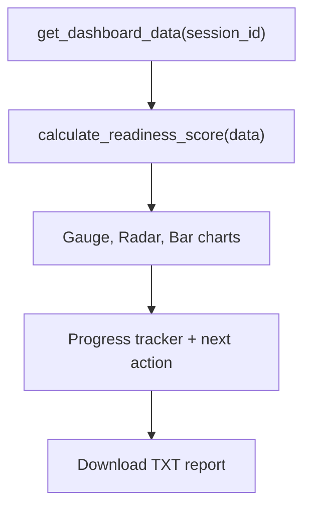

**Diagram sources**
- [7_Career_Dashboard.py:43-48](file://mentorx-ai/pages/7_Career_Dashboard.py#L43-L48)
- [7_Career_Dashboard.py:56-117](file://mentorx-ai/pages/7_Career_Dashboard.py#L56-L117)
- [7_Career_Dashboard.py:136-210](file://mentorx-ai/pages/7_Career_Dashboard.py#L136-L210)
- [7_Career_Dashboard.py:216-256](file://mentorx-ai/pages/7_Career_Dashboard.py#L216-L256)
- [utils.py:70-117](file://mentorx-ai/src/utils.py#L70-L117)
- [utils.py:151-205](file://mentorx-ai/src/utils.py#L151-L205)

**Section sources**
- [7_Career_Dashboard.py:24-25](file://mentorx-ai/pages/7_Career_Dashboard.py#L24-L25)
- [7_Career_Dashboard.py:43-117](file://mentorx-ai/pages/7_Career_Dashboard.py#L43-L117)
- [7_Career_Dashboard.py:136-256](file://mentorx-ai/pages/7_Career_Dashboard.py#L136-L256)
- [utils.py:70-117](file://mentorx-ai/src/utils.py#L70-L117)
- [utils.py:151-205](file://mentorx-ai/src/utils.py#L151-L205)

## Dependency Analysis
- Pages depend on shared database helpers for persistence and on utility functions for scoring and reporting.
- Plotly is used for interactive charts; Streamlit handles UI layout and interactivity.
- Theme and server settings are centralized in config.

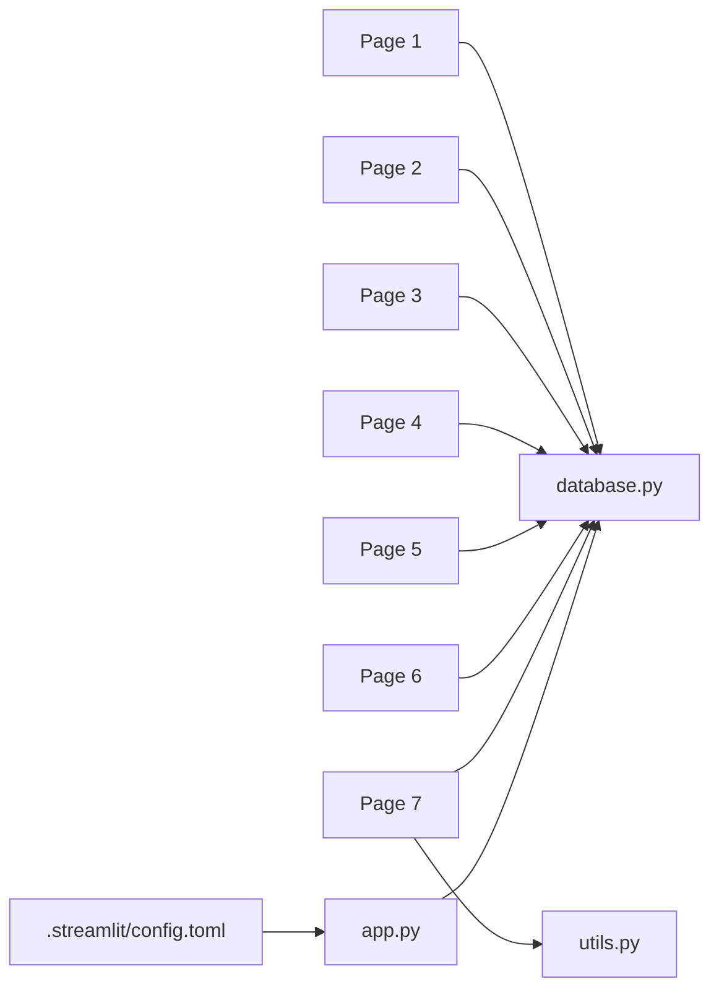

**Diagram sources**
- [database.py:21-107](file://mentorx-ai/src/database.py#L21-L107)
- [utils.py:70-117](file://mentorx-ai/src/utils.py#L70-L117)
- [config.toml:1-13](file://mentorx-ai/.streamlit/config.toml#L1-L13)

**Section sources**
- [database.py:114-145](file://mentorx-ai/src/database.py#L114-L145)
- [utils.py:124-144](file://mentorx-ai/src/utils.py#L124-L144)
- [requirements.txt:1-6](file://mentorx-ai/requirements.txt#L1-L6)

## Performance Considerations
- Use st.spinner during AI calls to keep UI responsive and provide loading feedback.
- Persist intermediate results to avoid recomputation and reduce API calls.
- Limit chart data points (e.g., top skills) to improve rendering performance.
- Prefer use_container_width for charts to optimize space usage on mobile and desktop.
- Avoid excessive reruns; trigger only on meaningful state changes.

[No sources needed since this section provides general guidance]

## Troubleshooting Guide
Common UI-layer issues and resolutions:
- Missing session: Pages guard against missing session_id and prompt to start from home.
- Incomplete inputs: Validation errors guide users to complete required fields (e.g., all assessment questions, at least one skill).
- API failures: Error messages instruct users to check API keys and retry.
- Stale data: Pages load persisted results from DB when available to restore state after reruns.

**Section sources**
- [1_Career_Assessment.py:21-23](file://mentorx-ai/pages/1_Career_Assessment.py#L21-L23)
- [1_Career_Assessment.py:91-94](file://mentorx-ai/pages/1_Career_Assessment.py#L91-L94)
- [2_Career_Recommendation.py:21-23](file://mentorx-ai/pages/2_Career_Recommendation.py#L21-L23)
- [2_Career_Recommendation.py:61-64](file://mentorx-ai/pages/2_Career_Recommendation.py#L61-L64)
- [3_Skill_Gap_Analysis.py:22-24](file://mentorx-ai/pages/3_Skill_Gap_Analysis.py#L22-L24)
- [3_Skill_Gap_Analysis.py:91-93](file://mentorx-ai/pages/3_Skill_Gap_Analysis.py#L91-L93)
- [5_Resume_Analyzer.py:84-89](file://mentorx-ai/pages/5_Resume_Analyzer.py#L84-L89)
- [6_AI_Mock_Interview.py:25-27](file://mentorx-ai/pages/6_AI_Mock_Interview.py#L25-L27)

## Conclusion
Mentor X-AI’s UI delivers a structured, guided career coaching experience with clear navigation, robust session state management, and persistent storage. The design emphasizes clarity, responsiveness, and actionable feedback across all seven steps, with consistent theming and accessible interactions suitable for Pakistani professional audiences.

[No sources needed since this section summarizes without analyzing specific files]

## Appendices

### Styling and Theme Configuration
- Global theme colors and fonts are defined in the Streamlit config file.
- Per-page layouts are set via set_page_config with wide layout and page icons.
- Custom HTML/CSS is used sparingly for hero sections and cards to enhance readability and brand consistency.

**Section sources**
- [config.toml:1-13](file://mentorx-ai/.streamlit/config.toml#L1-L13)
- [app.py:19-24](file://mentorx-ai/app.py#L19-L24)
- [1_Career_Assessment.py:15-16](file://mentorx-ai/pages/1_Career_Assessment.py#L15-L16)
- [2_Career_Recommendation.py:15-16](file://mentorx-ai/pages/2_Career_Recommendation.py#L15-L16)
- [3_Skill_Gap_Analysis.py:16-17](file://mentorx-ai/pages/3_Skill_Gap_Analysis.py#L16-L17)
- [4_Learning_Roadmap.py:16-17](file://mentorx-ai/pages/4_Learning_Roadmap.py#L16-L17)
- [5_Resume_Analyzer.py:16-17](file://mentorx-ai/pages/5_Resume_Analyzer.py#L16-L17)
- [6_AI_Mock_Interview.py:19-20](file://mentorx-ai/pages/6_AI_Mock_Interview.py#L19-L20)
- [7_Career_Dashboard.py:24-25](file://mentorx-ai/pages/7_Career_Dashboard.py#L24-L25)

### Accessibility and UX Considerations
- Clear headings and descriptive labels improve screen reader navigation.
- Consistent color thresholds and emojis aid quick comprehension of scores.
- Loading states (spinners) and explicit error messages reduce confusion during long operations.
- Wide layout and responsive charts adapt to various screen sizes.

[No sources needed since this section provides general guidance]